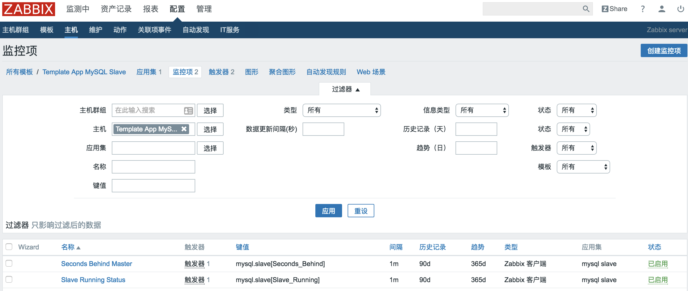
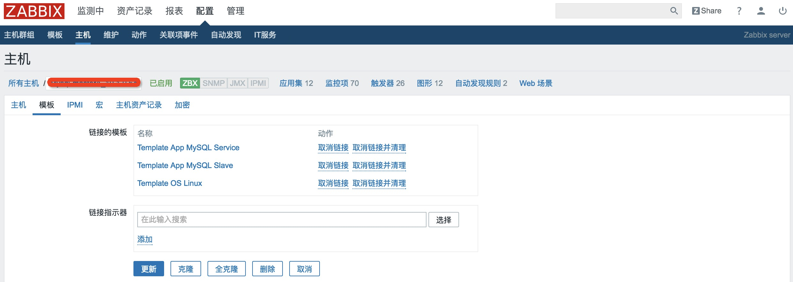
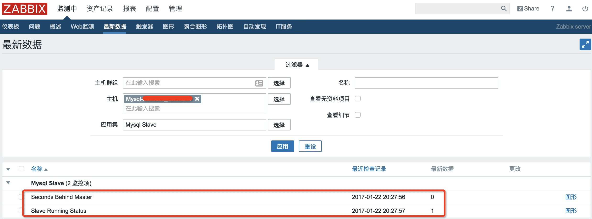

上次Zabbix添加了监控MySQL性能，因此此次在其基础上添加主从监控,文章过程中不在介绍MySQL5.6版本相关细节处理，具体可以参考上次文章： [http://blog.csdn.net/ygqygq2/article/details/53264955](http://blog.csdn.net/ygqygq2/article/details/53264955)

# 1\. Zabbix添加自定义监控流程

1. Zabbix agentd添加自定义key；
2. 自定义key调用的是获取监控数据源脚本等；
3. 添加Zabbix主机数据源模板，主机链接模板;

# 2\. 具体步骤

## 1\. 编写监控mysql主从脚本

`vim /usr/local/zabbix/shell/check_mysql_slave.sh`

```
#!/usr/bin/env bash
#Create by zijin 2014.09.28
##Need "grant REPLICATION CLIENT on *.* to zabbix_select@localhost identified by 'zabbix'"
#Mysql5.6
# mysql_config_editor set --login-path=local --host=localhost --user=zabbix_select -p
MYSQL_SOCK="/tmp/mysql.sock" 
MYSQL_PWD="zabbix"
MYSQL="/usr/local/mysql/bin/mysql"
MYSQL_ADMIN="${MYSQL}admin"
ARGS=1 
if [ $# -ne "$ARGS" ];then 
    echo "Please input one arguement:" 
fi 
case $1 in 
        Slave_Running) 
                slave_is=($(sudo ${MYSQL} --login-path=local -S $MYSQL_SOCK -e "show slave status\G"|egrep "\bSlave_.*_Running\b"|awk '{print $2}'))
                if [ "${slave_is[0]}" = "Yes" -a "${slave_is[1]}" = "Yes" ];then
                     result="1"
                else
                     result="0"
                fi
                echo $result
        ;;
    Seconds_Behind)
                result=$(sudo ${MYSQL} --login-path=local -S $MYSQL_SOCK -e "show slave status\G"|egrep "\bSeconds_Behind_Master\b"|awk '{print $2}')
                echo $result
        ;;
        *) 
                echo "Usage:$0(Slave_Running|Seconds_Behind)" 
        ;; 
esac 


```

## 2\. mysql赋权

`grant REPLICATION CLIENT on *.* to zabbix_select@localhost identified by 'zabbix';`

## 3\. 查看脚本执行效果

```
[root@mysql64 shell]# chmod a+x check_mysql_slave.sh
[root@mysql64 shell]# sh check_mysql_slave.sh Slave_Running
1
[root@mysql64 shell]# sh check_mysql_slave.sh Slave_Seconds
0
[root@mysql64 shell]#
```

## 4\. Zabbix客户端添加自定义key

`vim /usr/local/zabbix/etc/zabbix_agentd.conf.d/check_mysql_slave_key`

```
UserParameter=mysql.slave[*],/usr/local/zabbix/shell/check_mysql_slave.sh $1 $2
```

## 5\. 添加Zabbix监控MySQL主从模板

从Zabbix页面导入模板Template App MySQL Slave.xml，如下链接为模板地址： https://github.com/ygqygq2/zabbix/blob/master/%E6%A8%A1%E6%9D%BF/Template%20App%20MySQL%20Slave.xml 

## 6\. 主机链接模板



## 7\. 查看结果

在Zabbi Server端查看：

```
[root@zabbix-server ~]# /usr/local/zabbix/bin/zabbix_get -s mysql-slave-IP -k "mysql.slave[Seconds_Behind]"
0
[root@zabbix-server ~]# /usr/local/zabbix/bin/zabbix_get -s mysql-slave-IP -k "mysql.slave[Slave_Running]"
1
```

在页面上查看： 
