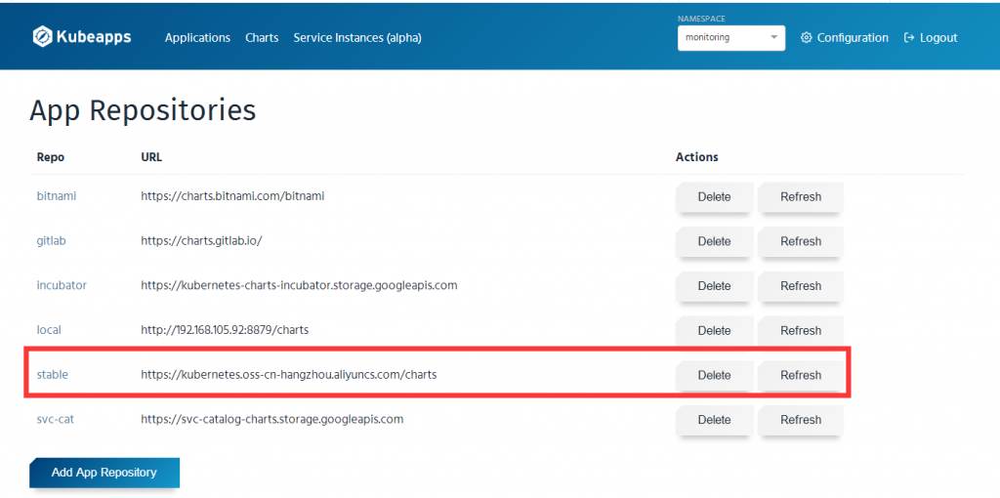
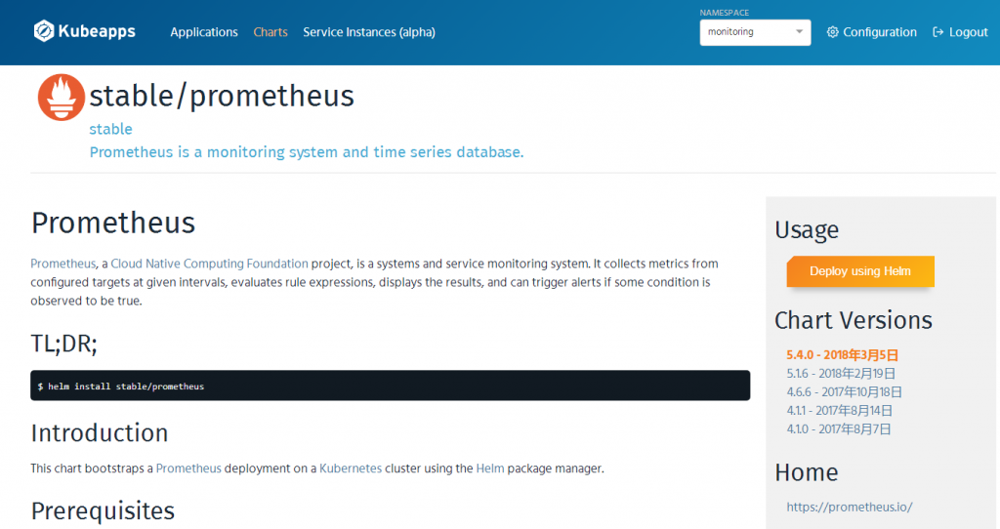
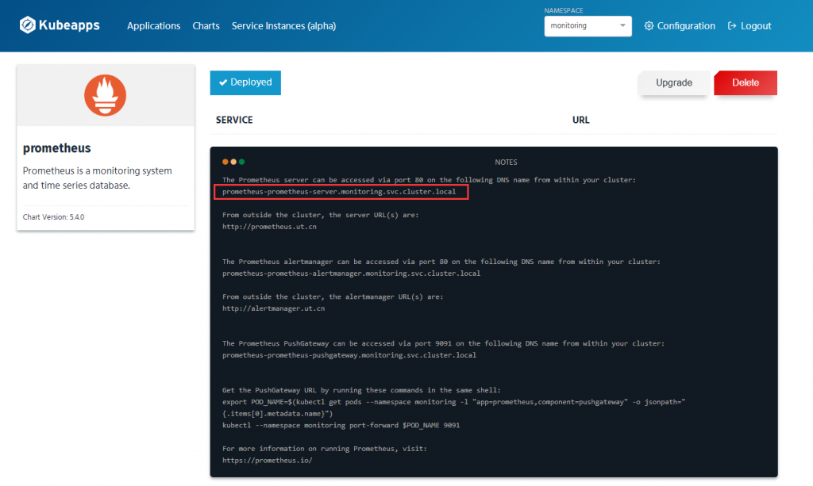
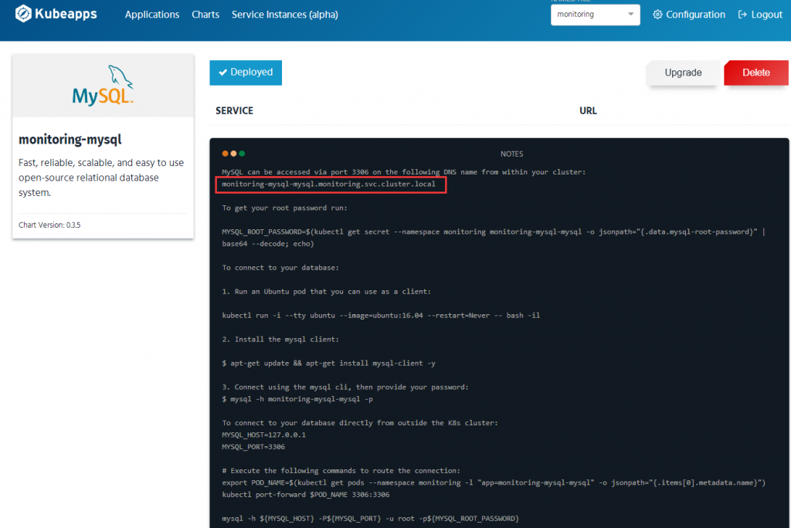
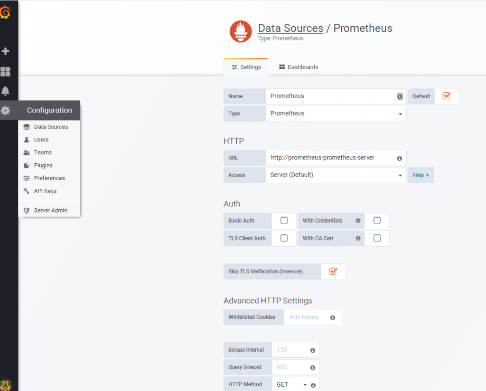
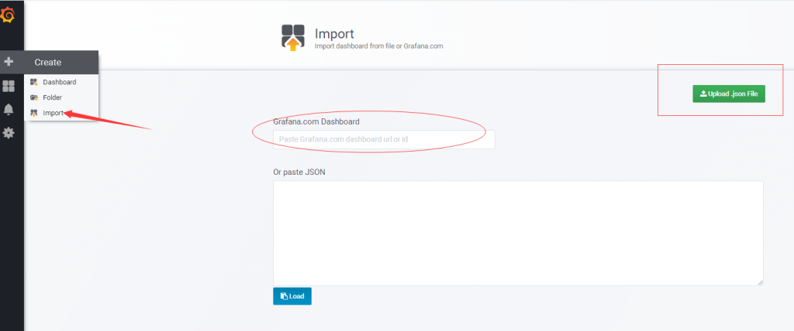
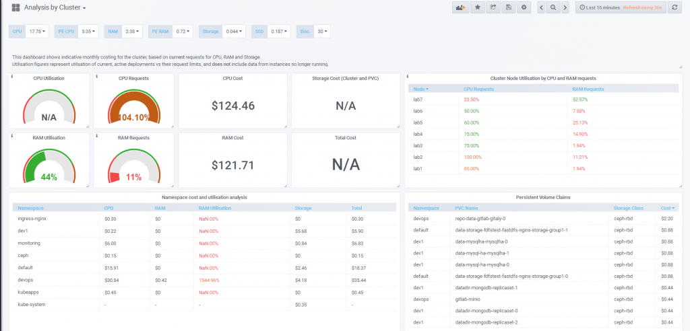

# 使用Helm部署Prometheus和Grafana监控Kubernetes

\[TOC\]

## 1\. 环境说明

- 可用的kubernetes集群
- 可用的持久化存储
- 可用的helm

这里我们使用kubeapps管理charts。



## 2\. 安装chart

安装时，适当修改`values.yaml`里的参数以适应自身的环境。我是设置持久化存储、ingress和证书secret。

安装Prometheus





安装成功后，注意提示页面的提示。同一namespace里，引用域名可只使用前面一段。

同理，安装`stable/mysql`和`stable/grafana`。 mysql的`values.yaml`配置用户密码和库名，以给grafana使用。



安装grafana时注意`values.yaml`里的数据库配置

```
[database]
type = mysql
host = monitoring-mysql-mysql:3306
name = grafana
user = grafana
password = GrafanaPWD
```


## 3\. 配置Grafana

全部安装运行正常后。我们配置登录Grafana添加数据源：



添加测试成功后，添加dashboard模板：



访问官网搜索模板： [https://grafana.com/dashboards?dataSource=prometheus&search=kubernetes](https://grafana.com/dashboards?dataSource=prometheus&search=kubernetes) Grafana的POD在上网环境可使用id直接导入，也可下载json文件导入。

我用的这位大神的dashboard，[https://karlstoney.com/2018/07/07/managing-your-costs-on-kubernetes/](https://karlstoney.com/2018/07/07/managing-your-costs-on-kubernetes/)

感觉比较清爽，当然，有需要再自己调整添加些dashboard。



## 4\. 小结

Helm使部署方便快捷，瞬间感觉kubernetes管理是如此easy。但是，helm安装chart过程中，最好看得懂chart里的templates，会排查问题，不然出错了会感觉无从下手。我是直接参考github里的chart，模仿各种用法，加上学习下面参考资料中的[\[3\]](https://whmzsu.github.io/helm-doc-zh-cn/quickstart/using_helm-zh_cn.html)写了一个[fastdfs-nginx](https://github.com/ygqygq2/charts/tree/master/fastdfs-nginx)的chart，再回来部署helm的chart，遇到问题才知道调试。

参考资料： \[1\] https://github.com/kubernetes/kube-state-metrics \[2\] https://www.kancloud.cn/huyipow/prometheus/527093 \[3\] https://whmzsu.github.io/helm-doc-zh-cn/quickstart/using\_helm-zh\_cn.html
