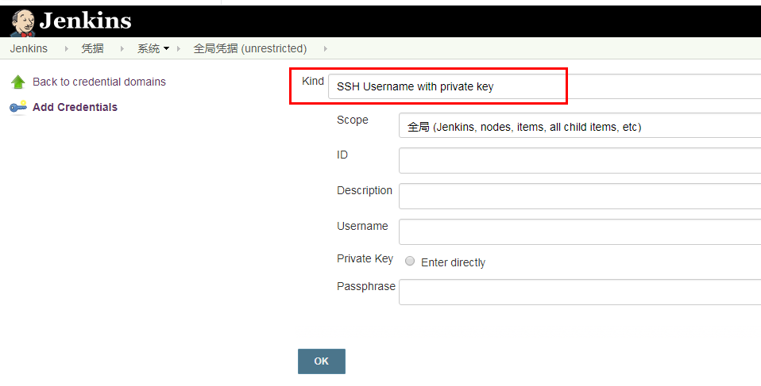
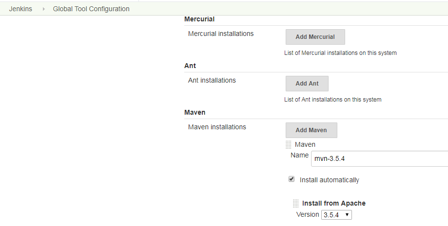
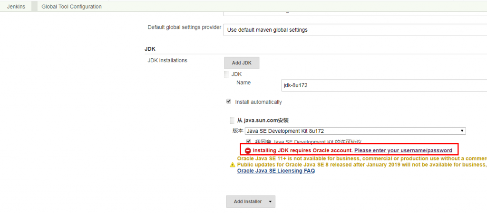
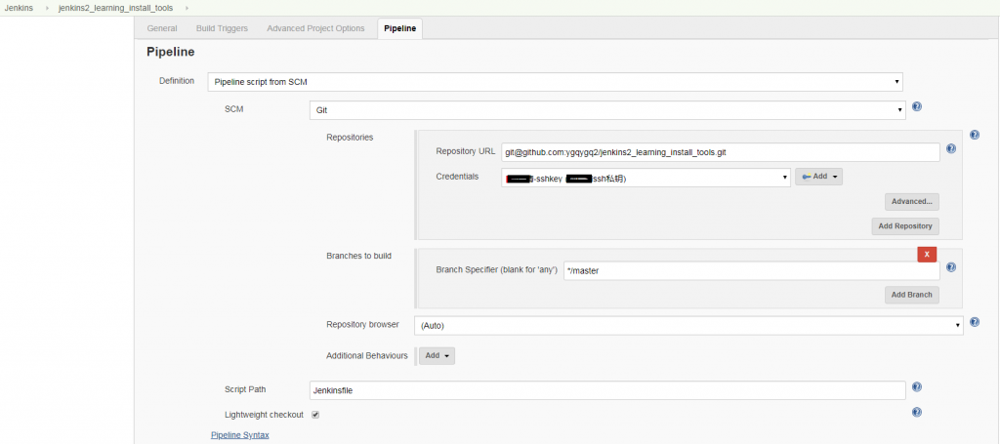

\[TOC\]

# 1\. Jenkins 2.x简介

## 1.1 pipeline是什么

从某种抽象层次上讲，部署流水线（Deployment pipeline）是指从软件版本控制库到用户手中这一过程的自动化表现形式。——《持续交付——发布可靠软件的系统方法》（下称《持续交付》） 按《持续交付》中的定义，Jenkins本来就支持pipeline（通常会把部署流水线简称为pipeline，本书会交替使用这两个术语），只是一开始不叫pipeline，而叫任务。 Jenkins 1.x只能通过界面手动操作来“描述”部署流水线。Jenkins 2.x终于支持pipeline as code了，可以通过“代码”来描述部署流水线。 使用“代码”而不是UI的意义在于：

- 更好地版本化：将pipeline提交到软件版本库中进行版本控制。
- 更好地协作：pipeline的每次修改对所有人都是可见的。除此之外，还可以对pipeline进行代码审查。
- 更好的重用性：手动操作没法重用，但是代码可以重用。 本书全面拥抱pipeline as code，放弃依赖手动操作的自由风格的项目（FreeStyle project）。

## 1.2 Jenkinsfile又是什么

Jenkinsfile就是一个文本文件，也就是部署流水线概念在Jenkins中的表现形式。像Dockerfile之于Docker。所有部署流水线的逻辑都写在Jenkinsfile中。

## 1.3 pipeline语法的选择

Jenkins pipeline有2种语法：脚本式（Scripted）语法和声明式（Declar-ative）语法。 脚本式语法使用Groovy语言，其语法灵活、可扩展，但是也意味着更复杂。再者，Groovy语言的学习成本对于（不使用Groovy的）开发团队来说通常是不必要的。所以才有了声明式语法，一种提供更简单、更结构化（more opinionated）的语法。

> 1. pipeline插件从2.5版本开始，才同时支持两种格式的语法；
> 2. 推荐主要使用声明式语法，脚本式语法作为辅助；

## 1.4 pipeline版本控制化

为了便于维护和协作，使用版本仓库对pipeline进行版本控制是生产使用过程中的最优选择。 本人实践过程中也是推荐书中提到的使用Git作为版本控制仓库，使用Jenkins ssh私钥作为凭证。

# 2\. 利用github仓库pipeline进行构建

以下为本实验地址： [https://github.com/ygqygq2/jenkins2\_learning\_install\_tools](https://github.com/ygqygq2/jenkins2_learning_install_tools)

**目的** 使用jenkins拉取git仓库内pipeline构建maven项目，达到了解pipeline基本用法。

**环境**

- github仓库
- jenkins（已整合kubernetes）

**实践**

1. 进入Manage Jenkins→Global Tool Configuration->Maven页添加`mvn-3.5.4` 
2. 进入Manage Jenkins→Global Tool Configuration→JDK页添加`jdk-8u172` 

> 注意这里需要oracle帐户验证。

1. 添加pipeline项目 
2. 构建 

因为jenkins-slave是整合kubernetes的，因此每次构建都会安装tools，如上图可以看出，maven安装包需要从官方下载，这对效率影响非常大。 若想优化可以考虑jenkins-slave镜像中直接整合maven，而不是使用jenkins tools；还可以使用docker-in-docker配合maven镜像。
