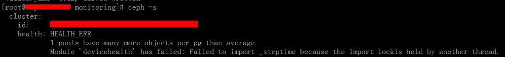
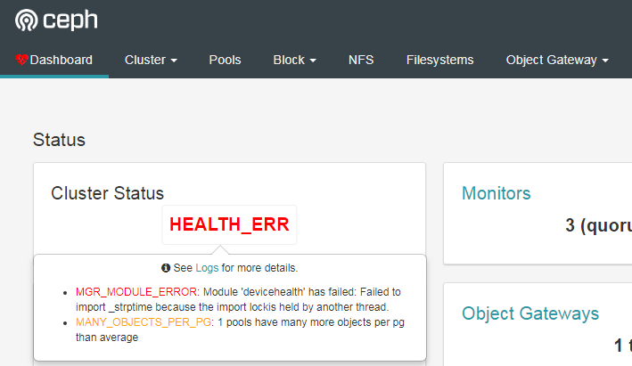
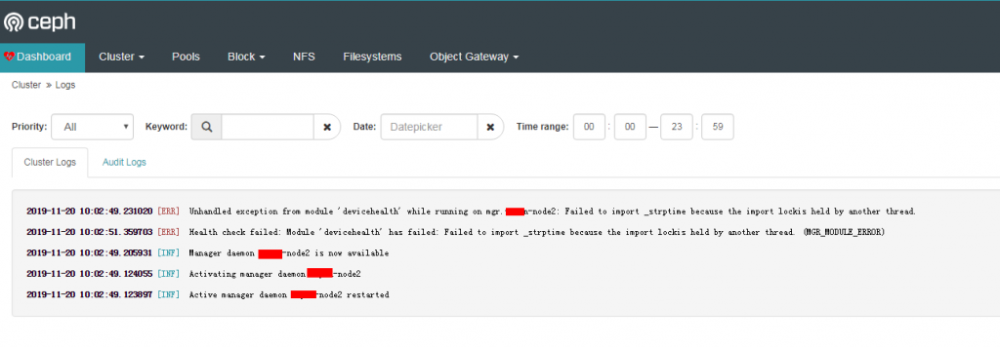
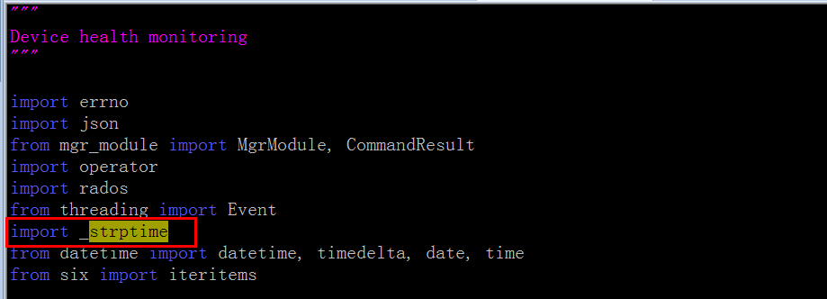

\[TOC\]

# 1\. 问题说明

| 软件 | 版本 |
| --- | --- |
| 操作系统 | CentOS7.6 |
| ceph | nautilus, v14.2.4 |

因为是刚搭建完ceph不久, rgw之前暂时没用到就没有添加。 今天添加rgw后，通过重启dashboard，发现报Error了。

```bash
ceph mgr module disable dashboard
ceph mgr module enable dashboard
```

```
Module 'devicehealth' has failed: Failed to import _strptime because the import lockis held by another thread.
```

 

通过在dashboard中的日志查看，发现mgr节点启动报错。



# 2\. 解决办法

通过谷歌搜索，发现有人提过这个bug，好在在stackoverflow中找到了解决办法。

mgr节点中，修改devicehealth模块文件，

`vim /usr/share/ceph/mgr/devicehealth/module.py`

添加一行`import _strptime`



重启mgr服务。报错消失，问题解决。

`systemctl restart ceph-mgr@ceph-node2.service`

参考资料： \[1\] [https://tracker.ceph.com/issues/41879](https://tracker.ceph.com/issues/41879) \[2\] [https://stackoverflow.com/questions/2427240/thread-safe-equivalent-to-pythons-time-strptime](https://stackoverflow.com/questions/2427240/thread-safe-equivalent-to-pythons-time-strptime)
