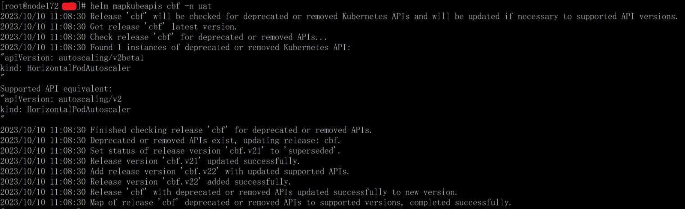

# 1\. 问题

kubernetes 升过级，但是 helm release 旧版本中有新版本 api 弃用的 version。  
在 helm upgrade 时就出现类似如下版本不匹配的错误，导致 `helm upgrade` 失败。  
当然 `helm uninstall` 再重新安装可能可以跳过这个问题（只要 charts 不再使用弃用的 api），但是 helm release 的历史记录就丢失了，处理方式显得有点暴力。

```
no matches for kind "HorizontalPodAutoscaler" in version "autoscaling/v2beta1"
```

# 2\. 解决

通过搜索 helm github issue，发现有个 helm 插件可以解决：  
https://github.com/helm/helm-mapkubeapis

插件安装、使用很简单：

```
helm plugin install https://github.com/helm/helm-mapkubeapis
# 如处理以下 cbf helm release
helm mapkubeapis cbf -n uat
```

然后就可以愉快地 `helm upgrade` 了。



参考资料：  
\[1\] https://github.com/helm/helm-mapkubeapis
