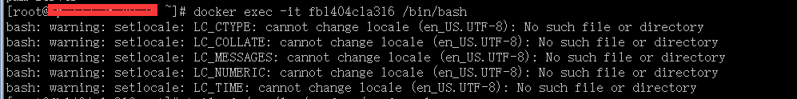
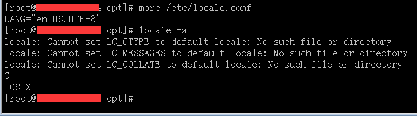
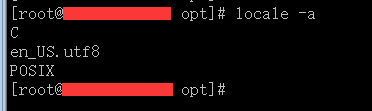

# CentOS7添加en\_US.UTF-8字符集

\[TOC\]

## 1\. 问题/现象

今天我在使用[PMM](https://www.percona.com/software/database-tools/percona-monitoring-and-management) docker的时候，发现连最基本的en\_US.UTF-8字符集都没有。





## 2\. 解决办法

搜了很久的资料，发现如下命令即可解决。

```
localedef -v -c -i en_US -f UTF-8 en_US.UTF-8
```

查看结果： 

`localedef`命令以前还真没用过，其实在linux下，还有很多命令不常用，平时可以多留意，以备不时之需。

参考： \[1\] [https://www.ibm.com/support/knowledgecenter/zh/ssw\_aix\_71/com.ibm.aix.cmds3/localedef.htm](https://www.ibm.com/support/knowledgecenter/zh/ssw_aix_71/com.ibm.aix.cmds3/localedef.htm) \[2\] [http://man.chinaunix.net/linux/lfs/LFS-6.1.1/chapter06/glibc.html](http://man.chinaunix.net/linux/lfs/LFS-6.1.1/chapter06/glibc.html) \[3\] [https://docs.oracle.com/cd/E62103\_01/html/E62875/localedef-1.html](https://docs.oracle.com/cd/E62103_01/html/E62875/localedef-1.html)
