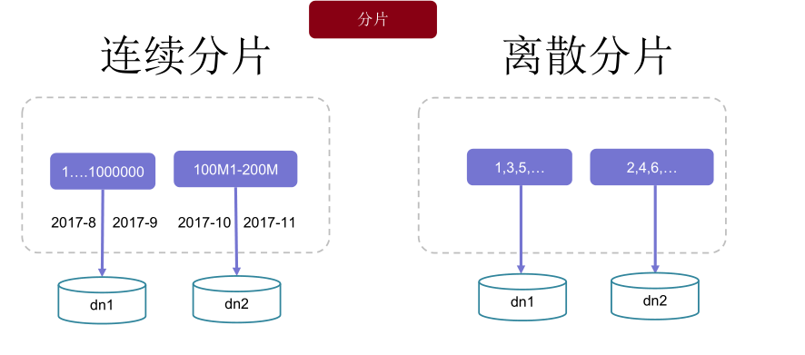
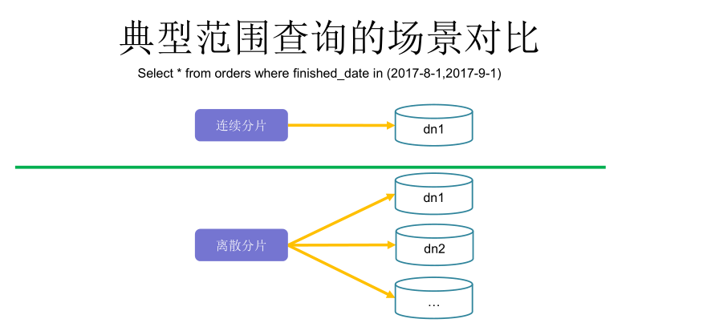
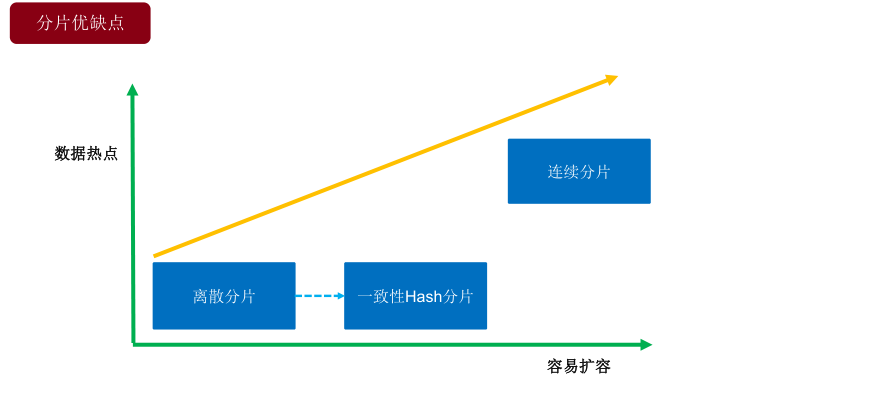
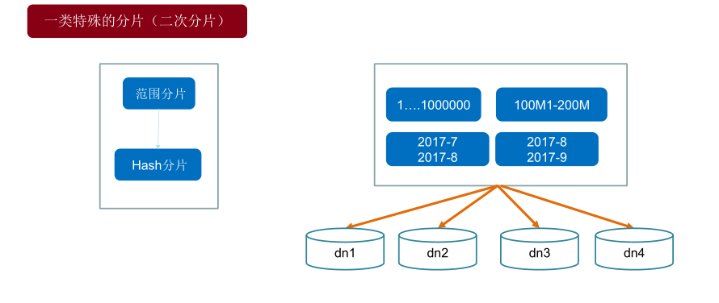
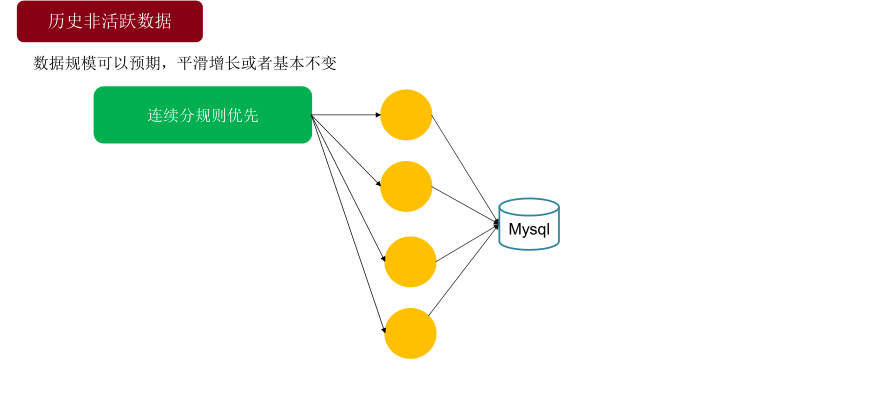

# Mycat学习实战-Mycat分片

\[TOC\]

## 1\. 分片规则配置文件

分片规则配置文件`rule.xml`位于$MYCAT\_HOME/conf目录，它定义了所有拆分表的规则。在使用过程中可以灵活使用不同的分片算法，或者对同一个分片算法使用不同的参数，它让分片过程可配置化，只需要简单的几步就可以让运维人员及数据库管理员轻松将数据拆分到不同的物理库中。该文件包含两个重要的标签，分别是Funcation和tableRule。

### 1.1 Funcation标签

```
<function name="rang-long"
        class="io.mycat.route.function.AutoPartitionByLong">
        <property name="mapFile">autopartition-long.txt</property>
</function>
```

- `name`属性指定算法的名称，在该文件中唯一。
- `class`属性对应具体的分片算法，需要指定算法的具体类。
- `property`属性根据算法的要求指定。

### 1.2 tableRule标签

```
<tableRule name="auto-sharding-long">
        <rule>
                <columns>id</columns>
                <algorithm>rang-long</algorithm>
        </rule>
</tableRule>
```

- `name`属性指定分片规则的名称，在该文件中唯一。
- `rule`属性指定分片算法的具体内容，包含`columns`和`algorithm`两个属性。
- `columns`属性指定对应的表中用于分片的列名。
- `algorithm`属性对应function中指定的算法的名称。

## 2\. 连续分片和离散分片





分片优缺点

| 分片 | 连续分片 | 离散分片 |
| --- | --- | --- |
| 优点 | 扩容无需迁移数据  
范围条件查询消耗资源少 | 并发访问能力增强  
范围条件查询性能提升 |
| 缺点 | 存在数据热点的可能性  
并发访问能力受限于单一或少量DataNode | 数据扩容比较困难，涉及到数据迁移问题  
数据库连接消耗比较多 |



特殊分片 

### 2.1 连续分片

连续分片规则 \* 自定义数字范围分片 \* 按日期（天）分片 \* 按单月小时分片 \* 自然月分片

#### 2.1.1 自定义数字范围分片

适用于明确知道分片字段的某个范围属于哪个分片，其字段为数字类型。

`vim conf/schema.xml`

```
<?xml version="1.0"?>
<!DOCTYPE mycat:schema SYSTEM "schema.dtd">
<mycat:schema xmlns:mycat="http://io.mycat/">
    <schema name="test" checkSQLschema="false" sqlMaxLimit="100">
        <table name="auto_sharding_long" primaryKey="id" dataNode="dn0,dn1,dn2" rule="auto-sharding-long" />
    </schema>
    <dataNode name="dn0" dataHost="dh-1" database="db0"/>
    <dataNode name="dn1" dataHost="dh-1" database="db1"/>
    <dataNode name="dn2" dataHost="dh-1" database="db2"/>  
    <dataHost name="dh-1" maxCon="1000" minCon="10" balance="0"  
              writeType="0" dbType="mysql" dbDriver="native" switchType="1"  slaveThreshold="100">
        <heartbeat>select user()</heartbeat>
        <writeHost host="hostM1" url="localhost:3306" user="root"  
                   password="123456">
        </writeHost>
    </dataHost>
</mycat:schema>
```

`vim conf/rule.xml`

```
<?xml version="1.0" encoding="UTF-8"?>
<!DOCTYPE mycat:rule SYSTEM "rule.dtd">
<mycat:rule xmlns:mycat="http://io.mycat/">
        <tableRule name="auto-sharding-long">
                <rule>
                        <columns>age</columns>
                        <algorithm>rang-long</algorithm>
                </rule>
        </tableRule>
        <function name="rang-long"
                class="io.mycat.route.function.AutoPartitionByLong">
                <property name="mapFile">autopartition-long.txt</property>
                <property name="defaultNode">0</property>
        </function>
</mycat:rule>
```

配置说明： \* `columns`指定分片的表列名。 \* `algorithm`指定分片函数与`function`对应。 \* `rang-long`函数中的mapFile代表规则配置文件的路径，可在`$MYCAT_HOME/conf`下新建目录作好规范，比如将`autopartition-long.txt`放在`$MYCAT_HOME/conf/func`中，则用`<property name="mapFile">func/autopartition-long.txt</property>`来引用。 \* `defaultNode`为超过范围后的默认节点。

`vim conf/autopartition-long.txt`

```
# range start-end ,data node index
# K=1000,M=10000.
0-2M=0
2M-3M=1
3M-6M=2
```

测试sql：

```
CREATE TABLE  auto_sharding_long  (`age`  int NOT NULL ,`db_nm`  varchar(20) NULL);  
INSERT INTO auto_sharding_long (age,db_nm) VALUES (20000, database());  
INSERT INTO auto_sharding_long (age,db_nm) VALUES (25000, database());  
INSERT INTO auto_sharding_long (age,db_nm) VALUES (35000, database()); 
```

测试结果：

```
[root@testA conf]# mysql -uroot -p123456 -h 127.0.0.1 -P8066 test
mysql: [Warning] Using a password on the command line interface can be insecure.
Welcome to the MySQL monitor.  Commands end with ; or \g.
Your MySQL connection id is 2
Server version: 5.6.29-mycat-1.6-RELEASE-20161028204710 MyCat Server (OpenCloundDB)

Copyright (c) 2000, 2017, Oracle and/or its affiliates. All rights reserved.

Oracle is a registered trademark of Oracle Corporation and/or its
affiliates. Other names may be trademarks of their respective
owners.

Type 'help;' or '\h' for help. Type '\c' to clear the current input statement.

mysql> CREATE TABLE  auto_sharding_long  (`age`  int NOT NULL ,`db_nm`  varchar(20) NULL);  
Query OK, 0 rows affected (0.10 sec)

mysql> INSERT INTO auto_sharding_long (age,db_nm) VALUES (20000, database());  
Query OK, 1 row affected (0.01 sec)

mysql> INSERT INTO auto_sharding_long (age,db_nm) VALUES (25000, database());  
Query OK, 1 row affected (0.00 sec)

mysql> INSERT INTO auto_sharding_long (age,db_nm) VALUES (35000, database());  
Query OK, 1 row affected (0.00 sec)

mysql> select * from auto_sharding_long;
+-------+-------+
| age   | db_nm |
+-------+-------+
| 20000 | db0   |
| 35000 | db2   |
| 25000 | db1   |
+-------+-------+
3 rows in set (0.00 sec)

mysql>
```

> 注意 schema里的table的dataNode节点个数必须 **大于等于** `autopartition-long.txt`里的配置个数 dataNode节点从0开始

#### 2.1.2 按日期（天）分片

根据时间类型字段，按天分片。

`vim conf/schema.xml`

```
<?xml version="1.0"?>
<!DOCTYPE mycat:schema SYSTEM "schema.dtd">
<mycat:schema xmlns:mycat="http://io.mycat/">
    <schema name="test" checkSQLschema="false" sqlMaxLimit="100">
        <table name="sharding_by_day" primaryKey="id" dataNode="dn$0-2" rule="sharding-by-day" /> 
    </schema>
    <dataNode name="dn0" dataHost="dh-1" database="db0"/>
    <dataNode name="dn1" dataHost="dh-1" database="db1"/>
    <dataNode name="dn2" dataHost="dh-1" database="db2"/>  
    <dataHost name="dh-1" maxCon="1000" minCon="10" balance="0"  
              writeType="0" dbType="mysql" dbDriver="native" switchType="1"  slaveThreshold="100">
        <heartbeat>select user()</heartbeat>
        <writeHost host="hostM1" url="localhost:3306" user="root"  
                   password="123456">
        </writeHost>
    </dataHost>
</mycat:schema>
```

`vim conf/rule.xml`

```
<?xml version="1.0" encoding="UTF-8"?>
<!DOCTYPE mycat:rule SYSTEM "rule.dtd">
<mycat:rule xmlns:mycat="http://io.mycat/">
        <tableRule name="sharding-by-day">  
            <rule>  
                <columns>create_time</columns>  
                <algorithm>part-by-day</algorithm>  
            </rule>  
        </tableRule>  
        <function name="part-by-day"  
            class="io.mycat.route.function.PartitionByDate">  
            <property name="dateFormat">yyyy-MM-dd</property>  
            <property name="sBeginDate">2017-10-01</property>  
            <property name="sPartionDay">10</property>  
        </function> 
</mycat:rule>
```

配置说明： \* `columns`标识将要分片的表字段。 \* `algorithm`为分片函数。 \* `dateFormat`为日期格式。 \* `sBeginDate`为开始日期。 \* `sEndDate`为结束日期，如果配置了这个属性，则代表数据达到了这个日期的分片后会重复从开始分片插入。 \* `sPartionDay`为分区天数，默认从开始日期算起，每隔10天一个分区。

测试SQL：

```
CREATE TABLE  sharding_by_day  (create_time   timestamp NULL ON UPDATE CURRENT_TIMESTAMP  ,`db_nm`  varchar(20) NULL);  
INSERT INTO sharding_by_day (create_time,db_nm) VALUES ('2017-10-01', database());  
INSERT INTO sharding_by_day (create_time,db_nm) VALUES ('2017-10-10', database());  
INSERT INTO sharding_by_day (create_time,db_nm) VALUES ('2017-10-11', database());  
INSERT INTO sharding_by_day (create_time,db_nm) VALUES ('2017-10-21', database());  
INSERT INTO sharding_by_day (create_time,db_nm) VALUES ('2017-10-31', database());  
select * from sharding_by_day;  
```

测试结果：

```
[root@testA conf]# mysql -uroot -p123456 -h 127.0.0.1 -P8066 test
mysql: [Warning] Using a password on the command line interface can be insecure.
Welcome to the MySQL monitor.  Commands end with ; or \g.
Your MySQL connection id is 1
Server version: 5.6.29-mycat-1.6-RELEASE-20161028204710 MyCat Server (OpenCloundDB)

Copyright (c) 2000, 2017, Oracle and/or its affiliates. All rights reserved.

Oracle is a registered trademark of Oracle Corporation and/or its
affiliates. Other names may be trademarks of their respective
owners.

Type 'help;' or '\h' for help. Type '\c' to clear the current input statement.

mysql> CREATE TABLE  sharding_by_day  (create_time   timestamp NULL ON UPDATE CURRENT_TIMESTAMP  ,`db_nm`  varchar(20) NULL);  
INSERT INTO sharding_by_day (create_time,db_nm) VALUES ('2017-10-01', database());  
INSERT INTO sharding_by_day (create_time,db_nm) VALUES ('2017-10-10', database());  
INSERT INTO sharding_by_day (create_time,db_nm) VALUES ('2017-10-11', database());  
INSERT INTO sharding_by_day (create_time,db_nm) VALUES ('2017-10-21', database());  
INSERT INTO sharding_by_day (create_time,db_nm) VALUES ('2017-10-31', database());  
select * from sharding_by_day;  Query OK, 0 rows affected (0.24 sec)

mysql> INSERT INTO sharding_by_day (create_time,db_nm) VALUES ('2017-10-01', database());  
Query OK, 1 row affected (0.10 sec)

mysql> INSERT INTO sharding_by_day (create_time,db_nm) VALUES ('2017-10-10', database());  
Query OK, 1 row affected (0.00 sec)

mysql> INSERT INTO sharding_by_day (create_time,db_nm) VALUES ('2017-10-11', database());  
Query OK, 1 row affected (0.01 sec)

mysql> INSERT INTO sharding_by_day (create_time,db_nm) VALUES ('2017-10-21', database());  
Query OK, 1 row affected (0.00 sec)

mysql> INSERT INTO sharding_by_day (create_time,db_nm) VALUES ('2017-10-31', database());  
ERROR 1064 (HY000): Can't find a valid data node for specified node index :SHARDING_BY_DAY -> CREATE_TIME -> 2017-10-31 -> Index : 3
mysql> select * from sharding_by_day;  
+---------------------+-------+
| create_time         | db_nm |
+---------------------+-------+
| 2017-10-01 00:00:00 | db0   |
| 2017-10-10 00:00:00 | db0   |
| 2017-10-11 00:00:00 | db1   |
| 2017-10-21 00:00:00 | db2   |
+---------------------+-------+
4 rows in set (0.05 sec)

mysql> 
```

> 注意 以上测试结果中有个错误，因为配置的dataNode节点数为3，而2017-10-31为2017-10-01后的第四个10天中的第一天，因此需要至少4个dataNode，节点不够就报如上错误了。

#### 2.1.3 按单月小时分片

单月内按照小时拆分，最小粒度是小时，一天最多可以有24个分片，最少1个分片，下个月从头开始循环，每个月末需要手工清理数据。

字段为字符串类型，`yyyymmddHH` 10位。

`vim conf/schema.xml`

```
<?xml version="1.0"?>
<!DOCTYPE mycat:schema SYSTEM "schema.dtd">
<mycat:schema xmlns:mycat="http://io.mycat/">
    <schema name="test" checkSQLschema="false" sqlMaxLimit="100">
        <table name="sharding_by_hour" primaryKey="id" dataNode="dn$0-2" rule="sharding-by-hour" /> 
    </schema>
    <dataNode name="dn0" dataHost="dh-1" database="db0"/>
    <dataNode name="dn1" dataHost="dh-1" database="db1"/>
    <dataNode name="dn2" dataHost="dh-1" database="db2"/>  
    <dataHost name="dh-1" maxCon="1000" minCon="10" balance="0"  
              writeType="0" dbType="mysql" dbDriver="native" switchType="1"  slaveThreshold="100">
        <heartbeat>select user()</heartbeat>
        <writeHost host="hostM1" url="localhost:3306" user="root"  
                   password="123456">
        </writeHost>
    </dataHost>
</mycat:schema>
```

`vim conf/rule.xml`

```
<?xml version="1.0" encoding="UTF-8"?>
<!DOCTYPE mycat:rule SYSTEM "rule.dtd">
<mycat:rule xmlns:mycat="http://io.mycat/">
        <tableRule name="sharding-by-hour">  
            <rule>  
                <columns>sharding_col</columns>  
                <algorithm>sharding-by-hour</algorithm>  
            </rule>  
        </tableRule>  
        <function name="sharding-by-hour"
                class="io.mycat.route.function.LatestMonthPartion">
                <property name="splitOneDay">3</property>
        </function>
</mycat:rule>
```

配置说明： \* `columns`标识将要分片的表字段，字符串类型（`yyyymmddHH`），格式需要符合Java标准。 \* `algorithm`为分片函数。 \* `splitOneDay`为一天切分的分片数。

测试SQL：

```
CREATE TABLE  sharding_by_hour  (create_time   timestamp NULL ON UPDATE CURRENT_TIMESTAMP  ,`db_nm`  varchar(20) NULL,sharding_col varchar(10) null);  
INSERT INTO sharding_by_hour (sharding_col,create_time,db_nm) VALUES ('2017100101','2017-10-01', database());  
INSERT INTO sharding_by_hour (sharding_col,create_time,db_nm) VALUES ('2017100108','2017-10-01', database());  
INSERT INTO sharding_by_hour (sharding_col,create_time,db_nm) VALUES ('2017100109','2017-10-01', database());  
INSERT INTO sharding_by_hour (sharding_col,create_time,db_nm) VALUES ('2017100116','2017-10-01', database());  
INSERT INTO sharding_by_hour (sharding_col,create_time,db_nm) VALUES ('2017100117','2017-10-01', database());  
INSERT INTO sharding_by_hour (sharding_col,create_time,db_nm) VALUES ('2017100123','2017-10-01', database());  
select * from sharding_by_hour;
```

测试结果：

```
[root@testA conf]# mysql -uroot -p123456 -h 127.0.0.1 -P8066 test
mysql: [Warning] Using a password on the command line interface can be insecure.
Welcome to the MySQL monitor.  Commands end with ; or \g.
Your MySQL connection id is 1
Server version: 5.6.29-mycat-1.6-RELEASE-20161028204710 MyCat Server (OpenCloundDB)

Copyright (c) 2000, 2017, Oracle and/or its affiliates. All rights reserved.

Oracle is a registered trademark of Oracle Corporation and/or its
affiliates. Other names may be trademarks of their respective
owners.

Type 'help;' or '\h' for help. Type '\c' to clear the current input statement.

mysql> CREATE TABLE  sharding_by_hour  (create_time   timestamp NULL ON UPDATE CURRENT_TIMESTAMP  ,`db_nm`  varchar(20) NULL,sharding_col varchar(10) null);  
INSERT INTO sharding_by_hour (sharding_col,create_time,db_nm) VALUES ('2017100101','2017-10-01', database());  
INSERT INTO sharding_by_hour (sharding_col,create_time,db_nm) VALUES ('2017100108','2017-10-01', database());  
INSERT INTO sharding_by_hour (sharding_col,create_time,db_nm) VALUES ('2017100109','2017-10-01', database());  
INSERT INTO sharding_by_hour (sharding_col,create_time,db_nm) VALUES ('2017100116','2017-10-01', database());  
INSERT INTO sharding_by_hour (sharding_col,create_time,db_nm) VALUES ('2017100117','2017-10-01', database());  
INSERT INTO sharding_by_hour (sharding_col,create_time,db_nm) VALUES ('2017100123','2017-10-01', database());  
select * from sharding_by_hour; Query OK, 0 rows affected (0.21 sec)

mysql> INSERT INTO sharding_by_hour (sharding_col,create_time,db_nm) VALUES ('2017100101','2017-10-01', database());  
Query OK, 1 row affected (0.11 sec)

mysql> INSERT INTO sharding_by_hour (sharding_col,create_time,db_nm) VALUES ('2017100108','2017-10-01', database());  
Query OK, 1 row affected (0.00 sec)

mysql> INSERT INTO sharding_by_hour (sharding_col,create_time,db_nm) VALUES ('2017100109','2017-10-01', database());  
Query OK, 1 row affected (0.01 sec)

mysql> INSERT INTO sharding_by_hour (sharding_col,create_time,db_nm) VALUES ('2017100116','2017-10-01', database());  
Query OK, 1 row affected (0.00 sec)

mysql> INSERT INTO sharding_by_hour (sharding_col,create_time,db_nm) VALUES ('2017100117','2017-10-01', database());  
Query OK, 1 row affected (0.01 sec)

mysql> INSERT INTO sharding_by_hour (sharding_col,create_time,db_nm) VALUES ('2017100123','2017-10-01', database());  
Query OK, 1 row affected (0.00 sec)

mysql> select * from sharding_by_hour; 
+---------------------+-------+--------------+
| create_time         | db_nm | sharding_col |
+---------------------+-------+--------------+
| 2017-10-01 00:00:00 | db0   | 2017100101   |
| 2017-10-01 00:00:00 | db1   | 2017100108   |
| 2017-10-01 00:00:00 | db1   | 2017100109   |
| 2017-10-01 00:00:00 | db2   | 2017100116   |
| 2017-10-01 00:00:00 | db2   | 2017100117   |
| 2017-10-01 00:00:00 | db2   | 2017100123   |
+---------------------+-------+--------------+
6 rows in set (0.06 sec) 
```

> 注意 \* 分片数必须跟dataNode节点数一致 \* 最大分24个分片 \* 分片字段的值必须是字符串，如：2017103112.(即为2017年10月31日12点)

#### 2.1.4 按自然月分片

使用场景为按月份列分区，每个自然月一个分片，查询条件时使用between and。 字段为时间类型。

`vim conf/schema.xml`

```
<?xml version="1.0"?>
<!DOCTYPE mycat:schema SYSTEM "schema.dtd">
<mycat:schema xmlns:mycat="http://io.mycat/">
    <schema name="test" checkSQLschema="false" sqlMaxLimit="100">
        <table name="sharding_by_month" primaryKey="id" dataNode="dn$0-2" rule="sharding-by-month" /> 
    </schema>
    <dataNode name="dn0" dataHost="dh-1" database="db0"/>
    <dataNode name="dn1" dataHost="dh-1" database="db1"/>
    <dataNode name="dn2" dataHost="dh-1" database="db2"/>  
    <dataHost name="dh-1" maxCon="1000" minCon="10" balance="0"  
              writeType="0" dbType="mysql" dbDriver="native" switchType="1"  slaveThreshold="100">
        <heartbeat>select user()</heartbeat>
        <writeHost host="hostM1" url="localhost:3306" user="root"  
                   password="123456">
        </writeHost>
    </dataHost>
</mycat:schema>
```

`vim conf/rule.xml`

```
<?xml version="1.0" encoding="UTF-8"?>
<!DOCTYPE mycat:rule SYSTEM "rule.dtd">
<mycat:rule xmlns:mycat="http://io.mycat/">
        <tableRule name="sharding-by-month">  
            <rule>  
                <columns>create_time</columns>  
                <algorithm>sharding-by-month</algorithm>  
            </rule>  
        </tableRule>  
        <function name="sharding-by-month"
                class="io.mycat.route.function.PartitionByMonth">
                <property name="dateFormat">yyyy-MM-dd</property>
                <property name="sBeginDate">2017-10-01</property>
                <property name="sEndDate">2017-12-30</property>
        </function>
</mycat:rule>
```

配置说明： \* `columns`标识将要分片的表字段，字符串类型，与`dateFormat`格式一致。 \* `algorithm`为分片函数。 \* `dateFormat`为日期字符串格式。 \* `sBeginDate`为开始日期。 \* `sEndDate`为结束日期

测试SQL：

```
CREATE TABLE  sharding_by_month  (create_time   timestamp NULL ON UPDATE CURRENT_TIMESTAMP  ,`db_nm`  varchar(20) NULL);  
INSERT INTO sharding_by_month (create_time,db_nm) VALUES ('2017-10-01', database());  
INSERT INTO sharding_by_month (create_time,db_nm) VALUES ('2017-10-30', database());  
INSERT INTO sharding_by_month (create_time,db_nm) VALUES ('2017-11-11', database());  
INSERT INTO sharding_by_month (create_time,db_nm) VALUES ('2017-11-21', database());  
INSERT INTO sharding_by_month (create_time,db_nm) VALUES ('2017-12-01', database());  
INSERT INTO sharding_by_month (create_time,db_nm) VALUES ('2017-12-31', database());  
INSERT INTO sharding_by_month (create_time,db_nm) VALUES ('2018-01-01', database());  
INSERT INTO sharding_by_month (create_time,db_nm) VALUES ('2018-01-31', database());  
select * from sharding_by_month
```

测试结果：

```
[root@testA conf]# mysql -uroot -p123456 -h 127.0.0.1 -P8066 test
mysql: [Warning] Using a password on the command line interface can be insecure.
Welcome to the MySQL monitor.  Commands end with ; or \g.
Your MySQL connection id is 1
Server version: 5.6.29-mycat-1.6-RELEASE-20161028204710 MyCat Server (OpenCloundDB)

Copyright (c) 2000, 2017, Oracle and/or its affiliates. All rights reserved.

Oracle is a registered trademark of Oracle Corporation and/or its
affiliates. Other names may be trademarks of their respective
owners.

Type 'help;' or '\h' for help. Type '\c' to clear the current input statement.

mysql> CREATE TABLE  sharding_by_month  (create_time   timestamp NULL ON UPDATE CURRENT_TIMESTAMP  ,`db_nm`  varchar(20) NULL);  
INSERT INTO sharding_by_month (create_time,db_nm) VALUES ('2017-10-01', database());  
INSERT INTO sharding_by_month (create_time,db_nm) VALUES ('2017-10-30', database());  
INSERT INTO sharding_by_month (create_time,db_nm) VALUES ('2017-11-11', database());  
INSERT INTO sharding_by_month (create_time,db_nm) VALUES ('2017-11-21', database());  
INSERT INTO sharding_by_month (create_time,db_nm) VALUES ('2017-12-01', database());  
INSERT INTO sharding_by_month (create_time,db_nm) VALUES ('2017-12-31', database());  
INSERT INTO sharding_by_month (create_time,db_nm) VALUES ('2018-01-01', database());  
INSERT INTO sharding_by_month (create_time,db_nm) VALUES ('2018-01-31', database());  
Query OK, 0 rows affected (0.15 sec)

mysql> INSERT INTO sharding_by_month (create_time,db_nm) VALUES ('2017-10-01', database());  
select * from sharding_by_month;  Query OK, 1 row affected (0.10 sec)

mysql> INSERT INTO sharding_by_month (create_time,db_nm) VALUES ('2017-10-30', database());  
Query OK, 1 row affected (0.00 sec)

mysql> INSERT INTO sharding_by_month (create_time,db_nm) VALUES ('2017-11-11', database());  
Query OK, 1 row affected (0.00 sec)

mysql> INSERT INTO sharding_by_month (create_time,db_nm) VALUES ('2017-11-21', database());  
Query OK, 1 row affected (0.01 sec)

mysql> INSERT INTO sharding_by_month (create_time,db_nm) VALUES ('2017-12-01', database());  
Query OK, 1 row affected (0.01 sec)

mysql> INSERT INTO sharding_by_month (create_time,db_nm) VALUES ('2017-12-31', database());  
Query OK, 1 row affected (0.00 sec)

mysql> INSERT INTO sharding_by_month (create_time,db_nm) VALUES ('2018-01-01', database());  
Query OK, 1 row affected (0.00 sec)

mysql> INSERT INTO sharding_by_month (create_time,db_nm) VALUES ('2018-01-31', database());  
Query OK, 1 row affected (0.01 sec)

mysql> select * from sharding_by_month;  
+---------------------+-------+
| create_time         | db_nm |
+---------------------+-------+
| 2017-10-01 00:00:00 | db0   |
| 2017-10-30 00:00:00 | db0   |
| 2018-01-01 00:00:00 | db0   |
| 2018-01-31 00:00:00 | db0   |
| 2017-11-11 00:00:00 | db1   |
| 2017-11-21 00:00:00 | db1   |
| 2017-12-01 00:00:00 | db2   |
| 2017-12-31 00:00:00 | db2   |
+---------------------+-------+
8 rows in set (0.06 sec)

```

> 注意 \* schema里的table的dataNode节点数必须：大于rule的开始时间按照分片数计算到现在的个数 \* 按照自然月计算（无论是28、30、31天都是一个月的） \* 分片节点个数可以后增加，但是必须符合第一点说明。

### 2.2 离散分片

离散分片规则 \* 枚举分片 \* 程序指定分区的分片 \* 十进制求模分片 \* 字符串hash解析分片 \* 一致性哈希分片

#### 2.2.1 枚举分片

通过在配置文件中配置可能的枚举id，指定数据分布到不同的物理节点上，本规则适用于按照省份或区县来拆分数据类业务。

`vim conf/schema.xml`

```
<?xml version="1.0"?>
<!DOCTYPE mycat:schema SYSTEM "schema.dtd">
<mycat:schema xmlns:mycat="http://io.mycat/">
    <schema name="test" checkSQLschema="false" sqlMaxLimit="100">
        <table name="sharding_by_intfile" primaryKey="id" dataNode="dn$0-2" rule="sharding-by-intfile" /> 
    </schema>
    <dataNode name="dn0" dataHost="dh-1" database="db0"/>
    <dataNode name="dn1" dataHost="dh-1" database="db1"/>
    <dataNode name="dn2" dataHost="dh-1" database="db2"/>  
    <dataHost name="dh-1" maxCon="1000" minCon="10" balance="0"  
              writeType="0" dbType="mysql" dbDriver="native" switchType="1"  slaveThreshold="100">
        <heartbeat>select user()</heartbeat>
        <writeHost host="hostM1" url="localhost:3306" user="root"  
                   password="123456">
        </writeHost>
    </dataHost>
</mycat:schema>
```

`vim conf/rule.xml`

```
<?xml version="1.0" encoding="UTF-8"?>
<!DOCTYPE mycat:rule SYSTEM "rule.dtd">
<mycat:rule xmlns:mycat="http://io.mycat/">
        <tableRule name="sharding-by-intfile">  
            <rule>  
                <columns>age</columns>  
                <algorithm>hash-int</algorithm>  
            </rule>  
        </tableRule>  
        <function name="hash-int"
                class="io.mycat.route.function.PartitionByFileMap">
                <property name="mapFile">partition-hash-int.txt</property>
                <property name="type">0</property>
                <property name="defaultNode">0</property>
        </function>
</mycat:rule>
```

配置说明： \* `columns`标识将要分片的表字段，字符串类型，与`dateFormat`格式一致。 \* `algorithm`为分片函数。 \* `dateFormat`为日期字符串格式。 \* `sBeginDate`为开始日期。 \* `sEndDate`为结束日期

`vim conf/partition-hash-int.txt`

```
# 枚举项=节点标识，枚举项可以是数字和字符（非汉字）
11=1
12=2
```

测试SQL：

```
CREATE TABLE sharding_by_intfile  (`age`  int NOT NULL ,`db_nm`  varchar(20) NULL);  
INSERT INTO `sharding_by_intfile` (age,db_nm) VALUES (10, database());  
INSERT INTO `sharding_by_intfile` (age,db_nm) VALUES (11, database());  
INSERT INTO `sharding_by_intfile` (age,db_nm) VALUES (12, database());  
select * from `sharding_by_intfile`;  
```

测试结果：

```
[root@testA conf]# mysql -uroot -p123456 -h 127.0.0.1 -P8066 test
mysql: [Warning] Using a password on the command line interface can be insecure.
Welcome to the MySQL monitor.  Commands end with ; or \g.
Your MySQL connection id is 1
Server version: 5.6.29-mycat-1.6-RELEASE-20161028204710 MyCat Server (OpenCloundDB)

Copyright (c) 2000, 2017, Oracle and/or its affiliates. All rights reserved.

Oracle is a registered trademark of Oracle Corporation and/or its
affiliates. Other names may be trademarks of their respective
owners.

Type 'help;' or '\h' for help. Type '\c' to clear the current input statement.

mysql> CREATE TABLE sharding_by_intfile  (`age`  int NOT NULL ,`db_nm`  varchar(20) NULL);  
INSERT INTO `sharding_by_intfile` (age,db_nm) VALUES (10, database());  
INSERT INTO `sharding_by_intfile` (age,db_nm) VALUES (11, database());  
INSERT INTO `sharding_by_intfile` (age,db_nm) VALUES (12, database());  
select * from `sharding_by_intfile`;  Query OK, 0 rows affected (0.21 sec)

mysql> INSERT INTO `sharding_by_intfile` (age,db_nm) VALUES (10, database());  
Query OK, 1 row affected (0.06 sec)

mysql> INSERT INTO `sharding_by_intfile` (age,db_nm) VALUES (11, database());  
Query OK, 1 row affected (0.00 sec)

mysql> INSERT INTO `sharding_by_intfile` (age,db_nm) VALUES (12, database());  
Query OK, 1 row affected (0.01 sec)

mysql> select * from `sharding_by_intfile`;  
+-----+-------+
| age | db_nm |
+-----+-------+
|  10 | db0   |
|  12 | db2   |
|  11 | db1   |
+-----+-------+
3 rows in set (0.21 sec)

```

> 注意 \* schema里的table的dataNode节点个数必须：**大于等于** partition-hash-int.txt里的配置个数

#### 2.2.2 程序指定分区分片

在程序运行阶段，由程序自主决定路由到哪个分片。

`vim conf/schema.xml`

```
<?xml version="1.0"?>
<!DOCTYPE mycat:schema SYSTEM "schema.dtd">
<mycat:schema xmlns:mycat="http://io.mycat/">
    <schema name="test" checkSQLschema="false" sqlMaxLimit="100">
        <table name="sharding_by_substring" primaryKey="id" dataNode="dn$0-2" rule="sharding-by-substring" /> 
    </schema>
    <dataNode name="dn0" dataHost="dh-1" database="db0"/>
    <dataNode name="dn1" dataHost="dh-1" database="db1"/>
    <dataNode name="dn2" dataHost="dh-1" database="db2"/>  
    <dataHost name="dh-1" maxCon="1000" minCon="10" balance="0"  
              writeType="0" dbType="mysql" dbDriver="native" switchType="1"  slaveThreshold="100">
        <heartbeat>select user()</heartbeat>
        <writeHost host="hostM1" url="localhost:3306" user="root"  
                   password="123456">
        </writeHost>
    </dataHost>
</mycat:schema>
```

`vim conf/rule.xml`

```
<?xml version="1.0" encoding="UTF-8"?>
<!DOCTYPE mycat:rule SYSTEM "rule.dtd">
<mycat:rule xmlns:mycat="http://io.mycat/">
        <tableRule name="sharding-by-substring">  
            <rule>  
                <columns>user_id</columns>  
                <algorithm>sharding-by-substring</algorithm>  
            </rule>  
        </tableRule>  
        <function name="sharding-by-substring"
                class="io.mycat.route.function.PartitionDirectBySubString">
                <property name="startIndex">0</property>
                <property name="size">2</property>
                <property name="partitionCount">3</property>
                <property name="defaultPartition">0</property>
        </function>
</mycat:rule>
```

配置说明： \* `columns`标识将要分片的表字段。 \* `algorithm`为分片函数。 \* `startIndex`为字符串开始截取位，从0开始。 \* `size`为截取的位数。 \* `partitionCount`为分片个数 \* `defaultPartition`为默认节点

测试SQL：

```
CREATE TABLE sharding_by_substring  (`user_id`  varchar(20) NOT NULL ,`db_nm`  varchar(20) NULL);  
INSERT INTO `sharding_by_substring` (user_id,db_nm) VALUES ('05-10000', database());  
INSERT INTO `sharding_by_substring` (user_id,db_nm) VALUES ('02-10001', database());  
INSERT INTO `sharding_by_substring` (user_id,db_nm) VALUES ('03-10002', database());  
select * from `sharding_by_substring`;  
```

测试结果：

```
[root@testA conf]# mysql -uroot -p123456 -h 127.0.0.1 -P8066 test
mysql: [Warning] Using a password on the command line interface can be insecure.
Welcome to the MySQL monitor.  Commands end with ; or \g.
Your MySQL connection id is 3
Server version: 5.6.29-mycat-1.6-RELEASE-20161028204710 MyCat Server (OpenCloundDB)

Copyright (c) 2000, 2017, Oracle and/or its affiliates. All rights reserved.

Oracle is a registered trademark of Oracle Corporation and/or its
affiliates. Other names may be trademarks of their respective
owners.

Type 'help;' or '\h' for help. Type '\c' to clear the current input statement.

mysql> CREATE TABLE sharding_by_substring  (`user_id`  varchar(20) NOT NULL ,`db_nm`  varchar(20) NULL);  
INSERT INTO `sharding_by_substring` (user_id,db_nm) VALUES ('05-10000', database());  
INSERT INTO `sharding_by_substring` (user_id,db_nm) VALUES ('02-10001', database());  
INSERT INTO `sharding_by_substring` (user_id,db_nm) VALUES ('03-10002', database());  
select * from `sharding_by_substring`;  Query OK, 0 rows affected (0.35 sec)

mysql> INSERT INTO `sharding_by_substring` (user_id,db_nm) VALUES ('05-10000', database());  
Query OK, 1 row affected (0.00 sec)

mysql> INSERT INTO `sharding_by_substring` (user_id,db_nm) VALUES ('02-10001', database());  
Query OK, 1 row affected (0.01 sec)

mysql> INSERT INTO `sharding_by_substring` (user_id,db_nm) VALUES ('03-10002', database());  
Query OK, 1 row affected (0.01 sec)

mysql> select * from `sharding_by_substring`;  
+----------+-------+
| user_id  | db_nm |
+----------+-------+
| 05-10000 | db0   |
| 03-10002 | db0   |
| 02-10001 | db2   |
+----------+-------+
3 rows in set (0.00 sec)

```

> 注意 \* 直接根据字符子串（必须是数字）计算分区号（由应用传递参数，指定分区号）。 例如`user_id=05-10000`，其中`user_id`是从`startIndex=0`开始的，截取长度为两位数字，即05，05就是获取的分区，默认分配到`defaultPartition`。

#### 2.2.3 十进制求模分片

对分片字段十进制取模运算，其数据分布最均匀。

`vim conf/schema.xml`

```
<?xml version="1.0"?>
<!DOCTYPE mycat:schema SYSTEM "schema.dtd">
<mycat:schema xmlns:mycat="http://io.mycat/">
    <schema name="test" checkSQLschema="false" sqlMaxLimit="100">
        <table name="sharding_by_substring" primaryKey="id" dataNode="dn$0-2" rule="sharding-by-substring" /> 
    </schema>
    <dataNode name="dn0" dataHost="dh-1" database="db0"/>
    <dataNode name="dn1" dataHost="dh-1" database="db1"/>
    <dataNode name="dn2" dataHost="dh-1" database="db2"/>  
    <dataHost name="dh-1" maxCon="1000" minCon="10" balance="0"  
              writeType="0" dbType="mysql" dbDriver="native" switchType="1"  slaveThreshold="100">
        <heartbeat>select user()</heartbeat>
        <writeHost host="hostM1" url="localhost:3306" user="root"  
                   password="123456">
        </writeHost>
    </dataHost>
</mycat:schema>
```

`vim conf/rule.xml`

```
<?xml version="1.0" encoding="UTF-8"?>
<!DOCTYPE mycat:rule SYSTEM "rule.dtd">
<mycat:rule xmlns:mycat="http://io.mycat/">
        <tableRule name="sharding-by-substring">  
            <rule>  
                <columns>user_id</columns>  
                <algorithm>sharding-by-substring</algorithm>  
            </rule>  
        </tableRule>  
        <function name="sharding-by-substring"
                class="io.mycat.route.function.PartitionDirectBySubString">
                <property name="startIndex">0</property>
                <property name="size">2</property>
                <property name="partitionCount">3</property>
                <property name="defaultPartition">0</property>
        </function>
</mycat:rule>
```

配置说明： \* `columns`标识将要分片的表字段。 \* `algorithm`为分片函数。 \* `startIndex`为字符串开始截取位，从0开始。 \* `size`为截取的位数。 \* `partitionCount`为分片个数 \* `defaultPartition`为默认节点

测试SQL：

```
CREATE TABLE `sharding_by_mod` (id int(10) null,`db_nm`  varchar(20) NULL);  
INSERT INTO `sharding_by_mod` (id,db_nm) VALUES (1, database());  
INSERT INTO `sharding_by_mod` (id,db_nm) VALUES (2, database());  
INSERT INTO `sharding_by_mod` (id,db_nm) VALUES (3, database());  
INSERT INTO `sharding_by_mod` (id,db_nm) VALUES (10, database());  
select * from sharding_by_mod;   
```

测试结果：

```
[root@testA conf]# mysql -uroot -p123456 -h 127.0.0.1 -P8066 test
mysql: [Warning] Using a password on the command line interface can be insecure.
Welcome to the MySQL monitor.  Commands end with ; or \g.
Your MySQL connection id is 2
Server version: 5.6.29-mycat-1.6-RELEASE-20161028204710 MyCat Server (OpenCloundDB)

Copyright (c) 2000, 2017, Oracle and/or its affiliates. All rights reserved.

Oracle is a registered trademark of Oracle Corporation and/or its
affiliates. Other names may be trademarks of their respective
owners.

Type 'help;' or '\h' for help. Type '\c' to clear the current input statement.

mysql> CREATE TABLE `sharding_by_mod` (id int(10) null,`db_nm`  varchar(20) NULL);  
INSERT INTO `sharding_by_mod` (id,db_nm) VALUES (1, database());  
INSERT INTO `sharding_by_mod` (id,db_nm) VALUES (2, database());  
INSERT INTO `sharding_by_mod` (id,db_nm) VALUES (3, database());  
INSERT INTO `sharding_by_mod` (id,db_nm) VALUES (10, database());  
select * from sharding_by_mod;   Query OK, 0 rows affected (0.22 sec)

mysql> INSERT INTO `sharding_by_mod` (id,db_nm) VALUES (1, database());  
Query OK, 1 row affected (0.04 sec)

mysql> INSERT INTO `sharding_by_mod` (id,db_nm) VALUES (2, database());  
Query OK, 1 row affected (0.02 sec)

mysql> INSERT INTO `sharding_by_mod` (id,db_nm) VALUES (3, database());  
Query OK, 1 row affected (0.00 sec)

mysql> INSERT INTO `sharding_by_mod` (id,db_nm) VALUES (10, database());  
Query OK, 1 row affected (0.01 sec)

mysql> select * from sharding_by_mod;   
+------+-------+
| id   | db_nm |
+------+-------+
|    3 | db0   |
|    1 | db1   |
|   10 | db1   |
|    2 | db2   |
+------+-------+
4 rows in set (0.10 sec)

```

> 注意 \* 对分片字段十进制取模运算，`dataNode=id%count` \* 数据分布最均匀。 \* 扩容需要重新计算分片，数据迁移繁琐。 \* 尽量的提前计算出来增量，创建足够多的分片数。但是也不宜太多，给运维造成负担。平衡点自己掌控。

#### 2.2.4 字符串hash解析分片

此规则是截取字符串中的int数值的hash分片。

`vim conf/schema.xml`

```
<?xml version="1.0"?>
<!DOCTYPE mycat:schema SYSTEM "schema.dtd">
<mycat:schema xmlns:mycat="http://io.mycat/">
    <schema name="test" checkSQLschema="false" sqlMaxLimit="100">
        <table name="sharding_by_stringhash" primaryKey="ord_no" dataNode="dn$0-2" rule="sharding-by-stringhash" /> 
    </schema>
    <dataNode name="dn0" dataHost="dh-1" database="db0"/>
    <dataNode name="dn1" dataHost="dh-1" database="db1"/>
    <dataNode name="dn2" dataHost="dh-1" database="db2"/>
    <dataHost name="dh-1" maxCon="1000" minCon="10" balance="0"  
              writeType="0" dbType="mysql" dbDriver="native" switchType="1"  slaveThreshold="100">
        <heartbeat>select user()</heartbeat>
        <writeHost host="hostM1" url="localhost:3306" user="root"  
                   password="123456">
        </writeHost>
    </dataHost>
</mycat:schema>
```

`vim conf/rule.xml`

```
<?xml version="1.0" encoding="UTF-8"?>
<!DOCTYPE mycat:rule SYSTEM "rule.dtd">
<mycat:rule xmlns:mycat="http://io.mycat/">
        <tableRule name="sharding-by-stringhash">  
            <rule>  
                <columns>ord_no</columns>  
                <algorithm>sharding-by-stringhash</algorithm>  
            </rule>  
        </tableRule>  
        <function name="sharding-by-stringhash"
                class="io.mycat.route.function.PartitionByString">
                <property name="partitionLength">512</property> 
                <property name="partitionCount">2</property>
                <property name="hashSlice">-6:0</property>
        </function>
</mycat:rule>
```

配置说明： \* `columns`标识将要分片的表字段。 \* `algorithm`为分片函数。 \* `partitionLength`为字符串hash的求模基数。 \* `partitionCount`为分区数。其中`partitionLength*partitionCount=1024` \* `hashSlice`为预算位，即根据子字符串中的int值进行hash运算。 0 代表 str.length(), -1 代表 str.length()-1，大于0只代表数字自身 可以理解为substring（start，end），start为0则只表示0 例1：值“45abc”，hash预算位0:2 ，取其中45进行计算 例2：值“aaaabbb2345”，hash预算位-4:0 ，取其中2345进行计算

测试SQL：

```
CREATE TABLE sharding_by_stringhash (ord_no varchar(20) NULL,`db_nm`  varchar(20) NULL);  
INSERT INTO `sharding_by_stringhash` (ord_no,db_nm) VALUES (171022237582, database());  
INSERT INTO `sharding_by_stringhash` (ord_no,db_nm) VALUES (171022553756, database());  
select * from sharding_by_stringhash;  
```

测试结果：

```
[root@testA conf]# mysql -uroot -p123456 -h 127.0.0.1 -P8066 test
mysql: [Warning] Using a password on the command line interface can be insecure.
Welcome to the MySQL monitor.  Commands end with ; or \g.
Your MySQL connection id is 1
Server version: 5.6.29-mycat-1.6-RELEASE-20161028204710 MyCat Server (OpenCloundDB)

Copyright (c) 2000, 2017, Oracle and/or its affiliates. All rights reserved.

Oracle is a registered trademark of Oracle Corporation and/or its
affiliates. Other names may be trademarks of their respective
owners.

Type 'help;' or '\h' for help. Type '\c' to clear the current input statement.

mysql> CREATE TABLE sharding_by_stringhash (ord_no varchar(20) NULL,`db_nm`  varchar(20) NULL);  
INSERT INTO `sharding_by_stringhash` (ord_no,db_nm) VALUES (171022237582, database());  
INSERT INTO `sharding_by_stringhash` (ord_no,db_nm) VALUES (171022553756, database());  
select * from sharding_by_stringhash;  Query OK, 0 rows affected (0.18 sec)

mysql> INSERT INTO `sharding_by_stringhash` (ord_no,db_nm) VALUES (171022237582, database());  
Query OK, 1 row affected (0.07 sec)

mysql> INSERT INTO `sharding_by_stringhash` (ord_no,db_nm) VALUES (171022553756, database());  
Query OK, 1 row affected (0.00 sec)

mysql> select * from sharding_by_stringhash;  
+--------------+-------+
| ord_no       | db_nm |
+--------------+-------+
| 171022237582 | db0   |
| 171022553756 | db1   |
+--------------+-------+
2 rows in set (0.09 sec)

```

> 注意 \* 分片数量必须**小于等于**dataNode数

#### 2.2.5 一致性hash分片

一致性hash算法有效解决了分布式数据的扩容问题。因为此规则优点在于扩容时迁移数据量比较少，前提是分片节点比较多，虚拟节点分配多些。虚拟节点分配的少就会造成数据分布不够均匀。但如果实际分片数据比较少，迁移量也会比较多。

`vim conf/schema.xml`

```
<?xml version="1.0"?>
<!DOCTYPE mycat:schema SYSTEM "schema.dtd">
<mycat:schema xmlns:mycat="http://io.mycat/">
    <schema name="test" checkSQLschema="false" sqlMaxLimit="100">
        <table name="sharding_by_murmurhash" primaryKey="id" dataNode="dn$0-2" rule="sharding-by-murmurhash" /> 
    </schema>
    <dataNode name="dn0" dataHost="dh-1" database="db0"/>
    <dataNode name="dn1" dataHost="dh-1" database="db1"/>
    <dataNode name="dn2" dataHost="dh-1" database="db2"/>
    <dataHost name="dh-1" maxCon="1000" minCon="10" balance="0"  
              writeType="0" dbType="mysql" dbDriver="native" switchType="1"  slaveThreshold="100">
        <heartbeat>select user()</heartbeat>
        <writeHost host="hostM1" url="localhost:3306" user="root"  
                   password="123456">
        </writeHost>
    </dataHost>
</mycat:schema>
```

`vim conf/rule.xml`

```
<?xml version="1.0" encoding="UTF-8"?>
<!DOCTYPE mycat:rule SYSTEM "rule.dtd">
<mycat:rule xmlns:mycat="http://io.mycat/">
        <tableRule name="sharding-by-murmurhash">  
            <rule>  
                <columns>id</columns>  
                <algorithm>sharding-by-murmurhash</algorithm>  
            </rule>  
        </tableRule>  
        <function name="sharding-by-murmurhash"
                class="io.mycat.route.function.PartitionByMurmurHash">
                <property name="seed">0</property><!-- 默认是0 -->
                <property name="count">2</property><!-- 要分片的数据库节点数量，必须指定，否则没法分片 -->
                <property name="virtualBucketTimes">160</property><!-- 一个实际的数据库节点被映射为这么多虚拟节点，默认是160倍，也就是虚拟节点数是物理节点数的160倍 
-->
                <!-- <property name="weightMapFile">weightMapFile</property> 节点的权重，没有指定权重的节点默认是1。以properties文件的格式填写，以从0开始到count-1的
                     整数值也就是节点索引为key，以节点权重值为值。所有权重值必须是正整数，否则以1代替 -->
                <!-- <property name="bucketMapPath">/etc/mycat/bucketMapPath</property> 
                                             用于测试时观察各物理节点与虚拟节点的分布情况，如果指定了这个属性，会把虚拟节点的murmur hash值与物理节点的映射按行输出到
这个文件，没有默认值>
，如果不指定，就不会输出任何东西 -->
        </function>
</mycat:rule>
```

测试SQL：

```
CREATE TABLE sharding_by_murmurhash (id int(10) null,`db_nm`  varchar(20) NULL);  
INSERT INTO `sharding_by_murmurhash` (id,db_nm) VALUES (1, database());  
INSERT INTO `sharding_by_murmurhash` (id,db_nm) VALUES (2, database());  
INSERT INTO `sharding_by_murmurhash` (id,db_nm) VALUES (3, database());  
INSERT INTO `sharding_by_murmurhash` (id,db_nm) VALUES (4, database());  
INSERT INTO `sharding_by_murmurhash` (id,db_nm) VALUES (5, database());  
INSERT INTO `sharding_by_murmurhash` (id,db_nm) VALUES (6, database());  
INSERT INTO `sharding_by_murmurhash` (id,db_nm) VALUES (7, database());  
INSERT INTO `sharding_by_murmurhash` (id,db_nm) VALUES (8, database());  
INSERT INTO `sharding_by_murmurhash` (id,db_nm) VALUES (9, database());  
INSERT INTO `sharding_by_murmurhash` (id,db_nm) VALUES (10, database());  
select * from sharding_by_murmurhash;  
```

测试结果：

```
[root@testA conf]# mysql -uroot -p123456 -h 127.0.0.1 -P8066 test
mysql: [Warning] Using a password on the command line interface can be insecure.
Welcome to the MySQL monitor.  Commands end with ; or \g.
Your MySQL connection id is 2
Server version: 5.6.29-mycat-1.6-RELEASE-20161028204710 MyCat Server (OpenCloundDB)

Copyright (c) 2000, 2017, Oracle and/or its affiliates. All rights reserved.

Oracle is a registered trademark of Oracle Corporation and/or its
affiliates. Other names may be trademarks of their respective
owners.

Type 'help;' or '\h' for help. Type '\c' to clear the current input statement.

mysql> CREATE TABLE sharding_by_murmurhash (id int(10) null,`db_nm`  varchar(20) NULL);  
INSERT INTO `sharding_by_murmurhash` (id,db_nm) VALUES (1, database());  
INSERT INTO `sharding_by_murmurhash` (id,db_nm) VALUES (2, database());  
INSERT INTO `sharding_by_murmurhash` (id,db_nm) VALUES (3, database());  
INSERT INTO `sharding_by_murmurhash` (id,db_nm) VALUES (4, database());  
Query OK, 0 rows affected (0.11 sec)

mysql> INSERT INTO `sharding_by_murmurhash` (id,db_nm) VALUES (1, database());  
INSERT INTO `sharding_by_murmurhash` (id,db_nm) VALUES (5, database());  
Query OK, 1 row affected (0.01 sec)

mysql> INSERT INTO `sharding_by_murmurhash` (id,db_nm) VALUES (2, database());  
INSERT INTO `sharding_by_murmurhash` (id,db_nm) VALUES (6, database());  
INSERT INTO `sharding_by_murmurhash` (id,db_nm) VALUES (7, database());  
INSERT INTO `sharding_by_murmurhash` (id,db_nm) VALUES (8, database());  
Query OK, 1 row affected (0.05 sec)

mysql> INSERT INTO `sharding_by_murmurhash` (id,db_nm) VALUES (3, database());  
Query OK, 1 row affected (0.00 sec)

mysql> INSERT INTO `sharding_by_murmurhash` (id,db_nm) VALUES (4, database());  
INSERT INTO `sharding_by_murmurhash` (id,db_nm) VALUES (9, database());  
Query OK, 1 row affected (0.01 sec)

mysql> INSERT INTO `sharding_by_murmurhash` (id,db_nm) VALUES (5, database());  
Query OK, 1 row affected (0.00 sec)

mysql> INSERT INTO `sharding_by_murmurhash` (id,db_nm) VALUES (6, database());  
Query OK, 1 row affected (0.01 sec)

mysql> INSERT INTO `sharding_by_murmurhash` (id,db_nm) VALUES (7, database());  
Query OK, 1 row affected (0.00 sec)

mysql> INSERT INTO `sharding_by_murmurhash` (id,db_nm) VALUES (8, database());  
INSERT INTO `sharding_by_murmurhash` (id,db_nm) VALUES (10, database());  
Query OK, 1 row affected (0.01 sec)

mysql> INSERT INTO `sharding_by_murmurhash` (id,db_nm) VALUES (9, database());  
Query OK, 1 row affected (0.00 sec)

mysql> INSERT INTO `sharding_by_murmurhash` (id,db_nm) VALUES (10, database());  
Query OK, 1 row affected (0.01 sec)

mysql> select * from sharding_by_murmurhash;  
+------+-------+
| id   | db_nm |
+------+-------+
|    1 | db1   |
|    2 | db1   |
|    3 | db1   |
|    4 | db1   |
|    7 | db1   |
|    9 | db1   |
|   10 | db1   |
|    5 | db0   |
|    6 | db0   |
|    8 | db0   |
+------+-------+
10 rows in set (0.08 sec)
```

> 注意 \* 分片数量必须**小于等于**dataNode数

## 3\. 综合类分片规则

- 范围求模分片
- 日期范围hash分片
- 取模范围约束分片
- ASCII码求模范围约束（字符串）
- 固定分片hash（二进制）

### 3.1 范围求模分片

该算法先进行范围分片，计算出分片组，组内再求模，综合了范围分片和求模分片的优点。分片组内使用求模可以保证组内的数据分布比较均匀，分片组之间采用范围分片可以兼顾范围分片的特点。事先规定好分片的数量，数据扩容时按分片组扩容，则原有分片组的数据不需要迁移。由于分片组内的数据分布比较均匀，所以分片组内可以避免热点数据问题。

`vim conf/schema.xml`

```
<?xml version="1.0"?>
<!DOCTYPE mycat:schema SYSTEM "schema.dtd">
<mycat:schema xmlns:mycat="http://io.mycat/">
    <schema name="test" checkSQLschema="false" sqlMaxLimit="100">
        <table name="sharding_by_rang_mod" primaryKey="id" dataNode="dn$0-10" rule="sharding-by-rang-mod" /> 
    </schema>
    <dataNode name="dn0" dataHost="dh-1" database="db0"/>
    <dataNode name="dn1" dataHost="dh-1" database="db1"/>
    <dataNode name="dn2" dataHost="dh-1" database="db2"/>
    <dataNode name="dn3" dataHost="dh-1" database="db3"/>
    <dataNode name="dn4" dataHost="dh-1" database="db4"/>
    <dataNode name="dn5" dataHost="dh-1" database="db5"/>
    <dataNode name="dn6" dataHost="dh-1" database="db6"/>
    <dataNode name="dn7" dataHost="dh-1" database="db7"/>
    <dataNode name="dn8" dataHost="dh-1" database="db8"/>
    <dataNode name="dn9" dataHost="dh-1" database="db9"/>
    <dataNode name="dn10" dataHost="dh-1" database="db10"/>
    <dataHost name="dh-1" maxCon="1000" minCon="10" balance="0"  
              writeType="0" dbType="mysql" dbDriver="native" switchType="1"  slaveThreshold="100">
        <heartbeat>select user()</heartbeat>
        <writeHost host="hostM1" url="localhost:3306" user="root"  
                   password="123456">
        </writeHost>
    </dataHost>
</mycat:schema>
```

`vim conf/rule.xml`

```
<?xml version="1.0" encoding="UTF-8"?>
<!DOCTYPE mycat:rule SYSTEM "rule.dtd">
<mycat:rule xmlns:mycat="http://io.mycat/">
        <tableRule name="sharding-by-rang-mod">  
            <rule>  
                <columns>id</columns>  
                <algorithm>sharding-by-rang-mod</algorithm>  
            </rule>  
        </tableRule>  
        <function name="sharding-by-rang-mod" class="io.mycat.route.function.PartitionByRangeMod">
                <property name="mapFile">partition-range-mod.txt</property>
                <property name="defaultNode">0</property>
        </function>
</mycat:rule>
```

`vim conf/partition-range-mod.txt`

```
# range start-end ,data node group size
0-200M=3
200M1-400M=1
400M1-600M=4
600M1-800M=2
```

配置说明： \* `columns`标识将要分片的表字段。 \* `algorithm`为分片函数。 \* `mapFile`为指定分片规则的配置文件。 \* `defaultNode`为未包含以上规则的数据存储节点，节点从0开始。

测试SQL：

```
CREATE TABLE sharding_by_rang_mod (id bigint null,`db_nm`  varchar(20) NULL);  
INSERT INTO `sharding_by_rang_mod` (id,db_nm) VALUES (1000, database());  
INSERT INTO `sharding_by_rang_mod` (id,db_nm) VALUES (1002, database());  
INSERT INTO `sharding_by_rang_mod` (id,db_nm) VALUES (30000, database());  
INSERT INTO `sharding_by_rang_mod` (id,db_nm) VALUES (30004, database());  
INSERT INTO `sharding_by_rang_mod` (id,db_nm) VALUES (40000, database());  
INSERT INTO `sharding_by_rang_mod` (id,db_nm) VALUES (40005, database());  
INSERT INTO `sharding_by_rang_mod` (id,db_nm) VALUES (60005, database());  
INSERT INTO `sharding_by_rang_mod` (id,db_nm) VALUES (60006, database());  
INSERT INTO `sharding_by_rang_mod` (id,db_nm) VALUES (80006, database());  
INSERT INTO `sharding_by_rang_mod` (id,db_nm) VALUES (60008, database());  
select * from sharding_by_rang_mod;  
```

测试结果：

```
[root@testA conf]# mysql -uroot -p123456 -h 127.0.0.1 -P8066 test
mysql: [Warning] Using a password on the command line interface can be insecure.
Welcome to the MySQL monitor.  Commands end with ; or \g.
Your MySQL connection id is 1
Server version: 5.6.29-mycat-1.6-RELEASE-20161028204710 MyCat Server (OpenCloundDB)

Copyright (c) 2000, 2017, Oracle and/or its affiliates. All rights reserved.

Oracle is a registered trademark of Oracle Corporation and/or its
affiliates. Other names may be trademarks of their respective
owners.

Type 'help;' or '\h' for help. Type '\c' to clear the current input statement.

mysql> CREATE TABLE sharding_by_rang_mod (id bigint null,`db_nm`  varchar(20) NULL);  
INSERT INTO `sharding_by_rang_mod` (id,db_nm) VALUES (1000, database());  
INSERT INTO `sharding_by_rang_mod` (id,db_nm) VALUES (1002, database());  
INSERT INTO `sharding_by_rang_mod` (id,db_nm) VALUES (30000, database());  
INSERT INTO `sharding_by_rang_mod` (id,db_nm) VALUES (30004, database());  
INSERT INTO `sharding_by_rang_mod` (id,db_nm) VALUES (40000, database());  
INSERT INTO `sharding_by_rang_mod` (id,db_nm) VALUES (40005, database());  
INSERT INTO `sharding_by_rang_mod` (id,db_nm) VALUES (60005, database());  
INSERT INTO `sharding_by_rang_mod` (id,db_nm) VALUES (60006, database());  
INSERT INTO `sharding_by_rang_mod` (id,db_nm) VALUES (80006, database());  
INSERT INTO `sharding_by_rang_mod` (id,db_nm) VALUES (60008, database());  
select * from sharding_by_rang_mod;  
Query OK, 0 rows affected (0.58 sec)

mysql> INSERT INTO `sharding_by_rang_mod` (id,db_nm) VALUES (1000, database());  
Query OK, 1 row affected (0.08 sec)

mysql> INSERT INTO `sharding_by_rang_mod` (id,db_nm) VALUES (1002, database());  
Query OK, 1 row affected (0.00 sec)

mysql> INSERT INTO `sharding_by_rang_mod` (id,db_nm) VALUES (30000, database());  
Query OK, 1 row affected (0.00 sec)

mysql> INSERT INTO `sharding_by_rang_mod` (id,db_nm) VALUES (30004, database());  
Query OK, 1 row affected (0.01 sec)

mysql> INSERT INTO `sharding_by_rang_mod` (id,db_nm) VALUES (40000, database());  
Query OK, 1 row affected (0.00 sec)

mysql> INSERT INTO `sharding_by_rang_mod` (id,db_nm) VALUES (40005, database());  
Query OK, 1 row affected (0.01 sec)

mysql> INSERT INTO `sharding_by_rang_mod` (id,db_nm) VALUES (60005, database());  
Query OK, 1 row affected (0.00 sec)

mysql> INSERT INTO `sharding_by_rang_mod` (id,db_nm) VALUES (60006, database());  
Query OK, 1 row affected (0.01 sec)

mysql> INSERT INTO `sharding_by_rang_mod` (id,db_nm) VALUES (80006, database());  
Query OK, 1 row affected (0.00 sec)

mysql> INSERT INTO `sharding_by_rang_mod` (id,db_nm) VALUES (60008, database());  
Query OK, 1 row affected (0.00 sec)

mysql> select * from sharding_by_rang_mod;  
+-------+-------+
| id    | db_nm |
+-------+-------+
|  1002 | db0   |
| 80006 | db0   |
| 30000 | db3   |
| 30004 | db3   |
| 40000 | db3   |
|  1000 | db1   |
| 40005 | db5   |
| 60005 | db9   |
| 60006 | db8   |
| 60008 | db8   |
+-------+-------+
10 rows in set (0.12 sec)

mysql> 
```

> 注意 \* 分片数量必须**小于等于**dataNode数

### 3.2 日期范围hash分片

其思想与范围求模一致，由于日期取模方法会出现数据热点问题，所以先根据日期分组，再根据时间hash使得短期内数据分布得更均匀。其优点是可以避免扩容时的数据迁移，又可以在一定程度上避免范围分片的热点问题，要求日期格式尽量精确，不然达不到局部均匀的目的。

`vim conf/schema.xml`

```
<?xml version="1.0"?>
<!DOCTYPE mycat:schema SYSTEM "schema.dtd">
<mycat:schema xmlns:mycat="http://io.mycat/">
    <schema name="test" checkSQLschema="false" sqlMaxLimit="100">
        <table name="sharding_by_rang_mod" primaryKey="id" dataNode="dn$0-10" rule="sharding-by-rang-mod" /> 
    </schema>
    <dataNode name="dn0" dataHost="dh-1" database="db0"/>
    <dataNode name="dn1" dataHost="dh-1" database="db1"/>
    <dataNode name="dn2" dataHost="dh-1" database="db2"/>
    <dataNode name="dn3" dataHost="dh-1" database="db3"/>
    <dataNode name="dn4" dataHost="dh-1" database="db4"/>
    <dataNode name="dn5" dataHost="dh-1" database="db5"/>
    <dataNode name="dn6" dataHost="dh-1" database="db6"/>
    <dataNode name="dn7" dataHost="dh-1" database="db7"/>
    <dataNode name="dn8" dataHost="dh-1" database="db8"/>
    <dataNode name="dn9" dataHost="dh-1" database="db9"/>
    <dataNode name="dn10" dataHost="dh-1" database="db10"/>
    <dataHost name="dh-1" maxCon="1000" minCon="10" balance="0"  
              writeType="0" dbType="mysql" dbDriver="native" switchType="1"  slaveThreshold="100">
        <heartbeat>select user()</heartbeat>
        <writeHost host="hostM1" url="localhost:3306" user="root"  
                   password="123456">
        </writeHost>
    </dataHost>
</mycat:schema>
```

`vim conf/rule.xml`

```
<?xml version="1.0" encoding="UTF-8"?>
<!DOCTYPE mycat:rule SYSTEM "rule.dtd">
<mycat:rule xmlns:mycat="http://io.mycat/">
        <tableRule name="sharding-by-rang-mod">  
            <rule>  
                <columns>id</columns>  
                <algorithm>sharding-by-rang-mod</algorithm>  
            </rule>  
        </tableRule>  
        <function name="sharding-by-rang-mod" class="io.mycat.route.function.PartitionByRangeMod">
                <property name="mapFile">partition-range-mod.txt</property>
                <property name="defaultNode">0</property>
        </function>
</mycat:rule>
```

配置说明： \* `columns`标识将要分片的表字段。 \* `algorithm`为分片函数。 \* `mapFile`为指定分片规则的配置文件。 \* `defaultNode`为未包含以上规则的数据存储节点，节点从0开始。

`vim conf/partition-range-mod.txt`

```
# range start-end ,data node group size
0-200M=3
200M1-400M=1
400M1-600M=4
600M1-800M=2
```

测试SQL：

```
CREATE TABLE sharding_by_rang_mod (id bigint null,`db_nm`  varchar(20) NULL);  
INSERT INTO `sharding_by_rang_mod` (id,db_nm) VALUES (1000, database());  
INSERT INTO `sharding_by_rang_mod` (id,db_nm) VALUES (1002, database());  
INSERT INTO `sharding_by_rang_mod` (id,db_nm) VALUES (30000, database());  
INSERT INTO `sharding_by_rang_mod` (id,db_nm) VALUES (30004, database());  
INSERT INTO `sharding_by_rang_mod` (id,db_nm) VALUES (40000, database());  
INSERT INTO `sharding_by_rang_mod` (id,db_nm) VALUES (40005, database());  
INSERT INTO `sharding_by_rang_mod` (id,db_nm) VALUES (60005, database());  
INSERT INTO `sharding_by_rang_mod` (id,db_nm) VALUES (60006, database());  
INSERT INTO `sharding_by_rang_mod` (id,db_nm) VALUES (80006, database());  
INSERT INTO `sharding_by_rang_mod` (id,db_nm) VALUES (60008, database());  
select * from sharding_by_rang_mod;  
```

测试结果：

```
[root@testA conf]# mysql -uroot -p123456 -h 127.0.0.1 -P8066 test
mysql: [Warning] Using a password on the command line interface can be insecure.
Welcome to the MySQL monitor.  Commands end with ; or \g.
Your MySQL connection id is 1
Server version: 5.6.29-mycat-1.6-RELEASE-20161028204710 MyCat Server (OpenCloundDB)

Copyright (c) 2000, 2017, Oracle and/or its affiliates. All rights reserved.

Oracle is a registered trademark of Oracle Corporation and/or its
affiliates. Other names may be trademarks of their respective
owners.

Type 'help;' or '\h' for help. Type '\c' to clear the current input statement.

mysql> CREATE TABLE sharding_by_rang_mod (id bigint null,`db_nm`  varchar(20) NULL);  
INSERT INTO `sharding_by_rang_mod` (id,db_nm) VALUES (1000, database());  
INSERT INTO `sharding_by_rang_mod` (id,db_nm) VALUES (1002, database());  
INSERT INTO `sharding_by_rang_mod` (id,db_nm) VALUES (30000, database());  
INSERT INTO `sharding_by_rang_mod` (id,db_nm) VALUES (30004, database());  
INSERT INTO `sharding_by_rang_mod` (id,db_nm) VALUES (40000, database());  
INSERT INTO `sharding_by_rang_mod` (id,db_nm) VALUES (40005, database());  
INSERT INTO `sharding_by_rang_mod` (id,db_nm) VALUES (60005, database());  
INSERT INTO `sharding_by_rang_mod` (id,db_nm) VALUES (60006, database());  
INSERT INTO `sharding_by_rang_mod` (id,db_nm) VALUES (80006, database());  
INSERT INTO `sharding_by_rang_mod` (id,db_nm) VALUES (60008, database());  
select * from sharding_by_rang_mod;  
Query OK, 0 rows affected (0.58 sec)

mysql> INSERT INTO `sharding_by_rang_mod` (id,db_nm) VALUES (1000, database());  
Query OK, 1 row affected (0.08 sec)

mysql> INSERT INTO `sharding_by_rang_mod` (id,db_nm) VALUES (1002, database());  
Query OK, 1 row affected (0.00 sec)

mysql> INSERT INTO `sharding_by_rang_mod` (id,db_nm) VALUES (30000, database());  
Query OK, 1 row affected (0.00 sec)

mysql> INSERT INTO `sharding_by_rang_mod` (id,db_nm) VALUES (30004, database());  
Query OK, 1 row affected (0.01 sec)

mysql> INSERT INTO `sharding_by_rang_mod` (id,db_nm) VALUES (40000, database());  
Query OK, 1 row affected (0.00 sec)

mysql> INSERT INTO `sharding_by_rang_mod` (id,db_nm) VALUES (40005, database());  
Query OK, 1 row affected (0.01 sec)

mysql> INSERT INTO `sharding_by_rang_mod` (id,db_nm) VALUES (60005, database());  
Query OK, 1 row affected (0.00 sec)

mysql> INSERT INTO `sharding_by_rang_mod` (id,db_nm) VALUES (60006, database());  
Query OK, 1 row affected (0.01 sec)

mysql> INSERT INTO `sharding_by_rang_mod` (id,db_nm) VALUES (80006, database());  
Query OK, 1 row affected (0.00 sec)

mysql> INSERT INTO `sharding_by_rang_mod` (id,db_nm) VALUES (60008, database());  
Query OK, 1 row affected (0.00 sec)

mysql> select * from sharding_by_rang_mod;  
+-------+-------+
| id    | db_nm |
+-------+-------+
|  1002 | db0   |
| 80006 | db0   |
| 30000 | db3   |
| 30004 | db3   |
| 40000 | db3   |
|  1000 | db1   |
| 40005 | db5   |
| 60005 | db9   |
| 60006 | db8   |
| 60008 | db8   |
+-------+-------+
10 rows in set (0.12 sec)

mysql> 
```

> 注意 \* 分片数量必须**小于等于**dataNode数

### 3.3 取模范围约束分片

取模运算与范围约束的结合，主要为了后续数据迁移做准备，即可以自主决定取模后数据的节点分布。

`vim conf/schema.xml`

```
<?xml version="1.0"?>
<!DOCTYPE mycat:schema SYSTEM "schema.dtd">
<mycat:schema xmlns:mycat="http://io.mycat/">
    <schema name="test" checkSQLschema="false" sqlMaxLimit="100">
        <table name="sharding_by_pattern" primaryKey="id" dataNode="dn$0-10" rule="sharding-by-pattern" /> 
    </schema>
    <dataNode name="dn0" dataHost="dh-1" database="db0"/>
    <dataNode name="dn1" dataHost="dh-1" database="db1"/>
    <dataNode name="dn2" dataHost="dh-1" database="db2"/>
    <dataNode name="dn3" dataHost="dh-1" database="db3"/>
    <dataNode name="dn4" dataHost="dh-1" database="db4"/>
    <dataNode name="dn5" dataHost="dh-1" database="db5"/>
    <dataNode name="dn6" dataHost="dh-1" database="db6"/>
    <dataNode name="dn7" dataHost="dh-1" database="db7"/>
    <dataNode name="dn8" dataHost="dh-1" database="db8"/>
    <dataNode name="dn9" dataHost="dh-1" database="db9"/>
    <dataNode name="dn10" dataHost="dh-1" database="db10"/>
    <dataHost name="dh-1" maxCon="1000" minCon="10" balance="0"  
              writeType="0" dbType="mysql" dbDriver="native" switchType="1"  slaveThreshold="100">
        <heartbeat>select user()</heartbeat>
        <writeHost host="hostM1" url="localhost:3306" user="root"  
                   password="123456">
        </writeHost>
    </dataHost>
</mycat:schema>
```

`vim conf/rule.xml`

```
<?xml version="1.0" encoding="UTF-8"?>
<!DOCTYPE mycat:rule SYSTEM "rule.dtd">
<mycat:rule xmlns:mycat="http://io.mycat/">
        <tableRule name="sharding-by-pattern">  
            <rule>  
                <columns>id</columns>  
                <algorithm>sharding-by-pattern</algorithm>  
            </rule>  
        </tableRule>  
        <function name="sharding-by-pattern" class="io.mycat.route.function.PartitionByPattern">
                <property name="mapFile">partition-pattern.txt</property>
                <property name="defaultNode">0</property>
                <property name="patternValue">256</property>
        </function>
</mycat:rule>
```

配置说明： \* `columns`标识将要分片的表字段。 \* `algorithm`为分片函数。 \* `mapFile`为指定分片规则的配置文件。 \* `defaultNode`为未包含以上规则的数据存储节点，节点从0开始。 \* `patternValue`为求模基数。

`vim conf/partition-pattern.txt`

```
# id patition range start-end, data node index
## first host configuration
1-32=0
33-64=1
65-96=2
97-128=3
## second host configuration
129-160=4
161-192=5
193-224=6
225-256=7
0-0=7
```

配置说明： \* 1-32即代表id%256后分布的范围，如果在1-32则分区在0，其他类推。 \* 如果id非数字，则会分配在defaultNode默认节点。

测试SQL：

```
CREATE TABLE sharding_by_pattern (id varchar(20) null,`db_nm`  varchar(20) NULL);  
INSERT INTO `sharding_by_pattern` (id,db_nm) VALUES (1000, database());  
INSERT INTO `sharding_by_pattern` (id,db_nm) VALUES (1002, database());  
INSERT INTO `sharding_by_pattern` (id,db_nm) VALUES (30000, database());  
INSERT INTO `sharding_by_pattern` (id,db_nm) VALUES (30004, database());  
INSERT INTO `sharding_by_pattern` (id,db_nm) VALUES (40000, database());  
INSERT INTO `sharding_by_pattern` (id,db_nm) VALUES (40005, database());  
INSERT INTO `sharding_by_pattern` (id,db_nm) VALUES (60005, database());  
INSERT INTO `sharding_by_pattern` (id,db_nm) VALUES (60006, database());  
INSERT INTO `sharding_by_pattern` (id,db_nm) VALUES (80006, database());  
INSERT INTO `sharding_by_pattern` (id,db_nm) VALUES ("abcd0", database());  
select * from sharding_by_pattern;  
```

测试结果：

```
[root@testA conf]# mysql -uroot -p123456 -h 127.0.0.1 -P8066 test
mysql: [Warning] Using a password on the command line interface can be insecure.
Welcome to the MySQL monitor.  Commands end with ; or \g.
Your MySQL connection id is 1
Server version: 5.6.29-mycat-1.6-RELEASE-20161028204710 MyCat Server (OpenCloundDB)

Copyright (c) 2000, 2017, Oracle and/or its affiliates. All rights reserved.

Oracle is a registered trademark of Oracle Corporation and/or its
affiliates. Other names may be trademarks of their respective
owners.

Type 'help;' or '\h' for help. Type '\c' to clear the current input statement.

mysql> CREATE TABLE sharding_by_pattern (id varchar(20) null,`db_nm`  varchar(20) NULL);  
INSERT INTO `sharding_by_pattern` (id,db_nm) VALUES (1000, database());  
INSERT INTO `sharding_by_pattern` (id,db_nm) VALUES (1002, database());  
INSERT INTO `sharding_by_pattern` (id,db_nm) VALUES (30000, database());  
INSERT INTO `sharding_by_pattern` (id,db_nm) VALUES (30004, database());  
INSERT INTO `sharding_by_pattern` (id,db_nm) VALUES (40000, database());  
INSERT INTO `sharding_by_pattern` (id,db_nm) VALUES (40005, database());  
INSERT INTO `sharding_by_pattern` (id,db_nm) VALUES (60005, database());  
INSERT INTO `sharding_by_pattern` (id,db_nm) VALUES (60006, database());  
INSERT INTO `sharding_by_pattern` (id,db_nm) VALUES (80006, database());  
INSERT INTO `sharding_by_pattern` (id,db_nm) VALUES ("abcd0", database());  
select * from sharding_by_pattern;  Query OK, 0 rows affected (0.72 sec)

mysql> INSERT INTO `sharding_by_pattern` (id,db_nm) VALUES (1000, database());  
Query OK, 1 row affected (0.08 sec)

mysql> INSERT INTO `sharding_by_pattern` (id,db_nm) VALUES (1002, database());  
Query OK, 1 row affected (0.01 sec)

mysql> INSERT INTO `sharding_by_pattern` (id,db_nm) VALUES (30000, database());  
Query OK, 1 row affected (0.00 sec)

mysql> INSERT INTO `sharding_by_pattern` (id,db_nm) VALUES (30004, database());  
Query OK, 1 row affected (0.00 sec)

mysql> INSERT INTO `sharding_by_pattern` (id,db_nm) VALUES (40000, database());  
Query OK, 1 row affected (0.01 sec)

mysql> INSERT INTO `sharding_by_pattern` (id,db_nm) VALUES (40005, database());  
Query OK, 1 row affected (0.00 sec)

mysql> INSERT INTO `sharding_by_pattern` (id,db_nm) VALUES (60005, database());  
Query OK, 1 row affected (0.00 sec)

mysql> INSERT INTO `sharding_by_pattern` (id,db_nm) VALUES (60006, database());  
Query OK, 1 row affected (0.01 sec)

mysql> INSERT INTO `sharding_by_pattern` (id,db_nm) VALUES (80006, database());  
Query OK, 1 row affected (0.00 sec)

mysql> INSERT INTO `sharding_by_pattern` (id,db_nm) VALUES ("abcd0", database());  

Query OK, 1 row affected (0.07 sec)

mysql> select * from sharding_by_pattern;  
+-------+-------+
| id    | db_nm |
+-------+-------+
| 80006 | db4   |
| 30000 | db1   |
| 30004 | db1   |
| 40000 | db1   |
| 1000  | db7   |
| 1002  | db7   |
| 60005 | db3   |
| 60006 | db3   |
| 40005 | db2   |
| abcd0 | db0   |
+-------+-------+
10 rows in set (0.14 sec)

mysql> 
```

> 注意 \* 分片数量必须**小于等于**dataNode数

### 3.4 ASCII码求模范围约束分片（字符串）

此种规则类似于取模范围约束，此规则支持数据符号字母取模。

`vim conf/schema.xml`

```
<?xml version="1.0"?>
<!DOCTYPE mycat:schema SYSTEM "schema.dtd">
<mycat:schema xmlns:mycat="http://io.mycat/">
    <schema name="test" checkSQLschema="false" sqlMaxLimit="100">
        <table name="sharding_by_pattern" primaryKey="id" dataNode="dn$0-10" rule="sharding-by-pattern" /> 
    </schema>
    <dataNode name="dn0" dataHost="dh-1" database="db0"/>
    <dataNode name="dn1" dataHost="dh-1" database="db1"/>
    <dataNode name="dn2" dataHost="dh-1" database="db2"/>
    <dataNode name="dn3" dataHost="dh-1" database="db3"/>
    <dataNode name="dn4" dataHost="dh-1" database="db4"/>
    <dataNode name="dn5" dataHost="dh-1" database="db5"/>
    <dataNode name="dn6" dataHost="dh-1" database="db6"/>
    <dataNode name="dn7" dataHost="dh-1" database="db7"/>
    <dataNode name="dn8" dataHost="dh-1" database="db8"/>
    <dataNode name="dn9" dataHost="dh-1" database="db9"/>
    <dataNode name="dn10" dataHost="dh-1" database="db10"/>
    <dataHost name="dh-1" maxCon="1000" minCon="10" balance="0"  
              writeType="0" dbType="mysql" dbDriver="native" switchType="1"  slaveThreshold="100">
        <heartbeat>select user()</heartbeat>
        <writeHost host="hostM1" url="localhost:3306" user="root"  
                   password="123456">
        </writeHost>
    </dataHost>
</mycat:schema>
```

`vim conf/rule.xml`

```
<?xml version="1.0" encoding="UTF-8"?>
<!DOCTYPE mycat:rule SYSTEM "rule.dtd">
<mycat:rule xmlns:mycat="http://io.mycat/">
        <tableRule name="sharding-by-pattern">  
            <rule>  
                <columns>id</columns>  
                <algorithm>sharding-by-pattern</algorithm>  
            </rule>  
        </tableRule>  
        <function name="sharding-by-pattern" class="io.mycat.route.function.PartitionByPattern">
                <property name="mapFile">partition-pattern.txt</property>
                <property name="defaultNode">0</property>
                <property name="patternValue">256</property>
        </function>
</mycat:rule>
```

配置说明： \* `columns`标识将要分片的表字段。 \* `algorithm`为分片函数。 \* `mapFile`为指定分片规则的配置文件。 \* `defaultNode`为未包含以上规则的数据存储节点，节点从0开始。 \* `patternValue`为求模基数。

`vim conf/partition-pattern.txt`

```
# id patition range start-end, data node index
## first host configuration
1-32=0
33-64=1
65-96=2
97-128=3
## second host configuration
129-160=4
161-192=5
193-224=6
225-256=7
0-0=7
```

配置说明： \* 1-32即代表id%256后分布的范围，如果在1-32则分区在0，其他类推。 \* 如果id非数字，则会分配在defaultNode默认节点。

测试SQL：

```
CREATE TABLE sharding_by_prefix_pattern (id varchar(20) null,`db_nm`  varchar(20) NULL);  
INSERT INTO `sharding_by_prefix_pattern` (id,db_nm) VALUES ("1000a", database());  
INSERT INTO `sharding_by_prefix_pattern` (id,db_nm) VALUES ("1002A", database());  
INSERT INTO `sharding_by_prefix_pattern` (id,db_nm) VALUES (30000, database());  
INSERT INTO `sharding_by_prefix_pattern` (id,db_nm) VALUES (30004, database());  
INSERT INTO `sharding_by_prefix_pattern` (id,db_nm) VALUES ("4000B", database());  
INSERT INTO `sharding_by_prefix_pattern` (id,db_nm) VALUES ("4000b", database());  
INSERT INTO `sharding_by_prefix_pattern` (id,db_nm) VALUES (60007, database());  
INSERT INTO `sharding_by_prefix_pattern` (id,db_nm) VALUES (60006, database());  
INSERT INTO `sharding_by_prefix_pattern` (id,db_nm) VALUES (80006, database());  
INSERT INTO `sharding_by_prefix_pattern` (id,db_nm) VALUES ("abcd0", database());  
select * from sharding_by_prefix_pattern;  
```

测试结果：

```
[root@testA conf]# mysql -uroot -p123456 -h 127.0.0.1 -P8066 test
mysql: [Warning] Using a password on the command line interface can be insecure.
Welcome to the MySQL monitor.  Commands end with ; or \g.
Your MySQL connection id is 4
Server version: 5.6.29-mycat-1.6-RELEASE-20161028204710 MyCat Server (OpenCloundDB)

Copyright (c) 2000, 2017, Oracle and/or its affiliates. All rights reserved.

Oracle is a registered trademark of Oracle Corporation and/or its
affiliates. Other names may be trademarks of their respective
owners.

Type 'help;' or '\h' for help. Type '\c' to clear the current input statement.

mysql> CREATE TABLE sharding_by_prefix_pattern (id varchar(20) null,`db_nm`  varchar(20) NULL);  
INSERT INTO `sharding_by_prefix_pattern` (id,db_nm) VALUES ("1000a", database());  
INSERT INTO `sharding_by_prefix_pattern` (id,db_nm) VALUES ("1002A", database());  
INSERT INTO `sharding_by_prefix_pattern` (id,db_nm) VALUES (30000, database());  
INSERT INTO `sharding_by_prefix_pattern` (id,db_nm) VALUES (30004, database());  
INSERT INTO `sharding_by_prefix_pattern` (id,db_nm) VALUES ("4000B", database());  
INSERT INTO `sharding_by_prefix_pattern` (id,db_nm) VALUES ("4000b", database());  
INSERT INTO `sharding_by_prefix_pattern` (id,db_nm) VALUES (60007, database());  
INSERT INTO `sharding_by_prefix_pattern` (id,db_nm) VALUES (60006, database());  
INSERT INTO `sharding_by_prefix_pattern` (id,db_nm) VALUES (80006, database());  
INSERT INTO `sharding_by_prefix_pattern` (id,db_nm) VALUES ("abcd0", database());  
select * from sharding_by_prefix_pattern;  Query OK, 0 rows affected (0.27 sec)

mysql> INSERT INTO `sharding_by_prefix_pattern` (id,db_nm) VALUES ("1000a", database());  
Query OK, 1 row affected (0.03 sec)

mysql> INSERT INTO `sharding_by_prefix_pattern` (id,db_nm) VALUES ("1002A", database());  
Query OK, 1 row affected (0.01 sec)

mysql> INSERT INTO `sharding_by_prefix_pattern` (id,db_nm) VALUES (30000, database());  
Query OK, 1 row affected (0.00 sec)

mysql> INSERT INTO `sharding_by_prefix_pattern` (id,db_nm) VALUES (30004, database());  
Query OK, 1 row affected (0.01 sec)

mysql> INSERT INTO `sharding_by_prefix_pattern` (id,db_nm) VALUES ("4000B", database());  
Query OK, 1 row affected (0.00 sec)

mysql> INSERT INTO `sharding_by_prefix_pattern` (id,db_nm) VALUES ("4000b", database());  
Query OK, 1 row affected (0.00 sec)

mysql> INSERT INTO `sharding_by_prefix_pattern` (id,db_nm) VALUES (60007, database());  
Query OK, 1 row affected (0.01 sec)

mysql> INSERT INTO `sharding_by_prefix_pattern` (id,db_nm) VALUES (60006, database());  
Query OK, 1 row affected (0.00 sec)

mysql> INSERT INTO `sharding_by_prefix_pattern` (id,db_nm) VALUES (80006, database());  
Query OK, 1 row affected (0.00 sec)

mysql> INSERT INTO `sharding_by_prefix_pattern` (id,db_nm) VALUES ("abcd0", database());  
Query OK, 1 row affected (0.01 sec)

mysql> select * from sharding_by_prefix_pattern;  
+-------+-------+
| id    | db_nm |
+-------+-------+
| 1000a | db3   |
| 1002A | db3   |
| 30000 | db3   |
| 30004 | db3   |
| 4000B | db3   |
| 4000b | db3   |
| 60007 | db3   |
| 60006 | db3   |
| 80006 | db3   |
| abcd0 | db6   |
+-------+-------+
10 rows in set (0.01 sec)

mysql> 
```

> 注意 \* 分片数量必须**小于等于**dataNode数

### 3.5 固定分片hash算法分片（二进制）

本条规则类似于十进制的求模运算，区别在于是二进制的操作，是取id的二进制低10位，即id二进制&1111111111。此算法的优点在于如果按照十进制取模运算，则在连续插入1~10时，1~10会被分到1~10个分片，增大了插入事务的控制难度。而此算法根据二进制则可能会分到连接的分片，降低了插入事务的控制难度。

`vim conf/schema.xml`

```
<?xml version="1.0"?>
<!DOCTYPE mycat:schema SYSTEM "schema.dtd">
<mycat:schema xmlns:mycat="http://io.mycat/">
    <schema name="test" checkSQLschema="false" sqlMaxLimit="100">
        <table name="sharding_by_long" primaryKey="id" dataNode="dn$0-10" rule="sharding-by-long" /> 
    </schema>
    <dataNode name="dn0" dataHost="dh-1" database="db0"/>
    <dataNode name="dn1" dataHost="dh-1" database="db1"/>
    <dataNode name="dn2" dataHost="dh-1" database="db2"/>
    <dataNode name="dn3" dataHost="dh-1" database="db3"/>
    <dataNode name="dn4" dataHost="dh-1" database="db4"/>
    <dataNode name="dn5" dataHost="dh-1" database="db5"/>
    <dataNode name="dn6" dataHost="dh-1" database="db6"/>
    <dataNode name="dn7" dataHost="dh-1" database="db7"/>
    <dataNode name="dn8" dataHost="dh-1" database="db8"/>
    <dataNode name="dn9" dataHost="dh-1" database="db9"/>
    <dataNode name="dn10" dataHost="dh-1" database="db10"/>
    <dataHost name="dh-1" maxCon="1000" minCon="10" balance="0"  
              writeType="0" dbType="mysql" dbDriver="native" switchType="1"  slaveThreshold="100">
        <heartbeat>select user()</heartbeat>
        <writeHost host="hostM1" url="localhost:3306" user="root"  
                   password="123456">
        </writeHost>
    </dataHost>
</mycat:schema>
```

`vim conf/rule.xml`

```
<?xml version="1.0" encoding="UTF-8"?>
<!DOCTYPE mycat:rule SYSTEM "rule.dtd">
<mycat:rule xmlns:mycat="http://io.mycat/">
        <tableRule name="sharding-by-long">  
            <rule>  
                <columns>id</columns>  
                <algorithm>sharding-by-long</algorithm>  
            </rule>  
        </tableRule>  
        <function name="sharding-by-long" class="io.mycat.route.function.PartitionByLong">
                <property name="partitionCount">2,1</property>
                <property name="partitionLength">256,512</property>
        </function>
</mycat:rule>
```

配置说明： \* `columns`标识将要分片的表字段。 \* `algorithm`为分片函数。 \* `partitionCount`为指定分片个数列表。 \* `partitionLength`为分片范围列表。 分区长度:默认为最大2^n=1024 ,即最大支持1024分区 约束 : count,length两个数组的长度必须是一致的。 1024 = sum((count\[i\]\*length\[i\])). count和length两个向量的点积恒等于1024 本例的分区策略：希望将数据水平分成3份，前两份各占25%，第三份占50%。（故本例非均匀分区） // |<———————1024———————————>| // |<—-256—>|<—-256—>|<———-512————->| // | partition0 | partition1 | partition2 | // | 共2份,故count\[0\]=2 | 共1份，故count\[1\]=1 | int\[\] count = new int\[\] { 2, 1 }; int\[\] length = new int\[\] { 256, 512 };

`vim conf/partition-pattern.txt`

测试SQL：

```
CREATE TABLE sharding_by_long (id int(10) null,`db_nm`  varchar(20) NULL);  
INSERT INTO `sharding_by_long` (id,db_nm) VALUES (1000, database());  
INSERT INTO `sharding_by_long` (id,db_nm) VALUES (1002, database());  
INSERT INTO `sharding_by_long` (id,db_nm) VALUES (30000, database());  
INSERT INTO `sharding_by_long` (id,db_nm) VALUES (30004, database());  
INSERT INTO `sharding_by_long` (id,db_nm) VALUES (4000, database());  
INSERT INTO `sharding_by_long` (id,db_nm) VALUES (4000, database());  
INSERT INTO `sharding_by_long` (id,db_nm) VALUES (60007, database());  
INSERT INTO `sharding_by_long` (id,db_nm) VALUES (60006, database());  
INSERT INTO `sharding_by_long` (id,db_nm) VALUES (80006, database());  
INSERT INTO `sharding_by_long` (id,db_nm) VALUES (0, database());  
select * from sharding_by_long;  
```

测试结果：

```
[root@testA conf]# mysql -uroot -p123456 -h 127.0.0.1 -P8066 test
mysql: [Warning] Using a password on the command line interface can be insecure.
Welcome to the MySQL monitor.  Commands end with ; or \g.
Your MySQL connection id is 4
Server version: 5.6.29-mycat-1.6-RELEASE-20161028204710 MyCat Server (OpenCloundDB)

Copyright (c) 2000, 2017, Oracle and/or its affiliates. All rights reserved.

Oracle is a registered trademark of Oracle Corporation and/or its
affiliates. Other names may be trademarks of their respective
owners.

Type 'help;' or '\h' for help. Type '\c' to clear the current input statement.

mysql> CREATE TABLE sharding_by_long (id int(10) null,`db_nm`  varchar(20) NULL);  
INSERT INTO `sharding_by_long` (id,db_nm) VALUES (1000, database());  
INSERT INTO `sharding_by_long` (id,db_nm) VALUES (1002, database());  
INSERT INTO `sharding_by_long` (id,db_nm) VALUES (30000, database());  
INSERT INTO `sharding_by_long` (id,db_nm) VALUES (30004, database());  
INSERT INTO `sharding_by_long` (id,db_nm) VALUES (4000, database());  
INSERT INTO `sharding_by_long` (id,db_nm) VALUES (4000, database());  
INSERT INTO `sharding_by_long` (id,db_nm) VALUES (60007, database());  
INSERT INTO `sharding_by_long` (id,db_nm) VALUES (60006, database());  
INSERT INTO `sharding_by_long` (id,db_nm) VALUES (80006, database());  
INSERT INTO `sharding_by_long` (id,db_nm) VALUES (0, database());  
select * from sharding_by_long;  Query OK, 0 rows affected (0.22 sec)

mysql> INSERT INTO `sharding_by_long` (id,db_nm) VALUES (1000, database());  
Query OK, 1 row affected (0.00 sec)

mysql> INSERT INTO `sharding_by_long` (id,db_nm) VALUES (1002, database());  
Query OK, 1 row affected (0.00 sec)

mysql> INSERT INTO `sharding_by_long` (id,db_nm) VALUES (30000, database());  
Query OK, 1 row affected (0.04 sec)

mysql> INSERT INTO `sharding_by_long` (id,db_nm) VALUES (30004, database());  
Query OK, 1 row affected (0.00 sec)

mysql> INSERT INTO `sharding_by_long` (id,db_nm) VALUES (4000, database());  
Query OK, 1 row affected (0.01 sec)

mysql> INSERT INTO `sharding_by_long` (id,db_nm) VALUES (4000, database());  
Query OK, 1 row affected (0.00 sec)

mysql> INSERT INTO `sharding_by_long` (id,db_nm) VALUES (60007, database());  
Query OK, 1 row affected (0.00 sec)

mysql> INSERT INTO `sharding_by_long` (id,db_nm) VALUES (60006, database());  
Query OK, 1 row affected (0.01 sec)

mysql> INSERT INTO `sharding_by_long` (id,db_nm) VALUES (80006, database());  
Query OK, 1 row affected (0.00 sec)

mysql> INSERT INTO `sharding_by_long` (id,db_nm) VALUES (0, database());  
Query OK, 1 row affected (0.00 sec)

mysql> select * from sharding_by_long;  
+-------+-------+
| id    | db_nm |
+-------+-------+
| 80006 | db0   |
|     0 | db0   |
| 30000 | db1   |
| 30004 | db1   |
|  1000 | db2   |
|  1002 | db2   |
|  4000 | db2   |
|  4000 | db2   |
| 60007 | db2   |
| 60006 | db2   |
+-------+-------+
10 rows in set (0.01 sec)

mysql> 
```

> 注意 \* 分片数量必须**小于等于**dataNode数

## 4\. Mycat分片场景和策略

- 根据表数据量判断是否需要切分，确保切分后单分片表数据量为1000W左右
- 根据业务的情况选择合适的分片字段： 最频繁的或者最重要的查询条件
- 需要考虑扩容数据迁移问题（范围类，范围取模类不需要迁移，哈希类需要迁移）
- 有关联关系的表配置相同分片规则（ER思想，为了应用join等复杂sql），一对多对应关系一般按多的那一方切分
- 如果配置类数据， 更新频率比较少，考虑全局表




参考资料： \[1\] http://mycat.io/ \[2\] 《分布式数据库架构及企业实践——基于Mycat中间件》 \[3\] 龙哥官方课程课件、[博客](http://blog.csdn.net/webnum)
