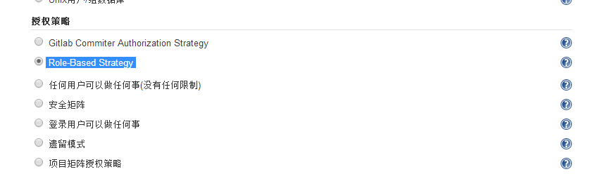
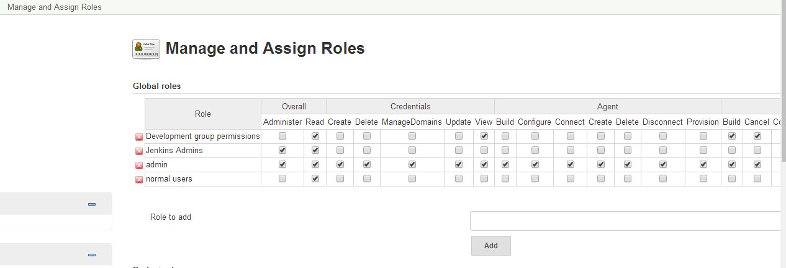
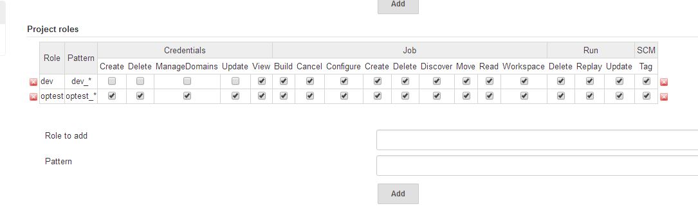
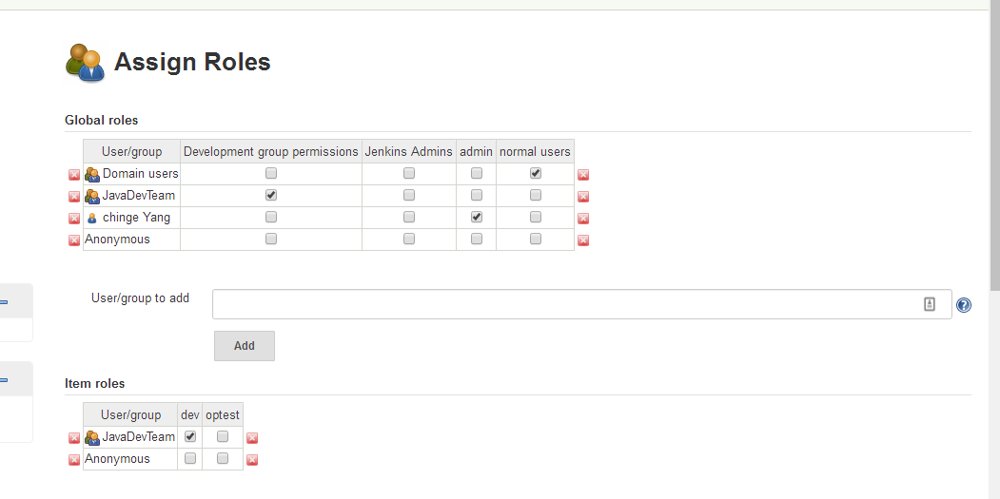

# Jenkins配置AD域用户验证管理项目

\[TOC\]

我这里使用的是当前较新稳定版本Jenkins ver. 2.73.3。下面介绍Jenkins使用AD域用户认证并针对项目进行用户权限管理设置。

## 1\. 插件安装

这里需要安装2个插件， `Active Directory plugin` `Role-based Authorization Strategy`

## 2\. 配置全局安全

在`Configure Global Security`中，配置访问控制使用"Active Directory" 

Bind DN可在域中cmd下执行如下命令获取： `dsquery user -name 你的域用户 | dsget user`

然后在授权策略中选中`Role-Based Strategy`

## 3\. 角色分配和用户管理

在"系统管理"下，进入"Manage and Assign Roles"，

### 3.1 Manage Roles

通过下图可以看到我添加了两个项目角色：dev和optest。dev用于管理开发环境的项目，optest用于管理测试环境的项目。 

Pattern：对构建的项目名称进行匹配，可以使用正则表达式。

> 注意： 要想用户登录不提示没有权限，需要开启"Overall"的"Read"权限。

### 3.2 Assign Roles

下图中的用户或组则为AD域中的用户或组。它们继承上面Roles分配的权限。 

"Item roles"则为相应项目管理权限。

> 注意： 新建job注意事项：由于在配置项目角色中对项目标题采用了正则表达式匹配，因此新建新的job时，需要特别留意，否则就会报错。例如我的Pattern是`dev_*`、`optest_*`，创建job时标题必须符合正则表达式，因此规范Jenkins项目名是非常必要的。

参考资料： \[1\] https://www.cnblogs.com/Eivll0m/p/6734076.html
