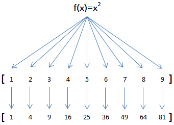

# JavaScript学习记录day7-高阶函数

\[TOC\]

## 1\. 什么是高阶函数

高阶函数英文叫Higher-order function。那么什么是高阶函数？

JavaScript的函数其实都指向某个变量。既然变量可以指向函数，函数的参数能接收变量，那么一个函数就可以接收另一个函数作为参数，这种函数就称之为高阶函数。

一个最简单的高阶函数：

```
function add(x, y, f) {
    return f(x) + f(y);
}
```

当我们调用`add(-5, 6, Math.abs)`时，参数`x`，`y`和`f`分别接收`-5`，`6`和函数`Math.abs`，根据函数定义，我们可以推导计算过程为：

```
x = -5;
y = 6;
f = Math.abs;
f(x) + f(y) ==> Math.abs(-5) + Math.abs(6) ==> 11;
return 11;
```

用代码验证一下：

```
'use strict';

function add(x, y, f) {
    return f(x) + f(y);
}

var x = add(-5, 6, Math.abs); 
console.log(x);  // 11
```

## 2\. `map`

举例说明，比如我们有一个函数`f(x)=x²`，要把这个函数作用在一个数组`[1, 2, 3, 4, 5, 6, 7, 8, 9]`上，就可以用`map`实现如下：



由于`map()`方法定义在JavaScript的`Array`中，我们调用`Array`的`map()`方法，传入我们自己的函数，就得到了一个新的`Array`作为结果：

```
'use strict';

function pow(x) {
    return x * x;
}

var arr = [1, 2, 3, 4, 5, 6, 7, 8, 9];
var results = arr.map(pow);
console.log(results);  // [1, 4, 9, 16, 25, 36, 49, 64, 81]
```

> 注意： `map()`传入的参数是`pow`，即函数对象本身。

有人可能会想，不需要`map()`，写一个循环，也可以计算出结果：

```
var f = function (x) {
    return x * x;
};

var arr = [1, 2, 3, 4, 5, 6, 7, 8, 9];
var result = [];
for (var i=0; i<arr.length; i++) {
    result.push(f(arr[i]));
}
```

的确可以，但是，从上面的循环代码，我们无法一眼看明白把`f(x)`作用在`Array`的每一个元素并把结果生成一个新的`Array`”。

所以，`map()`作为高阶函数，事实上它把运算规则抽象了，因此，我们不但可以计算简单的`f(x)=x²`，还可以计算任意复杂的函数，比如，把`Array`的所有数字转为字符串：

```
var arr = [1, 2, 3, 4, 5, 6, 7, 8, 9];
arr.map(String); // ['1', '2', '3', '4', '5', '6', '7', '8', '9']
```

只需要一行代码。

## 3\. `reduce`

再看`reduce`的用法。`Array`的`reduce()`把一个函数作用在这个`Array`的`[x1, x2, x3...]`上，这个函数必须接收两个参数，`reduce()`把结果继续和序列的下一个元素做累积计算，其效果就是：

`[x1, x2, x3, x4].reduce(f) = f(f(f(x1, x2), x3), x4)`

比方说对一个`Array`求和，就可以用`reduce`实现：

```
var arr = [1, 3, 5, 7, 9];
result = arr.reduce(function (x, y) {
    return x + y;
});

console.log(result);  // 25
```

_练习_：利用`reduce()`求积：

```
function product(arr) {
    result = arr.reduce(function (x, y) {
        return x * y;
    });
    return result;
}

// 测试:
if (product([1, 2, 3, 4]) === 24 && product([0, 1, 2]) === 0 && product([99, 88, 77, 66]) === 44274384) {
    console.log('测试通过!');
}
else {
    console.log('测试失败!');
}

```

要把`[1, 3, 5, 7, 9]`变换成整数`13579`，`reduce()`也能派上用场：

```
var arr = [1, 3, 5, 7, 9];
arr.reduce(function (x, y) {
    return x * 10 + y;
}); // 13579
```

如果我们继续改进这个例子，想办法把一个字符串`13579`先变成`Array`——`[1, 3, 5, 7, 9]`，再利用`reduce()`就可以写出一个把字符串转换为Number的函数。

_练习_： 不要使用JavaScript内置的parseInt()函数，利用map和reduce操作实现一个string2int()函数：

```
'use strict';

function string2int(s) {
    // 利用js变量弱类型转换
    var s_length = s.length;
    if (s_length == 1) {
        return s * 1;
    } else {
        var arr = s.split("");
        var result = arr.reduce(function (x, y) {
            return x * 10 + y * 1;
        });
        return result;
    }
}

// 测试:
if (string2int('0') === 0 && string2int('12345') === 12345 && string2int('12300') === 12300) {
    if (string2int.toString().indexOf('parseInt') !== -1) {
        console.log('请勿使用parseInt()!');
    } else if (string2int.toString().indexOf('Number') !== -1) {
        console.log('请勿使用Number()!');
    } else {
        console.log('测试通过!');
    }
}
else {
    console.log('测试失败!');
}
```

_练习_： 请把用户输入的不规范的英文名字，变为首字母大写，其他小写的规范名字。输入：`['adam', 'LISA', 'barT']`，输出：`['Adam', 'Lisa', 'Bart']`。

```
'use strict';

function normalize(arr) {
    // return arr.map((x)=>{
    // if(x.length > 0)
    // {
    //   x = x.toLowerCase();
    //   x = x[0].toUpperCase() + x.substr(1);
    // }
    // return x;
    // });
    return arr.map(function (x) {
        return x.substring(0, 1).toUpperCase() + x.substring(1).toLowerCase();
    });
}

// 测试:
if (normalize(['adam', 'LISA', 'barT']).toString() === ['Adam', 'Lisa', 'Bart'].toString()) {
    console.log('测试通过!');
}
else {
    console.log('测试失败!');
}
```

小明希望利用map()把字符串变成整数，他写的代码很简洁：

```
'use strict';

var arr = ['1', '2', '3'];
var r;

r = arr.map(parseInt);

console.log(r);
```

结果竟然是`1, NaN, NaN`，小明百思不得其解，请帮他找到原因并修正代码。

```
parseInt( ) 的语法：
parseInt ( String s , [ int radix ] )
其中，
参数 String s ，必需，表示要被解析的字符串。
int radix ，可选，表示要解析的数字的基数。
该函数使用第二个参数指定的基数，其值介于 2 ~ 36 之间。如果省略该参数或其值为 0，则数字将以 10 为基础来解析。如果它以 “0x” 或 “0X” 开头，将以 16 为基数。
如果该参数小于 2 或者大于 36，则 parseInt() 将返回 NaN。
["1","2","3"].map(parseInt)等于[parseInt(1,0),parseInt(2,1),parseInt(3,2)];
```

## 4\. `filter`

`filter`也是一个常用的操作，它用于把`Array`的某些元素过滤掉，然后返回剩下的元素。

和`map()`类似，`Array`的`filter()`也接收一个函数。和`map()`不同的是，`filter()`把传入的函数依次作用于每个元素，然后根据返回值是`true`还是`false`决定保留还是丢弃该元素。

例如，在一个`Array`中，删掉偶数，只保留奇数，可以这么写：

```
var arr = [1, 2, 4, 5, 6, 9, 10, 15];
var r = arr.filter(function (x) {
    return x % 2 !== 0;
});
console.log(r); // [1, 5, 9, 15]
```

把一个Array中的空字符串删掉，可以这么写：

```
var arr = ['A', '', 'B', null, undefined, 'C', '  '];
var r = arr.filter(function (s) {
    return s && s.trim(); // 注意：IE9以下的版本没有trim()方法
});
console.log(r); // ['A', 'B', 'C']
```

可见用`filter()`这个高阶函数，关键在于正确实现一个“筛选”函数。

**回调函数**

`filter()`接收的回调函数，其实可以有多个参数。通常我们仅使用第一个参数，表示`Array`的某个元素。回调函数还可以接收另外两个参数，表示元素的位置和数组本身：

```
var arr = ['A', 'B', 'C'];
var r = arr.filter(function (element, index, self) {
    console.log(element); // 依次打印'A', 'B', 'C'
    console.log(index); // 依次打印0, 1, 2
    console.log(self); // self就是变量arr
    return true;
});
```

利用`filter`，可以巧妙地去除`Array`的重复元素：

```
'use strict';

var
    r,
    arr = ['apple', 'strawberry', 'banana', 'pear', 'apple', 'orange', 'orange', 'strawberry'];

r = arr.filter(function (element, index, self) {
    return self.indexOf(element) === index;
});

console.log(r.toString()); // apple,strawberry,banana,pear,orange
```

去除重复元素依靠的是`indexOf`总是返回第一个元素的位置，后续的重复元素位置与`indexOf`返回的位置不相等，因此被`filter`滤掉了。

**练习**

请尝试用`filter()`筛选出素数：

```
'use strict';

function get_primes(arr) {
    // 判断一个整数m是否为素数，只需用2至m-1之间的每一个整数去除，如果都不能被整除，那么m就是一个素数。
    // 对于一个正整数m而言，它对(m/2, m)范围内的正整数是必然不能够整除的,
    // 因此，我们在判断m的时候，没有必要让它除以该范围内的数。
    var r = arr.filter(function (element, index, self) {
        var i;
        var result = true;
        for (i = 2; i <= element / 2 ; i++) {
            if (element % i == 0) {
                result = false;
                break;
            }
        }
        return element < 2 ? false : result;
    });
    return r;
}

// 测试:
var
    x,
    r,
    arr = [];
for (x = 1; x < 100; x++) {
    arr.push(x);
}
r = get_primes(arr);
if (r.toString() === [2, 3, 5, 7, 11, 13, 17, 19, 23, 29, 31, 37, 41, 43, 47, 53, 59, 61, 67, 71, 73, 79, 83, 89, 97].toString()) {
    console.log('测试通过!');
} else {
    console.log('测试失败: ' + r.toString());
}
```

## 5\. 排序算法

排序也是在程序中经常用到的算法。无论使用冒泡排序还是快速排序，排序的核心是比较两个元素的大小。如果是数字，我们可以直接比较，但如果是字符串或者两个对象呢？直接比较数学上的大小是没有意义的，因此，比较的过程必须通过函数抽象出来。通常规定，对于两个元素x和y，如果认为`x < y`，则返回`-1`，如果认为`x == y`，则返回`0`，如果认为`x > y`，则返回`1`，这样，排序算法就不用关心具体的比较过程，而是根据比较结果直接排序。

JavaScript的`Array`的`sort()`方法就是用于排序的，但是排序结果可能让你大吃一惊：

```
// 看上去正常的结果:
['Google', 'Apple', 'Microsoft'].sort(); // ['Apple', 'Google', 'Microsoft'];

// apple排在了最后:
['Google', 'apple', 'Microsoft'].sort(); // ['Google', 'Microsoft", 'apple']

// 无法理解的结果:
[10, 20, 1, 2].sort(); // [1, 10, 2, 20]
```

第二个排序把`apple`排在了最后，是因为字符串根据ASCII码进行排序，而小写字母`a`的ASCII码在大写字母之后。

第三个排序结果是为什么呢？简单的数字排序都能错？

这是因为`Array`的`sort()`方法默认把所有元素先转换为`String`再排序，结果`'10'`排在了`'2'`的前面，因为字符`'1'`比字符`'2'`的ASCII码小。

如果不知道`sort()`方法的默认排序规则，直接对数字排序，绝对栽进坑里！

幸运的是，`sort()`方法也是一个高阶函数，它还可以接收一个比较函数来实现自定义的排序。

要按数字大小排序，我们可以这么写：

```
'use strict';

var arr = [10, 20, 1, 2];

arr.sort(function (x, y) {
    if (x < y) {
        return -1;
    }
    if (x > y) {
        return 1;
    }
    return 0;
});
console.log(arr); // [1, 2, 10, 20]
```

如果要倒序排序，我们可以把大的数放前面：

```
var arr = [10, 20, 1, 2];
arr.sort(function (x, y) {
    if (x < y) {
        return 1;
    }
    if (x > y) {
        return -1;
    }
    return 0;
}); // [20, 10, 2, 1]
```

默认情况下，对字符串排序，是按照ASCII的大小比较的，现在，我们提出排序应该忽略大小写，按照字母序排序。要实现这个算法，不必对现有代码大加改动，只要我们能定义出忽略大小写的比较算法就可以：

```
var arr = ['Google', 'apple', 'Microsoft'];
arr.sort(function (s1, s2) {
    x1 = s1.toUpperCase();
    x2 = s2.toUpperCase();
    if (x1 < x2) {
        return -1;
    }
    if (x1 > x2) {
        return 1;
    }
    return 0;
}); // ['apple', 'Google', 'Microsoft']
```

忽略大小写来比较两个字符串，实际上就是先把字符串都变成大写（或者都变成小写），再比较。

从上述例子可以看出，高阶函数的抽象能力是非常强大的，而且，核心代码可以保持得非常简洁。

最后友情提示，`sort()`方法会直接对`Array`进行修改，它返回的结果仍是当前`Array`：

```
var a1 = ['B', 'A', 'C'];
var a2 = a1.sort();
a1; // ['A', 'B', 'C']
a2; // ['A', 'B', 'C']
a1 === a2; // true, a1和a2是同一对象
```

学习参考教程：[http://www.liaoxuefeng.com](http://www.liaoxuefeng.com)
