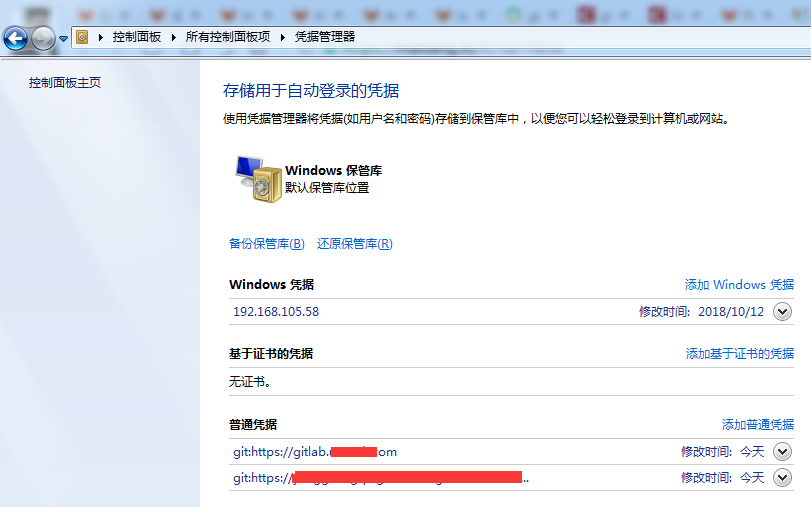
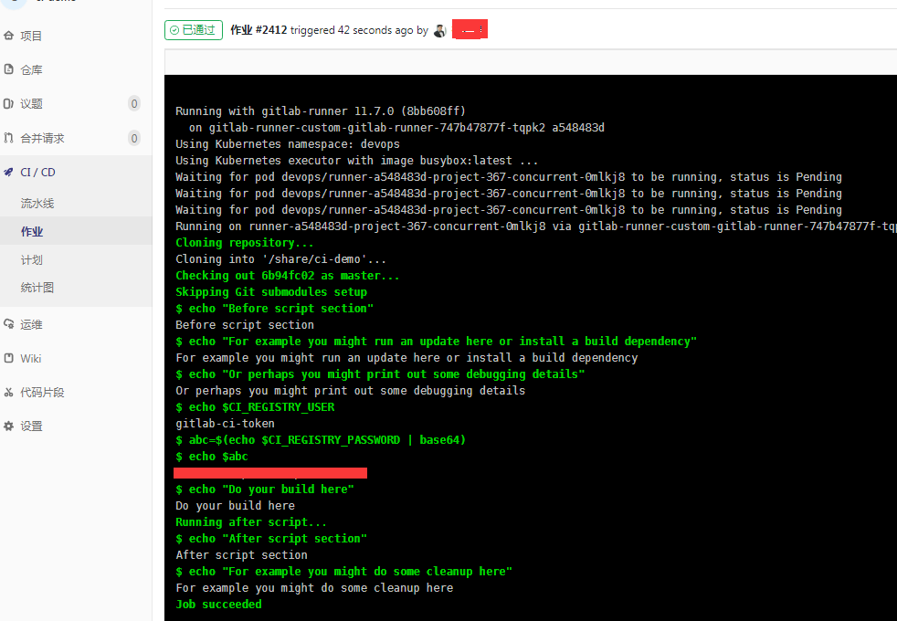

# GitLab CI/CD 因git凭据踩坑

\[TOC\]

## 1\. 问题

我在windows上，使用git push到gitlab中的私有项目上（项目是有ci/cd设置的），runner执行时出现403权限问题，但是在页面上，点重试又是正常的。该问题花了我2天时间。。。开始怀疑是gitlab或者runner的问题，我环境复杂，又是集成kubernetes，各种折腾，无果。

## 2\. 解决过程

既然windows的git命令不行，那试试sourcetree，一样的结果。反而在linux上用git命令也试了，是正常的，当然每次都需要输入用户密码。

那是不是用户密码没有缓存进去呢？找了个博客，他说的问题原因，可能由于多个帐户缓存。

[https://blog.csdn.net/aimee1608/article/details/81041685](https://blog.csdn.net/aimee1608/article/details/81041685)

经过测试，linux下git url中带用户密码，是可行的，但windows下还是不行。

索性，把windows下的git相关的凭据全部删除，git url中不带用户密码（因为我们用户名都是邮箱，git url好像不能包含用户名为邮箱）。

下面是正常的pipeline过程：

## 3\. 小结

1. 对比上面CI的图，有问题的triggered的用户为Administrator，正常的则为push用户。因为我是gitlab管理员，我本机也缓存了root的用户密码，虽然我已经将root添加为该git项目的成员，但是在凭据管理器中，还是让git产生了混淆，CI仍旧不能正确获取push的用户凭证；
2. gitlab 私有仓库权限严格，只有成员用户push才能触发CI/CD，而且push的用户凭证，CI/CD中需要获取到；
3. 出现问题，应该先根据问题现象找原因，再慢慢深入。我恰恰是去折腾gitlab、runner、kubernetes和docker版本的gitlab差异对比花了很多时间，最后才回来找gitlab 403错误。

这种细节，官方文档就算有，也很难找到，在此记录下。
