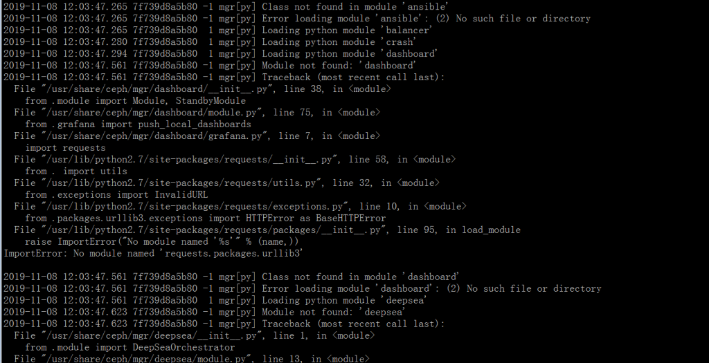
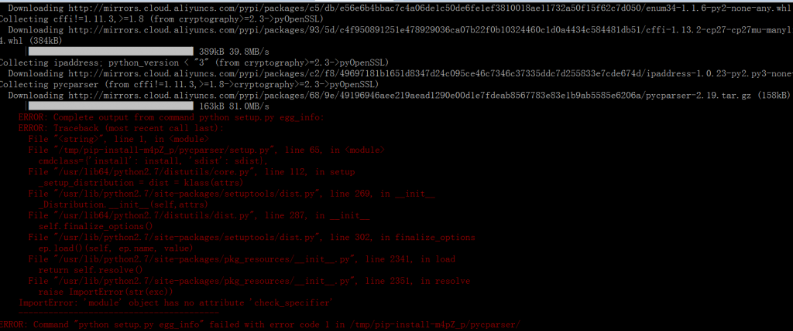
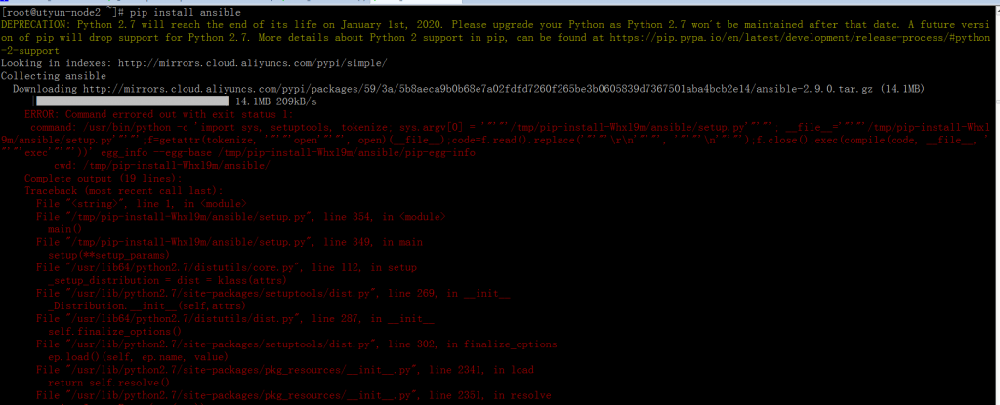
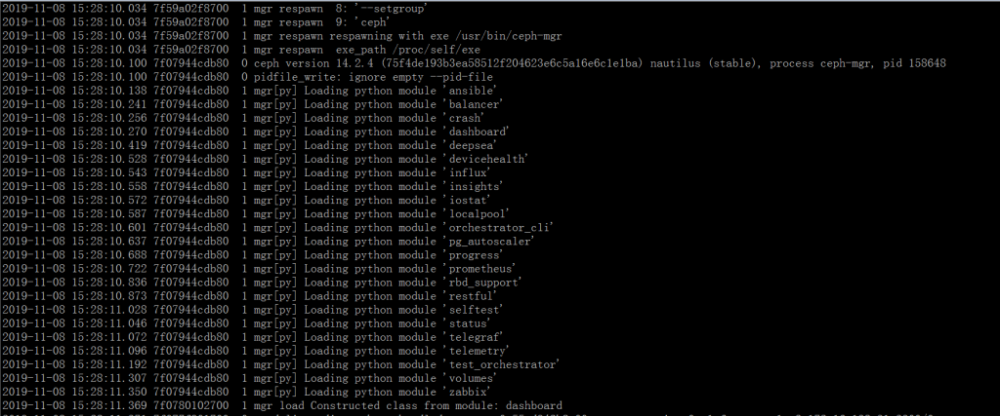

\[TOC\]

# 1\. 环境说明

| 软件 | 版本 |
| --- | --- |
| 操作系统 | CentOS7.6 |
| ceph | nautilus, v14.2.4 |

ceph-deploy的nautilus版本安装和luminous版本一样，可以参考我以前的文章： [](https://blog.51cto.com/ygqygq2/2161917)[https://blog.51cto.com/ygqygq2/2161917](https://blog.51cto.com/ygqygq2/2161917)

# 2\. 启用ceph dashboard失败

mgr模块开启dashboard提示错误，虽然加上`--force`表面启用了，但实际并未启动dashboard服务，因为设置dashboard用户命令提示不支持。

 

# 3\. 问题排查过程

mgr节点查看mgr启动日志



详细日志：

```
2019-11-08 12:44:23.673 7f7388cd9700  1 mgr respawn  e: '/usr/bin/ceph-mgr'
2019-11-08 12:44:23.673 7f7388cd9700  1 mgr respawn  0: '/usr/bin/ceph-mgr'
2019-11-08 12:44:23.673 7f7388cd9700  1 mgr respawn  1: '-f'
2019-11-08 12:44:23.673 7f7388cd9700  1 mgr respawn  2: '--cluster'
2019-11-08 12:44:23.673 7f7388cd9700  1 mgr respawn  3: 'ceph'
2019-11-08 12:44:23.673 7f7388cd9700  1 mgr respawn  4: '--id'
2019-11-08 12:44:23.673 7f7388cd9700  1 mgr respawn  5: 'utyun-node2'
2019-11-08 12:44:23.673 7f7388cd9700  1 mgr respawn  6: '--setuser'
2019-11-08 12:44:23.673 7f7388cd9700  1 mgr respawn  7: 'ceph'
2019-11-08 12:44:23.673 7f7388cd9700  1 mgr respawn  8: '--setgroup'
2019-11-08 12:44:23.673 7f7388cd9700  1 mgr respawn  9: 'ceph'
2019-11-08 12:44:23.673 7f7388cd9700  1 mgr respawn respawning with exe /usr/bin/ceph-mgr
2019-11-08 12:44:23.673 7f7388cd9700  1 mgr respawn  exe_path /proc/self/exe
2019-11-08 12:44:23.737 7fb0b7715b80  0 ceph version 14.2.4 (75f4de193b3ea58512f204623e6c5a16e6c1e1ba) nautilus (stable), process ceph-mgr, pid 158648
2019-11-08 12:44:23.738 7fb0b7715b80  0 pidfile_write: ignore empty --pid-file
2019-11-08 12:44:23.776 7fb0b7715b80  1 mgr[py] Loading python module 'ansible'
2019-11-08 12:44:23.834 7fb0b7715b80 -1 mgr[py] Module not found: 'ansible'
2019-11-08 12:44:23.834 7fb0b7715b80 -1 mgr[py] Traceback (most recent call last):
  File "/usr/share/ceph/mgr/ansible/__init__.py", line 5, in <module>
    from .module import Module
  File "/usr/share/ceph/mgr/ansible/module.py", line 10, in <module>
    import requests
  File "/usr/lib/python2.7/site-packages/requests/__init__.py", line 58, in <module>
    from . import utils
  File "/usr/lib/python2.7/site-packages/requests/utils.py", line 32, in <module>
    from .exceptions import InvalidURL
  File "/usr/lib/python2.7/site-packages/requests/exceptions.py", line 10, in <module>
    from .packages.urllib3.exceptions import HTTPError as BaseHTTPError
  File "/usr/lib/python2.7/site-packages/requests/packages/__init__.py", line 95, in load_module
    raise ImportError("No module named '%s'" % (name,))
ImportError: No module named 'requests.packages.urllib3'

2019-11-08 12:44:23.835 7fb0b7715b80 -1 mgr[py] Class not found in module 'ansible'
2019-11-08 12:44:23.835 7fb0b7715b80 -1 mgr[py] Error loading module 'ansible': (2) No such file or directory
2019-11-08 12:44:23.835 7fb0b7715b80  1 mgr[py] Loading python module 'balancer'
2019-11-08 12:44:23.850 7fb0b7715b80  1 mgr[py] Loading python module 'crash'
2019-11-08 12:44:23.864 7fb0b7715b80  1 mgr[py] Loading python module 'dashboard'
2019-11-08 12:44:24.133 7fb0b7715b80 -1 mgr[py] Module not found: 'dashboard'
2019-11-08 12:44:24.133 7fb0b7715b80 -1 mgr[py] Traceback (most recent call last):
  File "/usr/share/ceph/mgr/dashboard/__init__.py", line 38, in <module>
    from .module import Module, StandbyModule
  File "/usr/share/ceph/mgr/dashboard/module.py", line 75, in <module>
    from .grafana import push_local_dashboards
  File "/usr/share/ceph/mgr/dashboard/grafana.py", line 7, in <module>
    import requests
  File "/usr/lib/python2.7/site-packages/requests/__init__.py", line 58, in <module>
    from . import utils
  File "/usr/lib/python2.7/site-packages/requests/utils.py", line 32, in <module>
    from .exceptions import InvalidURL
  File "/usr/lib/python2.7/site-packages/requests/exceptions.py", line 10, in <module>
    from .packages.urllib3.exceptions import HTTPError as BaseHTTPError
  File "/usr/lib/python2.7/site-packages/requests/packages/__init__.py", line 95, in load_module
    raise ImportError("No module named '%s'" % (name,))
ImportError: No module named 'requests.packages.urllib3'

2019-11-08 12:44:24.133 7fb0b7715b80 -1 mgr[py] Class not found in module 'dashboard'
2019-11-08 12:44:24.133 7fb0b7715b80 -1 mgr[py] Error loading module 'dashboard': (2) No such file or directory
2019-11-08 12:44:24.134 7fb0b7715b80  1 mgr[py] Loading python module 'deepsea'
2019-11-08 12:44:24.197 7fb0b7715b80 -1 mgr[py] Module not found: 'deepsea'
2019-11-08 12:44:24.197 7fb0b7715b80 -1 mgr[py] Traceback (most recent call last):
  File "/usr/share/ceph/mgr/deepsea/__init__.py", line 1, in <module>
    from .module import DeepSeaOrchestrator
  File "/usr/share/ceph/mgr/deepsea/module.py", line 13, in <module>
    import requests
  File "/usr/lib/python2.7/site-packages/requests/__init__.py", line 58, in <module>
    from . import utils
  File "/usr/lib/python2.7/site-packages/requests/utils.py", line 32, in <module>
    from .exceptions import InvalidURL
  File "/usr/lib/python2.7/site-packages/requests/exceptions.py", line 10, in <module>
    from .packages.urllib3.exceptions import HTTPError as BaseHTTPError
  File "/usr/lib/python2.7/site-packages/requests/packages/__init__.py", line 95, in load_module
    raise ImportError("No module named '%s'" % (name,))
ImportError: No module named 'requests.packages.urllib3'

2019-11-08 12:44:24.198 7fb0b7715b80 -1 mgr[py] Class not found in module 'deepsea'
2019-11-08 12:44:24.198 7fb0b7715b80 -1 mgr[py] Error loading module 'deepsea': (2) No such file or directory
2019-11-08 12:44:24.198 7fb0b7715b80  1 mgr[py] Loading python module 'devicehealth'
2019-11-08 12:44:24.211 7fb0b7715b80  1 mgr[py] Loading python module 'influx'
2019-11-08 12:44:24.226 7fb0b7715b80  1 mgr[py] Loading python module 'insights'
2019-11-08 12:44:24.240 7fb0b7715b80  1 mgr[py] Loading python module 'iostat'
2019-11-08 12:44:24.254 7fb0b7715b80  1 mgr[py] Loading python module 'localpool'
2019-11-08 12:44:24.268 7fb0b7715b80  1 mgr[py] Loading python module 'orchestrator_cli'
2019-11-08 12:44:24.304 7fb0b7715b80  1 mgr[py] Loading python module 'pg_autoscaler'
2019-11-08 12:44:24.350 7fb0b7715b80  1 mgr[py] Loading python module 'progress'
2019-11-08 12:44:24.383 7fb0b7715b80  1 mgr[py] Loading python module 'prometheus'
2019-11-08 12:44:24.446 7fb0b7715b80  1 mgr[py] Loading python module 'rbd_support'
2019-11-08 12:44:24.523 7fb0b7715b80  1 mgr[py] Loading python module 'restful'
2019-11-08 12:44:24.674 7fb0b7715b80  1 mgr[py] Loading python module 'selftest'
2019-11-08 12:44:24.689 7fb0b7715b80  1 mgr[py] Loading python module 'status'
2019-11-08 12:44:24.714 7fb0b7715b80  1 mgr[py] Loading python module 'telegraf'
2019-11-08 12:44:24.737 7fb0b7715b80  1 mgr[py] Loading python module 'telemetry'
2019-11-08 12:44:24.784 7fb0b7715b80 -1 mgr[py] Module not found: 'telemetry'
2019-11-08 12:44:24.784 7fb0b7715b80 -1 mgr[py] Traceback (most recent call last):
  File "/usr/share/ceph/mgr/telemetry/__init__.py", line 1, in <module>
    from .module import Module
  File "/usr/share/ceph/mgr/telemetry/module.py", line 10, in <module>
    import requests
  File "/usr/lib/python2.7/site-packages/requests/__init__.py", line 58, in <module>
    from . import utils
  File "/usr/lib/python2.7/site-packages/requests/utils.py", line 32, in <module>
    from .exceptions import InvalidURL
  File "/usr/lib/python2.7/site-packages/requests/exceptions.py", line 10, in <module>
    from .packages.urllib3.exceptions import HTTPError as BaseHTTPError
  File "/usr/lib/python2.7/site-packages/requests/packages/__init__.py", line 95, in load_module
    raise ImportError("No module named '%s'" % (name,))
ImportError: No module named 'requests.packages.urllib3'

2019-11-08 12:44:24.784 7fb0b7715b80 -1 mgr[py] Class not found in module 'telemetry'
2019-11-08 12:44:24.784 7fb0b7715b80 -1 mgr[py] Error loading module 'telemetry': (2) No such file or directory
2019-11-08 12:44:24.784 7fb0b7715b80  1 mgr[py] Loading python module 'test_orchestrator'
2019-11-08 12:44:24.826 7fb0b7715b80  1 mgr[py] Loading python module 'volumes'
2019-11-08 12:44:24.940 7fb0b7715b80  1 mgr[py] Loading python module 'zabbix'
2019-11-08 12:44:24.957 7fb0b7715b80 -1 log_channel(cluster) log [ERR] : Failed to load ceph-mgr modules: ansible, dashboard, deepsea, telemetry
2019-11-08 12:44:24.961 7fb0a2b49700  0 ms_deliver_dispatch: unhandled message 0x5601d8ebaa00 mon_map magic: 0 v1 from mon.0 v2:172.16.138.26:3300/0
```

尝试`pip`手动安装模块，发现不管装什么插件都报错，通过升级python解决了`pip`安装问题：`yum -y update python`。



但`pip`安装`ansible`模块死活装不上，并且启动dashboard仍旧提示`ImportError: No module named 'requests.packages.urllib3'`


从日志上看，好像ceph mgr启用模块，原理上是python使用`urllib3`从网络上下载安装的，所以换个方向，先解决`urllib3`模块问题。

`pip`卸载`urllib3`，改用`yum`方式安装。

  

再次实时查看启用dashboard模块时的日志， `tail -f /var/log/ceph/ceph-mgr.utyun-node2.log`



终于如愿以偿，dashboard启用成功，并没有任何报错。

```
[root@utyun-node1 external-ceph]# ceph mgr module ls |more
{
    "enabled_modules": [
        "dashboard",
        "iostat",
        "pg_autoscaler",
        "restful"
    ],
```


# 4\. 小结

以下总结ceph nautilus开启dashboard的步骤：

mgr节点操作：

```bash
yum -y install ceph-mgr-dashboard
pip uninstall urllib3
yum install python-urllib3 -y
```

ceph管理节点操作：

```
ceph mgr module enable dashboard
ceph config set mgr mgr/dashboard/server_addr 0.0.0.0
ceph config set mgr mgr/dashboard/server_port 7000
ceph config set mgr mgr/dashboard/ssl false
ceph dashboard ac-user-create admin password administrator
```

参考资料： \[1\] [https://docs.ceph.com/docs/nautilus/mgr/dashboard/](https://docs.ceph.com/docs/nautilus/mgr/dashboard/)
