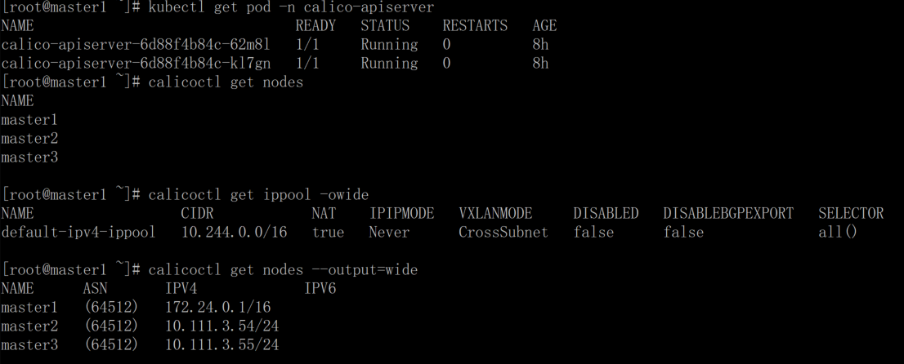
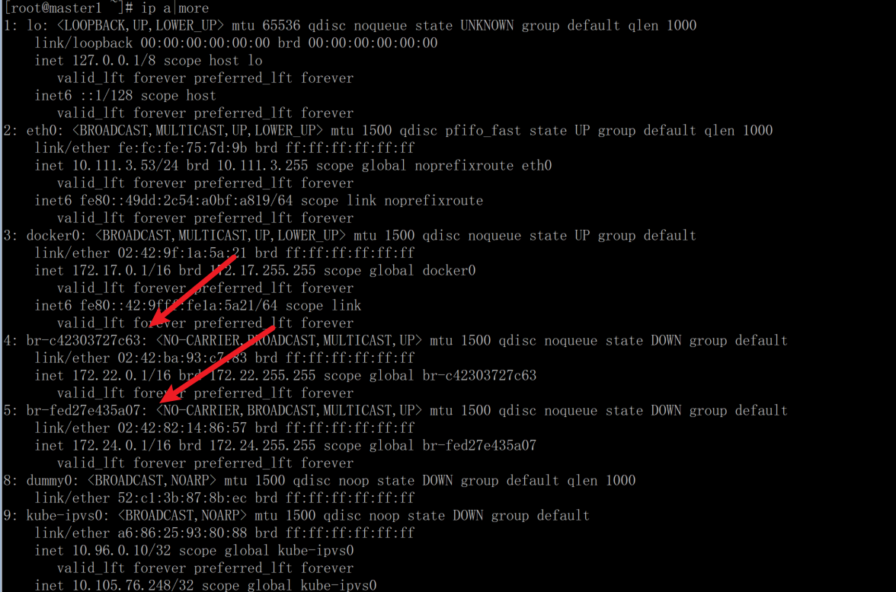
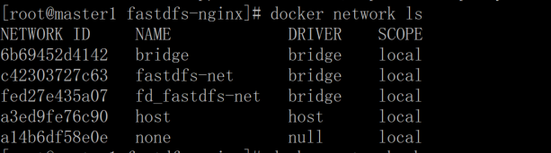
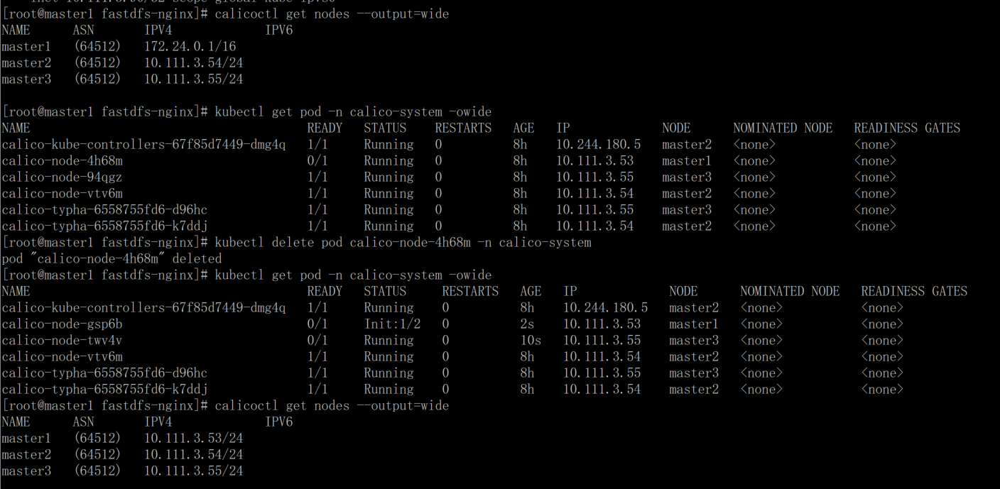
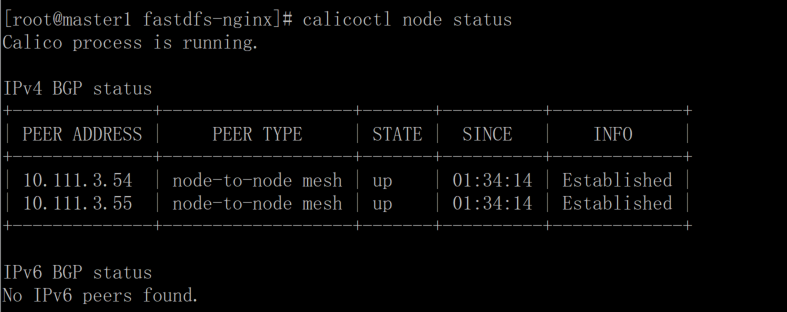
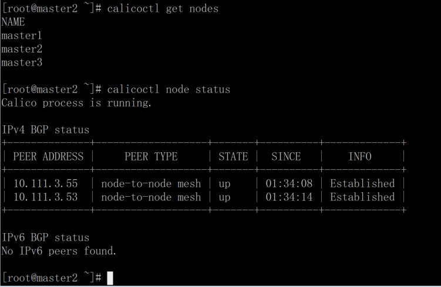
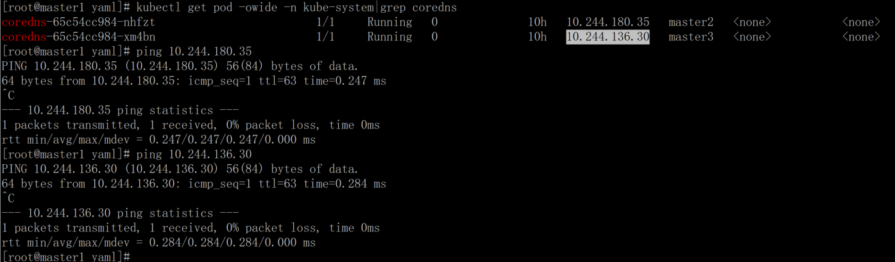

# 1\. 问题

版本： kubernetes version:

```
NAME      STATUS   ROLES                  AGE   VERSION
master1   Ready    control-plane,master   56d   v1.23.4
master2   Ready    control-plane,master   56d   v1.23.4
master3   Ready    control-plane,master   56d   v1.23.4
```

calico version:

```
Client Version:    v3.22.1
Git commit:        82e7ce520
Cluster Version:   v3.22.1
Cluster Type:      typha,kdd,k8s,operator,bgp,kubeadm
```

kubernetes 节点的 pod 间无法通信

# 2\. 问题排查

安装 calicoctl 命令排查 

查看异常 ip 对应的网卡 

使用 docker 列出 network 

清除这些不使用的网络 `docker network rm fastdfs-net fd_fastdfs-net`

重启 pod 

确认是否正常





确认跨节点 pod 正常通信了 

# 3\. 小结

使用 calico 网络插件需要在支持 bgp 协议的网络中，默认的 node to node mesh 的 peer type 下，节点数一多，会占用大量的连接数，官方推荐其在 100 节点内使用。

参考资料： \[1\] [https://projectcalico.docs.tigera.io/about/about-k8s-networking](https://projectcalico.docs.tigera.io/about/about-k8s-networking)
