# 1\. Argo Workflows 简单介绍

[Argo Workflows](https://argoproj.github.io/argo-workflows/) 是一个开源容器化原生工作流引擎，用于在 Kubernetes 中编排并行作业。Argo Workflows 实现为一个 Kubernetes CRD (自定义资源定义)。 其详细介绍和核心概念等查看官方文档即可，本文通过示例来体验 Argo Workflows。

# 2\. Argo Workflows 安装

我使用 [helm](https://helm.sh/) 安装 [bitnami](https://charts.bitnami.com/bitnami) 的 charts 仓库中的 argo-workflows。安装过程略...

# 3\. 官方示例体验

我们使用[官方示例](https://github.com/argoproj/argo-workflows/tree/master/examples)测试

## 3.1 CLI 安装

根据自己的环境，安装相应的 CLI。 [https://github.com/argoproj/argo-workflows/releases](https://github.com/argoproj/argo-workflows/releases)

## 3.2 示例体验并简单总结

### 3.2.1 hello world

```bash
argo submit hello-world.yaml    # submit a workflow spec to Kubernetes
argo list                       # list current workflows
argo get hello-world-xxx        # get info about a specific workflow
argo logs hello-world-xxx       # print the logs from a workflow
argo delete hello-world-xxx     # delete workflow
```

```bash
argo submit hello-world.yaml -n argo
argo watch -n argo hello-world-59rtg
```

```yaml
apiVersion: argoproj.io/v1alpha1
kind: Workflow
metadata:
  generateName: hello-world-
  labels:
    workflows.argoproj.io/archive-strategy: "false"
  annotations:
    workflows.argoproj.io/description: |
      This is a simple hello world example.
      You can also run it in Python: https://couler-proj.github.io/couler/examples/#hello-world
spec:
  entrypoint: whalesay
  templates:
  - name: whalesay
    container:
      image: docker/whalesay:latest
      command: [cowsay]
      args: ["hello world"]
```

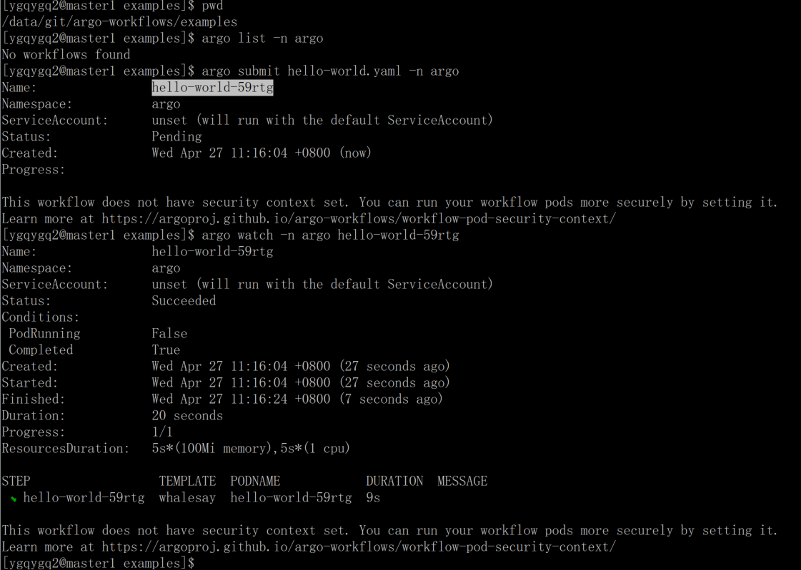

```bash
kubectl get pod -n argo
```


- `argo` 命令用起来参考了 `kubectl` 的习惯，还是非常丝滑的；
- `argo` 使用 `submit` 子命令创建 Workflow ；
- Workflow 资源显示非常详细，包含运行状态、所用资源、运行时间等；

### 3.2.2 Parameters

```bash
argo submit arguments-parameters.yaml -p message="ygqygq2 is testing argo workflows" -n argo
argo watch -n argo arguments-parameters-fnbpl
```

```yaml
apiVersion: argoproj.io/v1alpha1
kind: Workflow
metadata:
  generateName: arguments-parameters-
spec:
  entrypoint: whalesay
  # Parameters can be passed/overridden via the argo CLI.
  # To override the printed message, run `argo submit` with the -p option:
  # $ argo submit examples/arguments-parameters.yaml -p message="goodbye world"
  arguments:
    parameters:
    - name: message
      value: hello world

  templates:
  - name: whalesay
    inputs:
      parameters:
      - name: message
    container:
      image: docker/whalesay:latest
      command: [cowsay]
      args: ["{{inputs.parameters.message}}"]
```

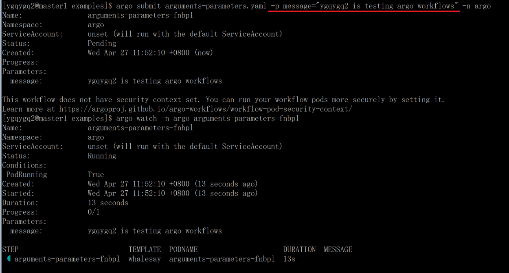

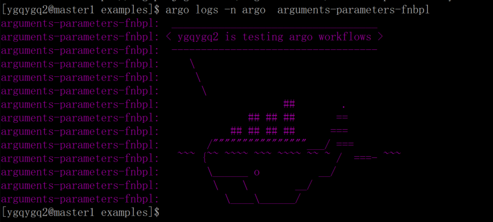

```bash
argo logs -n argo  arguments-parameters-fnbpl
```

**全局参数**

```bash
argo submit -n argo global-parameters.yaml -p message="ygqygq2 is testing workflows"
argo logs -n argo global-parameters-jhwqj
```

```yaml
apiVersion: argoproj.io/v1alpha1
kind: Workflow
metadata:
  generateName: global-parameters-
spec:
  entrypoint: whalesay1
  # Parameters can be passed/overridden via the argo CLI.
  # To override the printed message, run `argo submit` with the -p option:
  # $ argo submit examples/arguments-parameters.yaml -p message="goodbye world"
  arguments:
    parameters:
    - name: message
      value: hello world

  templates:
  - name: whalesay1
    container:
      image: docker/whalesay:latest
      command: [cowsay]
      args: ["{{workflow.parameters.message}}"]
```


- `argo` 通过 `-p key=value` 方式传递参数给 Workflow 的容器，Workflow 中使用 `args: ["{{inputs.parameters.message}}"]` 接收参数；
- `--parameter-file params.yaml` 参数构建可以指定 YAML 或 JSON 格式参数文件；
- `{{workflow.parameters.message}}` 这种方式 workflow 全局参数 `message`；

### 3.2.3 Steps

**多步骤 workflow**

```bash
argo submit steps.yaml -n argo
argo watch -n argo steps-slbmb
```

```yaml
# This template demonstrates a steps template and how to control sequential vs. parallel steps.
# In this example, the hello1 completes before the hello2a, and hello2b steps, which run in parallel.
apiVersion: argoproj.io/v1alpha1
kind: Workflow
metadata:
  generateName: steps-
spec:
  entrypoint: hello-hello-hello
  templates:
  - name: hello-hello-hello
    steps:
    - - name: hello1
        template: whalesay
        arguments:
          parameters: [{name: message, value: "hello1"}]
    - - name: hello2a
        template: whalesay
        arguments:
          parameters: [{name: message, value: "hello2a"}]
      - name: hello2b
        template: whalesay
        arguments:
          parameters: [{name: message, value: "hello2b"}]

  - name: whalesay
    inputs:
      parameters:
      - name: message
    container:
      image: docker/whalesay
      command: [cowsay]
      args: ["{{inputs.parameters.message}}"]
```

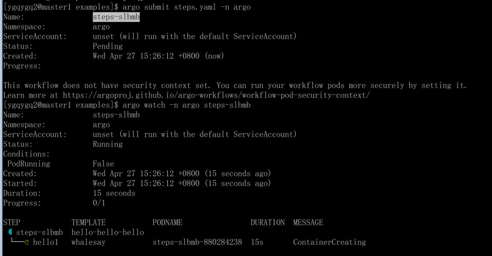

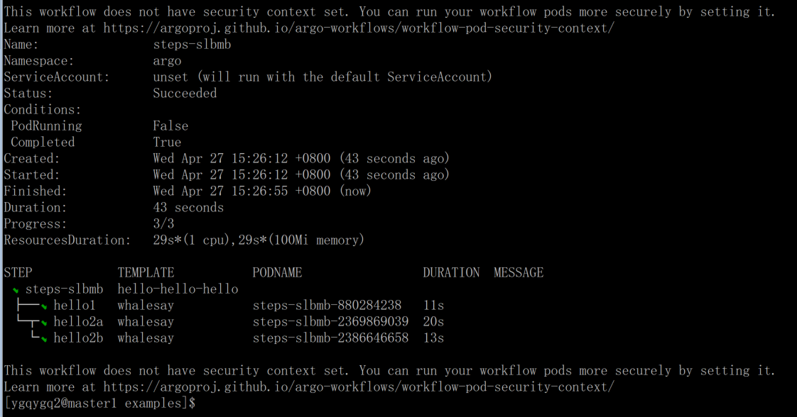 

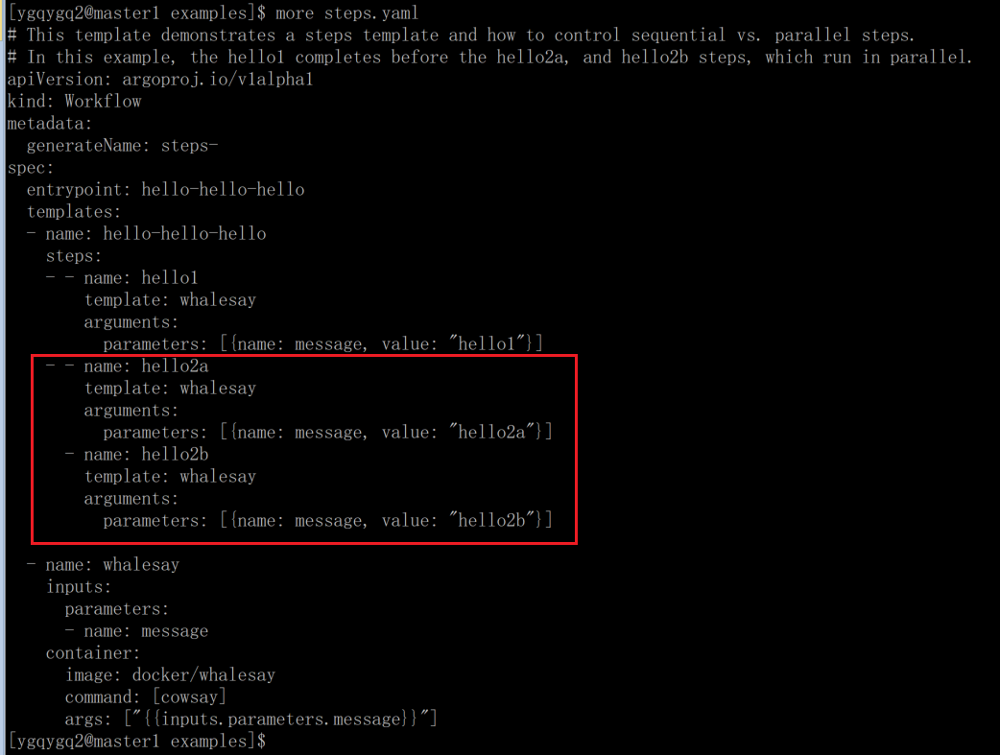

```bash
argo logs -n argo steps-slbmb
```

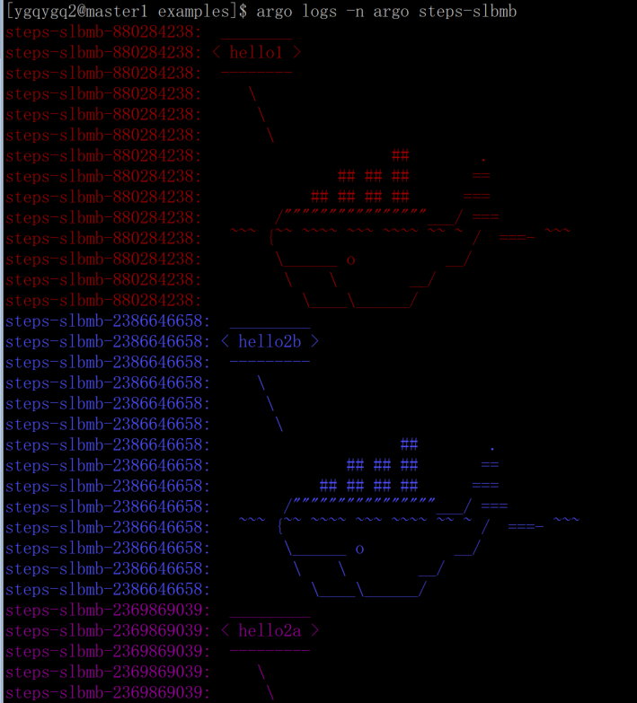

- 可以看到 hello1、hello2a 是串行关系；
- hello2a、hello2b 是并行关系；
- `argo log` 可以看到不同 pod 的输出不同颜色，这点体验不错；

### 3.2.4 DAG(directed-acyclic graph)

在下面工作流中，步骤 `A` `B` 同时运行，因为它们不依赖其它步骤，步骤 `C` 依赖 `A`，步骤 `D` 依赖 `A` 和 `B`，它们的依赖步骤运行完成，才会开始。 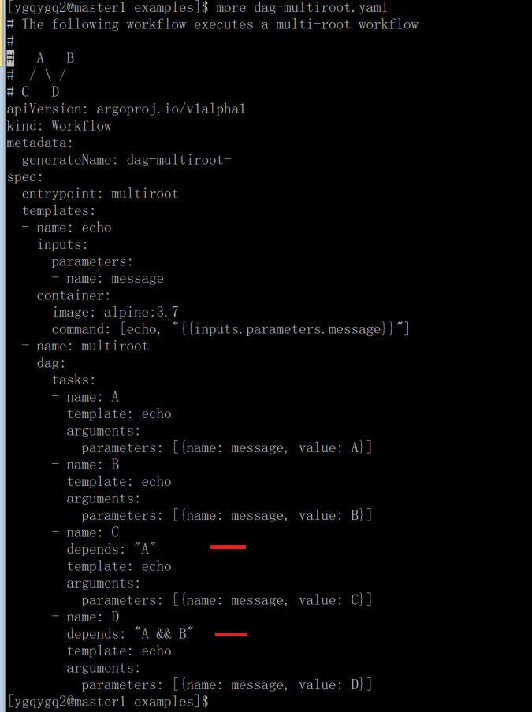

```bash
argo submit -n argo dag-multiroot.yaml
argo watch -n argo dag-multiroot-z4zzz
```

```yaml
# The following workflow executes a multi-root workflow
# 
#   A   B
#  / \ /
# C   D
apiVersion: argoproj.io/v1alpha1
kind: Workflow
metadata:
  generateName: dag-multiroot-
spec:
  entrypoint: multiroot
  templates:
  - name: echo
    inputs:
      parameters:
      - name: message
    container:
      image: alpine:3.7
      command: [echo, "{{inputs.parameters.message}}"]
  - name: multiroot
    dag:
      tasks:
      - name: A
        template: echo
        arguments:
          parameters: [{name: message, value: A}]
      - name: B
        template: echo
        arguments:
          parameters: [{name: message, value: B}]
      - name: C
        depends: "A"
        template: echo
        arguments:
          parameters: [{name: message, value: C}]
      - name: D
        depends: "A && B"
        template: echo
        arguments:
          parameters: [{name: message, value: D}]
```


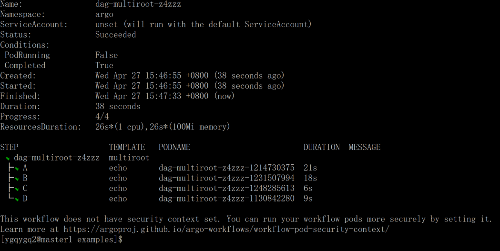

```bash
argo logs -n argo dag-multiroot-z4zzz
```


**非 FailFast**

```bash
argo submit -n argo dag-disable-failFast.yaml
argo watch -n argo dag-primay-branch-jdg6l
```

```yaml
apiVersion: argoproj.io/v1alpha1
kind: Workflow
metadata:
  generateName: dag-primay-branch-
spec:
  entrypoint: statis
  templates:
  - name: a
    container:
      image:  docker/whalesay:latest
      command: [cowsay]
      args: ["hello world"]
  - name: b
    retryStrategy:
      limit: "2"
    container:
      image: alpine:latest
      command: [sh, -c]
      args: ["sleep 30; echo haha"]
  - name: c
    retryStrategy:
      limit: "3"
    container:
      image: alpine:latest
      command: [sh, -c]
      args: ["echo intentional failure; exit 2"]
  - name: d
    container:
      image: docker/whalesay:latest
      command: [cowsay]
      args: ["hello world"]
  - name: statis
    dag:
      failFast: false
      tasks:
      - name: A
        template: a
      - name: B
        depends: "A"
        template: b
      - name: C
        depends: "A"
        template: c
      - name: D
        depends: "B"
        template: d
      - name: E
        depends: "D"
        template: d
```

FailFast false 示例：[dag-disable-failFast.yaml](https://github.com/argoproj/argo-workflows/blob/master/examples/dag-disable-failFast.yaml)

```yaml
apiVersion: argoproj.io/v1alpha1
kind: Workflow
metadata:
  generateName: dag-primay-branch-
spec:
  entrypoint: statis
  templates:
  - name: a
    container:
      image:  docker/whalesay:latest
      command: [cowsay]
      args: ["hello world"]
  - name: b
    retryStrategy:
      limit: "2"
    container:
      image: alpine:latest
      command: [sh, -c]
      args: ["sleep 30; echo haha"]
  - name: c
    retryStrategy:
      limit: "3"
    container:
      image: alpine:latest
      command: [sh, -c]
      args: ["echo intentional failure; exit 2"]
  - name: d
    container:
      image: docker/whalesay:latest
      command: [cowsay]
      args: ["hello world"]
  - name: statis
    dag:
      failFast: false
      tasks:
      - name: A
        template: a
      - name: B
        depends: "A"
        template: b
      - name: C
        depends: "A"
        template: c
      - name: D
        depends: "B"
        template: d
      - name: E
        depends: "D"
        template: d
```


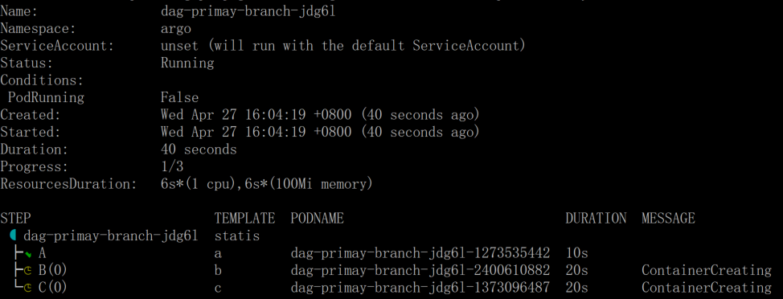

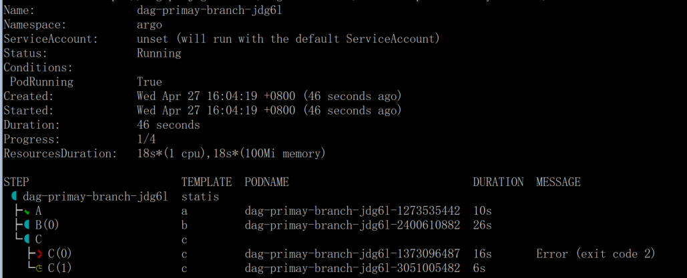

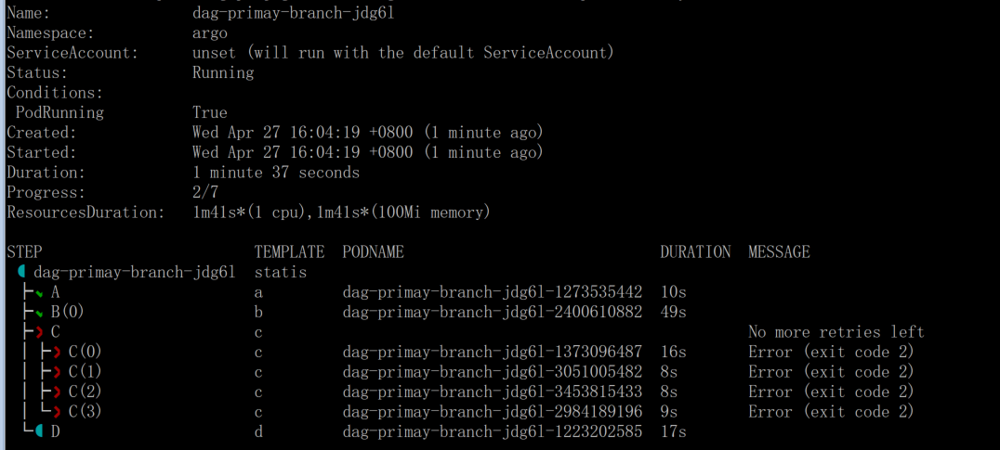

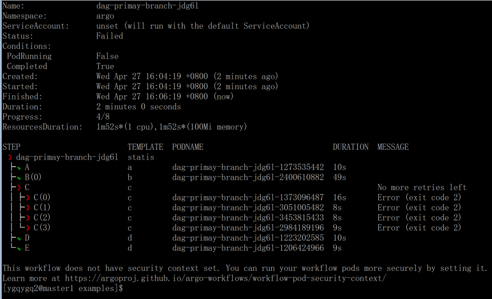

```bash
argo logs -n argo dag-primay-branch-jdg6l
```

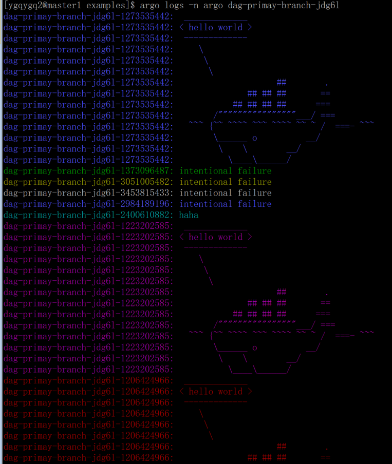

- DAG 默认 FailFast 设置为 `true`，即一旦有步骤失败，它将停止调度后面的步骤，只等待正在运行的步骤完成；
- 如果将 FailFast 设置为 `false`，它将不管步骤运行结果，继续调度后面步骤，直至所有步骤运行完成；

### 3.2.5 Artifacts

配置制品库参考：[https://argoproj.github.io/argo-workflows/configure-artifact-repository/](https://argoproj.github.io/argo-workflows/configure-artifact-repository/) 支持 Minio、AWS s3、GCS、阿里 OSS

```bash
argo submit -n argo artifact-repository-ref.yaml
```

当前官方示例报错，它建议使用 `emptyDir` 

我们根据官方 [emptyDir 示例](https://argoproj.github.io/argo-workflows/empty-dir/) 继续

```bash
argo submit -n argo /tmp/artifactory-emptydir.yaml
argo watch -n argo empty-dir-sqrr9
```

```yaml
apiVersion: argoproj.io/v1alpha1
kind: Workflow
metadata:
  generateName: empty-dir-
spec:
  entrypoint: main
  templates:
    - name: main
      container:
        image: argoproj/argosay:v2
        command: [sh, -c]
        args: ["cowsay hello world | tee /mnt/out/hello_world.txt"]
        volumeMounts:
          - name: out
            mountPath: /mnt/out
      volumes:
        - name: out
          emptyDir: { }
      outputs:
        parameters:
          - name: message
            valueFrom:
              path: /mnt/out/hello_world.txt
```

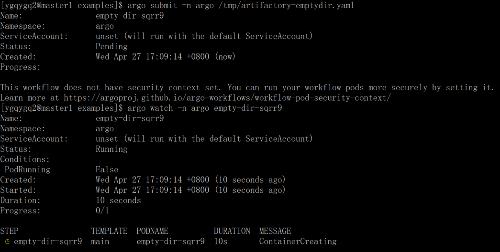

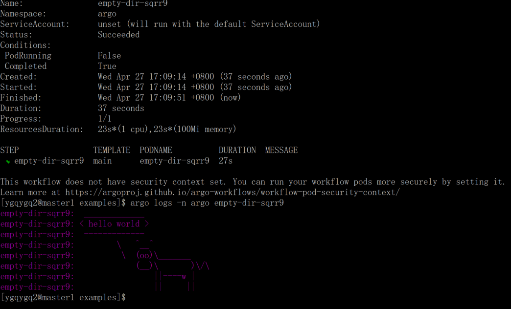

- 当前 k8s 不允许 workflow 直接输出制品在目录或文件中，须使用 emptyDir 或 pvc 等；
- 制品默认被打包为 Tarballs，默认情况下是 gzipped。可以通过使用归档字段指定归档策略来自定义此行为；

### 3.2.6 The Structure of Workflow Specs

Workflow 基本结构：

- 包含元数据的 kubernetes 头部
- Spec 主体
    - 带有可选参数的入口点调用
    - 模板定义列表
- 对于每个模板定义
    - 模板名称
    - 可选的输入列表
    - 可选的输出列表
- 容器调用或步骤列表
    - 对于每个步骤，都有一个模板调用

总而言之，Workflow 规范是由一组 Argo 模板组成的，其中每个模板包含一个可选的输入部分，一个可选的输出部分，以及一个容器调用或者一个步骤列表，其中每个步骤调用另一个模板。

> 注意，Workflow 规范的容器部分将接受与 pod 规范的容器部分相同的选项，包括但不限于环境变量、secret、volume、挂载。因此本文不在赘述相关 kubernetes 资源在 workflow 中的使用。

### 3.2.7 Scripts & Results

**使用脚本获取运行结果**

```bash
argo submit -n argo scripts-bash.yaml
argo watch -n argo scripts-bash-4fcm8
```

```yaml
# script templates provide a way to run arbitrary snippets of code
# in any language, to produce a output "result" via the standard out
# of the template. Results can then be referenced using the variable,
# {{steps.<stepname>.outputs.result}}, and used as parameter to other
# templates, and in 'when', and 'withParam' clauses.
# This example demonstrates the use of a bash shell script to
# generate a random number which is printed in the next step.
apiVersion: argoproj.io/v1alpha1
kind: Workflow
metadata:
  generateName: scripts-bash-
spec:
  entrypoint: bash-script-example
  templates:
  - name: bash-script-example
    steps:
    - - name: generate
        template: gen-random-int
    - - name: print
        template: print-message
        arguments:
          parameters:
          - name: message
            value: "{{steps.generate.outputs.result}}"

  - name: gen-random-int
    script:
      image: debian:9.4
      command: [bash]
      source: |
        cat /dev/urandom | od -N2 -An -i | awk -v f=1 -v r=100 '{printf "%i\n", f + r * $1 / 65536}'

  - name: print-message
    inputs:
      parameters:
      - name: message
    container:
      image: alpine:latest
      command: [sh, -c]
      args: ["echo result was: {{inputs.parameters.message}}"]
```

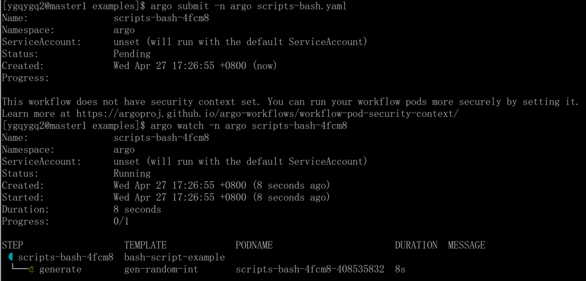

```bash
argo logs -n argo scripts-bash-4fcm8
```

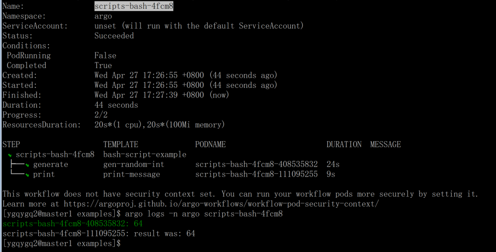

- `script` 关键字允许使用 `source` 来定义脚本主体，这将创建一个包含脚本主体的临时文件，然后将临时文件的名称作为最后一个参数传递给 `command`，`command`应该是一个脚本解释器；
- 使用 `script` 我特性还将运行脚本的标准输出指定给一个名为 `result`的特殊输出参数。这允许您在 workflow 的其余部分中使用脚本运行结果，在上面示例中，结果只是由 `print-message` 模板回显。

### 3.2.8 Output Parameters

输出参数提供了将步骤的结果作为参数而不是作为工件使用的通用机制。这允许您将任何类型的步骤(而不仅仅是`script`)的结果用于条件测试、循环和参数。输出参数的工作方式与 `script` `result`类似，只是输出参数的值设置为生成文件的内容，而不是标准输出的内容。

### 3.2.9 Loops

**循环**

```bash
argo submit -n argo loops-param-argument.yaml
argo watch -n argo loops-param-arg-rnwms
```

```yaml
# This example demonstrates a workflow accepting a list of items (as JSON string)
# as an input parameter, and using it for expanding a step into multiple steps.
apiVersion: argoproj.io/v1alpha1
kind: Workflow
metadata:
  generateName: loops-param-arg-
spec:
  entrypoint: loop-param-arg-example
  arguments:
    parameters:
    - name: os-list
      value: |
        [
          { "image": "debian", "tag": "9.1" },
          { "image": "debian", "tag": "8.9" },
          { "image": "alpine", "tag": "3.6" },
          { "image": "ubuntu", "tag": "17.10" }
        ]

  templates:
  - name: loop-param-arg-example
    inputs:
      parameters:
      - name: os-list
    steps:
    - - name: test-linux
        template: cat-os-release
        arguments:
          parameters:
          - name: image
            value: "{{item.image}}"
          - name: tag
            value: "{{item.tag}}"
        withParam: "{{inputs.parameters.os-list}}"

  - name: cat-os-release
    inputs:
      parameters:
      - name: image
      - name: tag
    container:
      image: "{{inputs.parameters.image}}:{{inputs.parameters.tag}}"
      command: [cat]
      args: [/etc/os-release]
```


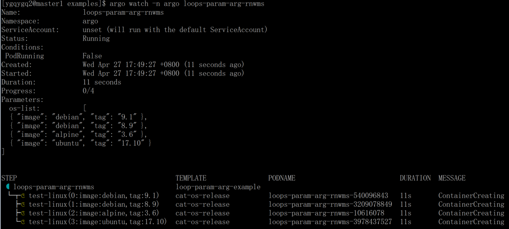

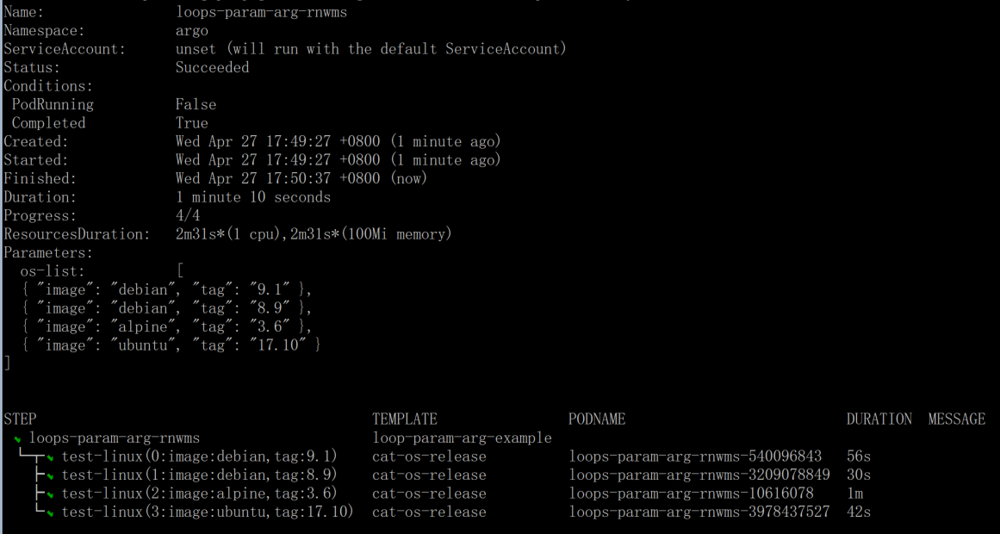

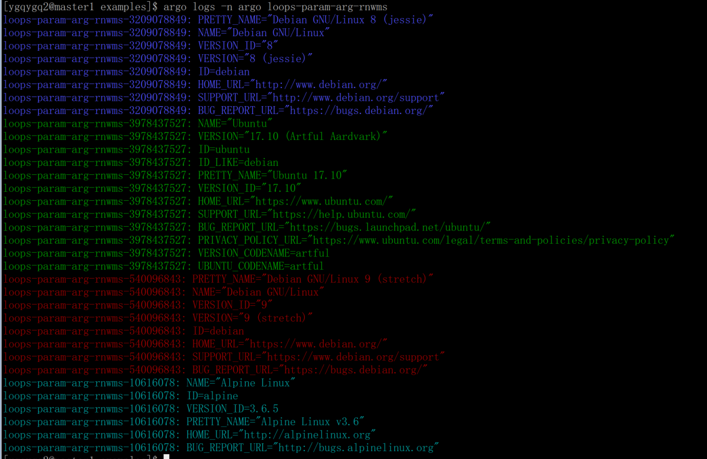

- workflow 支持循环的使用，不止是单个步骤，也支持多步骤中使用循环；
- 可以使用列表作为参数传递；
- 也可以动态生成要迭代的列表项；

### 3.2.10 Conditionals

Workflow 支持条件执行，语法是通过 [govaluate](https://github.com/Knetic/govaluate)实现的，它为复杂的语法提供了支持。

```bash
argo submit -n argo conditionals-complex.yaml
argo watch -n argo coinflip-8zsc2
```

```yaml
# In this example we flip 2 times a coin. First time we
# use the simple conditionals syntax. The second time we use
# regex and a complex condition with logical AND and OR.
# We also use of the parenthesis for defining the priority.
apiVersion: argoproj.io/v1alpha1
kind: Workflow
metadata:
  generateName: coinflip-
spec:
  entrypoint: coinflip
  templates:
  - name: coinflip
    steps:
    # flip a coin
    - - name: flip-coin
        template: flip-coin
    # evaluate the result in parallel
    - - name: heads
        template: heads                       # call heads template if "heads"
        when: "{{steps.flip-coin.outputs.result}} == heads"
      - name: tails
        template: tails                       # call tails template if "tails"
        when: "{{steps.flip-coin.outputs.result}} == tails"
    - - name: flip-again
        template: flip-coin
    - - name: complex-condition
        template: heads-tails-or-twice-tails 
        # call heads template if first flip was "heads" and second was "tails" OR both were "tails"
        when: >-
            ( {{steps.flip-coin.outputs.result}} == heads &&
              {{steps.flip-again.outputs.result}} == tails
            ) ||
            ( {{steps.flip-coin.outputs.result}} == tails &&
              {{steps.flip-again.outputs.result}} == tails )
      - name: heads-regex
        template: heads                       # call heads template if ~ "hea"
        when: "{{steps.flip-again.outputs.result}} =~ hea"
      - name: tails-regex
        template: tails                       # call heads template if ~ "tai"
        when: "{{steps.flip-again.outputs.result}} =~ tai"

  # Return heads or tails based on a random number
  - name: flip-coin
    script:
      image: python:alpine3.6
      command: [python]
      source: |
        import random
        result = "heads" if random.randint(0,1) == 0 else "tails"
        print(result)

  - name: heads
    container:
      image: alpine:3.6
      command: [sh, -c]
      args: ["echo \"it was heads\""]

  - name: tails
    container:
      image: alpine:3.6
      command: [sh, -c]
      args: ["echo \"it was tails\""]

  - name: heads-tails-or-twice-tails
    container:
      image: alpine:3.6
      command: [sh, -c]
      args: ["echo \"it was heads the first flip and tails the second. Or it was two times tails.\""]
```


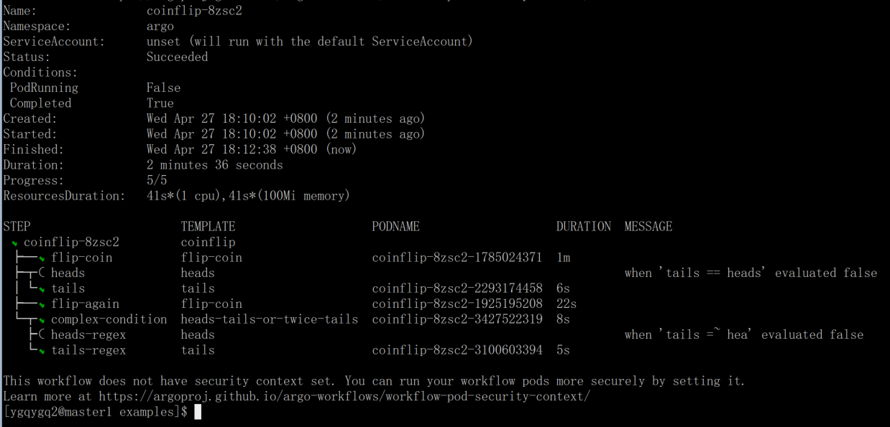

### 3.2.11 Recursion

**递归**

```bash
argo submit -n argo coinflip-recursive.yaml
argo watch -n argo coinflip-recursive-5c96n
```

```yaml
# coinflip-recursive is a variation of the coinflip example.
# This is an example of a dynamic workflow which extends
# indefinitely until it achieves a desired result. In this
# example, the 'flip-coin' step is recursively repeated until
# the result of the step is "heads".
apiVersion: argoproj.io/v1alpha1
kind: Workflow
metadata:
  generateName: coinflip-recursive-
spec:
  entrypoint: coinflip
  templates:
  - name: coinflip
    steps:
    - - name: flip-coin
        template: flip-coin
    - - name: heads
        template: heads
        when: "{{steps.flip-coin.outputs.result}} == heads"
      - name: tails
        template: coinflip
        when: "{{steps.flip-coin.outputs.result}} == tails"

  - name: flip-coin
    script:
      image: python:alpine3.6
      command: [python]
      source: |
        import random
        result = "heads" if random.randint(0,1) == 0 else "tails"
        print(result)

  - name: heads
    container:
      image: alpine:3.6
      command: [sh, -c]
      args: ["echo \"it was heads\""]
```


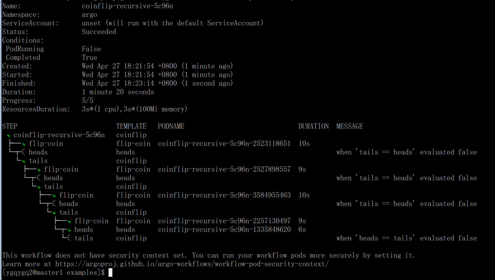

- 直到达成某个条件，workflow 才会跳出递归，然后结束；
- 和程序员开发过程中写循环一样，设定是否能正常退出递归的条件尤为关键，否则将会一直创建 POD 执行任务，直到超时或干预停止 workflow；

### 3.2.12 Exit handlers

退出处理程序是一个总是在工作流结束时执行的模板，无论成功还是失败。 退出处理程序的一些常见用例如下:

- 工作流程运行后的清理工作
- 发送工作流状态通知(例如，电子邮件/Slack)
- 将通过/失败状态发布到 webhook 结果(例如 GitHub 构建结果)
- 重新提交或提交另一个工作流

```bash
argo submit -n argo exit-handlers.yaml
argo watch -n argo exit-handlers-77kvs
```

```yaml
# An exit handler is a template reference that executes at the end of the workflow
# irrespective of the success, failure, or error of the primary workflow. To specify
# an exit handler, reference the name of a template in 'spec.onExit'.
# Some common use cases of exit handlers are:
# - sending notifications of workflow status (e.g. e-mail/slack)
# - posting the pass/fail status to a webhook result (e.g. github build result)
# - cleaning up workflow artifacts
# - resubmitting or submitting another workflow
apiVersion: argoproj.io/v1alpha1
kind: Workflow
metadata:
  generateName: exit-handlers-
spec:
  entrypoint: intentional-fail
  onExit: exit-handler
  templates:
  # primary workflow template
  - name: intentional-fail
    container:
      image: alpine:latest
      command: [sh, -c]
      args: ["echo intentional failure; exit 1"]

  # exit handler related templates
  # After the completion of the entrypoint template, the status of the
  # workflow is made available in the global variable {{workflow.status}}.
  # {{workflow.status}} will be one of: Succeeded, Failed, Error
  - name: exit-handler
    steps:
    - - name: notify
        template: send-email
      - name: celebrate
        template: celebrate
        when: "{{workflow.status}} == Succeeded"
      - name: cry
        template: cry
        when: "{{workflow.status}} != Succeeded"
  - name: send-email
    container:
      image: alpine:latest
      command: [sh, -c]
      # Tip: {{workflow.failures}} is a JSON list. If you're using bash to read it, we recommend using jq to manipulate
      # it. For example:
      #
      # echo "{{workflow.failures}}" | jq -r '.[] | "Failed Step: \(.displayName)\tMessage: \(.message)"'
      #
      # Will print a list of all the failed steps and their messages. For more info look up the jq docs.
      # Note: jq is not installed by default on the "alpine:latest" image, however it can be installed with "apk add jq"
      args: ["echo send e-mail: {{workflow.name}} {{workflow.status}} {{workflow.duration}}. Failed steps {{workflow.failures}}"]
  - name: celebrate
    container:
      image: alpine:latest
      command: [sh, -c]
      args: ["echo hooray!"]
  - name: cry
    container:
      image: alpine:latest
      command: [sh, -c]
      args: ["echo boohoo!"]
```


# 4\. 小结

其它的一些功能和示例，这里不再展开。使用时多查看官方文档，多试验，就会越发了解 argo workflows； 当前可能配合 jenkins 这类 CI/CD 工具一起使用效果比较好； 整体使用下来，感受到 Argo Workflows 的强大功能，也希望未来将会越来越好，随着其功能的逐渐完善，期待其成为 kubernetes 中 CI/CD 的标杆。

参考资料： \[1\] [https://argoproj.github.io/argo-workflows/](https://argoproj.github.io/argo-workflows/) \[2\] [https://github.com/argoproj/argo-workflows/blob/master/examples/README.md](https://github.com/argoproj/argo-workflows/blob/master/examples/README.md)
