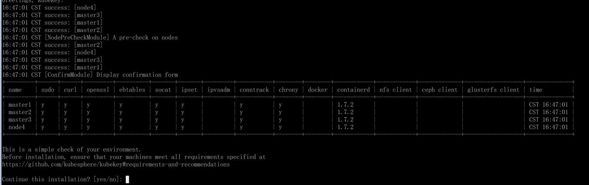

# 1\. 准备环境

## 1.1 机器准备

4 台机器，操作系统：Ubuntu 24.04/RHEL8/CentOS9

```
10.111.3.53 master1
10.111.3.54 master2
10.111.3.55 master3
10.111.3.57 node4
```

## 1.2 安装依赖和配置

所有节点都需要执行：

Ubuntu:

```
apt-get install -y socat conntrack ebtables ipset chrony # containerd

#echo 'export KKZONE=cn' >> /etc/profile

#cat>/etc/default/kubelet<EOF
#KUBELET_EXTRA_ARGS="--container-runtime-endpoint=unix:///var/run/containerd/containerd.sock"
#EOF
```

RHEL 系：

```
yum install -y socat conntrack ebtables ipset chrony # containerd

#echo 'export KKZONE=cn' >> /etc/profile

#cat>/etc/sysconfig/kubelet<EOF
#KUBELET_EXTRA_ARGS="--container-runtime-endpoint=unix:///var/run/containerd/containerd.sock"
#EOF
```

## 1.3 安装负载均衡 keepalived + haproxy

安装 keepalived haproxy

```
apt-get -y install keepalived haproxy
# yum -y install keepalived haproxy
```

新建用户

```
useradd -r -u 139 -g 100 -s /sbin/nologin keepalived_script
```

配置 keepalived `/etc/keepalived/keepalived.conf` （注意配置中注释，不同节点权重不同）内容：

```
! /etc/keepalived/keepalived.conf
! Configuration File for keepalived
global_defs {
    script_user keepalived_script
    enable_script_security     
    router_id LVS_DEVEL
     max_auto_priority 99
}
vrrp_script check_apiserver {
  script "/etc/keepalived/check_apiserver.sh"
  interval 3
  weight -2
  fall 10
  rise 2
}

vrrp_instance VI_1 {
    # 只配置一个 MASTER，其它的配置为 BACKUP
    state MASTER
     # 注意网卡名
    interface enp0s18
    virtual_router_id 60
     # MASTER 权重最高，尽量全部设置为不同的权重
    priority 101
    authentication {
        auth_type PASS
        auth_pass k8s
    }
    virtual_ipaddress {
        10.111.3.99
    }
    track_script {
        check_apiserver
    }
}
```

`/etc/keepalived/check_apiserver.sh` 内容：

```
#!/bin/bash

# if check error then repeat check for 12 times, else exit
err=0
for k in $(seq 1 12)
do
    check_code=$(curl -k https://localhost:6443)
    if [[ $check_code == "" ]]; then
        err=$(expr $err + 1)
        sleep 5
        continue
    else
        err=0
        break
    fi
done

if [[ $err != "0" ]]; then
    # if apiserver is down send SIG=1
    echo 'apiserver error!'
    exit 1
else
    # if apiserver is up send SIG=0
    echo 'apiserver normal!'
    exit 0
fi
```

`chmod a+x /etc/keepalived/check_apiserver.sh`

配置 haproxy `/etc/haproxy/haproxy.cfg` 内容：

```
global
  log 127.0.0.1 local0 err
  maxconn 50000
  uid 138 
  gid 138
  #daemon
  pidfile haproxy.pid

defaults
  mode http
  log 127.0.0.1 local0 err
  maxconn 50000
  retries 3
  timeout connect 5s
  timeout client 30s
  timeout server 30s
  timeout check 2s

listen admin_stats
  mode http
  bind 0.0.0.0:1080
  log 127.0.0.1 local0 err
  stats refresh 30s
  stats uri     /haproxy-status
  stats realm   Haproxy\ Statistics
  stats auth    admin:k8s
  stats hide-version
  stats admin if TRUE

frontend k8s-https
  bind 0.0.0.0:8443
  mode tcp
  #maxconn 50000
  default_backend k8s-https

backend k8s-https
  mode tcp
  balance roundrobin
  server master1 10.111.3.53:6443 weight 1 maxconn 1000 check inter 2000 rise 2 fall 3
  server master2 10.111.3.54:6443 weight 1 maxconn 1000 check inter 2000 rise 2 fall 3
  server master3 10.111.3.55:6443 weight 1 maxconn 1000 check inter 2000 rise 2 fall 3

```

```
systemctl start haproxy
systemctl start keepalived
systemctl enable haproxy
systemctl enable keepalived
```

# 2\. 集群安装

## 2.1 kk 安装

```bash
curl -sfL https://get-kk.kubesphere.io | VERSION=v3.1.1 sh -
mv kk /usr/local/sbin/
kk version --show-supported-k8s

# 生成 ssh key
ssh-keygen -t ed25519 -C "master"
# 公钥添加到其它节点
ssh-copy-id -i ~/.ssh/id_ed25519.pub root@其它节点IP
```

## 2.2 kk 配置

```bash
mkdir k8s
cd k8s
kk create config --with-kubernetes v1.29.2
```

会生成配置文件 `config-sample.yaml`，然后修改下节点信息，如下：

内容：

```yaml
apiVersion: kubekey.kubesphere.io/v1alpha2
kind: Cluster
metadata:
  name: vdi-k8s
spec:
  hosts:
    - {name: master1, address: 10.111.3.53, internalAddress: 10.111.3.53, user: root, privateKeyPath: "~/.ssh/id_ed25519"}
    - {name: master2, address: 10.111.3.54, internalAddress: 10.111.3.54, user: root, privateKeyPath: "~/.ssh/id_ed25519"}
    - {name: master3, address: 10.111.3.55, internalAddress: 10.111.3.55, user: root, privateKeyPath: "~/.ssh/id_ed25519"}
    - {name: node4, address: 10.111.3.57, internalAddress: 10.111.3.57, user: root, privateKeyPath: "~/.ssh/id_ed25519"}
  roleGroups:
    etcd:
    - master1
    - master2
    - master3
    control-plane: 
    - master1
    - master2
    - master3
    worker:
    - node4
  controlPlaneEndpoint:
    ## Internal loadbalancer for apiservers 
    # internalLoadbalancer: haproxy

    domain: lb.kubesphere.local
    address: "10.111.3.99"  # 注意修改
    port: 8443
  kubernetes:
    version: v1.29.2
    clusterName: cluster.local
    autoRenewCerts: true
    containerManager: containerd
  etcd:
    type: kubekey
  network:
    plugin: calico
    kubePodsCIDR: 10.233.64.0/18
    kubeServiceCIDR: 10.233.0.0/18
    ## multus support. https://github.com/k8snetworkplumbingwg/multus-cni
    multusCNI:
      enabled: false
  registry:
    privateRegistry: ""
    namespaceOverride: ""
    registryMirrors: []
    insecureRegistries: []
  addons: []
```

## 2.3 kk 安装集群

检查时间，如果时间未同步，重启 chronyd 服务。

```
date
systemctl stop chronyd
systemctl start chronyd
chronyc tracking
# chronc -a makestep # 强制同步
```

集群安装： `kk create cluster -f config-sample.yaml`



后面都是自动的，等待即可。

## 2.4 kk 安装集群失败处理

在 master 节点执行，注意确认正确的节点和危险性！！！

```bash
kk delete cluster -f config-sample.yaml
```
