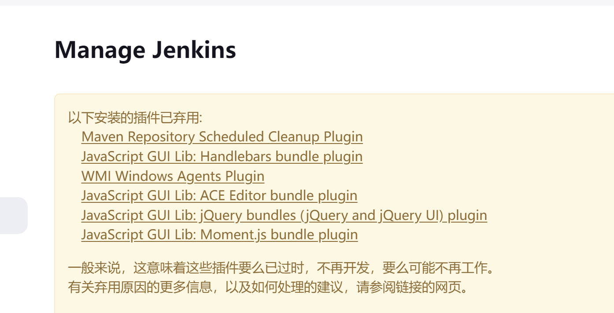
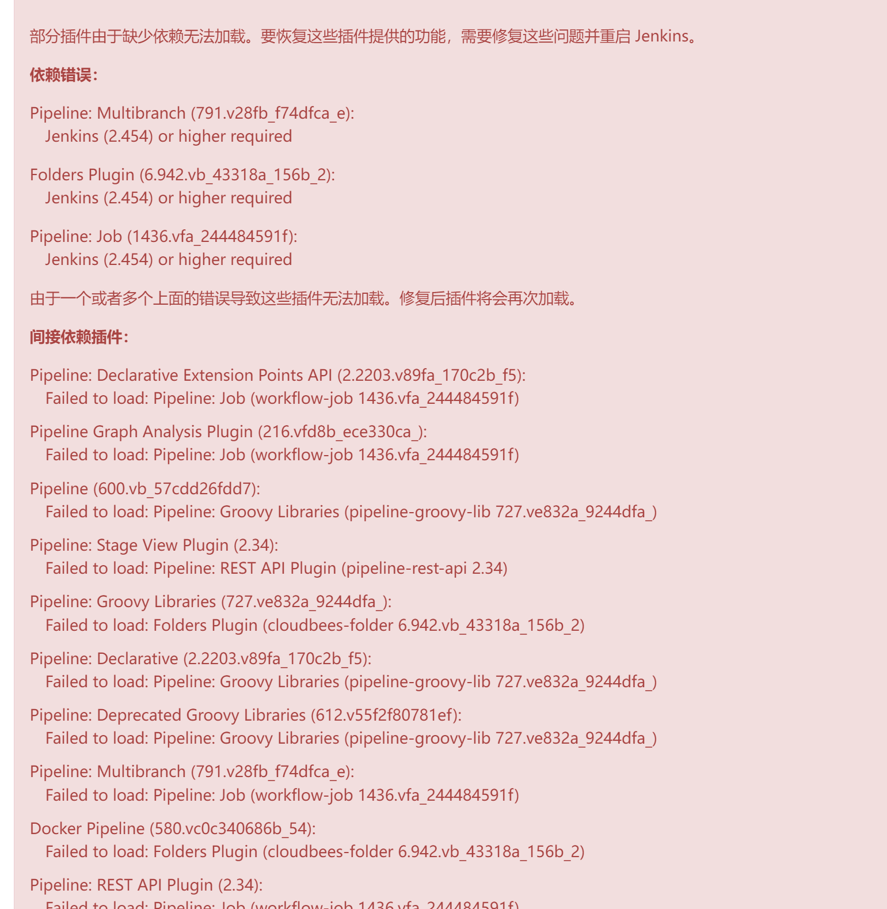
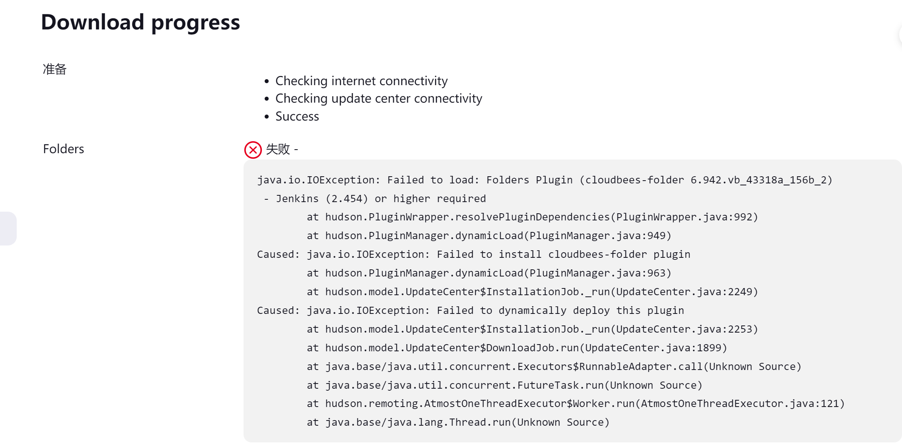
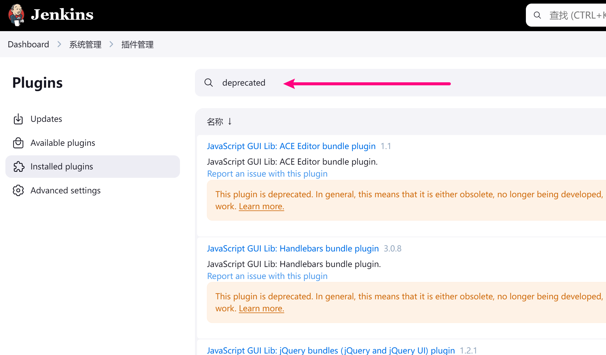
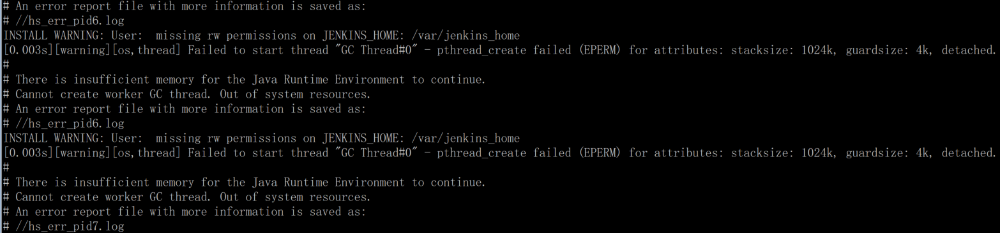
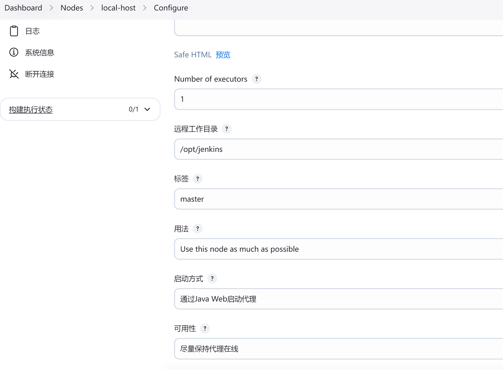
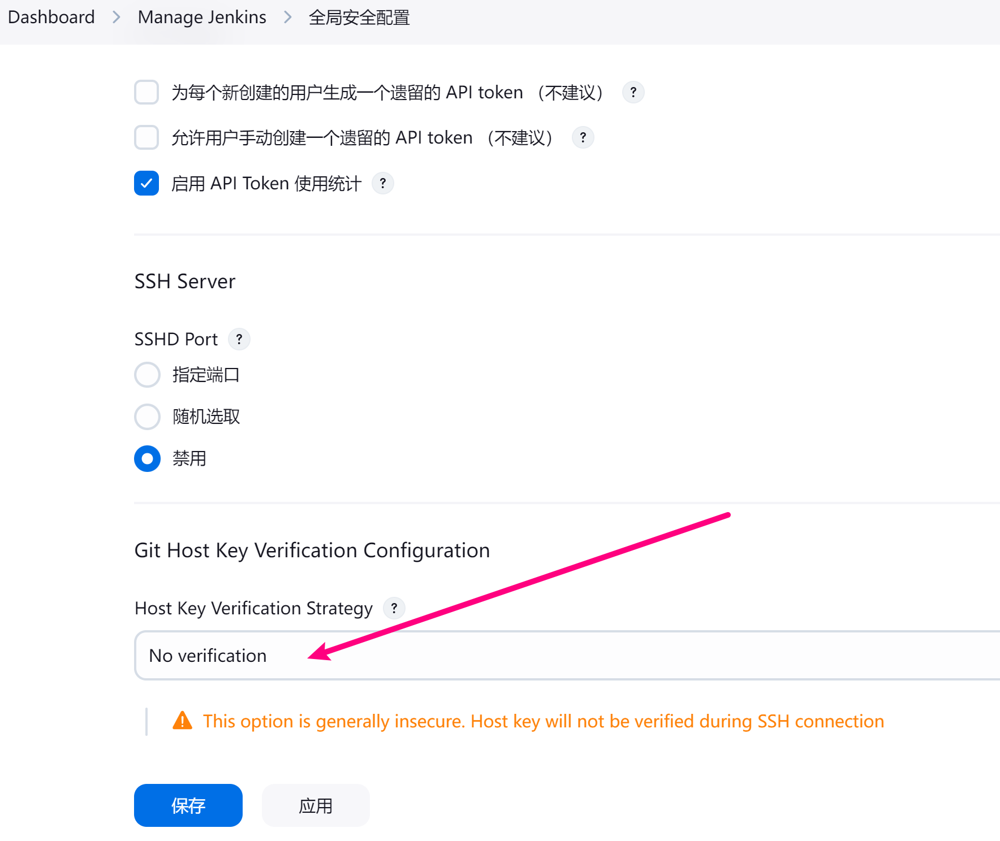

# 1\. 环境说明

环境 A: \* jenkins 版本：2.253 \* 使用 systemctl 管理的 jenkins 服务

环境 B： 可以上网的机器，装有 docker-compose

docker 和 docker-compose 安装，这里都略了。

# 2\. 安装旧版本

## 2.1 环境 A jenkins 目录打包文件

打包需要的文件放在 /tmp 目录下待下载：

```bash
/home/jenkins/  # jenkins 数据目录
tar -cvf jenkins.tar --exclude='caches' --exclude='jobs' --exclude='logs' --exclude='nodes' --exclude='workspace' *
mv jenkins.tar /tmp/
```

然后把 `jenkins.tar` 下载，并传输到 B 环境机器上。

## 2.2 环境 B 机器安装旧版本 jenkins

在 B 环境机器上，上传下载的 `jenkins.tar` 到 `/tmp/` 下，解压准备好 `jenkins_home`。

```bash
mkdir -p /data/tmp/jenkins/data
cd /data/tmp/jenkins/data
tar -xvf /tmp/jenkins.tar
cd ../..
chown 1000.1000 -R jenkins/
```

使用 docker-compose 安装旧版本 jenkins。

`/data/tmp/docker-compose.yml`：

```yaml
version: '3.1'
networks:
  app:

services:
  jenkins:
    image: harbor.ygqygq2.com/proxy/jenkins/jenkins:2.253-centos7
    restart: always
    # user: root
    networks:
      - app
    environment:
      - TZ=Asia/Shanghai
      - JAVA_OPTS=-Duser.timezone=Asia/Shanghai
      - JENKINS_ARGS="--sessionTimeout=86400"
    volumes:
      - ./jenkins/sudoers.d:/etc/sudoers.d
      - ./jenkins/data:/var/jenkins_home
      #- ./jenkins/war:/usr/share/jenkins
      - ./jenkins/caches:/caches
      - /var/run/docker.sock:/var/run/docker.sock
    ports:
      - "8090:8080"
```

启动，并浏览器登录 B 环境，注意端口

```bash
cd /data/tmp
docker-compose up -d
docker-compose ps
```

使用环境 A 的 jenkins 管理员用户密码，在浏览器登录后，滑到最底部查看 jenkins 版本，看是否和旧版本一致。

# 3\. 环境 B jenkins 升级插件

前面登录 jenkins 后，如果版本和旧版本一致，则成功启动。进入插件升级管理界面，先选择 “全选” 插件升级，但**不勾选** “安装完成后重启Jenkins”。

然后编辑 `/data/tmp/docker-compose.yml`，修改镜像 tag 为当前最新稳定版，比如当前为 `2.452.3-lts`

```yaml
version: '3.1'
networks:
  app:

services:
  jenkins:
    image: harbor.ygqygq2.com/proxy/jenkins/jenkins:2.452.3-lts
    restart: always
    # user: root
    networks:
      - app
    environment:
      - TZ=Asia/Shanghai
      - JAVA_OPTS=-Duser.timezone=Asia/Shanghai
      - JENKINS_ARGS="--sessionTimeout=86400"
    volumes:
      - ./jenkins/sudoers.d:/etc/sudoers.d
      - ./jenkins/data:/var/jenkins_home
      #- ./jenkins/war:/usr/share/jenkins
      - ./jenkins/caches:/caches
      - /var/run/docker.sock:/var/run/docker.sock
    ports:
      - "8090:8080"
```

重启容器：

```bash
cd /data/tmp
docker-compose up -d
docker-compose ps
```

# 4\. 环境 B jenkins 问题处理

`docker logs -f` 查看日志，并且看浏览器是否能访问和登录。

> 1. 如果遇到访问和登录问题，一般是插件不兼容，查看日志，把不兼容的插件文件从 `/data/tmp/jenkins/data/plugins/` 插件目录中移出去，并且使用 docker 命令手动重启容器，直到能登录并且能更新插件为止；
> 2. 根据移出去的插件名再从插件管理界面搜索安装；
> 3. 最后把插件再升级到兼容版本最新；
> 4. 看看插件管理界面有什么提示和未启动的插件原因；

比如： 





因为 LTS 的版本更新较慢，插件是跟着最新版本的，有时候会不兼容 LTS 版本。所以，使用 war 包方式将 jenkins 升级。

先把原 war 包目录拷出来备份

```bash
# 56 是 docker ps 看到的容器 id
docker cp 56:/usr/share/jenkins jenkins/war_bak
```

下载最新版本 jenkins war包到 `/data/tmp/jenkins/war/` 下

```bash
mkdir -p /data/tmp/jenkins/war/ref
wget https://updates.jenkins.io/download/war/2.467/jenkins.war -O /data/tmp/jenkins/war/jenkins.war
chown 1000.1000 -R /data/tmp/jenkins/war/
```

取消 `/data/tmp/docker-compose.yml` 中 war 目录那行的注释，让最新 war 包挂载进去。

```yaml
version: '3.1'
networks:
  app:

services:
  jenkins:
    image: harbor.ygqygq2.com/proxy/jenkins/jenkins:2.452.3-lts
    restart: always
    # user: root
    networks:
      - app
    environment:
      - TZ=Asia/Shanghai
      - JAVA_OPTS=-Duser.timezone=Asia/Shanghai
      - JENKINS_ARGS="--sessionTimeout=86400"
    volumes:
      - ./jenkins/sudoers.d:/etc/sudoers.d
      - ./jenkins/data:/var/jenkins_home
      - ./jenkins/war:/usr/share/jenkins
      - ./jenkins/caches:/caches
      - /var/run/docker.sock:/var/run/docker.sock
    ports:
      - "8090:8080"
```

重启容器：

```bash
cd /data/tmp
docker-compose up -d
docker-compose ps
```

这时候基本没什么插件问题了，把弃用的插件卸载。



后面就是流水线和设置等的调整测试了。

# 5\. 升级 A 环境 jenkins

## 5.1 升级 A 环境 jenkins master

环境 B 机器打包 jenkins 目录

```bash
cd /data/tmp/
tar -cvf jenkins.tar jenkins/
```

然后下载 `jenkins.tar` 上传到环境 A 机器 `/tmp` 下

因为前面环境 A 机器打包过滤了这些目录，这些为任务、节点和工作目录，所以新版本的 jenkins 目录，把这几个目录拷贝过来先放好。`--exclude='caches' --exclude='jobs' --exclude='logs' --exclude='nodes' --exclude='workspace'`

```bash
mkdir -p /data/docker/jenkins/data
rsync -avz /home/jenkins/{caches,jobs,logs,nodes,workspace} /data/docker/jenkins/data/

# 解压 /tmp/jenkins.tar
cd /data/docker/
tar -xvf /tmp/jenkins.tar

chown 1000.1000 -R /data/docker/jenkins
```

在 docker-compose 配置中添加上 jenkins 相关配置，注意这里使用的是 8090 端口，目的是不影响现有的 jenkins 8080 端口，等 8090 测试 ok 后，再关掉原来的 8080 端口，替换 8090 成 8080 端口完成升级。 `/data/docker/docker-compose.yml`

```yaml
version: '3.1'
networks:
  app:

services:
  jenkins:
    image: harbor.ygqygq2.com/proxy/jenkins/jenkins:2.452.3-lts
    restart: always
    # user: root
    networks:
      - app
    environment:
      - TZ=Asia/Shanghai
      - JAVA_OPTS=-Duser.timezone=Asia/Shanghai
      - JENKINS_ARGS="--sessionTimeout=86400"
    volumes:
      - ./jenkins/sudoers.d:/etc/sudoers.d
      - ./jenkins/data:/var/jenkins_home
      - ./jenkins/war:/usr/share/jenkins
      - ./jenkins/caches:/caches
      - /var/run/docker.sock:/var/run/docker.sock
    ports:
      - "8090:8080"
```

镜像传到环境 A 机器可以通过导出导入方式，或者传到内网镜像仓库，从内网镜像仓库拉，目的是保证环境 A 机器上有这个最新的 jenkins 镜像。

启动容器：

```bash
cd /data/tmp
docker-compose up -d
docker-compose ps
```

报错 

原因是 docker 版本较旧，升级 docker 版本，或者增加参数：

```yaml
    security_opt:
      - seccomp:unconfined
```

现在应该可以启动了。

## 5.2 升级 A 环境 jenkins node

登录 jenkins 后，可以看到 Node 已经连不上。

先更新 node 的 jdk，更新为 [openjdk17](https://openjdk.org/projects/jdk/17/)，[下载链接](https://builds.openlogic.com/downloadJDK/openlogic-openjdk/17.0.11+9/openlogic-openjdk-17.0.11+9-linux-x64.tar.gz)

环境变量

```bash
JAVA_HOME=/opt/java/jdk
PATH=$JAVA_HOME/bin:$PATH
CLASSPATH=.:$JAVA_HOME/lib/tools.jar
export PATH JAVA_HOME CLASSPATH
```

jdk 放好

```
cd /tmp
wget https://builds.openlogic.com/downloadJDK/openlogic-openjdk/17.0.11+9/openlogic-openjdk-17.0.11+9-linux-x64.tar.gz
tar -zxvf openlogic-openjdk-17.0.11+9-linux-x64.tar.gz
mv /tmp/openlogic-openjdk-17.0.11+9-linux-x64 /opt/java/openjdk-17.0.11
ln -s /opt/java/openjdk-17.0.11 /opt/java/jdk
```

然后节点设置指定这个 jdk 就可以启动了。

因为我们 jenkins master 是使用 docker 方式启动的，流水线中不少步骤还是使用原来的宿主机。我们添加一个 agent，宿主机作为 master agent，而真正的 master 则不添加标签，以此作为过度阶段。

比如 

- 通过在 Jenkins 的管理界面中，进入“系统配置”或“全局安全配置”；
- 确保已经启用了代理的安全配置，比如“TCP 端口用于 JNLP 代理”选项不是设置为“禁用”；
- 使用固定端口 50000，因为 docker-compose 也得暴露出来；
- 这个 `local-host` 节点的标签设置为 master；
- Built-In Node 节点的标签设置为空；

在使用 ssh 的地方，还有个安全设置要注意，比如使用 ssh 方式检出代码，如果不设置成 “No verification” 可能会导致无法检出代码。 

# 6\. 小结

Jenkins 升级涉及到的东西较多，用的插件、功能越多，流水线依赖越多，升级难度越大。 Jenkins 方案方式的变化也会引起流水线使用的变化，比如很多原来直接使用 master 运行的部分，随着 master 的容器化，里面很多命令和工具都没了，这部分要权衡好，当然像我上面一样将宿主机作为 master 标签也是一个办法。 Jenkins 升级后还需要一段时间的磨合，你可能发现某个功能的写法的变化，某个功能因为安全原因需要增加额外设置或者按安全要求修改。 当然，容器化隔离提供了更安全的环境，各部分使用不同的镜像做到各司其职是更好的实践。
