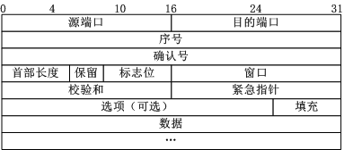
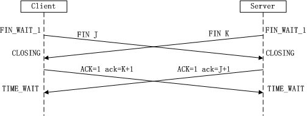

# TCP/IP连接与断开过程

TCP/IP三次握手与四次挥手

## 一.TCP报文格式

TCP/IP协议的详细信息参看《TCP/IP协议详解》三卷本。下面是TCP报文格式图： 

图1 TCP报文格式

上图中有几个字段需要重点介绍下： （1）序号：Seq序号，占32位，用来标识从TCP源端向目的端发送的字节流，发起方发送数据时对此进行标记。 （2）确认序号：Ack序号，占32位，只有ACK标志位为1时，确认序号字段才有效，Ack=Seq+1。 （3）标志位：共6个，即URG、ACK、PSH、RST、SYN、FIN等，具体含义如下： （A）URG：紧急指针（urgent pointer）有效。 （B）ACK：确认序号有效。 （C）PSH：接收方应该尽快将这个报文交给应用层。 （D）RST：重置连接。 （E）SYN：发起一个新连接。 （F）FIN：释放一个连接。 需要注意的是： （A）不要将确认序号Ack与标志位中的ACK搞混了。 （B）确认方Ack=发起方Req+1，两端配对。

## 二.三次握手

所谓三次握手（Three-Way Handshake）即建立TCP连接，就是指建立一个TCP连接时，需要客户端和服务端总共发送3个包以确认连接的建立。在socket编程中，这一过程由客户端执行connect来触发，整个流程如下图所示： 

图2 TCP三次握手

（1）第一次握手：Client将标志位SYN置为1，随机产生一个值seq=J，并将该数据包发送给Server，Client进入SYN\_SENT状态，等待Server确认。 （2）第二次握手：Server收到数据包后由标志位SYN=1知道Client请求建立连接，Server将标志位SYN和ACK都置为1，ack=J+1，随机产生一个值seq=K，并将该数据包发送给Client以确认连接请求，Server进入SYN\_RCVD状态。 （3）第三次握手：Client收到确认后，检查ack是否为J+1，ACK是否为1，如果正确则将标志位ACK置为1，ack=K+1，并将该数据包发送给Server，Server检查ack是否为K+1，ACK是否为1，如果正确则连接建立成功，Client和Server进入ESTABLISHED状态，完成三次握手，随后Client与Server之间可以开始传输数据了。

## 三.四次挥手

所谓四次挥手（Four-Way Wavehand）即终止TCP连接，就是指断开一个TCP连接时，需要客户端和服务端总共发送4个包以确认连接的断开。在socket编程中，这一过程由客户端或服务端任一方执行close来触发，整个流程如下图所示： 

图3 TCP四次挥手

由于TCP连接时全双工的，因此，每个方向都必须要单独进行关闭，这一原则是当一方完成数据发送任务后，发送一个FIN来终止这一方向的连接，收到一个FIN只是意味着这一方向上没有数据流动了，即不会再收到数据了，但是在这个TCP连接上仍然能够发送数据，直到这一方向也发送了FIN。首先进行关闭的一方将执行主动关闭，而另一方则执行被动关闭，上图描述的即是如此。 （1）第一次挥手：Client发送一个FIN，用来关闭Client到Server的数据传送，Client进入FIN\_WAIT\_1状态。 （2）第二次挥手：Server收到FIN后，发送一个ACK给Client，确认序号为收到序号+1（与SYN相同，一个FIN占用一个序号），Server进入CLOSE\_WAIT状态。 （3）第三次挥手：Server发送一个FIN，用来关闭Server到Client的数据传送，Server进入LAST\_ACK状态。 （4）第四次挥手：Client收到FIN后，Client进入TIME\_WAIT状态，接着发送一个ACK给Server，确认序号为收到序号+1，Server进入CLOSED状态，完成四次挥手。 上面是一方主动关闭，另一方被动关闭的情况，实际中还会出现同时发起主动关闭的情况，具体流程如下图： 

图4 同时挥手

流程和状态在上图中已经很明了了，在此不再赘述，可以参考前面的四次挥手解析步骤。

## 四.附注

关于三次握手与四次挥手通常都会有典型的面试题，在此提出供有需求的XDJM们参考： （1）三次握手是什么或者流程？四次握手呢？答案前面分析就是。 （2）为什么建立连接是三次握手，而关闭连接却是四次挥手呢？ 这是因为服务端在LISTEN状态下，收到建立连接请求的SYN报文后，把ACK和SYN放在一个报文里发送给客户端。而关闭连接时，当收到对方的FIN报文时，仅仅表示对方不再发送数据了但是还能接收数据，己方也未必全部数据都发送给对方了，所以己方可以立即close，也可以发送一些数据给对方后，再发送FIN报文给对方来表示同意现在关闭连接，因此，己方ACK和FIN一般都会分开发送。

## 五.SYN攻击

在三次握手过程中，服务器发送SYN-ACK之后，收到客户端的ACK之前的TCP连接称为半连接(half-open connect).此时服务器处于Syn\_RECV状态.当收到ACK后，服务器转入ESTABLISHED状态. Syn攻击就是 攻击客户端 在短时间内伪造大量不存在的IP地址，向服务器不断地发送syn包，服务器回复确认包，并等待客户的确认，由于源地址是不存在的，服务器需要不断的重发直 至超时，这些伪造的SYN包将长时间占用未连接队列，正常的SYN请求被丢弃，目标系统运行缓慢，严重者引起网络堵塞甚至系统瘫痪。 Syn攻击是一个典型的DDOS攻击。检测SYN攻击非常的方便，当你在服务器上看到大量的半连接状态时，特别是源IP地址是随机的，基本上可以断定这是一次SYN攻击.在Linux下可以如下命令检测是否被Syn攻击`netstat -ntp | grep SYN_RECV` 一般较新的TCP/IP协议栈都对这一过程进行修正来防范Syn攻击，修改tcp协议实现。主要方法有SynAttackProtect保护机制、SYN cookies技术、增加最大半连接和缩短超时时间等。 但是不能完全防范syn攻击。
