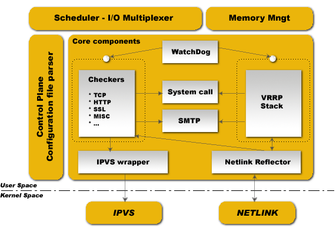

# keepalived高可用服务工作原理

什么是Keepalived呢，keepalived观其名可知，保持存活，在网络里面就是保持在线了， 也就是所谓的高可用或热备，用来防止单点故障(单点故障是指一旦某一点出现故障就会导致整个系统架构的不可用)的发生，那说到keepalived时不得 不说的一个协议就是VRRP协议，可以说这个协议就是keepalived实现的基础，那么首先我们来看看VRRP协议

## 一.VRRP协议

VRRP协议 学过网络的朋友都知道，网络在设计的时候必须考虑到冗余容灾，包括线路冗余，设备冗余等，防止网络存在单点故障，那在路由器或三层交换机处实现冗余就显得 尤为重要，在网络里面有个协议就是来做这事的，这个协议就是VRRP协议，Keepalived就是巧用VRRP协议来实现高可用性(HA)的

keepalived是以VRRP协议为实现基础的，VRRP全称Virtual Router Redundancy Protocol，即虚拟路由冗余协议。

虚拟路由冗余协议，可以认为是实现路由器高可用的协议，即将N台提供相同功能的路由器组成一个路由器组，这个组里面有一个master和多个backup，master上面有一个对外提供服务的vip（该路由器所在局域网内其他机器的默认路由为该vip），master会发组播，当backup收不到vrrp包时就认为master宕掉了，这时就需要根据VRRP的优先级来选举一个backup当master。这样的话就可以保证路由器的高可用了。

VRRP的工作过程如下： 1. 路由器开启VRRP功能后，会根据优先级确定自己在备份组中的角色。优先级高的路由器成为主用路由器，优先级低的成为备用路由器。主用路由器定期发送VRRP通告报文，通知备份组内的其他路由器自己工作正常；备用路由器则启动定时器等待通告报文的到来。 2. VRRP在不同的主用抢占方式下，主用角色的替换方式不同：l在抢占方式下，当主用路由器收到VRRP通告报文后，会将自己的优先级与通告报文中的优先级进行比较。如果大于通告报文中的优先级，则成为主用路由器；否则将保持备用状态。l在非抢占方式下，只要主用路由器没有出现故障，备份组中的路由器始终保持主用或备用状态，备份组中的路由器即使随后被配置了更高的优先级也不会成为主用路由器。 3. 如果备用路由器的定时器超时后仍未收到主用路由器发送来的VRRP通告报文，则认为主用路由器已经无法正常工作，此时备用路由器会认为自己是主用路由器，并对外发送VRRP通告报文。备份组内的路由器根据优先级选举出主用路由器，承担报文的转发功能。

keepalived完全遵守VRRP协议，包括竞选机制等等

## 二.Keepalived原理

Keepalived原理 keepalived也是模块化设计，不同模块复杂不同的功能，下面是keepalived的组件 core check vrrp libipfwc libipvs-2.4 libipvs-2.6 core：是keepalived的核心，复杂主进程的启动和维护，全局配置文件的加载解析等 check：负责healthchecker(健康检查)，包括了各种健康检查方式，以及对应的配置的解析包括LVS的配置解析 vrrp：VRRPD子进程，VRRPD子进程就是来实现VRRP协议的 libipfwc：iptables(ipchains)库，配置LVS会用到 libipvs\*：配置LVS会用到 注意，keepalived和LVS完全是两码事，只不过他们各负其责相互配合而已 

keepalived启动后会有三个进程 父进程：内存管理，子进程管理等等 子进程：VRRP子进程 子进程：healthchecker子进程

有图可知，两个子进程都被系统WatchDog看管，两个子进程各自复杂自己的事，healthchecker子进程复杂检查各自服务器的健康程度，例如HTTP，LVS等等，如果healthchecker子进程检查到MASTER上服务不可用了，就会通知本机上的兄弟VRRP子进程，让他删除通告，并且去掉虚拟IP，转换为BACKUP状态
