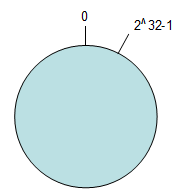

# 一致性哈希算法作用及原理

一致性哈希算法（Consistent Hashing）最早在论文《Consistent Hashing and Random Trees: Distributed Caching Protocols for Relieving Hot Spots on the World Wide Web》中被提出。简单来说，一致性哈希将整个哈希值空间组织成一个虚拟的圆环，如假设某哈希函数 H 的值空间为 0 - 232-1（即哈希值是一个 32 位无符号整形），整个哈希空间环如下：  整个空间按顺时针方向组织。0 和 232-1 在零点中方向重合。

一致性哈希算法在 1997 年由麻省理工学院提出的一种分布式哈希（DHT）实现算法，设计目标是为了解决因特网中的热点(Hot spot)问题，初衷和 CARP 十分类似。一致性哈希修正了 CARP 使用的简 单哈希算法带来的问题，使得分布式哈希（DHT）可以在 P2P 环境中真正得到应用。

一致性 hash 算法提出了在动态变化的 Cache 环境中，判定哈希算法好坏的四个定义： 1. **平衡性(Balance)**：平衡性是指哈希的结果能够尽可能分布到所有的缓冲中去，这样可以使得所有的缓冲空间都得到利用。很多哈希算法都能够满足这一条件。 2. **单调性(Monotonicity)**：单调性是指如果已经有一些内容通过哈希分派到了相应的缓冲中，又有新的缓冲加入到系统中。哈希的结果应能够保证原有已分配的内容可以被映射到原有的或者新的缓冲中去，而不会被映射到旧的缓冲集合中的其他缓冲区。 3. **分散性(Spread)**：在分布式环境中，终端有可能看不到所有的缓冲，而是只能看到其中的一部分。当终端希望通过哈希过程将内容映射到缓冲上时，由于不同终端所见的缓冲范围有可能不同，从而导致哈希的结果不一致，最终的结果是相同的内容被不同的终端映射到不同的缓冲区中。这种情况显然是应该避免的，因为它导致相同内容被存储到不同缓冲中去，降低了系统存储的效率。分散性的定义就是上述情况发生的严重程度。好的哈希算法应能够尽量避免不一致的情况发生，也就是尽量降低分散性。 4. **负载(Load)**：负载问题实际上是从另一个角度看待分散性问题。既然不同的终端可能将相同的内容映射到不同的缓冲区中，那么对于一个特定的缓冲区而言，也可能被不同的用户映射为不同 的内容。与分散性一样，这种情况也是应当避免的，因此好的哈希算法应能够尽量降低缓冲的负荷。

一致性哈希算法**作用**： 提高随机策略的时间效率和空间效率，且保证了较好的容错性和可扩展性。

应用场景：设计分布式 cache 系统，比如 memcached 应用

**原理**：一致性哈希将 key 用 hash 函数进行映射，映射出来的所有点能够分布到一个圆环内，实际上 consistent hashing 是一种 hash 算法, 在改变映射内容的大小时，而不需要改变 hash 算法，且能够尽可能小的改变已存在 key 映射关系，尽可能的满足单调性的要求。
