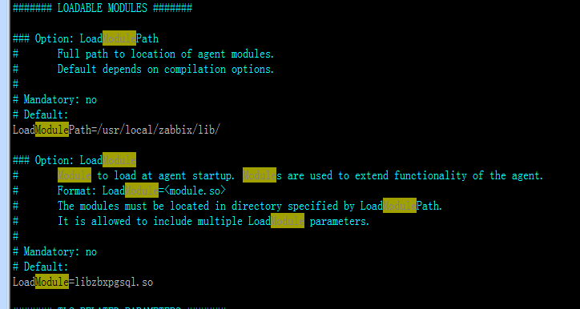
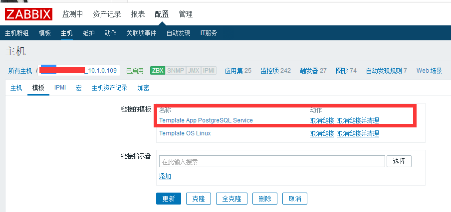
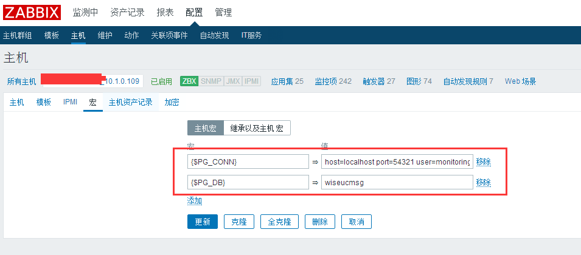
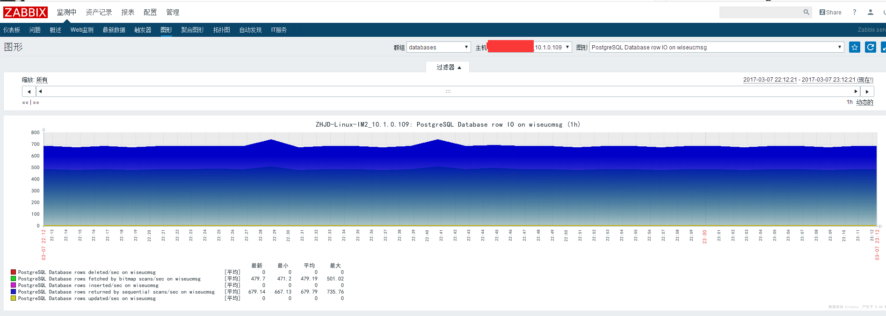

# Zabbix 监控 PostgreSQL

@(学习)\[PostgreSQL,zabbix\]

[TOC]

因上次用到了 PostgreSQL，而所使用的监控又是 Zabbix，所以找到了此插件用于 Zabbix 监控 PostgreSQL。

**插件网站**：[PostgreSQL monitoring for Zabbix](http://cavaliercoder.com/libzbxpgsql/) Github 地址：[https://github.com/cavaliercoder/libzbxpgsql](https://github.com/cavaliercoder/libzbxpgsql)

**环境**： CentOS6.8 Zabbix3.2.1 PostgreSQL9.5.6

## 1. 安装 libzbxpgsql

根据官方文档进行安装即可。 http://cavaliercoder.com/libzbxpgsql/documentation/module-installation/

```
rpm -ivh https://download.postgresql.org/pub/repos/yum/9.5/redhat/rhel-6-x86_64/pgdg-centos95-9.5-3.noarch.rpm
yum -y install postgresql95-libs  # 已经安装可忽略
yum -y install libconfig
wget http://cdn.cavaliercoder.com/libzbxpgsql/yum/zabbix32/rhel/6/x86_64/libzbxpgsql-1.1.0-1.el6.x86_64.rpm
```

```
[root@im109 packages]# find / -name libzbxpgsql.so
[root@im109 packages]# rpm -ivh --force libzbxpgsql-1.1.0-1.el6.x86_64.rpm
error: Failed dependencies:
        libconfig.so.8()(64bit) is needed by libzbxpgsql-1.1.0-1.x86_64
        zabbix-agent >= 3.0.0 is needed by libzbxpgsql-1.1.0-1.x86_64
[root@im109 packages]# rpm -ivh --force libzbxpgsql-1.1.0-1.el6.x86_64.rpm --nodeps
Preparing...                ########################################### [100%]
   1:libzbxpgsql            ########################################### [100%]
[root@im109 packages]# find / -name libzbxpgsql.so
/usr/lib64/zabbix/modules/libzbxpgsql.so
[root@im109 packages]# ln -s /usr/lib64/zabbix/modules/libzbxpgsql.so /usr/local/zabbix/lib/
```

## 2. 配置 zabbix 配置文件 zabbix_agentd.conf



```
[root@im109 log]# /usr/local/zabbix/sbin/zabbix_agentd -t pg.modver
zabbix_agentd [21910]: starting agent module libzbxpgsql 1.1.0
zabbix_agentd [21910]: using module configuration file: /etc/zabbix/libzbxpgsql.conf
pg.modver                                     [s|libzbxpgsql 1.1.0, compiled for Zabbix 3.2.3]
[root@im109 log]# /etc/init.d/zabbix-agentd restart
Shutting down Zabbix agent:                                [  OK  ]
Starting Zabbix agent:                                     [  OK  ]
```

## 3. 创建监控用户

创建一个用户，开放你所要监控的数据库只读权限给它，为了安全，把权限做到最小化。 我用的**pgpool-II**。

```
psql -h 10.1.0.115 -U postgres -p9999
Password for user postgres:
psql (9.5.6)
Type "help" for help.

postgres=# CREATE ROLE monitoring WITH LOGIN NOSUPERUSER NOCREATEDB NOCREATEROLE;
CREATE ROLE
postgres=# GRANT CONNECT ON DATABASE wiseucmsg TO monitoring;
GRANT
postgres=# alter user monitoring with password 'password';
ALTER ROLE
```

使用创建的用户能登录查看相应数据库，则可进行下一步。

```
[root@im109 pgpool-II]# psql -h localhost -U monitoring -p 54321 wiseucmsg
psql (9.5.6)
Type "help" for help.

wiseucmsg=> \l
                                  List of databases
   Name    |  Owner   | Encoding |   Collate   |    Ctype    |   Access privileges
-----------+----------+----------+-------------+-------------+-----------------------
 postgres  | postgres | UTF8     | en_US.UTF-8 | en_US.UTF-8 |
 template0 | postgres | UTF8     | en_US.UTF-8 | en_US.UTF-8 | =c/postgres          +
           |          |          |             |             | postgres=CTc/postgres
 template1 | postgres | UTF8     | en_US.UTF-8 | en_US.UTF-8 | =c/postgres          +
           |          |          |             |             | postgres=CTc/postgres
 wiseucmsg | postgres | UTF8     | en_US.UTF-8 | en_US.UTF-8 | =Tc/postgres         +
           |          |          |             |             | postgres=CTc/postgres+
           |          |          |             |             | monitoring=c/postgres
(4 rows)

wiseucmsg=>
```

## 4. 导入监控模板

模板在 Github 上有： https://github.com/cavaliercoder/libzbxpgsql/tree/master/templates

## 5. 主机链接模板，设置宏变量

 

> `{$PG_CONN} => host=localhost port=54321 user=monitoring connect_timeout=10` `{$PG_DB} => wiseucmsg`

有图形出现，则监控成功。 
