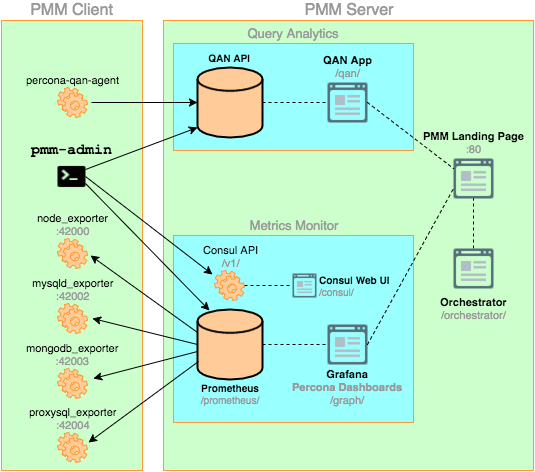
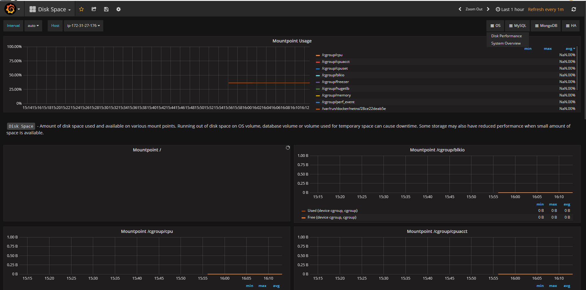
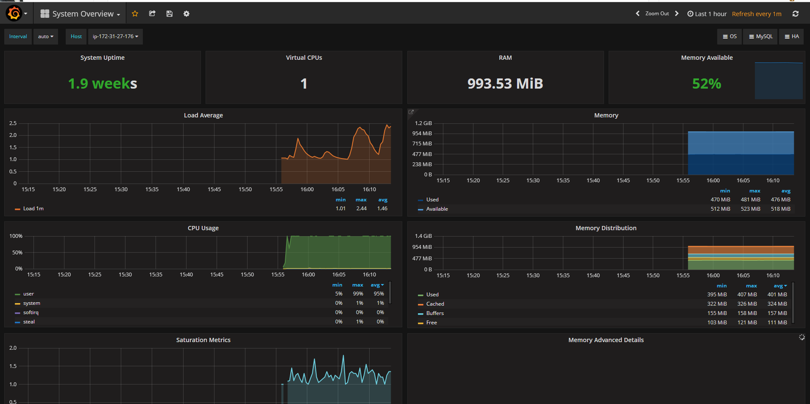
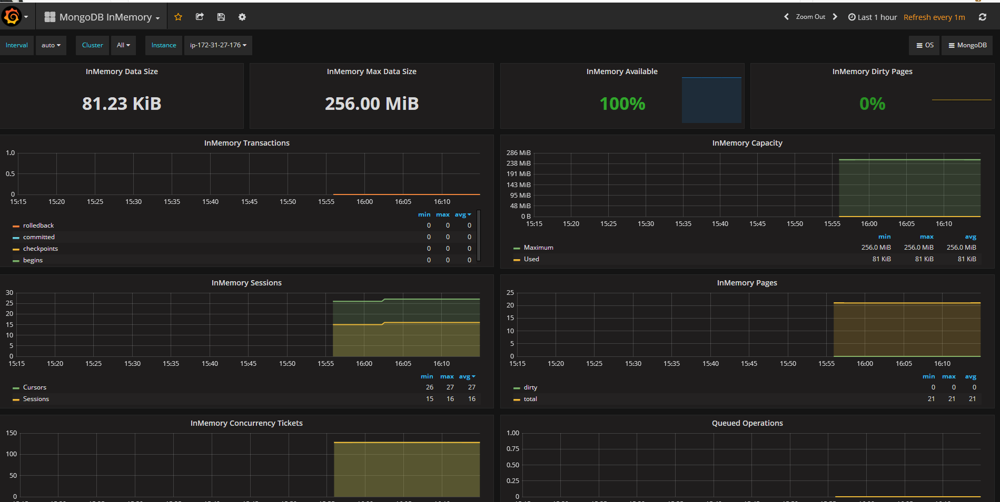
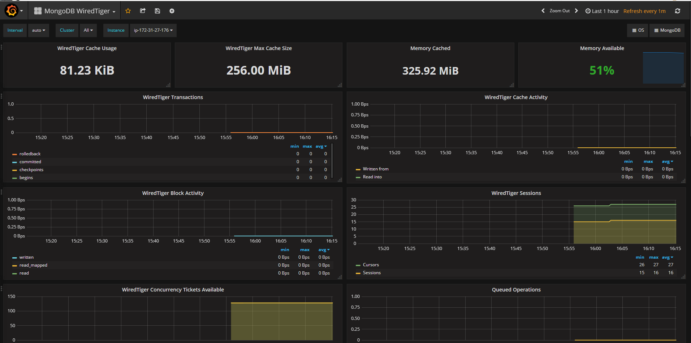

# Percona Monitoring and Management (PMM) 监控 MongoDB

[TOC]

环境： AWS ec2 CentOS7 一台

## 1. Percona 监控和管理概述

Percona 监控和管理（PMM）是一个用于管理和监控 MySQL 和 MongoDB 性能的开源平台。 它由 Percona 与托管数据库服务，支持和咨询领域的专家合作开发。 PMM 是一个免费的开源解决方案，您可以在自己的环境中运行，以实现最大的安全性和可靠性。 它为 mysql 和 mongodb 服务器提供全面的基于时间的分析，以确保您的数据尽可能高效地工作。

### 1.1 Percona 监控和管理架构

PMM 平台基于简单的客户端 - 服务器模型，可实现高效的可扩展性。它包括以下模块： PMM Client 安装在您要监视的每个数据库主机上。它收集服务器指标，一般系统指标和查询分析数据，以获得完整的性能概述。收集的数据发送到 PMM 服务器。 PMM Server 是 PMM 的核心部分，它聚合收集的数据，并以 Web 界面的表格，仪表板和图形的形式呈现。 PMM 是旨在无缝协同工作的工具集合。一些是由 Percona 开发的，一些是第三方开源工具。 下图说明了 PMM 当前的结构： 

### 1.2 PMM Client

PMM 客户端软件包适用于大多数流行的 Linux 发行版： - Red Hat Enterprise linux 衍生产品的 RPM（包括 CentOS，Oracle Linux，Amazon Linux 等） - DEB 用于基于 Debian 的发行版（包括 Ubuntu 等）

PMM 客户端软件包包含以下内容： pmm-admin 是用于管理 PMM 客户端的命令行工具，例如，添加和删除要监视的数据库实例。 percona-qan-agent 是一种在收集查询性能数据时管理查询分析（QAN）代理的服务。它还与 PMM 服务器中的 QAN API 连接，并发送收集的数据。 node_exporter 是收集一般系统指标的 Prometheus exporter。有关详细信息，请参阅[https://github.com/prometheus/node_exporter](https://github.com/prometheus/node_exporter)。 mysqld_exporter 是收集 MySQL 服务器指标的 Prometheus exporter。有关详细信息，请参阅[https://github.com/percona/mysqld_exporter](https://github.com/percona/mysqld_exporter)。 mongodb_exporter 是收集 MongoDB 服务器指标的 Prometheus exporter。有关详细信息，请参阅[https://github.com/percona/mongodb_exporter](https://github.com/percona/mongodb_exporter)。 proxysql_exporter 是收集 ProxySQL 性能指标的 Prometheus exporter。有关详细信息，请参阅[https://github.com/percona/proxysql_exporter](https://github.com/percona/proxysql_exporter)。

### 1.3 PMM Server

PMM 服务器将作为您的中央监控主机的机器运行。它通过以下方式作为设备分发： 可以用于运行容器的 Docker 映像 可以在 VirtualBox 或其他管理程序中运行 可以通过 Amazon Web Services（AWS）运行的 Amazon Machine Image（AMI） PMM 服务器由以下工具组成： 查询分析（QAN）使您能够在一段时间内分析 MySQL 查询性能。除客户端 QAN 代理外，还包括以下内容：

QAN API 是用于存储和访问在 PMM 客户端上运行的 percona-qan-agent 收集的查询数据的后端 QAN Web App 是用于可视化收集的 Query Analytics 数据的 Web 应用程序。 度量监视器（MM）提供对 MySQL 或 MongoDB 服务器实例至关重要的度量的历史视图。它包括以下内容：

Prometheus 是一个第三方时间序列数据库，连接到在 PMM 客户端上运行的出口商，并汇总了收集的指标. Consul 提供一个 PMM 客户端可以远程列出，添加和删除 Prometheus 主机的 API。 Grafana 是一个第三方仪表板和图形构建器，用于在直观的 Web 界面中可视化由 Prometheus 汇总的数据. Percona 仪表板是由 Percona 开发的 Grafana 仪表板 Orchestrator 是 MySQL 复制拓扑管理和可视化工具。 部署方案(https://www.percona.com/doc/percona-monitoring-and-management/architecture.html#id13)

参考： [1] [https://prometheus.io/docs/introduction/overview/](https://prometheus.io/docs/introduction/overview/) [2] [https://www.consul.io/docs/](https://www.consul.io/docs/) [3] [http://docs.grafana.org/](http://docs.grafana.org/) [4] [https://github.com/outbrain/orchestrator/wiki/Orchestrator-Manual](https://github.com/outbrain/orchestrator/wiki/Orchestrator-Manual)

## 2. 安装 MongoDB

### 2.1 配置 Percona yum 源

安装命令如下：

```
sudo yum install http://www.percona.com/downloads/percona-release/redhat/0.1-4/percona-release-0.1-4.noarch.rpm
```

请确保有安装成功结果：

```
Installed:
  percona-release.noarch 0:0.1-4

Complete!
```

```
sudo yum list | grep percona
```

显示部分的安装包：

```
percona-release.noarch                0.1-4                         installed
Percona-SQL-50-debuginfo.x86_64       5.0.92-b23.89.rhel6           percona-release-x86_64
Percona-SQL-client-50.x86_64          5.0.92-b23.89.rhel6           percona-release-x86_64
Percona-SQL-devel-50.x86_64           5.0.92-b23.89.rhel6           percona-release-x86_64
Percona-SQL-server-50.x86_64          5.0.92-b23.89.rhel6           percona-release-x86_64
Percona-SQL-shared-50.x86_64          5.0.92-b23.89.rhel6           percona-release-x86_64
Percona-SQL-shared-compat.x86_64      5.0.92-b23.89.rhel6           percona-release-x86_64
Percona-SQL-test-50.x86_64            5.0.92-b23.89.rhel6           percona-release-x86_64
Percona-Server-51-debuginfo.x86_64    5.1.73-rel14.12.624.rhel6     percona-release-x86_64
Percona-Server-55-debuginfo.x86_64    5.5.55-rel38.8.el6            percona-release-x86_64
Percona-Server-56-debuginfo.x86_64    5.6.36-rel82.0.el6            percona-release-x86_64
Percona-Server-57-debuginfo.x86_64    5.7.18-15.1.el6               percona-release-x86_64
Percona-Server-MongoDB.x86_64         3.0.15-1.10.el6               percona-release-x86_64
Percona-Server-MongoDB-32.x86_64      3.2.13-3.3.el6                percona-release-x86_64
                                      3.2.13-3.3.el6                percona-release-x86_64
                                      3.2.13-3.3.el6                percona-release-x86_64
                                      3.2.13-3.3.el6                percona-release-x86_64
                                      3.2.13-3.3.el6                percona-release-x86_64
                                      3.2.13-3.3.el6                percona-release-x86_64
Percona-Server-MongoDB-34.x86_64      3.4.5-1.5.el6                 percona-release-x86_64
```

这里我们安装 MongoDB3.4 版本

```
sudo yum install Percona-Server-MongoDB-34
```

**如果您已经启用 SELinux，则需要做配置相关，这里不做详细说明。我是禁用 SELinux 状态。**

MongoDB 默认配置文件`/etc/mongod.conf`，数据目录默认是`/var/lib/mongodb/` 。有需要，请自行修改配置文件。

查看 MongoDB 是否启动：

```
/etc/init.d/mongod status
```

## 3. 部署 Percona 监控和管理

以下过程介绍如何正确部署 PMM： 在主机上运行 PMM Server，用于访问收集的数据，查看基于时间的图表，并执行性能分析。

以下安装的选项可用： \* 使用 Docker 运行 PMM 服务器 \* 使用 VirtualBox 运行 PMM 服务器 \* 使用 Amazon Machine Image（AMI）运行 PMM 服务器

这里我们选择使用 Docker 运行 PMM 服务器。

使用 docker 运行 PMM Server PMM 服务器的 Docker 映像公开托管在https://hub.docker.com/r/percona/pmm-server/。 如果要从 docker 映像运行 PMM Server，则主机必须能够运行 Docker 1.12.6 或更高版本，并具有网络访问权限。 有关使用 Docker 的更多信息，请参阅[Docker 文档](https://docs.docker.com/)。

### 3.1 yum 安装 Docker

一般 CentOS 需要安装`epel`源，我这里是 aws ec2 linux，所以直接使用如下命令安装：

```
yum install docker
service docker start
chkconfig docker on
```

> 注意： 使用 pmm-server 映像时，请使用特定的版本标签，而不是最新的标签。目前的最新稳定版本是 1.2.0。

### 3.2 创建一个 PMM 数据容器

要创建持久 PMM 数据的容器，请运行以下命令：

```
docker create \
   -v /opt/prometheus/data \
   -v /opt/consul-data \
   -v /var/lib/mysql \
   -v /var/lib/grafana \
   --name pmm-data \
   percona/pmm-server:1.2.0 /bin/true
```

运行结果：

```
Unable to find image 'percona/pmm-server:1.2.0' locally
1.2.0: Pulling from percona/pmm-server
45a2e645736c: Pull complete
fe1f1770c826: Pull complete
4f1bdb417453: Pull complete
a2f3207fd166: Pull complete
2f8fffdaf5ef: Pull complete
46e8ca929fde: Pull complete
5c89a1a51b6b: Pull complete
fceac4be9a77: Pull complete
fb79d7de9adf: Pull complete
Digest: sha256:b9e200c9bc66bb2c31d75d57852474cf00a292d3ccb8301fdd55cc6e25738e3d
Status: Downloaded newer image for percona/pmm-server:1.2.0
a93b2e74a10afe3b47e127e7ef43072cff8e9b060c2a0e1cbdf7a0baae8dd712
```

> 注意： 这个容器不运行，它只是为了确保在升级到更新的 PMM - server 映像时保留所有 PMM 数据。不要删除或重新创建这个容器，除非您打算删除所有 PMM 数据并从头开始。

前面的命令解释： `docker create`命令表示 docker 守护进程从镜像中创建容器。 `- v`选项对`volumes`进行指定初始化 。 `--name`选项为容器指定一个自定义名称，用于在 Docker 网络中引用容器。例如名字：`pmm-server`。 `percona/pmm-server:1.2.0`是自源的镜像的名字和版本标识。 `/bin/true`容器进行运行的命令。

### 3.3 创建并运行 PMM 服务器容器

要运行 PMM 服务器，请使用以下命令：

```
docker run -d \
   -p 80:80 \
   --volumes-from pmm-data \
   --name pmm-server \
   --restart always \
   percona/pmm-server:1.2.0
```

```
e8e133c3af3669257debdbce89bd36080510b2b2be30b0595cf295eb891f7d42
```

前面的命令解释： `docker run`命令运行一个 docker 守护进程以运行容器。 `- d`选项以分离模式(即在后台)启动容器。 `- p`选项用于映射访问 PMM 服务器 web UI 的端口。如果端口 80 不可用，您可以使用`- p 8080:80`将登录页面映射到端口 8080。 `--volumes-from`表示挂载容器来自前面步骤指定的`pmm-data`。 `--name`选项为容器指定一个自定义名称，用于在 Docker 网络中引用容器。例如名字：`pmm-server`。 `--restart`选项定义容器的重新启动策略。设置它始终确保 Docker 守护进程在启动时启动容器，如果容器退出，则重新启动它。 `percona/pmm-server:1.2.0`是自源的镜像的名字和版本标识。

使用如下命令确认 PMM 安装运行是否正确：

```
netstat -tpln|grep 80
```

通过使用运行容器的主机的 IP 地址连接到 PMM Web 界面来验证 PMM 服务器是否正在运行，然后在要监视的所有数据库主机上安装 PMM Client Component URL PMM landing page http://172.31.27.176:80 Query Analytics (QAN web app) http://172.31.27.176/qan/ Metrics Monitor (Grafana) http://172.31.27.176/graph/User name: admin Password: admin Orchestrator http://172.31.27.176/orchestrator

### 3.4 安装 PMM 客户端

PMM 客户端是安装在您要监视的 MySQL 或 MongoDB 主机的客户端和数据提供采集方。 组件收集关于一般系统和数据库性能的各种数据，并将该数据发送到相应的 PMM 服务器组件。

> 注意： 不应该在具有相同主机名的数据库服务器上安装代理，因为 PMM 服务器使用主机名来标识收集的数据。

安装 PMM 客户端

安装 pmm-client 软件包

```
sudo yum install pmm-client -y
```

将 PMM 客户端连接到 PMM 服务器

使用`pmm-admin config --help`，查看帮助

`pmm-admin config --server 172.31.27.176:80`

```
OK, PMM server is alive.

PMM Server      | 172.31.27.176:80
Client Name     | ip-172-31-27-176
Client Address  | 172.17.0.1
```

### 3.5 pmm server 与 pmm client 通信

从以下操作也可以看出，pmm 并不支持代理，是 C/S 构架。

`pmm-admin check-network`检查结果：

```
PMM Network Status

Server Address | 172.31.27.176:80
  ient Address | 172.17.0.1

* System Time
NTP Server (0.pool.ntp.org)         | 2017-07-17 07:55:57 +0000 UTC
PMM Server                          | 2017-07-17 07:55:57 +0000 GMT
PMM Client                          | 2017-07-17 07:55:57 +0000 UTC
PMM Server Time Drift               | OK
PMM Client Time Drift               | OK
PMM Client to PMM Server Time Drift | OK

* Connection: Client --> Server
-------------------- -------
SERVER SERVICE       STATUS
-------------------- -------
Consul API           OK
Prometheus API       OK
Query Analytics API  OK

Connection duration | 75.404µs
Request duration    | 625.358µs
Full round trip     | 700.762µs


* Connection: Client <-- Server
---------------- ----------------- ----------------- ------- ---------- ---------
SERVICE TYPE     NAME              REMOTE ENDPOINT   STATUS  HTTPS/TLS  PASSWORD
---------------- ----------------- ----------------- ------- ---------- ---------
linux:metrics    ip-172-31-27-176  172.17.0.1:42000  DOWN    YES        -
mongodb:metrics  ip-172-31-27-176  172.17.0.1:42003  DOWN    YES        -

When an endpoint is down it may indicate that the corresponding service is stopped (run 'pmm-admin list' to verify).
If it's running, check out the logs /var/log/pmm-*.log

When all endpoints are down but 'pmm-admin list' shows they are up and no errors in the logs,
check the firewall settings whether this system allows incoming connections from server to address:port in question.

Also you can check the endpoint status by the URL: http://172.31.27.176:80/prometheus/targets
```

防火墙开启与 docker 容器通信：

```
iptables -A INPUT -s 172.0.0.1/8 -j ACCEPT
service iptables save
```

`pmm-admin check-network`再次查看结果，则通信正常。

```
PMM Network Status

Server Address | 172.31.27.176:80
Client Address | 172.17.0.1

* System Time
NTP Server (0.pool.ntp.org)         | 2017-07-17 07:56:40 +0000 UTC
PMM Server                          | 2017-07-17 07:56:40 +0000 GMT
PMM Client                          | 2017-07-17 07:56:40 +0000 UTC
PMM Server Time Drift               | OK
PMM Client Time Drift               | OK
PMM Client to PMM Server Time Drift | OK

* Connection: Client --> Server
-------------------- -------
SERVER SERVICE       STATUS
-------------------- -------
Consul API           OK
Prometheus API       OK
Query Analytics API  OK

Connection duration | 67.174µs
Request duration    | 595.339µs
Full round trip     | 662.513µs


* Connection: Client <-- Server
---------------- ----------------- ----------------- ------- ---------- ---------
SERVICE TYPE     NAME              REMOTE ENDPOINT   STATUS  HTTPS/TLS  PASSWORD
---------------- ----------------- ----------------- ------- ---------- ---------
linux:metrics    ip-172-31-27-176  172.17.0.1:42000  OK      YES        -
mongodb:metrics  ip-172-31-27-176  172.17.0.1:42003  OK      YES        -
```

### 3.6 pmm client 添加监控项

```
pmm-admin add linux:metrics  # 监控linux系统
pmm-admin add mongodb:metrics  # 监控mongodb
pmm-admin add mongodb:queries --dev-enable  # 此处为实验功能，所以需要加 --dev-enable
pmm-admin purge linux:metrics  # 清除数据
pmm-admin purge mongodb:metrics
```

管理 PMM 客户端的一些命令说明：

```
# 添加监控服务
pmm-admin add
# 检查PMM客户端和PMM服务器之间的网络连接。
pmm-admin check-network
# 配置PMM Client如何与PMM服务器通信。
pmm-admin config
# 打印任何命令和退出的帮助
pmm-admin help
# 打印有关PMM客户端的信息
pmm-admin info
# 列出此PMM客户端添加的所有监控服务
pmm-admin list
# 检查PMM服务器是否存活
pmm-admin ping
# 在PMM服务器上清除度量数据。
pmm-admin purge
# 清除监控服务
pmm-admin remove
# 修复安装
pmm-admin repair
# 重启pmm客户端
pmm-admin restart
# 打印PMM Client使用的密码
pmm-admin show-passwords
# 开启监控服务
pmm-admin start
# 停止监控服务
pmm-admin stop
# 在卸载之前清理PMM Client
pmm-admin uninstall
```

### 3.7 一些效果图









参考： [1] [https://www.percona.com/doc/percona-monitoring-and-management/index.html](https://www.percona.com/doc/percona-monitoring-and-management/index.html) [2] [https://www.percona.com/doc/percona-repo-config/index.html](https://www.percona.com/doc/percona-repo-config/index.html) [3] [https://www.percona.com/doc/percona-monitoring-and-management/architecture.html](https://www.percona.com/doc/percona-monitoring-and-management/architecture.html) [4] [https://www.percona.com/doc/percona-monitoring-and-management/deploy/server/docker.html#run-server-docker](https://www.percona.com/doc/percona-monitoring-and-management/deploy/server/docker.html#run-server-docker) [5] [https://www.percona.com/doc/percona-monitoring-and-management/pmm-admin.html](https://www.percona.com/doc/percona-monitoring-and-management/pmm-admin.html)
