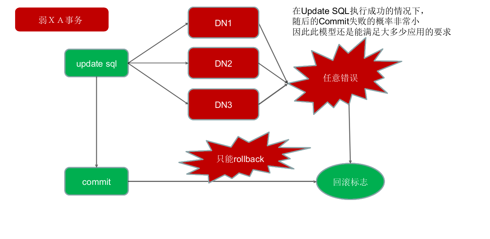

# Mycat 学习实战-Mycat 初识

[TOC]

## 1. Mycat 是什么

Mycat 是一个彻底开源的面向企业应用开发的大数据库集群，支持事务、ACID，是可以替代 MySQL 的加强版数据库。Mycat 被视为 MySQL 集群的企业级数据库，用来替代昂贵的 Oracle 集群，它是融合了内存缓存技术、NoSQL 技术、HDFS 大数据的新型 SQL Server，是结合了传统数据库和新型分布式数据仓库的新一代的企业级数据库产品，也是一个优秀的数据库中间件。

## 2. Mycat 与其他中间件的区别

目前的数据库中间件有很多。

### 2.1 Mango

Mango 的中文名是“芒果”，它是一个轻量级的极速数据层访问框架，目前已有十多个大型线上项目在使用它。据称，某一支付系统利用 Mango 承载了每秒 12 万的支付下单请求，其超高的性能及超快的响应速度几乎相当于直接使用 JDBC。它采用接口与注解的形式定义 DAO，完美地结合了 db 与 cache 操作；支持动态 SQL，可以构造任意复杂的 SQL 语句；支持多数据源、分表、分库、事务；内嵌“函数式调用”功能，能将任意复杂的对象映射到数据库的表中。但是从整体上看 Mango 是一个 Java Dao Framework，是一个 jar 包，它的运行依赖于应用系统的项目代码和服务器，采用了 JDBC Shard 思想，与 TDDL 是同款产品。

### 2.2 Cobar

Cobar 是阿里巴巴研发的关系型数据的分布式处理系统（Amoeba 的升级版，该产品成功替代了原先基于 Oracle 的数据存储方案，目前已经接管了 3000 多个 MySQL 数据库的 scheme，平均每天处理近 50 亿次的 SQL 执行请求。

### 2.3 Heisenberg

Heisenberg 源于 Cobar，结合了 Cobar 和 TDDL 的优势，让其分片策略变为分库分表策略，节约了大量的连接。优点是分库分表与应用脱离，分库分表如同使用单库表一样，减少了 db 连接数的压力，采用热重启配置，可水平扩容，并遵循 MySQL 原生协议，采用读写分离，无语言限制。MySQL Client、C、Java 等都可以使用 Heisenberg 服务器通过管理命令查看和调整连接数、线程池、节点等。Heisenberg 采用 velocity 的分库分表脚本进行自定义分库分表，相当灵活。

### 2.4 Atlas

Atlas 是由奇虎 360 的 Web 平台部基础架构团队开发维护的一个基于 MySQL 协议的数据库中间层项目。它在 MySQL-proxy 0.8.2 版本的基础上进行了优化，增加了一些新的功能和特性。奇虎 360 内部使用 Atlas 运行的 MySQL 业务，每天承载的读写请求数达几十亿条。Atlas 位于应用程序与 MySQL 之间，实现了 MySQL 的客户端与服务端协议，作为服务端与应用程序通信，同时作为客户端与 MySQL 通信。它对应用程序屏蔽了 db 的细节，同时为了降低 MySQL 的负担，维护了连接池。

### 2.5 Ameoba

Ameoba 是一个以 MySQL 为底层数据存储，并对应用提供 MySQL 协议接口的 Proxy。它集中响应应用的请求，依据用户事先设置的规则，将 SQL 请求发送到特定的数据库上执行，基于此可以实现负载均衡、读写分离、高可用性等需求。与 MySQL 官方的 MySQL Proxy 相比，Ameoba 的作者强调的是 Amoeba 配置的便捷性（基于 XML 的配置文件，用 SQLJEP 语法书写规则，比基于 Lua 脚本的 MySQL Proxy 简单）。

Mycat 与以上中间件的对比如下表所示。

| 对比项目     | Mycat                              | Mango  | Coba                     | Heisenberg             | Atlas                    | Amoeba         |
| ------------ | ---------------------------------- | ------ | ------------------------ | ---------------------- | ------------------------ | -------------- |
| 数据切片     | 支持                               | 支持   | 支持                     | 支持                   | 支持                     | 支持           |
| 读写分离     | 支持                               | 支持   | 支持                     | 支持                   | 支持                     | 支持           |
| 宕机自动切换 | 支持                               | 不支持 | 支持                     | 不支持                 | 半支持，影响写           | 不支持         |
| MySQL 协议   | 前后端支持                         | JDBC   | 前端支持                 | 前后端支持             | 前后端支持               | JDBC           |
| 支持的数据库 | MySQL、Oracle、MongoDB、PostgreSQL | MySQL  | MySQL                    | MySQL                  | MySQL                    | MySQL、MongoDB |
| 社区活跃度   | 高                                 | 活跃   | 停滞                     | 低                     | 中等                     | 停滞           |
| 文档资料     | 极丰富                             | 较齐全 | 较齐全                   | 缺少                   | 中等                     | 缺少           |
| 是否开源     | 开源                               | 开源   | 开源                     | 开源                   | 开源                     | 开源           |
| 是否支持事务 | 弱 XA                              | 支持   | 单库强一致、分布式弱事务 | 单库强一致、多库弱事务 | 单库强一致、分布式弱事务 | 不支持         |

## 3. Mycat 能解决的问题

## 4. Mycat 核心概念

### 4.1 逻辑库（schema）

业务开发人员通常在实际应用中并不需要知道中间件的存在，只需要关注数据库，所以数据库中间件可以被当作一个或多个数据库集群构成的逻辑库。 在云计算时代，数据库中间件可以以多租户的形式为一个或多个应用提供服务，每个应用访问的可能是一个独立或者共享的物理库。

### 4.2 逻辑表（table）

#### 4.2.1 分片表

分片表是将指数据量很大的表切分到多个数据库实例中，所有分片组合起来构成了一张完整的表。

#### 4.2.2 非分片表

并非所有的表在数据量很大时都需要进行分片，某些表可以不用分片。非分片表是相对于分片表而言的不需要进行数据切片的表。

#### 4.2.3 ER 表

关系型数据库是基于实体关系模型（Entity Relationship Model）的，Mycat 中的 ER 表便来源于此。基于此思想，Mycat 提出了基于 E-R 关系的数据分片策略，子表的记录与其所关系的父表的记录存放在同一个数据分片上，即子表依赖于父表，通过表分组（Table Group）保证数据关联查询不会跨库操作。 表分组（Table Group）是解决跨分片数据关联查询的一种很好的思路，也是数据切分的一条重要规则。

#### 4.2.4 全局表

在一个真实的业务场景中往往存在大量类似的字典表，这些字典表中的数据变动不频繁，而且数据规模不大，很少有超过数十万条的记录。 当业务表因为规模进行分片后，业务表这些附属的字典表之间的关联查询就成了比较棘手的问题，所以在 Mycat 中通过数据冗余来解决这类表的关联查询，即所有分片都复制了一份数据，我们把这些冗余数据的表定义为全局表。 数据冗余是解决跨分片数据关联查询的一种很好的思路，也是数据切分规划的另一条重要规则。

### 4.3 分片节点（dataNode）

将数据切分后，一个多大个被分到不同的分片数据 库上，每个表分片所在的数据库就是分片节点。

### 4.4 节点主机（dataHost）

将数据切分后，每个分片节点不一定会独占一台机器，同一台机器上可以有多个分片数据库，这样一个或多个分片节点所在的机器就是节点主机。为了规避单节点主机并发数量的限制，尽量将读写压力高的分片节点均匀地放在不同的节点主机上。 

## 5. Mycat 文件夹以及文件介绍

参考资料： [1] [http://mycat.io/](http://mycat.io/) [2] 《分布式数据库架构及企业实践——基于 Mycat 中间件》 [3] 龙哥官方课程课件
