# Mycat 学习实战-Mycat 的 zookeeper 集群模式

[TOC]

## 1\. ZooKeeper 简介

ZooKeeper 是一个面向分布式系统的构建块。当设计一个分布式系统时，一般需要设计和开发一些协调服务：
**名称服务**— 名称服务是将一个名称映射到与该名称有关联的一些信息的服务。电话目录是将人的名字映射到其电话号码的一个名称服务。同样，DNS 服务也是一个名称服务，它将一个域名映射到一个 IP 地址。在分布式系统中，您可能想跟踪哪些服务器或服务在运行，并通过名称查看其状态。ZooKeeper 暴露了一个简单的接口来完成此工作。也可以将名称服务扩展到组成员服务，这样就可以获得与正在查找其名称的实体有关联的组的信息。
**锁定**— 为了允许在分布式系统中对共享资源进行有序的访问，可能需要实现分布式互斥（distributed mutexes）。ZooKeeper 提供一种简单的方式来实现它们。
**同步**— 与互斥同时出现的是同步访问共享资源的需求。无论是实现一个生产者-消费者队列，还是实现一个障碍，ZooKeeper 都提供一个简单的接口来实现该操作。
**配置管理**— 您可以使用 ZooKeeper 集中存储和管理分布式系统的配置。这意味着，所有新加入的节点都将在加入系统后就可以立即使用来自 ZooKeeper 的最新集中式配置。这还允许您通过其中一个 ZooKeeper 客户端更改集中式配置，集中地更改分布式系统的状态。
**领导者选举**— 分布式系统可能必须处理节点停机的问题，您可能想实现一个自动故障转移策略。ZooKeeper 通过领导者选举对此提供现成的支持。

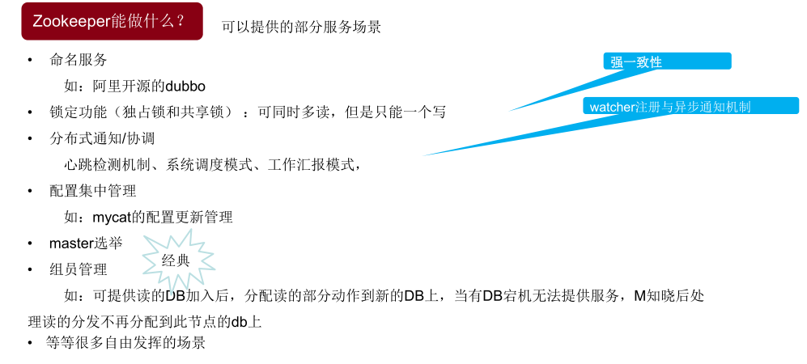

## 2\. ZooKeeper 角色和端口

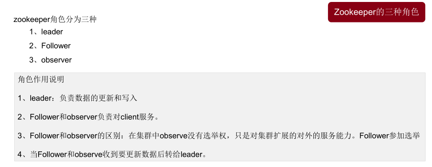 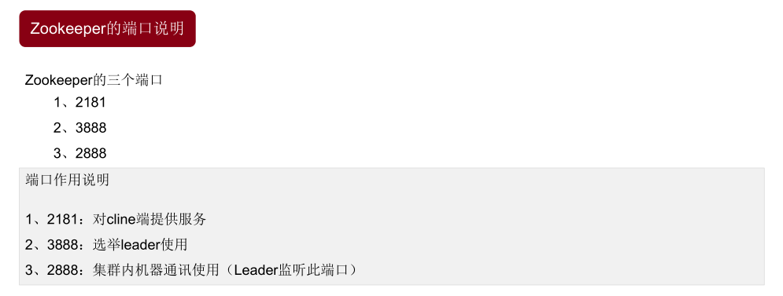

## 3\. ZooKeeper 部署简介

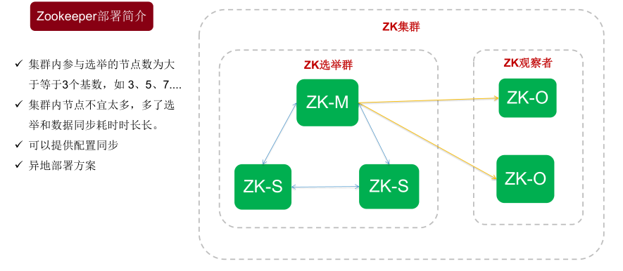

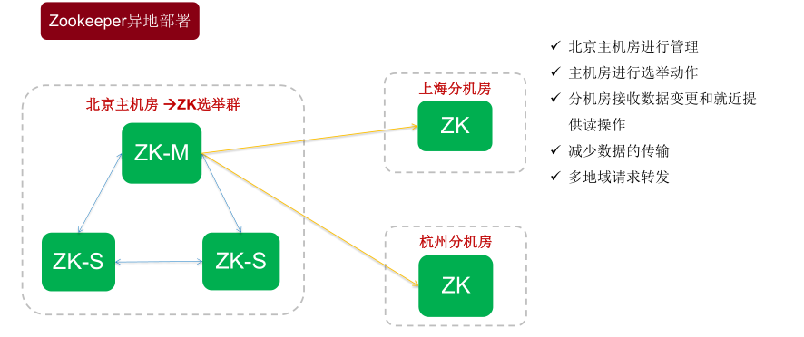

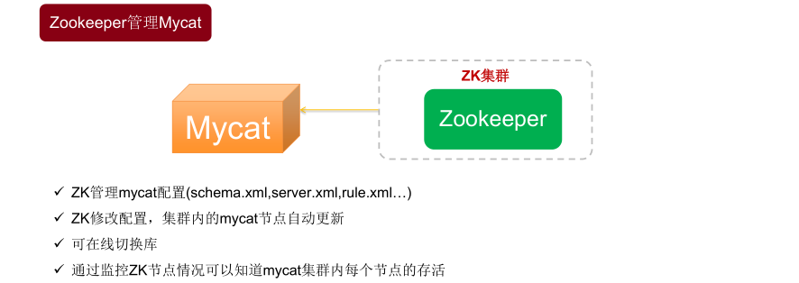

## 4\. ZooKeeper 部署管理 Mycat

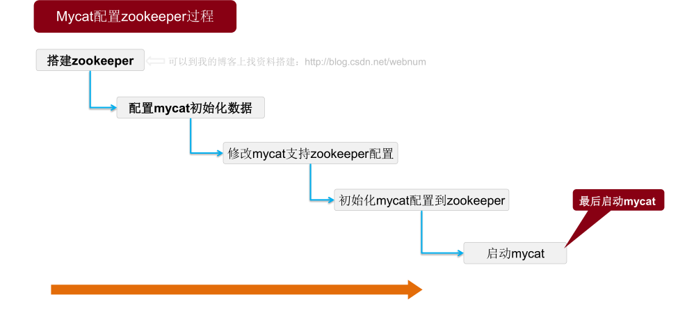

### 4.1 环境

系统：CentOS7.3 jdk 版本：1.7 zookeeper 版本：3.4.10 mycat 版本：1.6

| hostname | IP            | myid |
| -------- | ------------- | ---- |
| testA    | 192.168.33.11 | 1    |
| testB    | 192.168.33.12 | 2    |
| testC    | 192.168.33.13 | 3    |

### 4.2 环境准备

为了测试方便，这里关闭系统防火墙和禁用 selinux，生产环境防火墙则需要开放 zookeeper 相关端口，2181、2888、3888。

```
# 关闭防火墙
systemctl stop firewalld.service
systemctl disable firewalld.service

# 关闭SELINUX
sed -i 's/SELINUX=enforcing/SELINUX=disabled/g' /etc/sysconfig/selinux
setenforce 0
```

### 4.3 安装 zookeeper

先在`testA`节点安装，再同步到其它 2 个节点。

#### 4.3.1 下载解压

```
mkdir -p /data/packages/
cd /data/packages/
wget http://mirror.bit.edu.cn/apache/zookeeper/zookeeper-3.4.10/zookeeper-3.4.10.tar.gz
cd /usr/local/
tar -zxvf /data/packages/zookeeper-3.4.10.tar.gz
ln -s zookeeper-3.4.10 zookeeper
cd zookeeper
mkdir data log
cd conf/
cp zoo_sample.cfg zoo.cfg
```

#### 4.3.2 修改配置文件

`vim zoo.cfg`

```
# The number of milliseconds of each tick
tickTime=2000
# The number of ticks that the initial
# synchronization phase can take
initLimit=10
# The number of ticks that can pass between
# sending a request and getting an acknowledgement
syncLimit=5
# the directory where the snapshot is stored.
# do not use /tmp for storage, /tmp here is just
# example sakes.
dataDir=/usr/local/zookeeper/data
dataLogDir=/usr/local/zookeeper/log
# the port at which the clients will connect
clientPort=2181
server.1=192.168.33.11:2888:3888
server.2=192.168.33.12:2888:3888
server.3=192.168.33.13:2888:3888
# the maximum number of client connections.
# increase this if you need to handle more clients
#maxClientCnxns=60
#
# Be sure to read the maintenance section of the
# administrator guide before turning on autopurge.
#
# http://zookeeper.apache.org/doc/current/zookeeperAdmin.html#sc_maintenance
#
# The number of snapshots to retain in dataDir
#autopurge.snapRetainCount=3
# Purge task interval in hours
# Set to "0" to disable auto purge feature
#autopurge.purgeInterval=1
```

#### 4.3.3 添加 myid 文件

`vim /usr/local/zookeeper/data/myid`写入 1

#### 4.3.4 同步 zookeeper 目录到其它 2 个节点，修改 myid

```
rsync -avzP /usr/local/zookeeper/ root@192.168.33.12:/usr/local/zookeeper/
rsync -avzP /usr/local/zookeeper/ root@192.168.33.13:/usr/local/zookeeper/
```

并在 2 个节点分别修改对应的 myid

#### 4.3.5 启动 zookeeper

```
cd /usr/local/zookeeper/bin/
./zkServer.sh start
```

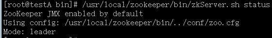

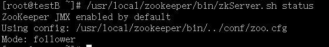

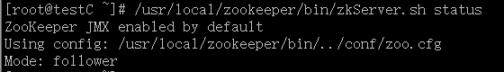

### 4.4 安装 Mycat

同样，3 个节点都需要安装 mycat。

```
cd /data/packages/
wget http://dl.mycat.io/1.6-RELEASE/Mycat-server-1.6-RELEASE-20161028204710-linux.tar.gz
cd /usr/local/
tar -zxvf /data/packages/Mycat-server-1.6-RELEASE-20161028204710-linux.tar.gz
```

### 4.6 执行 mycat 初始化数据

3 个节点 Mycat 都执行如下脚本

```
sh /usr/local/mycat/bin/init_zk_data.sh
```

### 4.7 配置 mycat 支持 zookeeper

`vim /usr/local/mycat/conf/myid.properties`

```
loadZk=true
# zk集群地址，多个用","隔开
zkURL=127.0.0.1:2181
# zk集群内Mycat集群ID
clusterId=mycat-cluster-1
# Mycat集群内本实例ID，禁止重复
myid=mycat_fz_01
# Mycat集群内节点个数
clusterSize=3
clusterNodes=mycat_fz_01,mycat_fz_02,mycat_fz_03
#server  booster  ;   booster install on db same server,will reset all minCon to 1
type=server
boosterDataHosts=dataHost1
```

### 4.8 用 zookeeper 配置 mycat

使用 ZooInspector 工具管理 ZooKeeper，以下是连接 zookeeper 方法。

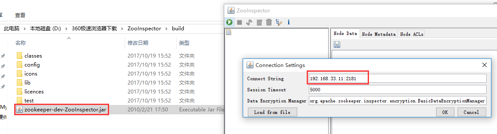

连接成功后，可看到 mycat 集群的配置 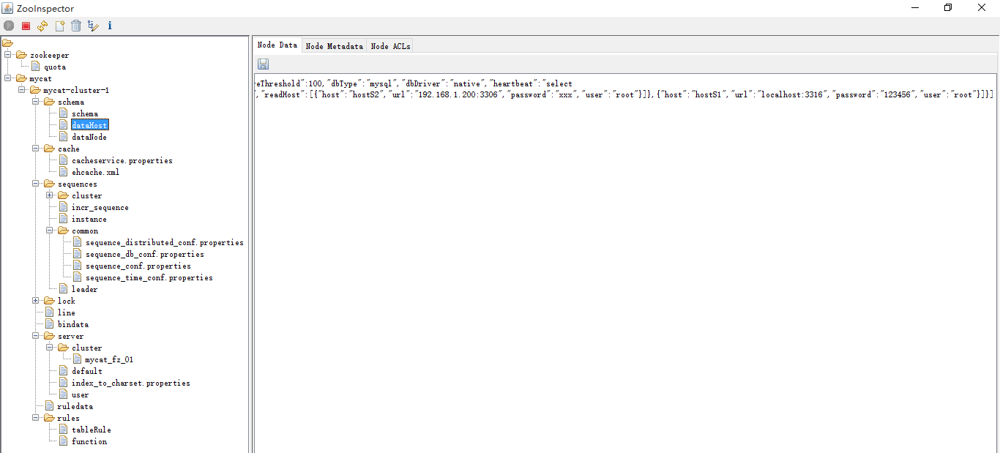

修改相应配置 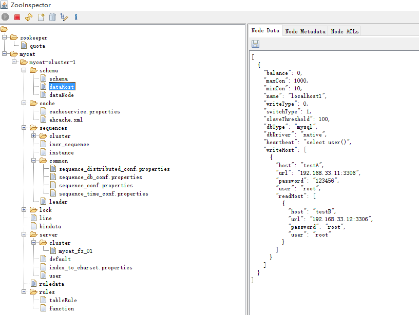

启动 mycat 后，mycat 配置文件会自动更新。 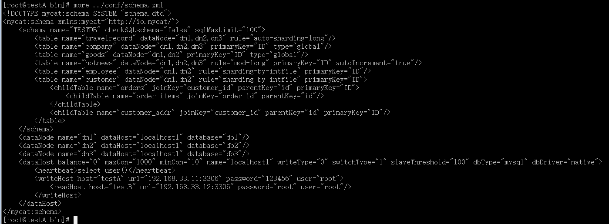

> 注意事项： \* loadZk 必须改为 true 才生效 \* zkURL 的地址是多个中间用“,”隔开 \* clusterId，同一个 zk 内的集群 ID 必须唯一 \* Myid：本实例的 id 在当前的 mycat 集群内 ID 唯一 \* 配置完 zk 并启动 mycat 后，会更新本地 conf 下的相关配置文件。

参考资料： \[1\] http://mycat.io/ \[2\] 《分布式数据库架构及企业实践——基于 Mycat 中间件》 \[3\] 龙哥官方课程课件 \[4\] [http://zookeeper.apache.org/](http://zookeeper.apache.org/) \[5\] [https://www.ibm.com/developerworks/cn/data/library/bd-zookeeper/](https://www.ibm.com/developerworks/cn/data/library/bd-zookeeper/)
