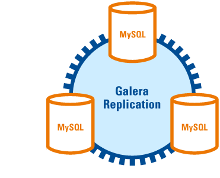
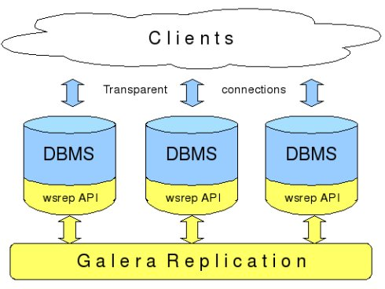

# Mycat 学习实战-Mycat 读写分离

[TOC]

读写分离，简单地说是把对数据库的读和写操作分开，以对应不同的数据库服务器。主数据库提供写操作，从数据库提供读操作，这样能有效地减轻单台数据库的压力。主数据库进行写操作后，数据及时同步到所读的数据库，尽可能保证读、写数据库的数据一致，比如 MySQL 的主从复制、Oracle 的 data guard、SQL Server 的复制订阅等。

## 1. Mycat 高可用参数

有关 Mycat 高可用的`schema.xml`配置参数相关说明：

`balance`属性 负载均衡类型，目前的取值有如下 4 种。

- `balance="0"` : 不开启读写分离机制，所有读操作都发送到当前可用的 writeHost 上。
- `balance="1"` : 全部的 readHost 与 stand by writeHost 都参与 select 语句的负载均衡，简而言之，当为双主双从模式（M1->S1，M2->S2，并且 M1 与 M2 互为主备）时，在正常情况下，M2、S1 和 S2 都参与 select 语句的负载均衡。
- `balance="2"` : 所有的读操作都随机地在 writeHost、readHost 上分发。
- `balance="3"` : 所有的读请求都随机分发到 writeHost 对应的 readHost 上执行，writeHost 不负担读压力。

`writeType`属性 负载均衡类型目前的取值有两种。

- `writeType="0"` : 所有的写操作都发送到配置的第 1 个 writeHost 上，writeHost 挂了则切到 writeHost2 上，重新恢复 writeHost1 节点后，不会再切回来，还是以 writeHost2 为准，切换记录在配置文件 dnindex.properties 中。
- `writeType="0"` : 所有的写操作都随机地发送到配置的 writeHost 上，Mycat1.5 版本以后不再推荐使用该值。

`switchType`属性 \* `switchType="-1"` : 表示不自动切换。 \* `switchType="1"` : 为默认值（或为 0），表示自动切换。 \* `switchType="2"` : 表示基于 MySQL 主从同步的状态决定是否切换，心跳语句如下：

```
show slave status
```

- `switchType="3"` : 表示基于 MySQL Galary Cluster 的切换机制，心跳语句如下：

```
show status like 'wsrep%'
```

## 2. MySQL 读写分离 master-slave

对于 MySQL，主流的读写分离是 master-slave 和 galera cluster，下面分别介绍如何通过 Mycat 来实现这两种读写分离。

### 2.1 MySQL 主从读写分离环境

| 项目 | Mycat         | MySQL-master  | MySQL-slaveA  | MySQL-slaveB  |
| ---- | ------------- | ------------- | ------------- | ------------- |
| IP   | 192.168.33.11 | 192.168.33.11 | 192.168.33.12 | 192.168.33.13 |
| Port | 8066/9066     | 3306          | 3306          | 3306          |

MySQL 为一主两从，192.168.33.11 同时为 192.168.33.12 和 192.168.33.13 的主。

```
[root@testA ~]# mysql -uroot -p123456
mysql: [Warning] Using a password on the command line interface can be insecure.
Welcome to the MySQL monitor.  Commands end with ; or \g.
Your MySQL connection id is 117
Server version: 5.7.19-log Source distribution

Copyright (c) 2000, 2017, Oracle and/or its affiliates. All rights reserved.

Oracle is a registered trademark of Oracle Corporation and/or its
affiliates. Other names may be trademarks of their respective
owners.

Type 'help;' or '\h' for help. Type '\c' to clear the current input statement.

mysql> grant replication slave on *.* to 'repl'@'192.168.33.12' identified by '123456';
Query OK, 0 rows affected, 1 warning (0.00 sec)

mysql> grant replication slave on *.* to 'repl'@'192.168.33.13' identified by '123456';
Query OK, 0 rows affected, 1 warning (0.02 sec)

mysql>
```

```
[root@testB ~]# mysql -uroot -p123456
mysql: [Warning] Using a password on the command line interface can be insecure.
Welcome to the MySQL monitor.  Commands end with ; or \g.
Your MySQL connection id is 61
Server version: 5.7.19-log Source distribution

Copyright (c) 2000, 2017, Oracle and/or its affiliates. All rights reserved.

Oracle is a registered trademark of Oracle Corporation and/or its
affiliates. Other names may be trademarks of their respective
owners.

Type 'help;' or '\h' for help. Type '\c' to clear the current input statement.

mysql> change master to master_host='192.168.33.11',master_port=3306,master_user='repl',master_password='123456',MASTER_AUTO_POSITION=1;
Query OK, 0 rows affected, 2 warnings (2.61 sec)

mysql> start slave;
Query OK, 0 rows affected (0.23 sec)
```

```
[root@testC ~]# mysql -uroot -p123456
mysql: [Warning] Using a password on the command line interface can be insecure.
Welcome to the MySQL monitor.  Commands end with ; or \g.
Your MySQL connection id is 48
Server version: 5.7.19-log Source distribution

Copyright (c) 2000, 2017, Oracle and/or its affiliates. All rights reserved.

Oracle is a registered trademark of Oracle Corporation and/or its
affiliates. Other names may be trademarks of their respective
owners.

Type 'help;' or '\h' for help. Type '\c' to clear the current input statement.

mysql> change master to master_host='192.168.33.11',master_port=3306,master_user='repl',master_password='123456',MASTER_AUTO_POSITION=1;
Query OK, 0 rows affected, 2 warnings (2.66 sec)

mysql> start slave;
Query OK, 0 rows affected (0.23 sec)
```

查看主从，都正常。

### 2.2 验证测试

`vim conf/schema.xml`

```
<!DOCTYPE mycat:schema SYSTEM "schema.dtd">
<mycat:schema xmlns:mycat="http://io.mycat/">
    <schema name="test01" checkSQLschema="false" sqlMaxLimit="100" dataNode="dn1">
    </schema>
    <dataNode name="dn1" dataHost="dh1" database="test01"/>
    <dataHost balance="0" maxCon="1000" minCon="10" name="dh1" writeType="0" switchType="2" slaveThreshold="100" dbType="mysql" dbDriver="native">
        <heartbeat>show slave status</heartbeat>
        <writeHost host="hostM1" url="192.168.33.11:3306" password="123456" user="root"/>
        <writeHost host="hostS2" url="192.168.33.12:3306" password="123456" user="root"/>
        <writeHost host="hostS3" url="192.168.33.13:3306" password="123456" user="root"/>
    </dataHost>
</mycat:schema>
```

测试 SQL：

```
CREATE TABLE t1  (`time`  datetime NOT NULL ,`db_nm`  varchar(20) NULL);
INSERT INTO t1 (time,db_nm) VALUES (now(), database());
INSERT INTO t1 (time,db_nm) VALUES (now(), database());
INSERT INTO t1 (time,db_nm) VALUES (now(), database());
```

```
[root@testA mycat]# mysql -uroot -p123456 -h127.0.0.1 -P8066 test01
mysql: [Warning] Using a password on the command line interface can be insecure.
Welcome to the MySQL monitor.  Commands end with ; or \g.
Your MySQL connection id is 3
Server version: 5.6.29-mycat-1.6-RELEASE-20161028204710 MyCat Server (OpenCloundDB)

Copyright (c) 2000, 2017, Oracle and/or its affiliates. All rights reserved.

Oracle is a registered trademark of Oracle Corporation and/or its
affiliates. Other names may be trademarks of their respective
owners.

Type 'help;' or '\h' for help. Type '\c' to clear the current input statement.

mysql> CREATE TABLE t1  (`time`  datetime NOT NULL ,`db_nm`  varchar(20) NULL);
INSERT INTO t1 (time,db_nm) VALUES (now(), database());
INSERT INTO t1 (time,db_nm) VALUES (now(), database());
INSERT INTO t1 (time,db_nm) VALUES (now(), database()); Query OK, 0 rows affected (0.04 sec)

mysql> INSERT INTO t1 (time,db_nm) VALUES (now(), database());
Query OK, 1 row affected (0.00 sec)

mysql> INSERT INTO t1 (time,db_nm) VALUES (now(), database());
Query OK, 1 row affected (0.01 sec)

mysql> INSERT INTO t1 (time,db_nm) VALUES (now(), database());
Query OK, 1 row affected (0.00 sec)

mysql> select * from t1;
+---------------------+--------+
| time                | db_nm  |
+---------------------+--------+
| 2017-11-01 17:38:03 | test01 |
| 2017-11-01 17:38:03 | test01 |
| 2017-11-01 17:38:03 | test01 |
+---------------------+--------+
3 rows in set (0.01 sec)
```

开启 DEBUG 日志， `vim conf/log4j2.conf`

```
...
<Configuration status="DEBUG">
...
        <asyncRoot level="DEBUG" includeLocation="true">
...
```

可以从 DEBUG 日志中看到，读操作发送到当前的 writeHost 上。 `tail -f logs/wrapper.log`

```
INFO   | jvm 1    | 2017/11/01 18:39:21 | 2017-11-01 18:39:21,738 [DEBUG][$_NIOREACTOR-1-RW] select read source hostM1 for dataHost:dh1  (io.mycat.backend.datasource.PhysicalDBPool:PhysicalDBPool.java:456)
```

其它的 balance 参数就不一一演示了。

### 2.3 读写分离 2 种配置的区别

配置方式一

```
<writeHost host="hostM1" url="192.168.33.11:3306" password="123456" user="root"/>
<writeHost host="hostS2" url="192.168.33.12:3306" password="123456" user="root"/>
<writeHost host="hostS3" url="192.168.33.13:3306" password="123456" user="root"/>
```

配置方式二

```
<writeHost host="hostM1" url="192.168.33.11:3306" password="123456" user="root">
    <readHost host="hostS2" url="192.168.33.12:3306" password="123456" user="root"/>
    <readHost host="hostS3" url="192.168.33.13:3306" password="123456" user="root"/>
</writeHost>
```

在 hostM1、hostS1、hostS2 均正常工作时，写均在 hostM1 上。读会有如下区别：

| balance | 方式一                          | 方式二                          |
| ------- | ------------------------------- | ------------------------------- |
| 0       | 读-->hostM1                     | 读-->hostM1                     |
| 1       | 读-->hostS2 or hostS3           | 读-->hostS2 or hostS3           |
| 2       | 读-->hostM1 or hostS2 or hostS3 | 读-->hostM1 or hostS2 or hostS3 |
| 3       | 读-->hostM1                     | 读-->hostS2 or hostS3           |

在 hostM1 失去心跳，宕机时，两种配置方式的读写会有如下区别：

<table><tbody><tr><td rowspan="2" align="center" valign="middle">balance</td><td colspan="2">方式一</td><td colspan="2">方式二</td></tr><tr><td>switchType=-1</td><td>switchType=0或1</td><td>switchType=-1</td><td>switchType=0或1</td></tr><tr><td>0</td><td>读--&gt;X<br>写--&gt;X</td><td>读--&gt;hostS2<br>写--&gt;hostS2</td><td rowspan="4" colspan="4"><font size="18">读--&gt;X<br>写--&gt;X</font></td></tr><tr><td>1</td><td>读--&gt;hostS2<br>写--&gt;X</td><td>读--&gt;hostS2<br>写--&gt;hostS2</td></tr><tr><td>2</td><td>读--&gt;hostS2<br>写--&gt;X</td><td>读--&gt;hostS2<br>写--&gt;hostS2</td></tr><tr><td>3</td><td>读--&gt;X<br>写--&gt;X</td><td>读--&gt;hostS2<br>写--&gt;hostS2</td></tr></tbody></table>

主从切换记录文件 `cat conf/dnindex.properties`

```
#update
#Mon Oct 23 18:44:40 CST 2017
dh1=0
```

> 注意 \* 当发生主从切换后，要查看集群内所有 mycat 的此文件是否一致。 \* 当主挂了以后，备接替主以后，再加入集群的 DB 是从的角色。 \* 主从切换后可能会存在数据的丢失。 \* mycat 的主从切换，并不是 mysql 的主从切换，mysql 的主从设置并不会改变。

## 3\. MySQL Galera Cluster+Mycat 读写分离

MySQL Galera Cluster 是一套基于同步复制的多主 MySQL 集群解决方案，使用简单，没有单点故障，可用性高，能很好地保证业务量不断增长时数据的安全和随时扩展。 

Galera 本质上是一个 wsrep 提供者，其运行依赖于 wsrep 的 API 接口。wsrep API 定义了一系列应用回调和复制调用库，来实现事务数据库同步写集（writeset）复制及相似的应用。目前的主流分支有 MariaDB Galera Cluster 和 Percona Xtradb Cluster。



Galera 官方建议一套 Cluster 至少有 3 个节点，理论上可以多写，但是在多个实验环境和生产案例中，多写会引起较为严重的锁等待，所以使用 Galera 时推荐用一写多读。这样 Galera Cluster 结合 Mycat，很容易配置出一套读写分离的数据库架构。

下面以 Percona Xtradb Cluster 为例，演示 Mycat 如何实现读写分离。

### 3.1 Percona XtraDB Cluster 读写分离环境

准备 3 个节点环境，系统 CentOS7.3。

| 项目 | Mycat         | testA         | testB         | testC         |
| ---- | ------------- | ------------- | ------------- | ------------- |
| IP   | 192.168.33.11 | 192.168.33.11 | 192.168.33.12 | 192.168.33.13 |
| Port | 8066/9066     | 3306          | 3306          | 3306          |

为了测试方便，这里关闭系统防火墙和禁用 selinux，生产环境防火墙则需要开放 Percona XtraDB Cluster 节点间通信需要使用的端口： \* 3306 \* 4444 \* 4567 \* 4568

```
# 关闭防火墙
systemctl stop firewalld.service
systemctl disable firewalld.service

# 关闭SELINUX
sed -i 's/SELINUX=enforcing/SELINUX=disabled/g' /etc/sysconfig/selinux
setenforce 0
```

### 3.2 安装、配置 Percona XtraDB Cluster

#### 3.2.1 配置 Percona yum 源

安装命令如下：

`sudo yum install http://www.percona.com/downloads/percona-release/redhat/0.1-4/percona-release-0.1-4.noarch.rpm`

请确保有安装成功结果：

```
Installed:
  percona-release.noarch 0:0.1-4

Complete!
```

`sudo yum list | grep percona`

显示部分的安装包：

```
Percona-XtraDB-Cluster-55.x86_64         1:5.5.41-25.12.855.el7        percona-release-x86_64
                                         1:5.5.41-25.12.855.el7        percona-release-x86_64
Percona-XtraDB-Cluster-55-g3.x86_64      1:5.5.41-25.12.855.el7        percona-release-x86_64
Percona-XtraDB-Cluster-56.x86_64         1:5.6.37-26.21.3.el7          percona-release-x86_64
                                         1:5.6.37-26.21.3.el7          percona-release-x86_64
Percona-XtraDB-Cluster-57.x86_64         5.7.19-29.22.3.el7            percona-release-x86_64
                                         5.7.19-29.22.3.el7            percona-release-x86_64
Percona-XtraDB-Cluster-client-55.x86_64  1:5.5.41-25.12.855.el7        percona-release-x86_64
Percona-XtraDB-Cluster-client-56.x86_64  1:5.6.37-26.21.3.el7          percona-release-x86_64
Percona-XtraDB-Cluster-client-57.x86_64  5.7.19-29.22.3.el7            percona-release-x86_64
Percona-XtraDB-Cluster-devel-55.x86_64   1:5.5.41-25.12.855.el7        percona-release-x86_64
Percona-XtraDB-Cluster-devel-56.x86_64   1:5.6.37-26.21.3.el7          percona-release-x86_64
Percona-XtraDB-Cluster-devel-57.x86_64   5.7.19-29.22.3.el7            percona-release-x86_64
```

#### 3.2.2 安装 Percona-XtraDB-Cluster-57

安装 Percona XtraDB Cluster

`sudo yum install Percona-XtraDB-Cluster-57`

启动 mysql `sudo service mysql start`

mysql5.7 版本初始化时，密码保存在 log-error 日志中，所以过滤出来，修改密码，并为 mycat 作准备。

```
[root@testA mysql]# grep password /var/log/mysqld.log
2017-11-02T07:16:00.900227Z 1 [Note] A temporary password is generated for root@localhost: Iu,plsXP=1lE
[root@testA mysql]# mysql -uroot -p'Iu,plsXP=1lE'
mysql: [Warning] Using a password on the command line interface can be insecure.
Welcome to the MySQL monitor.  Commands end with ; or \g.
Your MySQL connection id is 2368
Server version: 5.7.19-17-57-log

Copyright (c) 2009-2017 Percona LLC and/or its affiliates
Copyright (c) 2000, 2017, Oracle and/or its affiliates. All rights reserved.

Oracle is a registered trademark of Oracle Corporation and/or its
affiliates. Other names may be trademarks of their respective
owners.

Type 'help;' or '\h' for help. Type '\c' to clear the current input statement.

mysql> ALTER USER 'root'@'localhost' IDENTIFIED BY '123456';
Query OK, 0 rows affected (0.12 sec)

mysql> grant all on *.* to root@'192.168.33.%' IDENTIFIED BY '123456';
Query OK, 0 rows affected, 1 warning (0.04 sec)

mysql> quit
Bye
```

停止 mysql 服务

`sudo service mysql stop`

#### 3.2.3 节点配置 Write-Set Replication

安装完 Percona-XtraDB-Cluster-57，其实已经配置了默认的 wsrep 配置，配置文件如下：

`cat /etc/percona-xtradb-cluster.conf.d/wsrep.cnf`

```
[mysqld]
# Path to Galera library
wsrep_provider=/usr/lib64/galera3/libgalera_smm.so

# Cluster connection URL contains IPs of nodes
#If no IP is found, this implies that a new cluster needs to be created,
#in order to do that you need to bootstrap this node
wsrep_cluster_address=gcomm://

# In order for Galera to work correctly binlog format should be ROW
binlog_format=ROW

# MyISAM storage engine has only experimental support
default_storage_engine=InnoDB

# Slave thread to use
wsrep_slave_threads= 8

wsrep_log_conflicts

# This changes how InnoDB autoincrement locks are managed and is a requirement for Galera
innodb_autoinc_lock_mode=2

# Node IP address
#wsrep_node_address=192.168.70.63
# Cluster name
wsrep_cluster_name=pxc-cluster

#If wsrep_node_name is not specified,  then system hostname will be used
wsrep_node_name=pxc-cluster-node-1

#pxc_strict_mode allowed values: DISABLED,PERMISSIVE,ENFORCING,MASTER
pxc_strict_mode=ENFORCING

# SST method
wsrep_sst_method=xtrabackup-v2

#Authentication for SST method
#wsrep_sst_auth="sstuser:s3cretPass"
```

---

官方说在`/etc/my.cnf`下添加如下配置，其实会导致 mysql 启动出错，在这里卡了我几个小时。因为有`/etc/percona-xtradb-cluster.conf.d/wsrep.cnf`配置了相差参数，所以我们直接修改该配置。以下并对配置文件说明。

```
wsrep_provider=/usr/lib64/galera3/libgalera_smm.so

wsrep_cluster_name=pxc-cluster
wsrep_cluster_address=gcomm://192.168.33.11,192.168.33.12,192.168.33.13

wsrep_node_name=pxc-cluster-node-1
wsrep_node_address=192.168.33.11

wsrep_sst_method=xtrabackup-v2
wsrep_sst_auth=sstuser:passw0rd

pxc_strict_mode=ENFORCING

binlog_format=ROW
default_storage_engine=InnoDB
innodb_autoinc_lock_mode=2
```

其它 2 个节点也做相应配置，只是注意如下 2 个参数：

testB

```
wsrep_node_name=pxc-cluster-node-2
wsrep_node_address=192.168.33.12
```

testC

```
wsrep_node_name=pxc-cluster-node-3
wsrep_node_address=192.168.33.13
```

配置参数说明： `wsrep_provider`：指定 Galera library 的路径

`wsrep_cluster_name`：在集群中所有的节点指定相同的集群名

`wsrep_cluster_address`：指定集群中节点的 IP 地址。至少需要一个节点加入集群，但建议将节点的地址列出来。这样，如果列表中的第一个节点不可用，加入的节点可以使用其他地址。而且节点从不可用重新变为可用时，可以重新加入集群。

`wsrep_node_name`：为每个节点指定逻辑名称。如果没有指定此变量，则将使用主机名。 `wsrep_node_address`：指定这个节点的 IP 地址。

`wsrep_sst_method`：默认情况下，Percona XtraDB 集群使用 Percona XtraBackup 进行状态快照传输(SST)。设置`wsrep_sst_method =xtrabackup-v2`是非常推荐的。该方法需要在初始节点上设置 SST 的用户。使用·wsrep_sst_auth·变量提供 SST 用户凭据。

`wsrep_sst_auth`：为 SST 指定身份验证凭证作为< sst_user>:。当引导第一个节点并为其提供必要的特权时，您必须创建该用户。

`pxc_strict_mode`：在默认情况下，`PXC Strict Mode`启用，并设置为`ENFORCING`，这阻止了 Percona XtraDB 集群中实验性和不受支持的特性的使用。

`binlog_format`：Galera 只支持行级复制，因此设置`binlog_format = ROW`。

`default_storage_engine`：Galera 完全支持 InnoDB 存储引擎。它不能正确地与 MyISAM 或任何其他非事务性存储引擎一起工作。将此变量设置为`default_storage_engine = InnoDB`。

`innodb_autoinc_lock_mode`：Galera 只支持对 InnoDB 的交叉(2)锁模式。设置传统的(0)或连续的(1)锁定模式会导致由于未解决的死锁而导致复制失败。将此变量设置为`innodb_autoinc_lock_mode = 2`。

---

#### 3.2.4 引导第一个节点

在配置所有的 PXC 节点之后，通过引导第一个节点来初始化集群。初始节点应该是包含所有数据的节点，您希望将这些数据复制到其他节点。 Bootstrapping 意味着在没有任何已知的集群地址的情况下启动节点。如果`wsrep_cluster_address`变量是空的，那么 Percona XtraDB 集群假设这是第一个节点并初始化集群。 与其更改配置，不如使用以下命令启动第一个节点：（5.7 版本使用如下命令时，并不需要修改配置`wsrep_cluster_address`为空。

`systemctl start mysql@bootstrap.service`

当您使用前面的命令启动节点时，它将使用`wsrep_cluster_address =gcomm://`的引导模式运行。这告诉节点用`wsrep_cluster_conf_id`将集群初始化为 1。在将其他节点添加到集群之后，您可以重新启动该节点，并再次使用标准配置。

为了确保集群已初始化，运行以下步骤:

```
mysql@testA> show status like 'wsrep%';
+----------------------------+--------------------------------------+
| Variable_name              | Value                                |
+----------------------------+--------------------------------------+
| wsrep_local_state_uuid     | 5bace53b-c03c-11e7-be83-5b0d3bcc31cf |
| ...                        | ...                                  |
| wsrep_local_state          | 4                                    |
| wsrep_local_state_comment  | Synced                               |
| ...                        | ...                                  |
| wsrep_cluster_size         | 1                                    |
| wsrep_cluster_status       | Primary                              |
| wsrep_connected            | ON                                   |
| ...                        | ...                                  |
| wsrep_ready                | ON                                   |
+----------------------------+--------------------------------------+
67 rows in set (0.00 sec)
```

上面的输出显示集群大小为 1 节点，它是主组件，节点处于同步状态，它是完全连接的，并为写集复制做好准备。 在将其他节点添加到新集群之前，为 SST 创建一个用户并为它提供必要的特权。在为写集复制配置节点时，凭证必须与指定的凭证匹配。

```
mysql> CREATE USER 'sstuser'@'localhost' IDENTIFIED BY 'passw0rd';
mysql> GRANT RELOAD, LOCK TABLES, PROCESS, REPLICATION CLIENT ON *.* TO
  'sstuser'@'localhost';
mysql> FLUSH PRIVILEGES;
```

更多信息，查看 [Privileges for Percona XtraBackup](https://www.percona.com/doc/percona-xtrabackup/2.4/using_xtrabackup/privileges.html)。

#### 3.2.4 添加节点到集群

自动配置适当配置的新节点。当您使用`wsrep_cluster_address`变量中至少一个其他运行节点的地址启动一个节点时，它会自动加入集群并与之同步。

> 注意 任何现有的数据和配置都将被覆盖，以匹配供节点的数据和配置。不要在同一时间连接多个节点以避免在新节点连接时大量的通信开销。

**启动第二个节点**

`systemctl start mysql`

为了确保集群已添加节点，运行以下步骤:

```
mysql@testB> show status like 'wsrep%';
+----------------------------+--------------------------------------+
| Variable_name              | Value                                |
+----------------------------+--------------------------------------+
| wsrep_local_state_uuid     | 5bace53b-c03c-11e7-be83-5b0d3bcc31cf |
| ...                        | ...                                  |
| wsrep_local_state          | 4                                    |
| wsrep_local_state_comment  | Synced                               |
| ...                        | ...                                  |
| wsrep_cluster_size         | 2                                    |
| wsrep_cluster_status       | Primary                              |
| wsrep_connected            | ON                                   |
| ...                        | ...                                  |
| wsrep_ready                | ON                                   |
+----------------------------+--------------------------------------+
67 rows in set (0.00 sec)
```

之前的输出显示新节点已成功添加到集群中。集群大小现在是 2 个节点，它是主要组件，它已经完全连接并准备好接收写集复制。 如果第二个节点的状态与前一个示例同步，则节点接收到完整的 SST，与集群同步，然后您可以继续添加下一个节点。

> 注意 如果节点的状态是`Joiner`，则意味着 SST 还没有完成。在所有其他节点处于同步状态之前，不要添加新节点。

**启动第三个节点**

`systemctl start mysql`

为了确保集群已添加节点，运行以下步骤:

```
mysql@testC> show status like 'wsrep%';
+----------------------------+--------------------------------------+
| Variable_name              | Value                                |
+----------------------------+--------------------------------------+
| wsrep_local_state_uuid     | 5bace53b-c03c-11e7-be83-5b0d3bcc31cf |
| ...                        | ...                                  |
| wsrep_local_state          | 4                                    |
| wsrep_local_state_comment  | Synced                               |
| ...                        | ...                                  |
| wsrep_cluster_size         | 3                                    |
| wsrep_cluster_status       | Primary                              |
| wsrep_connected            | ON                                   |
| ...                        | ...                                  |
| wsrep_ready                | ON                                   |
+----------------------------+--------------------------------------+
67 rows in set (0.00 sec)
```

之前的输出显示新节点已成功添加到集群中。集群大小现在是 3 个节点，它是主要组件，它已经完全连接并准备好接收写集复制。

**将节点 1 加入集群** 先停止引导服务 `systemctl stop mysql@bootstrap.service` 再启动 mysql 服务 `systemctl start mysql`

#### 3.2.5 数据复制验证

我们在节点 2 创建数据库，在节点 3 创建表，在节点 1 插入数据到表中。

**节点 2 创建数据库**

```
mysql@testB> CREATE DATABASE percona;
Query OK, 1 row affected (0.12 sec)
```

**节点 3 创建表**

```
mysql@testC> USE percona;
Database changed

mysql@testC> CREATE TABLE example (node_id INT PRIMARY KEY, node_name VARCHAR(30));
Query OK, 0 rows affected (0.03 sec)
```

**在节点 1 插入数据**

```
mysql@testA> INSERT INTO percona.example VALUES (1, 'percona1');
Query OK, 1 row affected (0.09 sec)
```

**节点 2 查询数据**

```
mysql@testB> SELECT * FROM percona.example;
+---------+-----------+
| node_id | node_name |
+---------+-----------+
|       1 | percona1  |
+---------+-----------+
1 row in set (0.00 sec)
```

### 3.3 配置 Mycat 对 Percona-XtraDB-Cluster-57 读写分离

`vim conf/schema.xml`

```
<!DOCTYPE mycat:schema SYSTEM "schema.dtd">
<mycat:schema xmlns:mycat="http://io.mycat/">
    <schema name="test01" checkSQLschema="false" sqlMaxLimit="100" dataNode="dn1">
    </schema>
    <dataNode name="dn1" dataHost="dh1" database="percona"/>
    <dataHost balance="1" maxCon="1000" minCon="10" name="dh1" writeType="0" switchType="1" slaveThreshold="100" dbType="mysql" dbDriver="native">
        <heartbeat>show status like 'wsrep%'</heartbeat>
        <writeHost host="hostM1" url="192.168.33.11:3306" password="123456" user="root"/>
        <writeHost host="hostS2" url="192.168.33.12:3306" password="123456" user="root"/>
        <writeHost host="hostS3" url="192.168.33.13:3306" password="123456" user="root"/>
    </dataHost>
</mycat:schema>
```

启动 mycat 后，查询数据，关闭节点 1 的 mysql，查询数据，发现对读写没有任何影响。

```
[root@testA mycat]# mysql -uroot -p123456 -P8066 -h127.0.0.1 test01
mysql: [Warning] Using a password on the command line interface can be insecure.
Reading table information for completion of table and column names
You can turn off this feature to get a quicker startup with -A

Welcome to the MySQL monitor.  Commands end with ; or \g.
Your MySQL connection id is 2
Server version: 5.6.29-mycat-1.6-RELEASE-20161028204710 MyCat Server (OpenCloundDB)

Copyright (c) 2009-2017 Percona LLC and/or its affiliates
Copyright (c) 2000, 2017, Oracle and/or its affiliates. All rights reserved.

Oracle is a registered trademark of Oracle Corporation and/or its
affiliates. Other names may be trademarks of their respective
owners.

Type 'help;' or '\h' for help. Type '\c' to clear the current input statement.

mysql> show tables;
+-------------------+
| Tables_in_percona |
+-------------------+
| example           |
+-------------------+
1 row in set (0.01 sec)

mysql> select * from example;
+---------+-----------+
| node_id | node_name |
+---------+-----------+
|       1 | percona1  |
+---------+-----------+
1 row in set (0.01 sec)

mysql> select * from example;
+---------+-----------+
| node_id | node_name |
+---------+-----------+
|       1 | percona1  |
+---------+-----------+
1 row in set (0.01 sec)

mysql> select * from example;
+---------+-----------+
| node_id | node_name |
+---------+-----------+
|       1 | percona1  |
+---------+-----------+
1 row in set (0.01 sec)

mysql> INSERT INTO percona.example VALUES (3, 'percona3');
Query OK, 1 row affected (0.05 sec)

mysql> select * from example;
+---------+-----------+
| node_id | node_name |
+---------+-----------+
|       1 | percona1  |
|       3 | percona3  |
+---------+-----------+
2 rows in set (0.00 sec)

mysql> quit
Bye
[root@testA mycat]#
```

## 4\. 总结

mycat+mysql 主从配置读写分离，不管主从是什么样的架构，都需要从实际业务角度考虑各个节点宕机对数据库可用性的影响，以及主从同步设置的难易。

MySQL Galera Cluster+Mycat 读写分离是非常好的架构，但是它也有不足之处或者说限制，主要包括： \* 数据复制只支持 InnoDB 存储引擎的表。 \* 不支持`LOCK TABLES`和`UNLOCK TABLES`语句，也不支持其它的 Lock functions, 比如 `GET_LOCK()`, `RELEASE_LOCK()`等函数。 \* 不支持使用 log_output 将日志存储在表中，日志只能以文件形式存储。 \* 目前还不支持 XA（扩展架构）事务。 详情： [https://www.percona.com/doc/percona-xtradb-cluster/5.7/limitation.html](https://www.percona.com/doc/percona-xtradb-cluster/5.7/limitation.html)

后面还会研究下 MySQL MHA + Mycat 的高可用方案。

参考资料： \[1\] http://mycat.io/ \[2\] 《分布式数据库架构及企业实践——基于 Mycat 中间件》 \[3\] 龙哥官方课程课件、[博客](http://blog.csdn.net/webnum) \[4\] [https://www.percona.com/doc/percona-xtradb-cluster/5.7/index.html](https://www.percona.com/doc/percona-xtradb-cluster/5.7/index.html)
