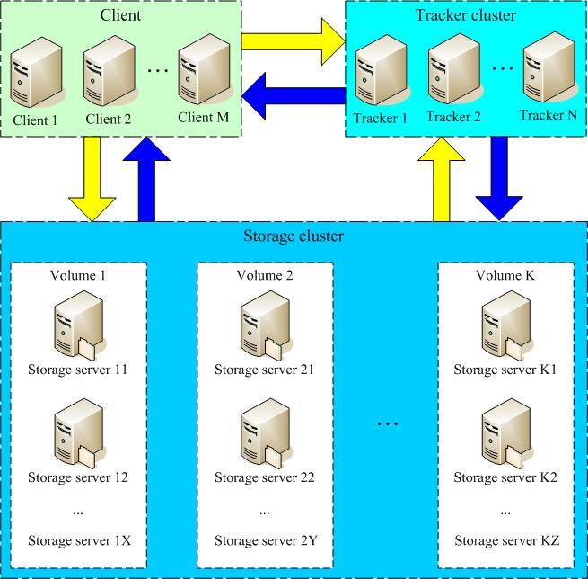
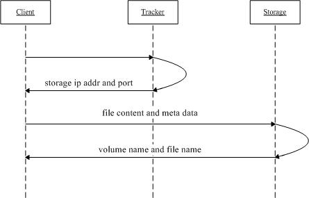
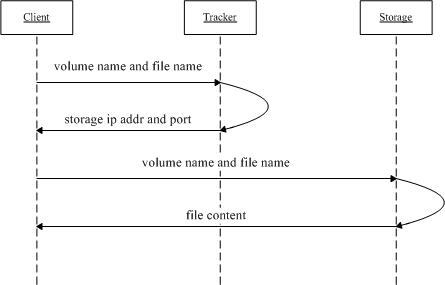

# CentOS7 搭建 FastDFS+Nginx

[TOC]

## 1\. FastDFS 介绍

FastDFS 是一个开源的分布式文件系统，她对文件进行管理，功能包括：文件存储、文件同步、文件访问（文件上传、文件下载）等，解决了大容量存储和负载均衡的问题。特别适合以文件为载体的在线服务，如相册网站、视频网站等等。

FastDFS 服务端有两个角色：跟踪器（tracker）和存储节点（storage）。跟踪器主要做调度工作，在访问上起负载均衡的作用。

存储节点存储文件，完成文件管理的所有功能：存储、同步和提供存取接口，FastDFS 同时对文件的 meta data 进行管理。所谓文件的 meta data 就是文件的相关属性，以键值对（key value pair）方式表示，如：width=1024，其中的 key 为 width，value 为 1024。文件 meta data 是文件属性列表，可以包含多个键值对。

FastDFS 系统结构如下图所示：



跟踪器和存储节点都可以由一台或多台服务器构成。跟踪器和存储节点中的服务器均可以随时增加或下线而不会影响线上服务。其中跟踪器中的所有服务器都是对等的，可以根据服务器的压力情况随时增加或减少。

为了支持大容量，存储节点（服务器）采用了分卷（或分组）的组织方式。存储系统由一个或多个卷组成，卷与卷之间的文件是相互独立的，所有卷 的文件容量累加就是整个存储系统中的文件容量。一个卷可以由一台或多台存储服务器组成，一个卷下的存储服务器中的文件都是相同的，卷中的多台存储服务器起 到了冗余备份和负载均衡的作用。

在卷中增加服务器时，同步已有的文件由系统自动完成，同步完成后，系统自动将新增服务器切换到线上提供服务。

当存储空间不足或即将耗尽时，可以动态添加卷。只需要增加一台或多台服务器，并将它们配置为一个新的卷，这样就扩大了存储系统的容量。 FastDFS 中的文件标识分为两个部分：卷名和文件名，二者缺一不可。



上传文件交互过程： 1. client 询问 tracker 上传到的 storage，不需要附加参数； 2. tracker 返回一台可用的 storage； 3. client 直接和 storage 通讯完成文件上传。



下载文件交互过程：

1. client 询问 tracker 下载文件的 storage，参数为文件标识（卷名和文件名）；
2. tracker 返回一台可用的 storage；
3. client 直接和 storage 通讯完成文件下载。

需要说明的是，client 为使用 FastDFS 服务的调用方，client 也应该是一台服务器，它对 tracker 和 storage 的调用均为服务器间的调用。

## 2\. FastDFS 单机部署

### 2.1 准备

系统： CentOS7

安装包：

```
[root@SUNQFASTDFS01 fastdfs]# pwd
/tmp/fastdfs
[root@SUNQFASTDFS01 fastdfs]# ll
total 1896
-rw-r--r-- 1 root root  22192 Dec  8 14:29 fastdfs-nginx-module-master.zip
-rw-r--r-- 1 root root 425467 Dec  8 14:25 fastdfs-master.zip
-rw-r--r-- 1 root root 478937 Dec  8 14:27 libfastcommon-master.zip
-rw-r--r-- 1 root root 988415 Aug  8 23:11 nginx-1.13.4.tar.gz
[root@SUNQFASTDFS01 fastdfs]#
```

### 2.2 安装依赖包和开始工具

```
#安装依赖软件
yum -y install gcc gcc-c++ libstdc++-devel pcre-devel zlib-devel wget make
yum -y groupinstall 'Development Tools'
```

### 2.3 安装 libfastcommon

```
cd /tmp/fastdfs/
unzip libfastcommon-master.zip
mv libfastcommon-master /usr/local/libfastcommon
cd /usr/local/libfastcommon
./make.sh
./make.sh install
```

### 2.4 安装 fastdfs

```
cd /tmp/fastdfs
unzip fastdfs-master.zip
mv fastdfs-master /usr/local/fastdfs
./make.sh
./make.sh install
```

```
[root@SUNQFASTDFS01 fastdfs]# ls -l /etc/fdfs/
total 40
-rw-r--r-- 1 root root 1461 Jan  8 16:50 client.conf.sample
-rw-r--r-- 1 root root 7927 Jan  8 16:50 storage.conf.sample
-rw-r--r-- 1 root root  105 Jan  8 16:50 storage_ids.conf.sample
-rw-r--r-- 1 root root 7389 Jan  8 16:50 tracker.conf.sample
[root@SUNQFASTDFS01 fastdfs]#
```

安装好之后，在/usr/bin 目录下，可以看 fdfs 开头的命令工具

> FastDFS 安装完成之后，所有配置文件在/etc/fdfs 目录下， tracker 需要 tracker.conf 配置文件， storage 需要 storage.conf 配置文件。

### 2.5 配置 tracker

```
cd /etc/fdfs/
cp tracker.conf.sample tracker.conf
vim tracker.conf
```

修改`base_path`（文件存储路径）为`/opt/fastdfs`

```
# the base path to store data and log files
base_path=/opt/fastdfs
```

```
# 启用配置文件
disabled=false
# 设置tracker的端口号
port=22122
# 设置tracker的数据文件和日志目录（需手动创建）
base_path=/opt/fastdfs
# 设置http端口号
http.server_port=8080
```

使用`fdfs_trackerd /etc/fdfs/tracker.conf start`尝试启动 tracker

检查是否启动

```
[root@SUNQFASTDFS01 fdfs]# fdfs_trackerd /etc/fdfs/tracker.conf start
[root@SUNQFASTDFS01 fdfs]# ps -ef|grep tracker.conf
root      3438     1  0 17:01 ?        00:00:00 fdfs_trackerd /etc/fdfs/tracker.conf start
root      3446  2670  0 17:01 pts/0    00:00:00 grep --color=auto tracker.conf
[root@SUNQFASTDFS01 fdfs]# netstat -pln|grep fdfs
tcp        0      0 0.0.0.0:22122           0.0.0.0:*               LISTEN      3438/fdfs_trackerd
[root@SUNQFASTDFS01 fdfs]# tail /opt/fastdfs/logs/trackerd.log
[2018-01-08 17:01:08] INFO - FastDFS v5.12, base_path=/opt/fastdfs, run_by_group=, run_by_user=, connect_timeout=30s, network_timeout=60s, port=22122, bind_addr=, max_connections=256, accept_threads=1, work_threads=4, min_buff_size=8192, max_buff_size=131072, store_lookup=2, store_group=, store_server=0, store_path=0, reserved_storage_space=10.00%, download_server=0, allow_ip_count=-1, sync_log_buff_interval=10s, check_active_interval=120s, thread_stack_size=64 KB, storage_ip_changed_auto_adjust=1, storage_sync_file_max_delay=86400s, storage_sync_file_max_time=300s, use_trunk_file=0, slot_min_size=256, slot_max_size=16 MB, trunk_file_size=64 MB, trunk_create_file_advance=0, trunk_create_file_time_base=02:00, trunk_create_file_interval=86400, trunk_create_file_space_threshold=20 GB, trunk_init_check_occupying=0, trunk_init_reload_from_binlog=0, trunk_compress_binlog_min_interval=0, use_storage_id=0, id_type_in_filename=ip, storage_id_count=0, rotate_error_log=0, error_log_rotate_time=00:00, rotate_error_log_size=0, log_file_keep_days=0, store_slave_file_use_link=0, use_connection_pool=0, g_connection_pool_max_idle_time=3600s
```

### 2.6 配置 storage

```
cd /etc/fdfs/
cp storage.conf.sample storage.conf
vim storage.conf
```

主要修改`base_path`，`store_path`以及 tracker 的连接地址以及 storage 的 http 服务端口配置等。

```
group_name=group1                   # 组名（第一组为group1，第二组为group2，依次类推...）
base_path=/opt/fastdfs             # 数据和日志文件存储根目录
store_path0=/opt/fastdfs           # 第一个存储目录，第二个存储目录起名为：store_path1=xxx，其它存储目录名依次类推...
store_path_count=1                  # 存储路径个数，需要和store_path个数匹配
tracker_server=172.30.47.156:22122          # tracker服务器IP和端口，有多个则添加多行
```

检查是否启动

```
[root@SUNQFASTDFS01 fdfs]# fdfs_storaged /etc/fdfs/storage.conf start
[root@SUNQFASTDFS01 fdfs]# netstat -unltp|grep fdfs
tcp        0      0 0.0.0.0:22122           0.0.0.0:*               LISTEN      3438/fdfs_trackerd
tcp        0      0 0.0.0.0:23000           0.0.0.0:*               LISTEN      4571/fdfs_storaged
[root@SUNQFASTDFS01 fdfs]# tail /opt/fastdfs/logs/storaged.log
mkdir data path: FA ...
mkdir data path: FB ...
mkdir data path: FC ...
mkdir data path: FD ...
mkdir data path: FE ...
mkdir data path: FF ...
data path: /opt/fastdfs/data, mkdir sub dir done.
[2018-01-09 10:15:08] INFO - file: storage_param_getter.c, line: 191, use_storage_id=0, id_type_in_filename=ip, storage_ip_changed_auto_adjust=1, store_path=0, reserved_storage_space=10.00%, use_trunk_file=0, slot_min_size=256, slot_max_size=16 MB, trunk_file_size=64 MB, trunk_create_file_advance=0, trunk_create_file_time_base=02:00, trunk_create_file_interval=86400, trunk_create_file_space_threshold=20 GB, trunk_init_check_occupying=0, trunk_init_reload_from_binlog=0, trunk_compress_binlog_min_interval=0, store_slave_file_use_link=0
[2018-01-09 10:15:08] INFO - file: storage_func.c, line: 257, tracker_client_ip: 172.30.47.156, my_server_id_str: 172.30.47.156, g_server_id_in_filename: -1674633556
[2018-01-09 10:15:08] INFO - file: tracker_client_thread.c, line: 310, successfully connect to tracker server 172.30.47.156:22122, as a tracker client, my ip is 172.30.47.156
[root@SUNQFASTDFS01 fdfs]#
```

在任一存储节点上使用如下命令查看集群的状态信息： `fdfs_monitor /etc/fdfs/storage.conf`

如果出现 ip_addr = Active, 则表明 storage 服务器已经登记到 tracker 服务器，如下：

```
server_count=1, server_index=0

tracker server is 172.30.47.156:22122

group count: 1

Group 1:
group name = group1
disk total space = 50871 MB
disk free space = 40771 MB
trunk free space = 0 MB
storage server count = 1
active server count = 1
storage server port = 23000
storage HTTP port = 8888
store path count = 1
subdir count per path = 256
current write server index = 0
current trunk file id = 0

        Storage 1:
                id = 172.30.47.156
                ip_addr = 172.30.47.156 (SUNQFASTDFS01)  ACTIVE
```

### 2.7 在 storage 上安装 nginx

> _注意_： fastdfs-nginx-module 模块只需要安装到 storage 上。

```
cd /tmp/fastdfs
unzip fastdfs-nginx-module-master.zip
mv fastdfs-nginx-module-master /usr/local/fastdfs-nginx-module
tar -zxf nginx-1.13.4.tar.gz
cd nginx-1.13.4
./configure --prefix=/usr/local/nginx --add-module=/usr/local/fastdfs-nginx-module/src/
```

没有报错则执行下一步：

```
make
make install
```

如下结果则表示安装成功

```
[root@SUNQFASTDFS01 nginx-1.13.4]# /usr/local/nginx/sbin/nginx -V
nginx version: nginx/1.13.4
built by gcc 4.8.5 20150623 (Red Hat 4.8.5-16) (GCC)
configure arguments: --prefix=/usr/local/nginx --add-module=/usr/local/fastdfs-nginx-module/src/
```

### 2.8 配置 client

```
cd /etc/fdfs/
cp client.conf.sample client.conf
vim client.conf
```

```
base_path=/opt/fastdfs              # 数据和日志文件存储根目录
tracker_server=172.30.47.156:22122  # tracker服务器IP和端口，有多个按行添加
http.tracker_server_port=8080       # 服务端IP和端口号
```

```
[root@SUNQFASTDFS01 data]# ls /tmp/test01.png
/tmp/test01.png
[root@SUNQFASTDFS01 data]# fdfs_upload_file /etc/fdfs/client.conf /tmp/test01.png
group1/M00/00/00/rB4vnFpUPN-Adut0AANMVnJruQg458.png
```

### 2.9 配置 fastdfs-nginx-module 和 nginx

```
cd /etc/fdfs/
cp /usr/local/fastdfs-nginx-module/src/mod_fastdfs.conf .
vim mod_fastdfs.conf
```

一般只需改动以下几个参数即可：

```
base_path=/opt/fastdfs            # 保存日志目录
tracker_server=172.30.47.156:22122  # tracker服务器IP和端口，有多个按行添加
storage_server_port=23000         # storage服务器的端口号
group_name=group1                 # 当前服务器的group名
url_have_group_name = true        # 文件url中是否有group名
store_path_count=1                # 存储路径个数，需要和store_path个数匹配
store_path0=/opt/fastdfs          # 存储路径
group_count = 0                   # 设置组的个数，设置为0则为单组
```

```
cp /usr/local/fastdfs/conf/http.conf /usr/local/fastdfs/conf/mime.types /etc/fdfs/
vim /usr/local/nginx/conf/nginx.conf
```

内容：

```
# nginx.conf
user  nobody;
worker_processes  8;

error_log  logs/info.log  info;

#pid        logs/nginx.pid;


events {
    worker_connections  1024;
}


http {
    include       mime.types;
    default_type  application/octet-stream;

    #log_format  main  '$remote_addr - $remote_user [$time_local] "$request" '
    #                  '$status $body_bytes_sent "$http_referer" '
    #                  '"$http_user_agent" "$http_x_forwarded_for"';

    #access_log  logs/access.log  main;

    sendfile        on;
    #tcp_nopush     on;

    #keepalive_timeout  0;
    keepalive_timeout  65;

    #设定请求缓冲
    server_names_hash_bucket_size 128;
    client_header_buffer_size 32k;
    large_client_header_buffers 4 32k;
    client_max_body_size 300m;
    tcp_nopush     on;
    tcp_nodelay on;
    server_tokens off;
    client_body_buffer_size 512k;
    proxy_connect_timeout   20;
    proxy_send_timeout      60;
    proxy_read_timeout      20;
    proxy_buffer_size       16k;
    proxy_buffers           4 64k;
    proxy_busy_buffers_size 128k;
    proxy_temp_file_write_size 128k;
    client_header_timeout  3m;
    client_body_timeout    3m;
    send_timeout           3m;


    gzip on; # 开启gzip，节省带宽
    gzip_min_length  1100;
    gzip_buffers     4 8k;
    gzip_types       text/plain text/css application/x-javascript image/bmp application/javascript;

    output_buffers   1 32k;
    postpone_output  1460;

    limit_rate_after 3m; # 限速模块，前3M下载时不限速
    limit_rate 512k; # 限速模块

include vhost/*.conf;

}
```

```
vim /usr/local/nginx/conf/vhost/storage.conf
```

内容：

```
# storage.conf
server {
    listen       8080 ;
    server_name  172.30.47.156 ;

    location / {
        root   html;
        index  index.html index.htm;
    }

    location ~/group[0-9]/M00 {
        alias   /opt/fastdfs/data/;
        ngx_fastdfs_module;
    }

}
```

启动 nginx：

```
/usr/local/nginx/sbin/nginx
```

然后访问上文件中生成的字符串拼接的 url： `http://172.30.47.156:8080/group1/M00/00/00/rB4vnFpUPN-Adut0AANMVnJruQg458.png`

参考资料： \[1\] [http://www.ityouknow.com/fastdfs/2017/10/10/cluster-building-fastdfs.html](http://www.ityouknow.com/fastdfs/2017/10/10/cluster-building-fastdfs.html) \[2\] [http://www.cnblogs.com/sunmmi/p/5798803.html](http://www.cnblogs.com/sunmmi/p/5798803.html) \[3\] [http://blog.csdn.net/u012453843/article/details/69055570](http://blog.csdn.net/u012453843/article/details/69055570)
