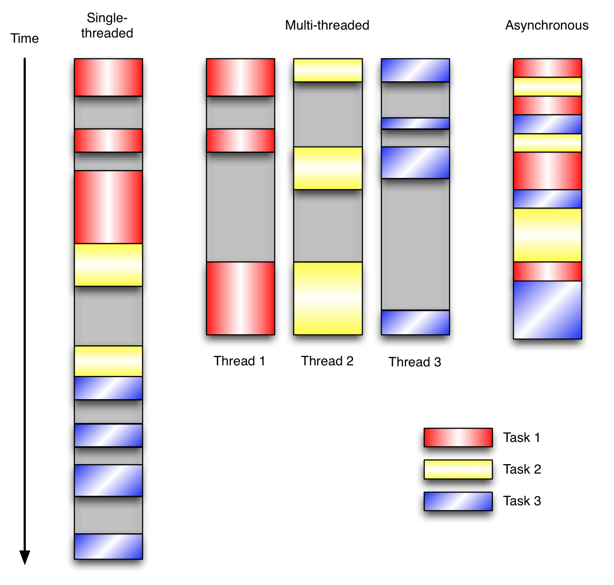

# Python 学习记录-协程、异步 IO

[TOC]

## 1. 协程

线程和进程的操作是由程序触发系统接口，最后的执行者是系统；协程的操作则是程序员。 协程存在的意义：对于多线程应用，CPU 通过切片的方式来切换线程间的执行，线程切换时需要耗时（保存状态，下次继续）。协程，则只使用一个线程，在一个线程中规定某个代码块执行顺序。 协程的适用场景：当程序中存在大量不需要 CPU 的操作时（IO），适用于协程；

**协程的好处**：

- 无需线程上下文切换的开销
- 无需原子操作锁定及同步的开销 "原子操作(atomic operation)是不需要 synchronized"，所谓原子操作是指不会被线程调度机制打断的操作；这种操作一旦开始，就一直运行到结束，中间不会有任何 context switch （切换到另一个线程）。原子操作可以是一个步骤，也可以是多个操作步骤，但是其顺序是不可以被打乱，或者切割掉只执行部分。视作整体是原子性的核心。
- 方便切换控制流，简化编程模型
- 高并发+高扩展性+低成本：一个 CPU 支持上万的协程都不是问题。所以很适合用于高并发处理。

**协程的缺点**：

- 无法利用多核资源：协程的本质是个单线程,它不能同时将 单个 CPU 的多个核用上,协程需要和进程配合才能运行在多 CPU 上.当然我们日常所编写的绝大部分应用都没有这个必要，除非是 cpu 密集型应用。
- 进行阻塞（Blocking）操作（如 IO 时）会阻塞掉整个程序

使用`yield`实现协程操作例子：

```
import time
import queue

def consumer(name):
    print("--->starting eating baozi...")
    while True:
        new_baozi = yield
        print("[%s] is eating baozi %s" % (name,new_baozi))
        # time.sleep(1)

def producer():

    r = con.__next__()
    r = con2.__next__()
    n = 0
    while n < 5:
        n +=1
        con.send(n)
        con2.send(n)
        print("\033[32;1m[producer]\033[0m is making baozi %s" %n )


if __name__ == '__main__':
    con = consumer("c1")
    con2 = consumer("c2")
    p = producer()
```

### 1.1 greenlet

```
from greenlet import greenlet


def test1():
    print(12)
    gr2.switch()
    print(34)
    gr2.switch()


def test2():
    print(56)
    gr1.switch()
    print(78)

gr1 = greenlet(test1)
gr2 = greenlet(test2)
gr1.switch()
```

运行结果：

```
12
56
34
78
```

### 1.2 gevent

Python 通过 yield 提供了对协程的基本支持，但是不完全。而第三方的 gevent 为 Python 提供了比较完善的协程支持。

gevent 是第三方库，通过 greenlet 实现协程，其基本思想是：

当一个 greenlet 遇到 IO 操作时，比如访问网络，就自动切换到其他的 greenlet，等到 IO 操作完成，再在适当的时候切换回来继续执行。由于 IO 操作非常耗时，经常使程序处于等待状态，有了 gevent 为我们自动切换协程，就保证总有 greenlet 在运行，而不是等待 IO。

```
import gevent

def foo():
    print('Running in foo')
    gevent.sleep(0)
    print('Explicit context switch to foo again')

def bar():
    print('Explicit context to bar')
    gevent.sleep(0)
    print('Implicit context switch back to bar')

gevent.joinall([
    gevent.spawn(foo),
    gevent.spawn(bar),
])
```

运行结果：

```
Running in foo
Explicit context to bar
Explicit context switch to foo again
Implicit context switch back to bar
```

遇到 IO 操作自动切换：

```
from gevent import monkey
import gevent
import time
from urllib import request

monkey.patch_all()

def f(url):
    print('GET: %s' % url)
    resp = request.urlopen(url)
    data = resp.read()
    print('%d bytes received from %s.' % (len(data), url))

urls = ['https://www.python.org/','https://www.baidu.com/','https://www.so.com/']
time_start = time.time()
for url in urls:
    f(url)

print("同步cost", time.time() - time_start)

async_time_start =  time.time()
gevent.joinall([
        gevent.spawn(f, 'https://www.python.org/'),
        gevent.spawn(f, 'https://www.baidu.com/'),
        gevent.spawn(f, 'https://www.so.com/'),
])
print("异步cost", time.time() - async_time_start )
```

通过 gevent 实现单线程下的多 socket 并发：

`server.py`

```
import socket
import gevent

from gevent import socket,monkey
monkey.patch_all()


def server(port):
    s = socket.socket()
    s.bind(('0.0.0.0', port))
    s.listen(500)
    while True:
        cli, addr = s.accept()
        gevent.spawn(handle_request, cli)


def handle_request(conn):
    try:
        while True:
            data = conn.recv(1024)
            print("recv:", data)
            conn.send(data)
            if not data:
                conn.shutdown(socket.SHUT_WR)

    except Exception as  ex:
        print(ex)
    finally:
        conn.close()
if __name__ == '__main__':
    server(8001)
```

`client.py`

```
import socket

HOST = 'localhost'    # The remote host
PORT = 8001           # The same port as used by the server
s = socket.socket(socket.AF_INET, socket.SOCK_STREAM)
s.connect((HOST, PORT))
while True:
    msg = bytes(input(">>:"),encoding="utf8")
    s.sendall(msg)
    data = s.recv(1024)
    print('Received', repr(data))

s.close()
```

多线程自发自收：

```
import socket
import threading

def sock_conn():

    client = socket.socket()

    client.connect(("localhost",8001))
    count = 0
    while True:
        #msg = input(">>:").strip()
        #if len(msg) == 0:continue
        client.send( ("hello %s" %count).encode("utf-8"))

        data = client.recv(1024)

        print("[%s]recv from server:" % threading.get_ident(),data.decode()) #结果
        count +=1
    client.close()


for i in range(100):
    t = threading.Thread(target=sock_conn)
    t.start()
```

## 2. 事件驱动与异步 IO

### 2.1 事件驱动模型

通常，我们写服务器处理模型的程序时，有以下几种模型: (1)每收到一个请求，创建一个新的进程，来处理该请求; (2)每收到一个请求，创建一个新的线程，来处理该请求; (3)每收到一个请求，放入一个事件列表，让主进程通过非阻塞 I/O 方式来处理请求 上面的几种方式，各有千秋， 第(1)种方法，由于创建新的进程的开销比较大，所以，会导致服务器性能比较差,但实现比较简单。 第(2)种方式，由于要涉及到线程的同步，有可能会面临死锁等问题。 第(3)种方式，在写应用程序代码时，逻辑比前面两种都复杂。 综合考虑各方面因素，一般普遍认为第(3)种方式是大多数网络服务器采用的方式。

事件驱动编程是一种编程范式，这里程序的执行流由外部事件来决定。它的特点是包含一个事件循环，当外部事件发生时使用回调机制来触发相应的处理。另外两种常见的编程范式是（单线程）同步以及多线程编程。

让我们用例子来**比较和对比一下单线程、多线程以及事件驱动编程模型**。下图展示了随着时间的推移，这三种模式下程序所做的工作。这个程序有 3 个任务需要完成，每个任务都在等待 I/O 操作时阻塞自身。阻塞在 I/O 操作上所花费的时间已经用灰色框标示出来了。



在单线程同步模型中，任务按照顺序执行。如果某个任务因为 I/O 而阻塞，其他所有的任务都必须等待，直到它完成之后它们才能依次执行。这种明确的执行顺序和串行化处理的行为是很容易推断得出的。如果任务之间并没有互相依赖的关系，但仍然需要互相等待的话这就使得程序不必要的降低了运行速度。

在多线程版本中，这 3 个任务分别在独立的线程中执行。这些线程由操作系统来管理，在多处理器系统上可以并行处理，或者在单处理器系统上交错执行。这使得当某个线程阻塞在某个资源的同时其他线程得以继续执行。与完成类似功能的同步程序相比，这种方式更有效率，但程序员必须写代码来保护共享资源，防止其被多个线程同时访问。多线程程序更加难以推断，因为这类程序不得不通过线程同步机制如锁、可重入函数、线程局部存储或者其他机制来处理线程安全问题，如果实现不当就会导致出现微妙且令人痛不欲生的 bug。

在事件驱动版本的程序中，3 个任务交错执行，但仍然在一个单独的线程控制中。当处理 I/O 或者其他昂贵的操作时，注册一个回调到事件循环中，然后当 I/O 操作完成时继续执行。回调描述了该如何处理某个事件。事件循环轮询所有的事件，当事件到来时将它们分配给等待处理事件的回调函数。这种方式让程序尽可能的得以执行而不需要用到额外的线程。事件驱动型程序比多线程程序更容易推断出行为，因为程序员不需要关心线程安全问题。

当我们面对如下的环境时，事件驱动模型通常是一个好的选择：

程序中有许多任务，而且… 任务之间高度独立（因此它们不需要互相通信，或者等待彼此）而且… 在等待事件到来时，某些任务会阻塞。 当应用程序需要在任务间共享可变的数据时，这也是一个不错的选择，因为这里不需要采用同步处理。

网络应用程序通常都有上述这些特点，这使得它们能够很好的契合事件驱动编程模型。

### 2.2 Select、Poll、Epoll 异步 IO

首先列一下，sellect、poll、epoll 三者的区别

select select 最早于 1983 年出现在 4.2BSD 中，它通过一个 select()系统调用来监视多个文件描述符的数组，当 select()返回后，该数组中就绪的文件描述符便会被内核修改标志位，使得进程可以获得这些文件描述符从而进行后续的读写操作。

select 目前几乎在所有的平台上支持，其良好跨平台支持也是它的一个优点，事实上从现在看来，这也是它所剩不多的优点之一。

select 的一个缺点在于单个进程能够监视的文件描述符的数量存在最大限制，在 Linux 上一般为 1024，不过可以通过修改宏定义甚至重新编译内核的方式提升这一限制。

另外，select()所维护的存储大量文件描述符的数据结构，随着文件描述符数量的增大，其复制的开销也线性增长。同时，由于网络响应时间的延迟使得大量 TCP 连接处于非活跃状态，但调用 select()会对所有 socket 进行一次线性扫描，所以这也浪费了一定的开销。

poll poll 在 1986 年诞生于 System V Release 3，它和 select 在本质上没有多大差别，但是 poll 没有最大文件描述符数量的限制。

poll 和 select 同样存在一个缺点就是，包含大量文件描述符的数组被整体复制于用户态和内核的地址空间之间，而不论这些文件描述符是否就绪，它的开销随着文件描述符数量的增加而线性增大。

另外，select()和 poll()将就绪的文件描述符告诉进程后，如果进程没有对其进行 IO 操作，那么下次调用`select()`和`poll()`的时候将再次报告这些文件描述符，所以它们一般不会丢失就绪的消息，这种方式称为水平触发（Level Triggered）。

epoll 直到 Linux2.6 才出现了由内核直接支持的实现方法，那就是 epoll，它几乎具备了之前所说的一切优点，被公认为 Linux2.6 下性能最好的多路 I/O 就绪通知方法。

epoll 可以同时支持水平触发和边缘触发（Edge Triggered，只告诉进程哪些文件描述符刚刚变为就绪状态，它只说一遍，如果我们没有采取行动，那么它将不会再次告知，这种方式称为边缘触发），理论上边缘触发的性能要更高一些，但是代码实现相当复杂。

epoll 同样只告知那些就绪的文件描述符，而且当我们调用 epoll_wait()获得就绪文件描述符时，返回的不是实际的描述符，而是一个代表就绪描述符数量的值，你只需要去 epoll 指定的一个数组中依次取得相应数量的文件描述符即可，这里也使用了内存映射（mmap）技术，这样便彻底省掉了这些文件描述符在系统调用时复制的开销。

另一个本质的改进在于 epoll 采用基于事件的就绪通知方式。在 select/poll 中，进程只有在调用一定的方法后，内核才对所有监视的文件描述符进行扫描，而 epoll 事先通过`epoll_ctl()`来注册一个文件描述符，一旦基于某个文件描述符就绪时，内核会采用类似 callback 的回调机制，迅速激活这个文件描述符，当进程调用 epoll_wait()时便得到通知。

### 2.3 Python select

下面是 Python select 的服务端和客户端通信示例：

`select_server.py`

```
import select
import socket
import sys
import queue

# Create a TCP/IP socket
server = socket.socket(socket.AF_INET, socket.SOCK_STREAM)
server.setblocking(False)

# Bind the socket to the port
server_address = ('localhost', 10000)
print(sys.stderr, 'starting up on %s port %s' % server_address)
server.bind(server_address)

# Listen for incoming connections
server.listen(5)

# Sockets from which we expect to read
inputs = [ server ]

# Sockets to which we expect to write
outputs = [ ]

message_queues = {}
while inputs:

    # Wait for at least one of the sockets to be ready for processing
    print( '\nwaiting for the next event')
    readable, writable, exceptional = select.select(inputs, outputs, inputs)
    # Handle inputs
    for s in readable:

        if s is server:
            # A "readable" server socket is ready to accept a connection
            connection, client_address = s.accept()
            print('new connection from', client_address)
            connection.setblocking(False)
            inputs.append(connection)

            # Give the connection a queue for data we want to send
            message_queues[connection] = queue.Queue()
        else:
            data = s.recv(1024)
            if data:
                # A readable client socket has data
                print(sys.stderr, 'received "%s" from %s' % (data, s.getpeername()) )
                message_queues[s].put(data)
                # Add output channel for response
                if s not in outputs:
                    outputs.append(s)
            else:
                # Interpret empty result as closed connection
                print('closing', client_address, 'after reading no data')
                # Stop listening for input on the connection
                if s in outputs:
                    outputs.remove(s)  #既然客户端都断开了，我就不用再给它返回数据了，所以这时候如果这个客户端的连接对象还在outputs列表中，就把它删掉
                inputs.remove(s)    #inputs中也删除掉
                s.close()           #把这个连接关闭掉

                # Remove message queue
                del message_queues[s]
    # Handle outputs
    for s in writable:
        try:
            next_msg = message_queues[s].get_nowait()
        except queue.Empty:
            # No messages waiting so stop checking for writability.
            print('output queue for', s.getpeername(), 'is empty')
            outputs.remove(s)
        else:
            print( 'sending "%s" to %s' % (next_msg, s.getpeername()))
            s.send(next_msg)
    # Handle "exceptional conditions"
    for s in exceptional:
        print('handling exceptional condition for', s.getpeername() )
        # Stop listening for input on the connection
        inputs.remove(s)
        if s in outputs:
            outputs.remove(s)
        s.close()

        # Remove message queue
        del message_queues[s]
```

`select_client.py`

```
import socket
import sys

messages = [ 'This is the message. ',
             'It will be sent ',
             'in parts.',
             ]
server_address = ('localhost', 10000)

# Create a TCP/IP socket
socks = [ socket.socket(socket.AF_INET, socket.SOCK_STREAM),
          socket.socket(socket.AF_INET, socket.SOCK_STREAM),
          ]

# Connect the socket to the port where the server is listening
print(sys.stderr, 'connecting to %s port %s' % server_address)
for s in socks:
    s.connect(server_address)

for message in messages:

    # Send messages on both sockets
    for s in socks:
        print(sys.stderr, '%s: sending "%s"' % (s.getsockname(), message))
        s.send(bytes(message, encoding='utf-8'))

    # Read responses on both sockets
    for s in socks:
        data = s.recv(1024)
        print(sys.stderr, '%s: received "%s"' % (s.getsockname(), data))
        if not data:
            print(sys.stderr, 'closing socket', s.getsockname())
            s.close()
```

运行结果：

`python3 select_server.py`

```
<_io.TextIOWrapper name='<stderr>' mode='w' encoding='UTF-8'> starting up on localhost port 10000

waiting for the next event
new connection from ('127.0.0.1', 19915)

waiting for the next event
new connection from ('127.0.0.1', 19916)

waiting for the next event
<_io.TextIOWrapper name='<stderr>' mode='w' encoding='UTF-8'> received "b'This is the message. '" from ('127.0.0.1', 19915)

waiting for the next event
sending "b'This is the message. '" to ('127.0.0.1', 19915)

waiting for the next event
output queue for ('127.0.0.1', 19915) is empty

waiting for the next event
<_io.TextIOWrapper name='<stderr>' mode='w' encoding='UTF-8'> received "b'This is the message. '" from ('127.0.0.1', 19916)

waiting for the next event
sending "b'This is the message. '" to ('127.0.0.1', 19916)

waiting for the next event
output queue for ('127.0.0.1', 19916) is empty

waiting for the next event
<_io.TextIOWrapper name='<stderr>' mode='w' encoding='UTF-8'> received "b'It will be sent '" from ('127.0.0.1', 19915)

waiting for the next event
sending "b'It will be sent '" to ('127.0.0.1', 19915)

waiting for the next event
output queue for ('127.0.0.1', 19915) is empty

waiting for the next event
<_io.TextIOWrapper name='<stderr>' mode='w' encoding='UTF-8'> received "b'It will be sent '" from ('127.0.0.1', 19916)

waiting for the next event
sending "b'It will be sent '" to ('127.0.0.1', 19916)

waiting for the next event
output queue for ('127.0.0.1', 19916) is empty

waiting for the next event
<_io.TextIOWrapper name='<stderr>' mode='w' encoding='UTF-8'> received "b'in parts.'" from ('127.0.0.1', 19915)

waiting for the next event
sending "b'in parts.'" to ('127.0.0.1', 19915)

waiting for the next event
output queue for ('127.0.0.1', 19915) is empty

waiting for the next event
<_io.TextIOWrapper name='<stderr>' mode='w' encoding='UTF-8'> received "b'in parts.'" from ('127.0.0.1', 19916)

waiting for the next event
sending "b'in parts.'" to ('127.0.0.1', 19916)

waiting for the next event
output queue for ('127.0.0.1', 19916) is empty

waiting for the next event
closing ('127.0.0.1', 19916) after reading no data

waiting for the next event
closing ('127.0.0.1', 19916) after reading no data

waiting for the next event
```

`python3 select_client.py`

```
<_io.TextIOWrapper name='<stderr>' mode='w' encoding='UTF-8'> connecting to localhost port 10000
<_io.TextIOWrapper name='<stderr>' mode='w' encoding='UTF-8'> ('127.0.0.1', 19915): sending "This is the message. "
<_io.TextIOWrapper name='<stderr>' mode='w' encoding='UTF-8'> ('127.0.0.1', 19916): sending "This is the message. "
<_io.TextIOWrapper name='<stderr>' mode='w' encoding='UTF-8'> ('127.0.0.1', 19915): received "b'This is the message. '"
<_io.TextIOWrapper name='<stderr>' mode='w' encoding='UTF-8'> ('127.0.0.1', 19916): received "b'This is the message. '"
<_io.TextIOWrapper name='<stderr>' mode='w' encoding='UTF-8'> ('127.0.0.1', 19915): sending "It will be sent "
<_io.TextIOWrapper name='<stderr>' mode='w' encoding='UTF-8'> ('127.0.0.1', 19916): sending "It will be sent "
<_io.TextIOWrapper name='<stderr>' mode='w' encoding='UTF-8'> ('127.0.0.1', 19915): received "b'It will be sent '"
<_io.TextIOWrapper name='<stderr>' mode='w' encoding='UTF-8'> ('127.0.0.1', 19916): received "b'It will be sent '"
<_io.TextIOWrapper name='<stderr>' mode='w' encoding='UTF-8'> ('127.0.0.1', 19915): sending "in parts."
<_io.TextIOWrapper name='<stderr>' mode='w' encoding='UTF-8'> ('127.0.0.1', 19916): sending "in parts."
<_io.TextIOWrapper name='<stderr>' mode='w' encoding='UTF-8'> ('127.0.0.1', 19915): received "b'in parts.'"
<_io.TextIOWrapper name='<stderr>' mode='w' encoding='UTF-8'> ('127.0.0.1', 19916): received "b'in parts.'"
```

### 2.4 Python [selectors](https://docs.python.org/3/library/selectors.html)

This module allows high-level and efficient I/O multiplexing, built upon the select module primitives. Users are encouraged to use this module instead, unless they want precise control over the OS-level primitives used.

示例：

```
import selectors
import socket

sel = selectors.DefaultSelector()

def accept(sock, mask):
    conn, addr = sock.accept()  # Should be ready
    print('accepted', conn, 'from', addr)
    conn.setblocking(False)
    sel.register(conn, selectors.EVENT_READ, read)

def read(conn, mask):
    data = conn.recv(1000)  # Should be ready
    if data:
        print('echoing', repr(data), 'to', conn)
        conn.send(data)  # Hope it won't block
    else:
        print('closing', conn)
        sel.unregister(conn)
        conn.close()

sock = socket.socket()
sock.bind(('localhost', 1234))
sock.listen(100)
sock.setblocking(False)
sel.register(sock, selectors.EVENT_READ, accept)

while True:
    events = sel.select()
    for key, mask in events:
        callback = key.data
        callback(key.fileobj, mask)
```

参考资料： \[1\] [http://www.aosabook.org/en/twisted.html](http://www.aosabook.org/en/twisted.html) \[2\] [https://docs.python.org/3/library/select.html](https://docs.python.org/3/library/select.html) \[3\] [https://docs.python.org/3/library/selectors.html](https://docs.python.org/3/library/selectors.html)
