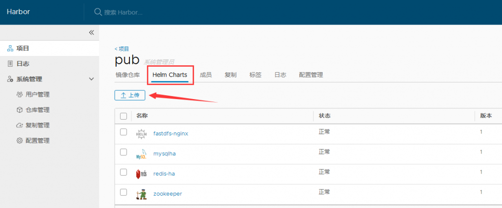
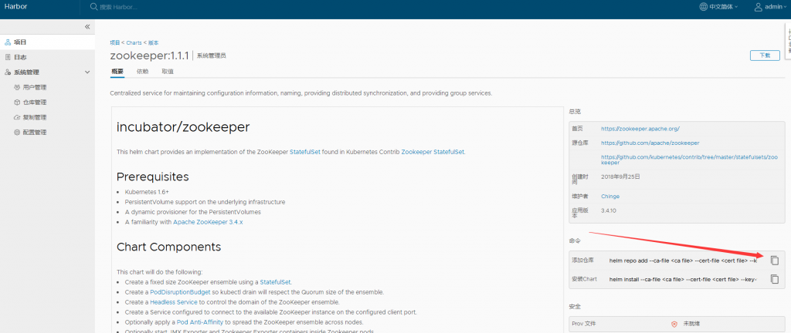
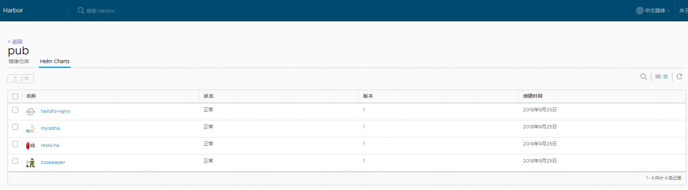
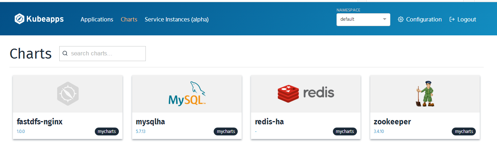

# Kubernetes 使用 helm 安装 Harbor 管理 image 和 chart

[TOC]

## 1. 环境说明

- 可用的 kubernetes 集群
- 可用的 helm 服务端、客户端
- 可用的 kubeapps

## 2. helm 安装 Harbor

根据[官方文档](https://github.com/goharbor/harbor-helm)安装，可能失败的是下载 redis 依赖包：

`helm dependency update`

```
Downloading redis from repo https://kubernetes-charts.storage.googleapis.com
Save error occurred:  could not download https://kubernetes-charts.storage.googleapis.com/redis-3.2.5.tgz: Get https://kubernetes-charts.storage.googleapis.com/redis-3.2.5.tgz: dial tcp 216.58.200.240:443: i/o timeout
```

如果下载失败，可以手动准备 redis：

```
[root@lab1 harbor]# helm search redis
NAME                                    CHART VERSION   APP VERSION     DESCRIPTION
aliyun/redis                            1.1.15          4.0.8           Open source, advanced key-value store. It is of...
aliyun/redis-ha                         2.0.1                           Highly available Redis cluster with multiple se...
bitnami/redis                           4.0.1           4.0.11          Open source, advanced key-value store. It is of...
incubator/redis-cache                   0.3.3           3               A pure in-memory redis cache, using statefulset...
mycharts/redis-ha                       2.0.1                           Highly available Redis cluster with multiple se...
stable/prometheus-redis-exporter        0.3.2           0.21.1          Prometheus exporter for Redis metrics
stable/redis                            4.0.1           4.0.11          Open source, advanced key-value store. It is of...
stable/redis-ha                         2.2.3           4.0.8-r0        Highly available Redis cluster with multiple se...
aliyun/sensu                            0.2.0                           Sensu monitoring framework backed by the Redis ...
stable/sensu                            0.2.3           0.28            Sensu monitoring framework backed by the Redis ...
[root@lab1 harbor]# helm repo list
NAME            URL
monocular       https://helm.github.io/monocular
bitnami         https://charts.bitnami.com/bitnami
gitlab          https://charts.gitlab.io/
incubator       https://kubernetes-charts-incubator.storage.googleapis.com/
aliyun          https://kubernetes.oss-cn-hangzhou.aliyuncs.com/charts
stable          https://kubernetes-charts.storage.googleapis.com/
mycharts        https://reg.linuxba.com/chartrepo/pub
[root@lab1 harbor]# cd charts/
[root@lab1 charts]# helm fetch aliyun/redis --untar
```

后面安装基本没有什么问题。

## 3. kubeapps 添加 harbor 仓库

比如我用的仓库名为：`pub`



可以手动上传一个 chart 包，然后进入查看详情，可以看到仓库地址：



在 kubeapps 中添加仓库时，需要使用 bearer token，下面是获取方法：

`curl -i -k -u "admin:password" "https://reg.linuxba.com/service/token?account=admin&service=harbor-registry&scope=repository:pub/"`

## 4. 效果图

以下是我的使用效果图  

## 5. 一个上传 chart 脚本

```bash
#!/usr/bin/env bash
##############################################################
# File Name:
# Version: V1.0
# Author: Chinge_Yang
# Blog: http://blog.csdn.net/ygqygq2
# Created Time : 2018-09-25 15:32:50
# Description: 上传chart包到harbor仓库
##############################################################

#获取脚本所存放目录
cd `dirname $0`
bash_path=`pwd`

chart_name="$1"
user_name="admin"
password="password"
project_name="${2:-pub}"
request_url="https://reg.linuxba.com/api/chartrepo/$project_name/charts"
charts_dir=$bash_path/charts

#脚本名
me=$(basename $0)
log_dir=$bash_path/log
shell_log=$log_dir/${USER}_${me}.log

#定义保存日志函数
function save_log () {
    echo -e "`date +%F\ %T` $*" >> $shell_log
}

[ ! -d $log_dir ] && mkdir -p $log_dir

#定义输出颜色函数
function red_echo () {
#用法:  red_echo "内容"
    local what=$*
    echo -e "\e[1;31m ${what} \e[0m"
}

function green_echo () {
#用法:  green_echo "内容"
    local what=$*
    echo -e "\e[1;32m ${what} \e[0m"
}

function yellow_echo () {
#用法:  yellow_echo "内容"
    local what=$*
    echo -e "\e[1;33m ${what} \e[0m"
}

function twinkle_echo () {
#用法:  twinkle_echo $(red_echo "内容")  ,此处例子为红色闪烁输出
    local twinkle='\e[05m'
    local what="${twinkle} $*"
    echo -e "${what}"
}

function return_echo () {
    [ $? -eq 0 ] && green_echo "$* 成功" && return 0 || red_echo "$* 失败" && return 1
}

function return_error_exit () {
    [ $? -eq 0 ] && REVAL="0"
    local what=$*
    if [ "$REVAL" = "0" ];then
        [ ! -z "$what" ] && green_echo "$what 成功"
    else
        red_echo "$* 失败，脚本退出"
        exit 1
    fi
}

#定义确认函数
function user_verify_function () {
    while true;do
        echo ""
        read -p "是否确认?[Y/N]:" Y
        case $Y in
    [yY]|[yY][eE][sS])
        echo -e "answer:  \\033[20G [ \e[1;32m是\e[0m ] \033[0m"
        break
        ;;
    [nN]|[nN][oO])
        echo -e "answer:  \\033[20G [ \e[1;32m否\e[0m ] \033[0m"
        exit 1
        ;;
      *)
        continue
        ;;
        esac
    done
}

#定义跳过函数
function user_pass_function () {
    while true;do
        echo ""
        read -p "是否确认?[Y/N]:" Y
        case $Y in
            [yY]|[yY][eE][sS])
            echo -e "answer:  \\033[20G [ \e[1;32m是\e[0m ] \033[0m"
            break
            ;;
            [nN]|[nN][oO])
            echo -e "answer:  \\033[20G [ \e[1;32m否\e[0m ] \033[0m"
            return 1
            ;;
            *)
            continue
            ;;
            esac
    done
}

function usage() {
    if [ $# -lt 1 ]; then
        echo $"Usage: $0 {chart_file|chart_directory}"
        exit 0
    fi
}

function push () {
    if [ ! "$(ls ${chart_name} 2>/dev/null|grep '.tgz')" ]; then
        if [ -d $chart_name ]; then
            echo -e "helm package $(basename $chart_name)"
            helm package $(basename $chart_name)
            #echo -e "mv -f *.tgz charts/"
            mv -f *.tgz charts/
            chart_file=$(ls -r $charts_dir/$(echo ${chart_name}|sed -r 's@\/$@@')-*.tgz|head -n 1)
        else
            return_error_exit "检查目录"
        fi
    else
        if [ -f $chart_name ]; then
            chart_file=$chart_name
        else
            return_error_exit "检查文件"
        fi
    fi

    result=$(curl -i -u "$user_name:$password" -k -X POST "${request_url}" \
        -H "accept: application/json" \
        -H "Content-Type: multipart/form-data" \
        -F "chart=@${chart_file};type=application/x-compressed" 2>/dev/null
    )
    if echo $result |grep '{"saved":true}'>/dev/null; then
        save_log push ${chart_file} sucessed
    else
        save_log push ${chart_file} failed
    fi
}

usage $*
push
```

参考资料： \[1\] https://github.com/goharbor/harbor  
\[2\] https://github.com/goharbor/harbor-helm  
\[3\] https://github.com/goharbor/harbor/blob/master/docs/swagger.yaml
