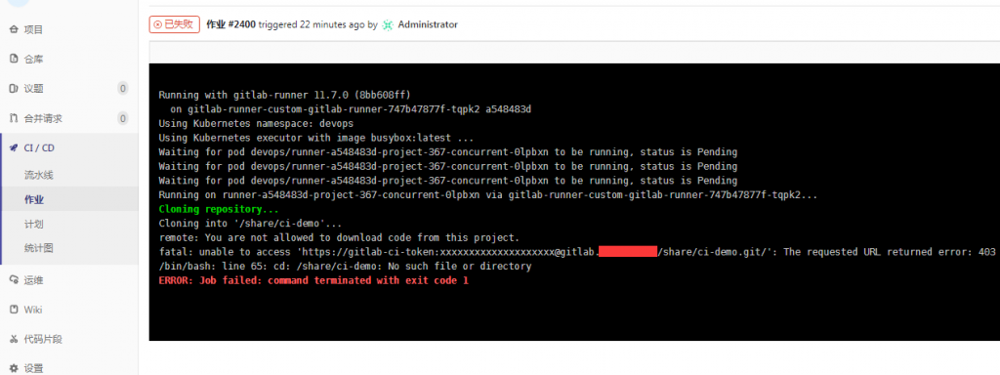
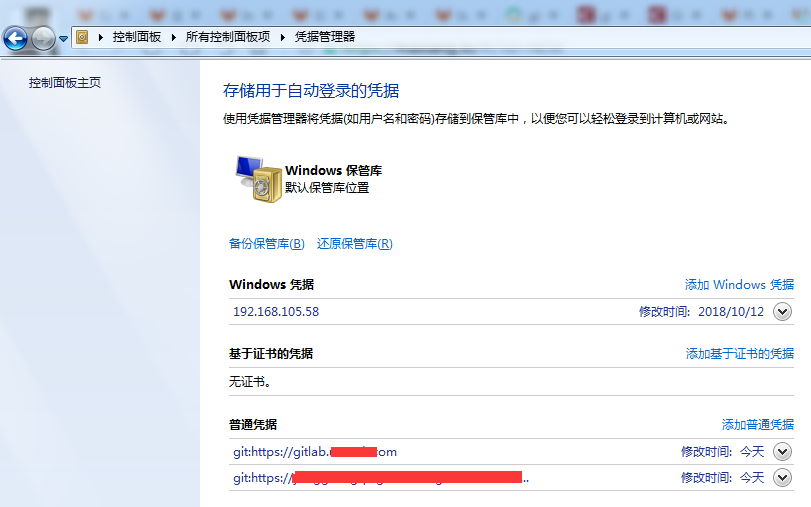
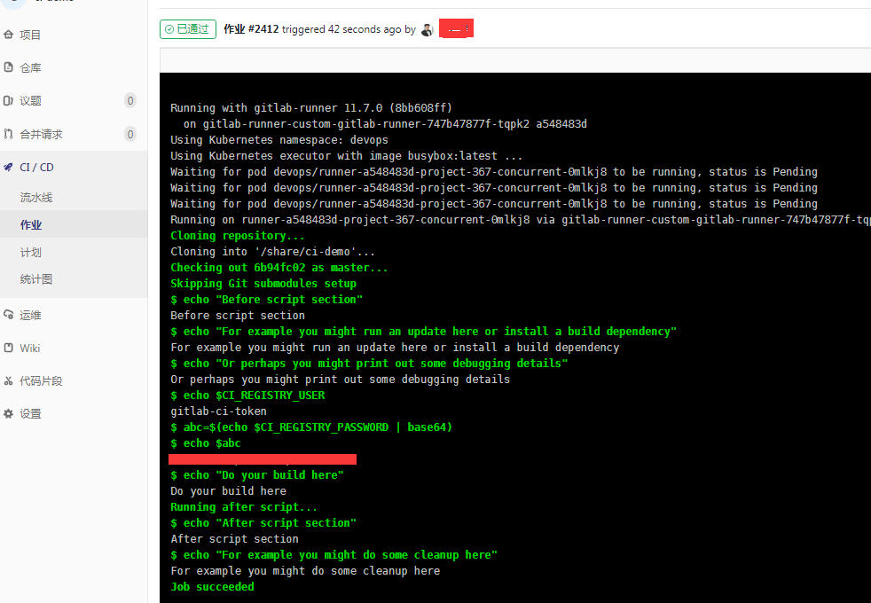

# GitLab CI/CD 因 git 凭据踩坑

[TOC]

## 1\. 问题

我在 windows 上，使用 git push 到 gitlab 中的私有项目上（项目是有 ci/cd 设置的），runner 执行时出现 403 权限问题，但是在页面上，点重试又是正常的。该问题花了我 2 天时间。。。开始怀疑是 gitlab 或者 runner 的问题，我环境复杂，又是集成 kubernetes，各种折腾，无果。

## 2\. 解决过程

既然 windows 的 git 命令不行，那试试 sourcetree，一样的结果。反而在 linux 上用 git 命令也试了，是正常的，当然每次都需要输入用户密码。

那是不是用户密码没有缓存进去呢？找了个博客，他说的问题原因，可能由于多个帐户缓存。

[https://blog.csdn.net/aimee1608/article/details/81041685](https://blog.csdn.net/aimee1608/article/details/81041685)

经过测试，linux 下 git url 中带用户密码，是可行的，但 windows 下还是不行。

索性，把 windows 下的 git 相关的凭据全部删除，git url 中不带用户密码（因为我们用户名都是邮箱，git url 好像不能包含用户名为邮箱）。

下面是正常的 pipeline 过程：

## 3\. 小结

1. 对比上面 CI 的图，有问题的 triggered 的用户为 Administrator，正常的则为 push 用户。因为我是 gitlab 管理员，我本机也缓存了 root 的用户密码，虽然我已经将 root 添加为该 git 项目的成员，但是在凭据管理器中，还是让 git 产生了混淆，CI 仍旧不能正确获取 push 的用户凭证；
2. gitlab 私有仓库权限严格，只有成员用户 push 才能触发 CI/CD，而且 push 的用户凭证，CI/CD 中需要获取到；
3. 出现问题，应该先根据问题现象找原因，再慢慢深入。我恰恰是去折腾 gitlab、runner、kubernetes 和 docker 版本的 gitlab 差异对比花了很多时间，最后才回来找 gitlab 403 错误。

这种细节，官方文档就算有，也很难找到，在此记录下。
