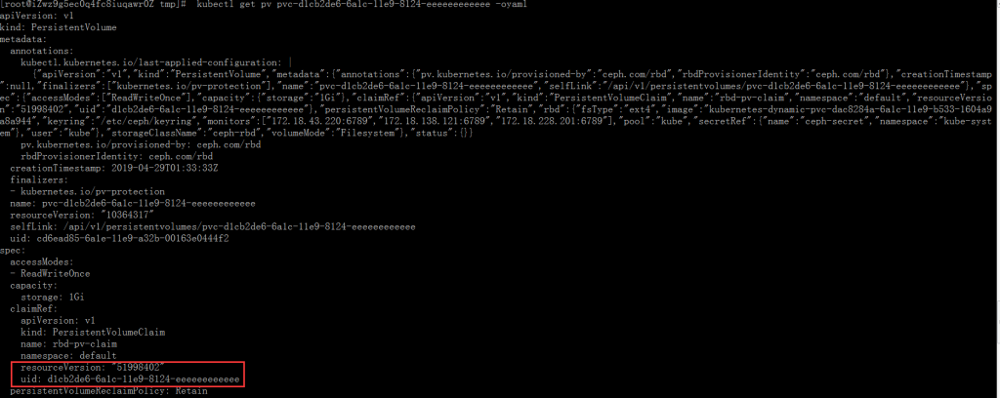
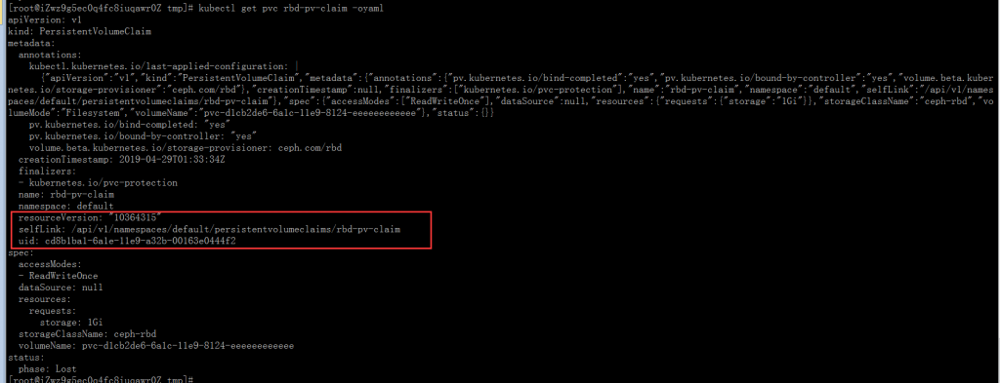
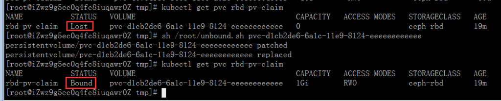
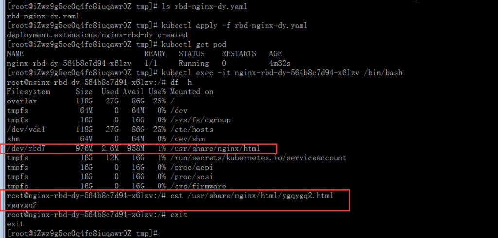

# 2 个 Kubernetes 使用同一个 Ceph 存储达到 Kubernetes 间持久化数据迁移

[TOC]

当前最新 Kubernetes 稳定版为 1.14。现在为止，还没有不同 Kubernetes 间持久化存储迁移的方案。但根据 Kubernetes pv/pvc 绑定流程和原理，只要 "存储"-->"PV"-->"PVC" 的绑定关系相同，即可保证不同间 Kubernetes 可挂载相同的存储，并且里面是相同数据。

## 1. 环境

原来我的 Kubernetes 为阿里云 ECS 自己搭建的，现在想切换使用阿里云购买的 Kubernetes。因 Kubernetes 中一些应用使用像 1G、2G 等小容量存储比较多，所以仍旧想保留原有的 Ceph 存储使用。

Kubernetes: v1.13.4 Ceph: 12.2.10 luminous (stable)

2 个 Kubernetes 存储使用 storageclass 管理，并连接相同 Ceph 集群。可参考：[Kubernetes 使用 Ceph 动态卷部署应用](https://blog.51cto.com/ygqygq2/2163656)

## 2. 迁移过程示例

数据依旧保留在存储中，并未真正有迁移动作，迁移只是相对于不同 Kubernetes 来讲。

### 2.1 提取旧 Kubernetes 持久化存储

为了更好的看到效果，这里新建一个 nginx 的 deploy，并使用 ceph rbd 做为持久化存储，然后写一些数据。

`vim rbd-claim.yaml`

```yaml
kind: PersistentVolumeClaim
apiVersion: v1
metadata:
  name: rbd-pv-claim
spec:
  accessModes:
    - ReadWriteOnce
  storageClassName: ceph-rbd
  resources:
    requests:
      storage: 1Gi
```

`vim rbd-nginx-dy.yaml`

```yaml
apiVersion: extensions/v1beta1
kind: Deployment
metadata:
  name: nginx-rbd-dy
spec:
  replicas: 1
  template:
    metadata:
      labels:
        name: nginx
    spec:
      containers:
        - name: nginx
          image: nginx
          imagePullPolicy: IfNotPresent
          ports:
            - containerPort: 80
          volumeMounts:
            - name: ceph-cephfs-volume
              mountPath: '/usr/share/nginx/html'
      volumes:
        - name: ceph-cephfs-volume
          persistentVolumeClaim:
            claimName: rbd-pv-claim
```

```bash
# 创建pvc和deploy
kubectl create -f rbd-claim.yaml
kubectl create -f rbd-nginx-dy.yaml
```

查看结果，并写入数据至 nginx 持久化目录中：

```
pod/nginx-rbd-dy-7455884d49-rthzt   1/1     Running   0          4m31s
[root@node5 tmp]# kubectl get pvc,pod
NAME                                                          STATUS   VOLUME                                     CAPACITY   ACCESS MODES   STORAGECLASS   AGE
persistentvolumeclaim/rbd-pv-claim                            Bound    pvc-d1cb2de6-6a1c-11e9-8124-eeeeeeeeeeee   1Gi        RWO            ceph-rbd       4m37s

NAME                                READY   STATUS    RESTARTS   AGE
pod/nginx-rbd-dy-7455884d49-rthzt   1/1     Running   0          4m36s
[root@node5 tmp]# kubectl exec -it nginx-rbd-dy-7455884d49-rthzt /bin/bash
root@nginx-rbd-dy-7455884d49-rthzt:/# df -h
Filesystem      Size  Used Avail Use% Mounted on
overlay          40G   23G   15G  62% /
tmpfs            64M     0   64M   0% /dev
tmpfs            16G     0   16G   0% /sys/fs/cgroup
/dev/vda1        40G   23G   15G  62% /etc/hosts
shm              64M     0   64M   0% /dev/shm
/dev/rbd5       976M  2.6M  958M   1% /usr/share/nginx/html
tmpfs            16G   12K   16G   1% /run/secrets/kubernetes.io/serviceaccount
tmpfs            16G     0   16G   0% /proc/acpi
tmpfs            16G     0   16G   0% /proc/scsi
tmpfs            16G     0   16G   0% /sys/firmware
root@nginx-rbd-dy-7455884d49-rthzt:/# echo ygqygq2 > /usr/share/nginx/html/ygqygq2.html
root@nginx-rbd-dy-7455884d49-rthzt:/# exit
exit
[root@node5 tmp]#
```

将 pv、pvc 信息提取出来：

```
[root@node5 tmp]# kubectl get pvc rbd-pv-claim -oyaml --export > rbd-pv-claim-export.yaml
[root@node5 tmp]# kubectl get pv pvc-d1cb2de6-6a1c-11e9-8124-eeeeeeeeeeee -oyaml --export > pvc-d1cb2de6-6a1c-11e9-8124-eeeeeeeeeeee-export.yaml
[root@node5 tmp]# more rbd-pv-claim-export.yaml
apiVersion: v1
kind: PersistentVolumeClaim
metadata:
  annotations:
    pv.kubernetes.io/bind-completed: "yes"
    pv.kubernetes.io/bound-by-controller: "yes"
    volume.beta.kubernetes.io/storage-provisioner: ceph.com/rbd
  creationTimestamp: null
  finalizers:
  - kubernetes.io/pvc-protection
  name: rbd-pv-claim
  selfLink: /api/v1/namespaces/default/persistentvolumeclaims/rbd-pv-claim
spec:
  accessModes:
  - ReadWriteOnce
  dataSource: null
  resources:
    requests:
      storage: 1Gi
  storageClassName: ceph-rbd
  volumeMode: Filesystem
  volumeName: pvc-d1cb2de6-6a1c-11e9-8124-eeeeeeeeeeee
status: {}
[root@node5 tmp]# more pvc-d1cb2de6-6a1c-11e9-8124-eeeeeeeeeeee-export.yaml
apiVersion: v1
kind: PersistentVolume
metadata:
  annotations:
    pv.kubernetes.io/provisioned-by: ceph.com/rbd
    rbdProvisionerIdentity: ceph.com/rbd
  creationTimestamp: null
  finalizers:
  - kubernetes.io/pv-protection
  name: pvc-d1cb2de6-6a1c-11e9-8124-eeeeeeeeeeee
  selfLink: /api/v1/persistentvolumes/pvc-d1cb2de6-6a1c-11e9-8124-eeeeeeeeeeee
spec:
  accessModes:
  - ReadWriteOnce
  capacity:
    storage: 1Gi
  claimRef:
    apiVersion: v1
    kind: PersistentVolumeClaim
    name: rbd-pv-claim
    namespace: default
    resourceVersion: "51998402"
    uid: d1cb2de6-6a1c-11e9-8124-eeeeeeeeeeee
  persistentVolumeReclaimPolicy: Retain
  rbd:
    fsType: ext4
    image: kubernetes-dynamic-pvc-dac8284a-6a1c-11e9-b533-1604a9a8a944
    keyring: /etc/ceph/keyring
    monitors:
    - 172.18.43.220:6789
    - 172.18.138.121:6789
    - 172.18.228.201:6789
    pool: kube
    secretRef:
      name: ceph-secret
      namespace: kube-system
    user: kube
  storageClassName: ceph-rbd
  volumeMode: Filesystem
status: {}
[root@node5 tmp]#
```

### 2.2 将提取出来的 pv、pvc 导入新 Kubernetes 中

将上文中提取出来的 pv 和 pvc 传至新的 Kubernetes 中：

```
[root@node5 tmp]# rsync -avz pvc-d1cb2de6-6a1c-11e9-8124-eeeeeeeeeeee-export.yaml rbd-pv-claim-export.yaml rbd-nginx-dy.yaml 172.18.97.95:/tmp/
sending incremental file list
pvc-d1cb2de6-6a1c-11e9-8124-eeeeeeeeeeee-export.yaml
rbd-nginx-dy.yaml
rbd-pv-claim-export.yaml

sent 1,371 bytes  received 73 bytes  2,888.00 bytes/sec
total size is 2,191  speedup is 1.52
[root@node5 tmp]#
```

在新的 Kubernetes 中导入 pv、pvc：

```
[root@iZwz9g5ec0q4fc8iuqawr0Z tmp]# kubectl apply -f pvc-d1cb2de6-6a1c-11e9-8124-eeeeeeeeeeee-export.yaml -f rbd-pv-claim-export.yaml
persistentvolume/pvc-d1cb2de6-6a1c-11e9-8124-eeeeeeeeeeee created
persistentvolumeclaim/rbd-pv-claim created
[root@iZwz9g5ec0q4fc8iuqawr0Z tmp]# kubectl get pv pvc-d1cb2de6-6a1c-11e9-8124-eeeeeeeeeeee
NAME                                       CAPACITY   ACCESS MODES   RECLAIM POLICY   STATUS     CLAIM                  STORAGECLASS   REASON   AGE
pvc-d1cb2de6-6a1c-11e9-8124-eeeeeeeeeeee   1Gi        RWO            Retain           Released   default/rbd-pv-claim   ceph-rbd                20s
[root@iZwz9g5ec0q4fc8iuqawr0Z tmp]# kubectl get pvc rbd-pv-claim
NAME           STATUS   VOLUME                                     CAPACITY   ACCESS MODES   STORAGECLASS   AGE
rbd-pv-claim   Lost     pvc-d1cb2de6-6a1c-11e9-8124-eeeeeeeeeeee   0                         ceph-rbd       28s
[root@iZwz9g5ec0q4fc8iuqawr0Z tmp]#
```

可以看到，pvc 状态显示为`Lost`，这是因为在新的 Kubernetes 中导入 pv 和 pvc 后，它们会自动重新生成自己的`resourceVersion`和`uid`，因此在新导入的 pv 中的`spec.claimRef`信息为旧的：





为了解决新导入的 pv 中的`spec.claimRef`信息旧的变成新的，我们将这段信息删除，由 provisioner 自动重新绑定它们的关系：

这里我们做成一个脚本处理：

`vim unbound.sh`

```bash
pv=$*
function unbound() {
    kubectl patch pv -p '{"spec":{"claimRef":{"apiVersion":"","kind":"","name":"","namespace":"","resourceVersion":"","uid":""}}}' \
        $pv
    kubectl get pv $pv -oyaml> /tmp/.pv.yaml
    sed '/claimRef/d' -i /tmp/.pv.yaml
    #kubectl apply -f /tmp/.pv.yaml
    kubectl replace -f /tmp/.pv.yaml
}

unbound
```

```bash
sh unbound.sh pvc-d1cb2de6-6a1c-11e9-8124-eeeeeeeeeeee
```

脚本执行后，过个 10 秒左右，查看结果：



在新的 Kubernetes 中使用之前传的`rbd-nginx-dy.yaml`验证下，在此之前，因为使用 ceph rbd，需要先解除旧 Kubernetes 上的 pod 占用该 rbd：

旧 Kubernetes：

```
[root@node5 tmp]# kubectl delete -f rbd-nginx-dy.yaml
deployment.extensions "nginx-rbd-dy" deleted
```

新 Kubernetes：



## 3. 小结

上面实验中，使用的是`RWO`的 pvc，大家试想下，如果使用`RWX`，多个 Kubernetes 使用，这种使用场景可能有更大的作用。

Kubernetes 使用过程中，pv、pvc 和存储，它们的信息和绑定关系至关重要，所以可按需求当作日常备份，有了这些备份，即使 Kubernetes etcd 数据损坏，也可达到恢复和迁移 Kubernetes 持久化数据目的。
