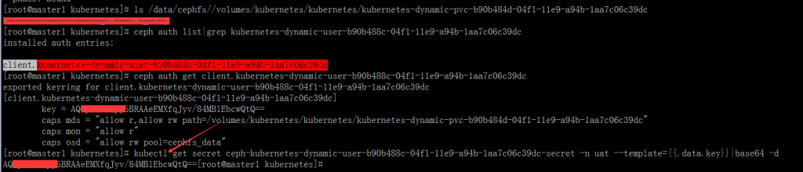
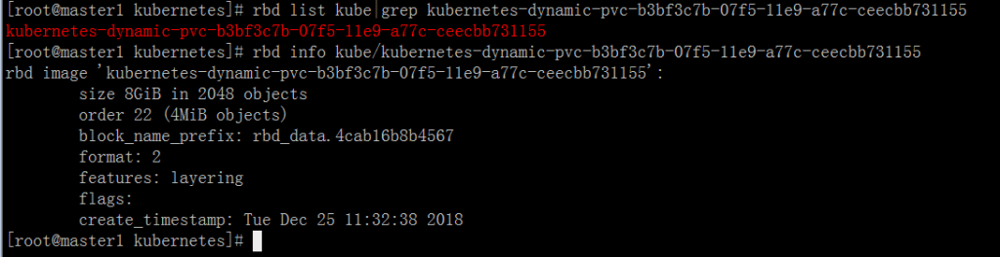

# Kubernetes+Ceph 时 cephfs 和 ceph-rbd 的 PV 管理

[TOC]

## 1\. 目的

**环境**： Kubernetes: v1.13.4 Ceph: 12.2.10 luminous (stable) external storage provisioner: [https://github.com/kubernetes-incubator/external-storage/tree/master/ceph](https://github.com/kubernetes-incubator/external-storage/tree/master/ceph)

**目的**： Kubernetes storage class 使用以上 provisioner 管理 pv/pvc 时，默认不支持 recycle 回收策略，且 pv 创建后，除非人为删除，其会一直存在。为了更好的管理 pv/pvc，本文以 shell 脚本方式人为补充管理。

相关脚本： [https://github.com/ygqygq2/kubernetes/tree/master/shell/pv-manage](https://github.com/ygqygq2/kubernetes/tree/master/shell/pv-manage)

## 2\. 相关原理

介绍下上面脚本中使用的一些原理细节。

### 2.1 PV 的状态切换与 PVC 的关系

以下文章中已经通过具体示例测试 PV 的`Released`和`Available`状态切换： [Kubernetes PV 在 Retain 策略 Released 状态下重新分配到 PVC 恢复数据](https://blog.51cto.com/ygqygq2/2308576)

### 2.2 删除 PV 需要在 ceph 集群中删除哪些信息

删除 PV 后，ceph 集群中原来 Kubernetes 使用的相关资源并未完全删除，因此如果想要完成删除，需要了解它们之间的关联。

**准备工作** ceph 管理节点挂载 CephFS

将 ceph 用户密钥提取至`/etc/ceph/ceph.client.admin.secret`，并使用它将 cephfs 根目录挂载至特定目录：

```
yum -y install ceph-fuse
mount -t ceph 192.168.105.92:6789,192.168.105.93:6789,192.168.105.94:6789:/ /data/cephfs -oname=admin,secretfile=/etc/ceph/ceph.client.admin.secret
```

如下可设置开机自动挂载： `/etc/fstab`添加一行

```
192.168.105.92:6789,192.168.105.93:6789,192.168.105.94:6789:/ /data/cephfs ceph name=admin,secretfile=/etc/ceph/ceph.client.admin.secret,noatime 0 0
```

**查看一个 cephfs 类型的 PV**：

```yaml
apiVersion: v1
kind: PersistentVolume
metadata:
  annotations:
    cephFSProvisionerIdentity: cephfs-provisioner-1
    cephShare: kubernetes-dynamic-pvc-b90b484d-04f1-11e9-a94b-1aa7c06c39dc
    pv.kubernetes.io/provisioned-by: ceph.com/cephfs
  creationTimestamp: "2018-12-21T07:26:26Z"
  finalizers:
    - kubernetes.io/pv-protection
  name: pvc-b787c1cf-04f1-11e9-812d-eeeeeeeeeeee
  resourceVersion: "3894910"
  selfLink: /api/v1/persistentvolumes/pvc-b787c1cf-04f1-11e9-812d-eeeeeeeeeeee
  uid: b9b805e9-04f1-11e9-8460-000c29ee2954
spec:
  accessModes:
    - ReadWriteMany
  capacity:
    storage: 2Gi
  cephfs:
    monitors:
      - 192.168.105.92:6789
      - 192.168.105.93:6789
      - 192.168.105.94:6789
    path: /volumes/kubernetes/kubernetes/kubernetes-dynamic-pvc-b90b484d-04f1-11e9-a94b-1aa7c06c39dc
    secretRef:
      name: ceph-kubernetes-dynamic-user-b90b488c-04f1-11e9-a94b-1aa7c06c39dc-secret
      namespace: uat
    user: kubernetes-dynamic-user-b90b488c-04f1-11e9-a94b-1aa7c06c39dc
  claimRef:
    apiVersion: v1
    kind: PersistentVolumeClaim
    name: plat-zuul-utcook
    namespace: uat
    resourceVersion: "3894873"
    uid: b787c1cf-04f1-11e9-812d-eeeeeeeeeeee
  persistentVolumeReclaimPolicy: Retain
  storageClassName: cephfs
  volumeMode: Filesystem
status:
  phase: Bound
```

ceph 管理节点做些确认：

```bash
ls /data/cephfs/volumes/kubernetes/kubernetes/kubernetes-dynamic-pvc-b90b484d-04f1-11e9-a94b-1aa7c06c39dc
ceph auth list|grep kubernetes-dynamic-user-b90b488c-04f1-11e9-a94b-1aa7c06c39dc
# 依据上面一条命令所得到的信息 client.kubernetes-dynamic-user-b90b488c-04f1-11e9-a94b-1aa7c06c39dc
ceph auth get client.[client.kubernetes-dynamic-user-b90b488c-04f1-11e9-a94b-1aa7c06c39dc]
```

kubernetes 管理节点做些确认：

```bash
kubectl get secret ceph-client.kubernetes-dynamic-user-b90b488c-04f1-11e9-a94b-1aa7c06c39dc-secret -n uat --template={{.data.key}}|base64 -d
```

可以看出两边的`key`和`path`是对应的。因此，如果删除此 pv，相关的资源有：ceph 中的 auth、path，kubernetes 中的 pv、secret。



**查看一个 rbd 类型的 PV**：

```yaml
apiVersion: v1
kind: PersistentVolume
metadata:
  annotations:
    pv.kubernetes.io/provisioned-by: ceph.com/rbd
    rbdProvisionerIdentity: ceph.com/rbd
  creationTimestamp: "2018-12-25T03:32:38Z"
  finalizers:
    - kubernetes.io/pv-protection
  name: pvc-b97cf919-07f5-11e9-8183-0050568ddb46
  resourceVersion: "5113288"
  selfLink: /api/v1/persistentvolumes/pvc-b97cf919-07f5-11e9-8183-0050568ddb46
  uid: ba318fd1-07f5-11e9-b415-000c297f476b
spec:
  accessModes:
    - ReadWriteOnce
  capacity:
    storage: 8Gi
  claimRef:
    apiVersion: v1
    kind: PersistentVolumeClaim
    name: redis-data-harbor-redis-master-0
    namespace: devops
    resourceVersion: "5109726"
    uid: b97cf919-07f5-11e9-8183-0050568ddb46
  persistentVolumeReclaimPolicy: Retain
  rbd:
    fsType: ext4
    image: kubernetes-dynamic-pvc-b3bf3c7b-07f5-11e9-a77c-ceecbb731155
    keyring: /etc/ceph/keyring
    monitors:
      - 192.168.105.92:6789
      - 192.168.105.93:6789
      - 192.168.105.94:6789
    pool: kube
    secretRef:
      name: ceph-secret
      namespace: kube-system
    user: kube
  storageClassName: ceph-rbd
  volumeMode: Filesystem
status:
  phase: Released
```

从以上看出，因为 rbd 下 user 和 pool 都是共用的，所以只要确认 image，这样如果要删除此 pv，相关的资源有：ceph 中的 image，kubernetes 中的 pv。



## 3\. 小结

以上环境中，cephfs 的 pv 虽有大小设置，但是实际使用过程中并未发现有大小限制，参考资料\[5\]、\[6\]中可以查看相关详情。 另外，此文章[Kubernetes 容器挂载 ceph rbd 卷的平滑扩容方法](https://blog.csdn.net/shida_csdn/article/details/79193009)，也是我经过实践证明可行的。

参考资料： \[1\] [http://docs.ceph.org.cn/cephfs/kernel/](http://docs.ceph.org.cn/cephfs/kernel/) \[2\] [http://docs.ceph.org.cn/cephfs/fstab/](http://docs.ceph.org.cn/cephfs/fstab/) \[3\] [http://docs.ceph.org.cn/rbd/rados-rbd-cmds/](http://docs.ceph.org.cn/rbd/rados-rbd-cmds/) \[4\] [https://blog.csdn.net/shida_csdn/article/details/79193009](https://blog.csdn.net/shida_csdn/article/details/79193009) \[5\] [http://docs.ceph.org.cn/cephfs/quota/](http://docs.ceph.org.cn/cephfs/quota/) \[6\] [https://www.cnblogs.com/ltxdzh/p/9173706.html](https://www.cnblogs.com/ltxdzh/p/9173706.html)
