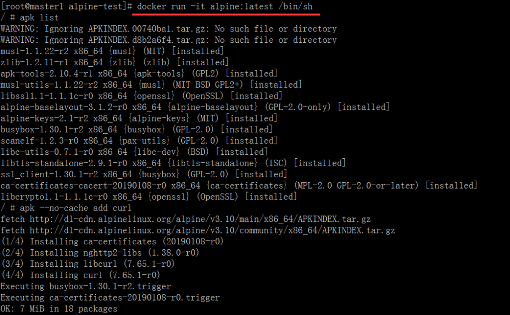
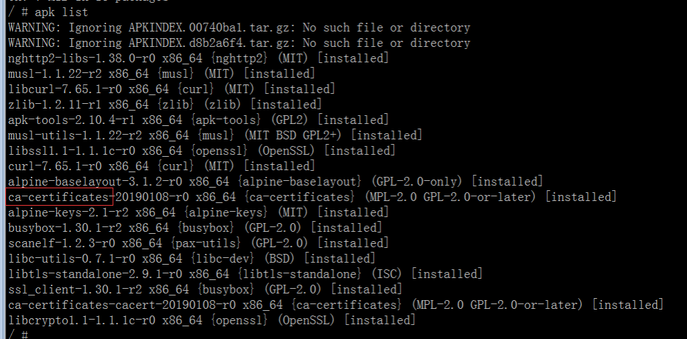
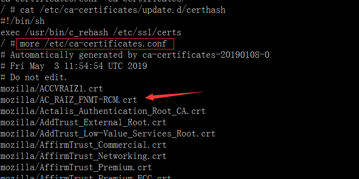
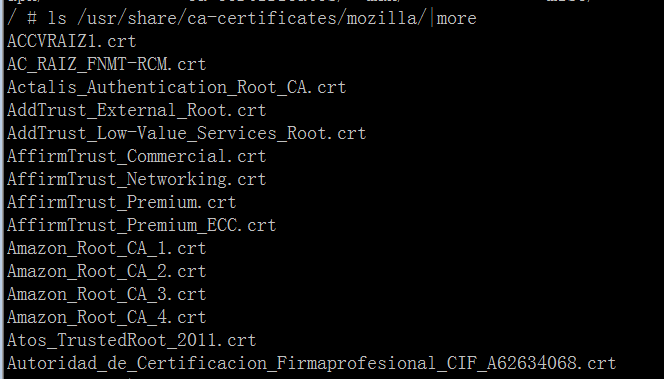
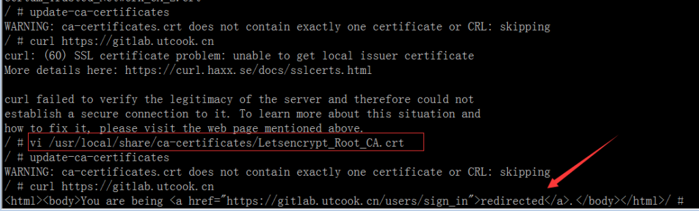
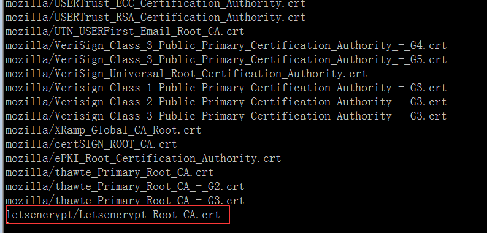
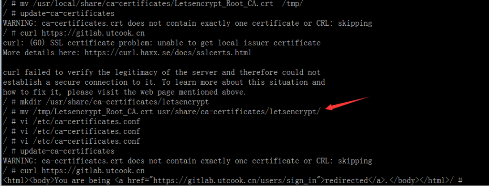
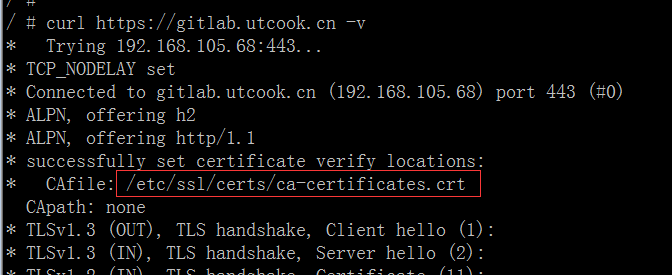

# Alpine Linux添加Let's Encrypt CA证书或者自签CA证书

[toc]

## 1. 用docker进行查看

进入容器， `docker run -it alpine:latest /bin/sh`



安装curl， `apk --no-cache add curl`

对比发现curl依赖ca-certificates，



网上查到`update-ca-certificates`命令为更新系统ca证书，



## 2. 添加CA证书

经过操作总结，发现有2种方式添加ca证书至系统内，以下示例：

### 2.1 放至目录`/usr/local/share/ca-certificates/`

将Let's Encrypt Authority X3的CA证书`Letsencrypt_Root_CA.crt`放至目录`/usr/local/share/ca-certificates/`下，并执行`update-ca-certificates`，即可完成证书更新。

```
-----BEGIN CERTIFICATE-----
MIIEkjCCA3qgAwIBAgIQCgFBQgAAAVOFc2oLheynCDANBgkqhkiG9w0BAQsFADA/
MSQwIgYDVQQKExtEaWdpdGFsIFNpZ25hdHVyZSBUcnVzdCBDby4xFzAVBgNVBAMT
DkRTVCBSb290IENBIFgzMB4XDTE2MDMxNzE2NDA0NloXDTIxMDMxNzE2NDA0Nlow
SjELMAkGA1UEBhMCVVMxFjAUBgNVBAoTDUxldCdzIEVuY3J5cHQxIzAhBgNVBAMT
GkxldCdzIEVuY3J5cHQgQXV0aG9yaXR5IFgzMIIBIjANBgkqhkiG9w0BAQEFAAOC
AQ8AMIIBCgKCAQEAnNMM8FrlLke3cl03g7NoYzDq1zUmGSXhvb418XCSL7e4S0EF
q6meNQhY7LEqxGiHC6PjdeTm86dicbp5gWAf15Gan/PQeGdxyGkOlZHP/uaZ6WA8
SMx+yk13EiSdRxta67nsHjcAHJyse6cF6s5K671B5TaYucv9bTyWaN8jKkKQDIZ0
Z8h/pZq4UmEUEz9l6YKHy9v6Dlb2honzhT+Xhq+w3Brvaw2VFn3EK6BlspkENnWA
a6xK8xuQSXgvopZPKiAlKQTGdMDQMc2PMTiVFrqoM7hD8bEfwzB/onkxEz0tNvjj
/PIzark5McWvxI0NHWQWM6r6hCm21AvA2H3DkwIDAQABo4IBfTCCAXkwEgYDVR0T
AQH/BAgwBgEB/wIBADAOBgNVHQ8BAf8EBAMCAYYwfwYIKwYBBQUHAQEEczBxMDIG
CCsGAQUFBzABhiZodHRwOi8vaXNyZy50cnVzdGlkLm9jc3AuaWRlbnRydXN0LmNv
bTA7BggrBgEFBQcwAoYvaHR0cDovL2FwcHMuaWRlbnRydXN0LmNvbS9yb290cy9k
c3Ryb290Y2F4My5wN2MwHwYDVR0jBBgwFoAUxKexpHsscfrb4UuQdf/EFWCFiRAw
VAYDVR0gBE0wSzAIBgZngQwBAgEwPwYLKwYBBAGC3xMBAQEwMDAuBggrBgEFBQcC
ARYiaHR0cDovL2Nwcy5yb290LXgxLmxldHNlbmNyeXB0Lm9yZzA8BgNVHR8ENTAz
MDGgL6AthitodHRwOi8vY3JsLmlkZW50cnVzdC5jb20vRFNUUk9PVENBWDNDUkwu
Y3JsMB0GA1UdDgQWBBSoSmpjBH3duubRObemRWXv86jsoTANBgkqhkiG9w0BAQsF
AAOCAQEA3TPXEfNjWDjdGBX7CVW+dla5cEilaUcne8IkCJLxWh9KEik3JHRRHGJo
uM2VcGfl96S8TihRzZvoroed6ti6WqEBmtzw3Wodatg+VyOeph4EYpr/1wXKtx8/
wApIvJSwtmVi4MFU5aMqrSDE6ea73Mj2tcMyo5jMd6jmeWUHK8so/joWUoHOUgwu
X4Po1QYz+3dszkDqMp4fklxBwXRsW10KXzPMTZ+sOPAveyxindmjkW8lGy+QsRlG
PfZ+G6Z6h7mjem0Y+iWlkYcV4PIWL1iwBi8saCbGS5jN2p8M+X+Q7UNKEkROb3N6
KOqkqm57TH2H3eDJAkSnh6/DNFu0Qg==
-----END CERTIFICATE-----
```



### 2.2 放至目录`/usr/share/ca-certificates/`

将Let's Encrypt Authority X3的CA证书`Letsencrypt_Root_CA.crt`放至目录`/usr/share/ca-certificates/`下，在文件`/etc/ca-certificates.conf`中配置引用路径，并执行`update-ca-certificates`，即可完成证书更新。



## 3. 小结

从curl命令过程可以看出，`/etc/ssl/certs/ca-certificates.crt`是最终生效的CA文件，因此，可以将CA证书的内容直接添加进此文件。`update-ca-certificates`其实也就是干的这件事，在没有此命令时，直接添加内容至CA文件中是最好的选择。



以下是gitlab-runner不支持letsencrypt证书解决办法：

`Dockerfile`

```
FROM gitlab/gitlab-runner:alpine-v11.11.2

USER root
COPY Letsencrypt_Root_CA.crt /usr/local/share/ca-certificates/
RUN apk --no-cache add ca-certificates \
  && rm -rf /var/cache/apk/* \
  && update-ca-certificates

USER gitlab-runner
```
