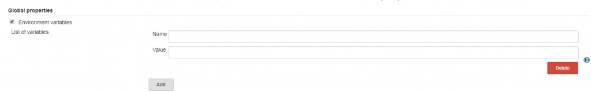
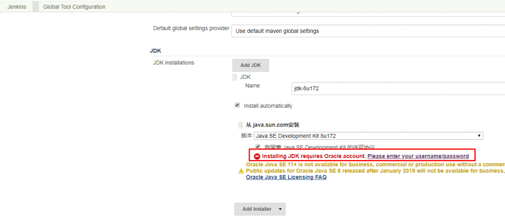
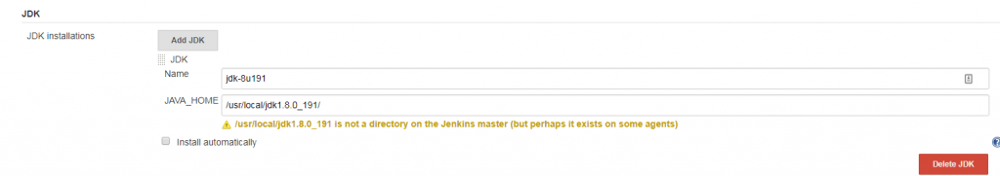
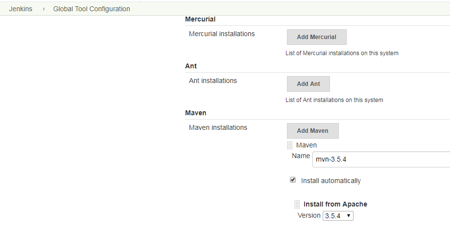
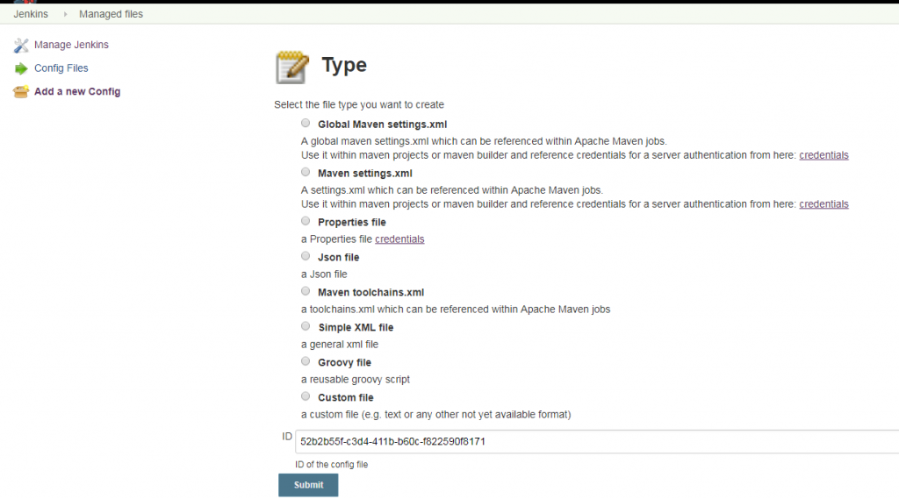
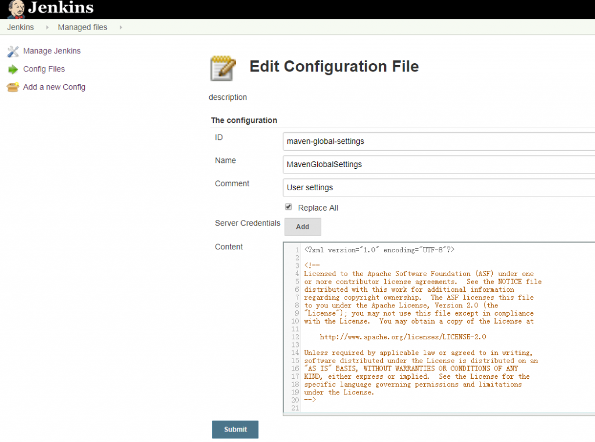
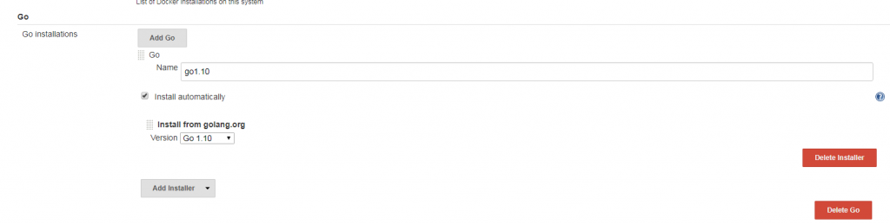

[TOC]

# 1. 环境变量

环境变量可以被看作是 pipeline 与 Jenkins 交互的媒介。比如，可以在 pipeline 中通过 BUILD_NUMBER 变量知道构建任务的当前构建次数。环境变量可以分为 Jenkins 内置变量和自定义变量。

## 1.1 内置变量

在 pipeline 执行时，Jenkins 通过一个名为 env 的全局变量，将 Jenkins 内置环境变量暴露出来。其使用方法有多种，示例如下:

```Jenkinsfile
pipeline {
  agent any
  stages {
    stage('Example') {
      steps {
         echo "Running ${env.BUILDNUMBER} on ${env.JENKINS_URL}" # 方法1 推荐
         echo "Running $env.BUILDNUMBER on $env.JENKINS_URL"  # 方法2
         echo "Running ${BUILDNUMBER} on ${JENKINS_URL}"   # 方法3 不推荐，难排查
      }
    }
  }
}
```

通过访问`<Jenkins master的地址>/pipeline-syntax/globals#env`来获取完整列表。在列表中，当一个变量被声明为"For a multibranch project"时，代表只有多分支项目才会有此变量。

下面简单介绍几个在实际工作中经常用到的变量。

- `BUILD_ NUMBER`：构建号，累加的数字。在打包时，它可作为制品名称的一部分，比如`server-2.jar`。
- `BRANCH_ NAME`：多分支 pipeline 项目支持。当需要根据不同的分支做不同的事情时就会用到，比如通过代码将 release 分支发布到生产环境中、master 分支发布到测试环境中。
- `BUILD_ URL`：当前构建的页面 URL。如果构建失败，则需要将失败的构建链接放在邮件通知中，这个链接就可以是`BUILD _URL`。
- `GIT_BRANCH`：通过 git 拉取的源码构建的项目才会有此变量。

在使用`env`变量时，需要注意不同类型的项目，`env`变量所包含的属性及其值是不一样的。比如普通 pipeline 任务中的`GIT_BRANCH`变量的值为`origin/master`，而在多分支 pipeline 任务中`GIT_BRANCH`变量的值为`master`。 所以，在 pipeline 中根据分支进行不同行为的逻辑处理时，需要留意。

## 1.2 自定义 pipeline 环境变量

当 pipeline 变得复杂时，我们就会有定义自己的环境变量的需求。声明式 pipeline 提供了`environment`指令，方便自定义变量。比如：

```Jenkinsfile
pipeline {
    agent any
    environment {
        CC = "clang"
    }
    stages {
        stage("Example") {
            environment {
                DEBUG_FLAGS = "-g"
            }
            steps {
                sh "${CC} ${DEBUG_FLAGS}"
                sh "printenv"
            }
        }
    }
}
```

`environment`指令可以用在 pipeline 中定义，作用域就是整个 pipeline，当定义在`stage`阶段，只在当前`stage`有效。

但是这些变量都不是跨 pipeline 的，比如 pipeline a 访问不到 pipeline b 的变量。在 pipeline 之间共享变量可以通过参数化 pipeline 来实现。

环境变量的互相引用：

```
environment {
    __server_name = 'mail-server'
    __version = "${BUILD_NUMBER}"
    __artifact_name = "${__server_name}-${__version}.jar"
}
```

小技巧 ：

1. 在调试 pipeline 时，可以在 pipeline 的开始阶段加一句：`sh 'printenv'`，将`env`变量的属性值打印出来。这样可以帮助我们避免不少问题。
2. 自定义变量时，为避免命名冲突，可根据项目或公司加上统一前缀，如`__server_name`，`__`就是前缀。

## 1.3 自定义全局环境变量

定义全局环境变量可以跨 pipeline 使用。 进入 Jenkins→Manage Jenkins→Confiure System 找到 Global properties→ 勾选"Environment variables"复选框，单击“Add”按钮，在输入框中输入变量名和变量值即可。



自定义全局环境变量会被加入`env`属性列表中，所以使用时可以直接用`${env.g_name}`引用。

# 2. 构建工具

构建是指将源码转换成一个可使用的二进制程序的过程。这个过程可以包括但不限于这几个环节：下载依赖、编译、打包。构建过程的输出——比如一个 zip 包，我们称之为制品（有些书籍也称之为产出物）。而管理制品的仓库，称为制品库。

## 2.1 构建工具的选择

对构建工具的选择，还取决于团队对工具本身的接受程度。建议是，团队中同一技术栈的所有项目都使用同一个构建工具。

## 2.2 `tools`指令介绍

`tools`指令能帮助我们自动下载并安装所指定的构建工具，并将其加入`PATH`变量中。这样，我们就可以在`sh`步骤里直接使用了。但在`agent none`的情况下不会生效。

`tools`指令默认支持 3 种工具：JDK、Maven、Gradle。通过安装插件，`tools`指令还可以支持更多的工具。接下来，我们介绍几种常用的构建环境的搭建。

## 2.3 JDK 环境搭建

### 2.3.1 自动安装 JDK

进入 Manage Jenkins→Global Tool Configuration→JDK 页，单击“Add JDK”：



> 注意
>
> 1. 这里需要 oracle 帐户验证。
> 2. Jenkins 不会马上下载 JDK，而是当 pipeline 使用到时才会直接执行下载操作。

### 2.3.2 自定义 JDK 路径

基于安全的考虑，公司的内网可能无法直接访问因特网或者因为无法访问官方插件地址，所以使用自动下载会失败。这时就需要在 Jenkins agent 上准备 JDK，然后在 Manage Jenkins→Global Tool Configuration→JDK 页中指定名称和`JAVA_HOME`路径：



> 注意
>
> 1. 使用 docker agent 或者 kubernetes agent 时，可使用 agent 基础镜像内安装 JDK 定制成自定义镜像。
> 2. 可以脚本自动化，即在使用`tools`安装 JDK 前，脚本自动提前准备好这个`JAVA_HOME`的 JDK。

## 2.4 Maven

### 2.4.1 使用 Maven 进行构建

Jenkins pipeline 的 tools 指令默认就支持 Maven。所以，使用 Maven 只需要两步。

1. 进入 Manage Jenkins→Global Tool Configuration→Maven 页，单击“Add Maven”：



2. 在 Jenkinsfile 中指定 Maven 版本，并使用`mvn`命令。

### 2.4.2 使用 Managed files 设置 Maven

Maven 默认使用的是其官方仓库，国内下载速度很慢。所以，我们通常会使用国内的 Maven 镜像仓库。这时就需要修改 Maven 的配置文件 `settings.xml`。`settings.xml` 文件的默认路径为`${M2_HOME}/conf/settings.xml`。但是，我们是不可能登录上 Jenkins 的机器，然后手动修改这个文件的。 [Config File Provider 插件](https://plugins.jenkins.io/config-file-provider)能很好地解决这个问题。只需要在 Jenkins 的界面上填入`settings.xml`的内容，然后在 pipeline 中指定`settings.xml`就可以了。也就是说，对于不同的 pipeline，可以使用不同的`settings.xml`。 具体实现方法如下：

1. 安装 Config File Provider 插件。
2. 进入 Manage Jenkins 页面，就可以看到多出一个“Managed files”菜单。
3. 单击“Managed files”进入，在左侧菜单栏中选择“Add a new Config”，就会看到该插件支持很多种配置文件的格式及方式，



4. 选择“Global Maven settings.xml”选项。因为我们的设置是全局的。填写“ID”字段，Jenkins pipeline 会引用此变量名。假如使用的 ID 为 maven-global-settings。
5. 在编辑页将自定义的 Maven `settings.xml`的内容粘贴到“Content”字段中，



6. 在 Jenkins pipeline 中使用的方法如下：

```Jenkinsfile
configFileProvider([configFile(fileId: "maven-global-settings", variable: "MAVEN_GLOBAL_ENV")]) {
    sh "mvn -s $MAVEN_GLOBAL_ENV clean install"
}
```

## 2.5 Go 语言环境搭建

Jenkins 支持 Golang 的构建，只需要以下几步。

1. 安装[Go 插件](https：//plugins.jenkins.io/golang)。
2. 进入 Manage Jenkins→Global Tool Configuration→Go 页



3. 在 pipeline 中加入`tools`部分。

```Jenkinsfile
pipeline {
    agent none
    environment {
        GOPATH = "${env.WORKSPACE}/"
    }
    tools {
        go 'go1.10'
    }
    stages {
        stage('build') {
            steps {
                sh "go build"
            }
        }
    }
}
```

此时，在环境变量中会增加一个`GOROOT`变量。

4. 设置`GOPATH`。了解 Go 语言开发的读者都会知道，编译时需要设置`GOPATH`环境变量。直接在`environment`指令中添加就可以了。

## 2.6 Python 环境搭建

Python 环境很容易产生 Python 版本冲突、第三方库冲突等问题。所以，Python 开发通常会进行工程级别的环境隔离，也就是每个 Python 工程使用一个 Python 环境。

在 Jenkins 环境下，我们使用[Pyenv Pipeline 插件](https://plugins.jenkins.io/pyenv-pipeline)可以轻松地实现。 首先，准备 Python 基础环境。

1. 在 Jenkins 机器上安装 python、pip、virtualenv。
   - pip：Python 的包管理工具。
   - virtualenv：Python 中的虚拟环境管理工具。
2. 安装 Pyenv Pipeline 插件。 然后，在 pipeline 中使用 Pyenv Pipeline 插件提供的`withPythonEnv`方法。

```
withPythonEnv("/usr/bin/python") {
    sh "python --version"
}
```

`withPythonEnv`方法会根据第一个参数——可执行 python 路径——在当前工作空间下创建一个 virtualenv 环境。 `withPythonEnv`方法的第二个参数是一个闭包。闭包内的代码就执行在新建的 virtualenv 环境下。

# 3. 利用环境变量支持更多的构建工具

不是所有的构建工具都需要安装相应的 Jenkins 插件才可以使用。 平时，开发人员在搭建开发环境时做的就是：首先在机器上安装好构建工具，然后将这个构建工具所在目录加入 PATH 环境变量中。 如果想让 Jenkins 支持更多的构建工具，也是同样的做法：在 Jenkins agent 上安装构建工具，并记录下它的可执行命令的目录，然后在需要使用此命令的 Jenkins pipeline 的 PATH 环境变量中加入该可执行命令的目录。示例如下：

```Jenkinsfile
pipeline {
    agent none
    environment {
        PATH = "/usr/local/customtool/bin:$PATH"
    }
    stages {
        stage('build') {
            steps {
                sh "customtool build"
            }
        }
    }
}
```

还可以有另一种写法：

```Jenkinsfile
pipeline {
    agent none
    environment {
        CUSTOM_TOOL_HOME = "/usr/local/customtool/bin"
    }
    stages {
        stage('build') {
            steps {
                sh "${CUSTOM_TOOL_HOME}/customtool build"
            }
        }
    }
}
```

# 4. 利用 tools 作用域实现多版本编译

在实际工作中，有时需要对同一份源码使用多个版本的编译器进行编译。`tools`指令除了支持 pipeline 作用域，还支持`stage`作用域。所以，我们可以在同一个 pipeline 中实现多版本编译。代码如下：

```
pipeline {
    agent none
    stages {
        stage('build with jdk-10.0.2') {
            tools {
                jdk "jdk-10.0.2"
            }
            steps {
                sh "printenv"
            }
        }
        stage('build with jdk-9.0.4') {
            tools {
                jdk "jdk-9.0.4"
            }
            steps {
                sh "printenv"
            }
        }
    }
}
```

在打印出来的日志中，会发现每个 stage 下的`JAVA_HOME`变量的值都不一样。

参考资料： [1] 《Jenkins 2.x 实战指南》 [2] [https://jenkins.io/zh/doc/book/pipeline/syntax/](https://jenkins.io/zh/doc/book/pipeline/syntax/) [3] [https://jenkins.io/zh/doc/pipeline/steps/](https://jenkins.io/zh/doc/pipeline/steps/)
