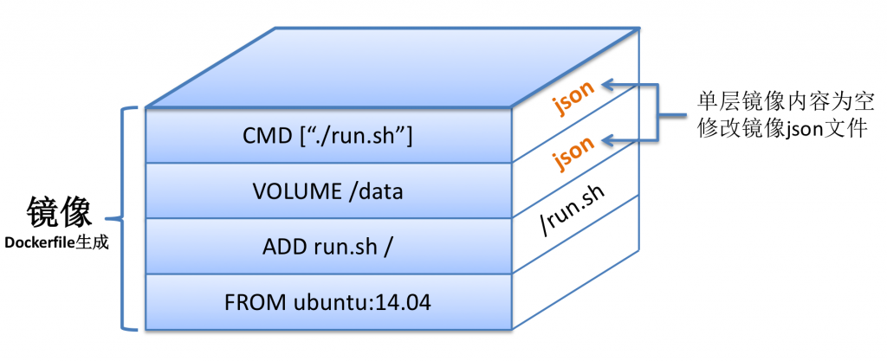

[TOC]

# 1. 为什么要优化`Dockerfile`

我们如果使用`Dockerfile`来构建 Docker 镜像，如果一不小心就会导致镜像大小超过 1G，这是非常恐怖的。一般也都是好几百兆。较大的镜像往往会导致移植，迁移缓慢，部署上线也就慢。 `Dockerfile`就像代码一样需要持续去进行优化。使用下面的几个优化方案，可以大幅度的减小镜像的大小。

# 2. 优化方案

## 2.1 减少镜像层数

最重要的因素是减少镜像的层数，这样能大大减小镜像的大小； 当然在减少层数和增加层数但能减少编译时长上，可以适当衡量。



> 说明：
>
> 1. docker 镜像可以看出是分层的，分层方向与`Dockerfile`相反，自下而上；
> 2. docker 镜像每一层是共享的，即同一台机器中，如果`Dockerfile`编译的时候，前面的内容相同，则相应的层是引用相同的，当然内容自`Dockerfile`中要自上而下相同，有出现不一样的层数的时候，后面的层内容都会不同，基于这个原理，在没有任何修改的情况下，后面的编译都是使用之前的镜像缓存；
> 3. 一层新的命令形成新的一层，如果涉及磁盘更新，而且没有在同一层删除，无论文件是否最后删除，都会带到下一层。

基于上面的说明，层数越小，每一层大小越小，镜像总体就越小。

以下为一个示例，其优化原理是相邻的命令间用`&&`让其只形成一层。

```dockerfile
# 基础镜像
FROM node:10.16-alpine as builder

# 拷贝静态资源文件
COPY . /app/

# 工作目录
WORKDIR /app

RUN yarn config set registry https://registry.npm.taobao.org \
  && yarn config set sass-binary-site http://npm.taobao.org/mirrors/node-sass \
  && yarn global add http-server@0.9.0 \
  && yarn install \
  && yarn build

# 暴露端口
EXPOSE 80

# 启动参数
CMD [ "http-server", "build", "-p", "80" ]
```

但是，有种情况是分层更优的，共目的是为了减少 docker 编译时间，比如：

```dockerfile
FROM alpine:latest

# command1耗时久，且比较稳定
RUN command1
# command2涉及更新内容频繁
RUN command2
```

因为`command1`耗时久，比如安装依赖包，而`command2`更新频繁，比如代码修改。这种场景下，如果每次编译都需要安装很久的依赖包，这样体验非常差，因为安装依赖包这部分很少有变化，所以如果分开 2 层，前面安装依赖包就会使用缓存，这样编译就非常快了。

## 2.2 基于更小的镜像

在保证功能前提下，尽量使用更小的镜像。比如使用基于`alpine`制作的镜像，或者带`alpine` tag 的镜像。 还有使用谷歌[Distroless](https://github.com/GoogleContainerTools/distroless)

Alpine Linux 是：一个基于 musl libc 和 busybox 的面向安全的轻量级 Linux 发行版。 换句话说，它是一个体积更小也更安全的 Linux 发行版。

比如以下示例，选择带`alpine`

```dockerfile
FROM node:lts-alpine

RUN apk --no-cache add ca-certificates curl git \
  && rm -rf /var/cache/apk/* \
  && update-ca-certificates
```

## 2.3 在每一层清理产生的垃圾文件或临时文件

以下整理了常用的基础镜像的清理命令：

| 基础镜像               | 清理命令                                                         |
| ---------------------- | ---------------------------------------------------------------- |
| `alpine`               | `rm -rf /var/cache/apk/*`                                        |
| `centos`/`oraclelinux` | `rm -rf /var/cache/yum/*`                                        |
| `ubuntu`/`debian`      | `apt autoclean -y && apt autoremove -y && rm -rf /var/lib/apt/*` |

仍然是这个示例，以下含有删除缓存命令`rm -rf /var/cache/apk/*`。

```dockerfile
FROM node:lts-alpine

RUN apk --no-cache add ca-certificates curl git \
  && rm -rf /var/cache/apk/* \
  && update-ca-certificates
```

## 2.4 使用`.dockerignore`

`.dockerignore` 文件的作用类似于 git 工程中的 `.gitignore` 。不同的是 `.dockerignore` 应用于 docker 镜像的构建，它存在于 docker 构建上下文的根目录，用来排除不需要上传到 docker 服务端的文件或目录。

docker 在构建镜像时首先从构建上下文找有没有 `.dockerignore` 文件，如果有的话则在上传上下文到 docker 服务端时忽略掉 `.dockerignore` 里面的文件列表。这么做显然带来的好处是：

- 构建镜像时能避免不需要的大文件上传到服务端，从而拖慢构建的速度、网络带宽的消耗，减少镜像体积；
- 可以避免构建镜像时将一些敏感文件及其他不需要的文件打包到镜像中，从而提高镜像的安全性；

`.dockerignore` 示例：

```
.codeclimate
.gitlab-ci.yml
Dockerfile
.git
.gitignore
ci
```

使用方法具体参考： [https://docs.docker.com/engine/reference/builder/#dockerignore-file](https://docs.docker.com/engine/reference/builder/#dockerignore-file)

## 2.5 使用 multi-stage 功能

前提：docker 版本`17.05`或更高

示例`Dockerfile`

```Dockerfile
# 基础镜像
FROM node:10.16-alpine as builder

# 拷贝静态资源文件
COPY . /app/

# 工作目录
WORKDIR /app

################# 旧版本使用http-server插件 #####################
# 旧运行命令
#RUN yarn config set registry https://registry.npm.taobao.org \
#  && yarn config set sass-binary-site http://npm.taobao.org/mirrors/node-sass \
#  && yarn global add http-server@0.9.0 \
#  && yarn install \
#  && yarn build

## 暴露端口
#EXPOSE 80
#
## 启动参数
#CMD [ "http-server", "build", "-p", "80" ]
################# 旧版本使用http-server插件 #####################

# 新运行命令
RUN yarn config set registry https://registry.npm.taobao.org \
  && yarn config set sass-binary-site http://npm.taobao.org/mirrors/node-sass \
  && yarn install \
  && yarn build

FROM nginx:1.17.5-alpine

# 维护人
LABEL maintainer="ygqygq2"

# 工作目录
WORKDIR /usr/share/nginx/html

copy --from=builder /app/build .

######################## 使用默认，可不必添加 #######################
# 暴露端口
#EXPOSE 80

# 启动命令及参数
#ENTRYPOINT ["nginx", "-g", "daemon off;"]
######################## 使用默认，可不必添加 #######################
```

关键的地方是 `FROM image:tag AS name` `copy --from name /path/ /path/`

参考资料： \[1\] [https://docs.docker.com/engine/reference/builder/#dockerignore-file](https://docs.docker.com/engine/reference/builder/#dockerignore-file) \[2\] [https://docs.docker.com/develop/develop-images/multistage-build/](https://docs.docker.com/develop/develop-images/multistage-build/)
