[TOC]

# 1. 时间触发

时间触发是指定义一个时间，时间到了就触发 pipeline 执行。在 Jenkins pipeline 中使用 trigger 指令来定义时间触发。

trigger 指令只能被定义在 pipeline 块下，Jenkins 内置支持 cron、pollSCM，upstream 三种方式。其他方式可以通过插件来实现。

## 1.1 定时执行：cron

定时执行就像 cronjob，一到时间点就执行。它的使用场景通常是执行一些周期性的 job，如每夜构建。

```
pipeline {
    agent any
    triggers {
        cron('0 0 * * *')
    }
    stages {
        stage('Nightly build') {
            steps {
                echo "这是一个耗时的构建，每天凌晨执行"
            }
        }
     }
}
```

Jenkins trigger cron 语法采用的是 UNIX cron 语法（有些细微的区别）。一条 cron 包含 5 个字段，使用空格或 Tab 分隔，格式为：MINUTE HOUR DOM MONTH DOW。每个字段的含义为：

- MINUTE：一小时内的分钟，取值范围为 0∼59。
- HOUR：一天内的小时，取值范围为 0∼23。
- DOM：一个月的某一天，取值范围为 1∼31。
- MONTH：月份，取值范围为 1∼12。
- DOW：星期几，取值范围为 0∼7。0 和 7 代表星期天。 还可以使用以下特殊字符，一次性指定多个值。
- \*：匹配所有的值
- M-N：匹配 M 到 N 之间的值。
- M-N/X or\*/X：指定在 M 到 N 范围内，以 X 值为步长。
- A，B，· · ·，Z：使用逗号枚举多个值。

在一些大型组织中，会同时存在大量的同一时刻执行的定时任务，比如 N 个半夜零点（`0 0 * * *`）执行的任务。这样会产生负载不均衡。在 Jenkins trigger cron 语法中使用“H”字符来解决这一问题，H 代表 hash。对于没必要准确到零点 0 分执行的任务，cron 可以这样写：`H 0 * * *`，代表在零点 0 分至，H 代表 hash。代表在零点 0 分至零点 59 分之间任何一个时间点执行。

需要注意的是，H 应用在 DOM（一个月的某一天）字段时会有不准确的情况，因为 10 月有 31 天，而 2 月却是 28 天。

Jenkins trigger cron 还设计了一些人性化的别名：`@yearly`、`@annually`、`@monthly`、`@weekly`、`@daily`、`@midnight`和`@hourly`。例如，`@hourly`与`H * * * *`相同，代表一小时内的任何时间；`@midnight`实际上代表在半夜 12：00 到凌晨 2：59 之间的某个时间。其他别名很少有应用场景。

## 1.2 轮询代码仓库：pollSCM

轮询代码仓库是指定期到代码仓库询问代码是否有变化，如果有变化就执行。

```
pipeline {
    agent any
    triggers {
        // 每分钟判断一次代码是否有变化
        pollSCM("H/1 * * * *")
    }
}
```

事实上，如果代码有变化，最好的方式是代码仓库主动通知 Jenkins，而不是 Jenkins 频繁去代码仓库检查。那这种方式存在的意义是什么？ 在一些特殊情况下，比如外网的代码仓库无法调用内网的 Jenkins，或者反过来，则会采用这种方式。

# 2. 事件触发

事件触发就是发生了某个事件就触发 pipeline 执行。这个事件可以是你能想到的任何事件。比如手动在界面上触发、其他 Job 主动触发、HTTP API Webhook 触发等。

## 2.1 由上游任务触发：upstream

当 B 任务的执行依赖 A 任务的执行结果时，A 就被称为 B 的上游任务。在 Jenkins 2.22 及以上版本中，trigger 指令开始支持 upstream 类型的触发条件。upstream 的作用就是能让 B pipeline 自行决定依赖哪些上游任务。

```
// job1和job2都是任务名
triggers {
    upstream(upstreamProjects: "job1,job2", threshold: hudson.model.Result.SUCCESS)
}
```

当 upstreamProjects 参数接收多个任务时，使用，分隔。threshold 参数是指上游任务的执行结果是什么值时触发。hudson.model.Result 是一个枚举，包括以下值：

- `ABORTED`：任务被手动中止。
- `FAILURE`：构建失败。
- `SUCCESS`：构建成功。
- `UNSTABLE`：存在一些错误，但不至于构建失败。
- `NOT_BUILT`：在多阶段构建时，前面阶段的问题导致后面阶段无法执行。

注意：需要手动触发一次任务，让 Jenkins 加载 pipeline 后，trigger 指令才会生效。

## 2.2 GitLab 通知触发

GitLab 通知触发是指当 GitLab 发现源代码有变化时，触发 Jenkins 执行构建。

由 GitLab 主动通知进行构建的好处是显而易见的，这样很容易就解决了我们之前提到的轮询代码仓库时“多久轮询一次”的问题，实现每一次代码的变化都对应一次构建。

### 2.2.1 在 pipeline 中实现 GitLab trigger

GitLab 插件上实现了基于 GitLab 的 trigger。以下是具体使用方法。

```
pipeline {
    agent any
    triggers {
        gitlab(triggerOnPush: true,
            triggerOnMergeRequest: true,
            branchFilterType: "All",
            secretToken: "t8vcxwuza023ehzcftzr5a74vkpto6xr")
    }
    stages {
        stage('build') {
            steps {
                echo 'Hello World from gitlab trigger'
            }
        }
    }
}
```

secretToken 使用随机字符串生成器生成即可。如果 Jenkins 在内网使用，并且安全性有一定的保障，我们可以将 secretToken 定义为一个 Jenkins 全局变量，供所有的项目使用。这样做就不用为每个项目重新生成 token 了。 GitLab trigger 方法有很多参数可配置，下面简单介绍一些常用的参数。

- `triggerOnPush`：当 GitLab 触发 push 事件时，是否执行构建。
- `triggerOnMergeRequest`：当 GitLab 触发 mergeRequest 事件时，是否执行构建。
- `branchFilterType`：只有符合条件的分支才会被触发。必选，否则无法实现触发。可以设置的值有：
  - `NameBasedFilter`：基于分支名进行过滤，多个分支名使用逗号分隔。
  - `RegexBasedFilter`：基于正则表达对分支名进行过滤。
  - All：所有分支都会被触发。
- `includeBranchesSpec`：基于 branchFilterType 值，输入期望包括的分支的规则。
- `excludeBranchesSpec`：基于 branchFilterType 值，输入期望排除的分支的规则。

### 2.2.2 使用 Generic Webhook Trigger 插件实现触发

安装 Generic Webhook Trigger 插件（下文使用 GWT 简称）后，Jenkins 会暴露一个 API： `＜JENKINS URL>/generic-webhook-trigger/invoke`，即由 GWT 插件来处理此 API 的请求。

以下为使用`token`示例：

```
pipeline {
    agent any
    triggers {
        GenericTrigger(
            genericVariables: [
                [
                    key: 'ref',
                    value: '$.ref'
                ]
            ],

            token: 'secret',

            causeString: 'Triggered on $ref',
            printContributedVariables: true,
            printPostContent: true
        )
    }
    stages {
        stage("Some step") {
            steps {
                sh "echo $ref"
                sh "printenv"
            }
        }
    }
}
```

`curl -X POST -H "Content-Type: application/json" -d '{"ref": "ref/heads/master"}' -s https://jenkins.utcook.com/generic-webhook-trigger/invoke?token=secret`

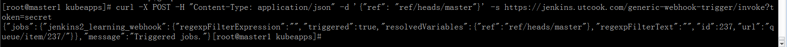

GenericTrigger 触发条件由 GWT 插件提供。此触发条件可以说是 GWT 的所有内容。 可以将 GenericTrigger 触发条件分为 5 部分，这样更易于理解各参数的作用。

- 从 HTTP POST 请求中提取参数值。
- `token`，GWT 插件用于标识 Jenkins 项目的唯一性。
- 根据请求参数值判断是否触发 Jenkins 项目的执行。
- 日志打印控制。
- Webhook 响应控制。

**一个 HTTP POST 请求可以从三个维度提取参数，即 POST body、URL 参数和 header** GWT 插件提供了三个参数分别对这三个维度的数据进行提取。

1. genericVariables：提取 POST body 中的参数。

```
            genericVariables: [
                [key: 'ref', value: '$.ref'],
                [key: 'before',
                 value: '$.before',
                 expressionType: 'JSONPath',
                 regexpFilter: '',
                 defaultValue: ''
                ]
            ]
```

- `value`：JSONPath 表达式，或者 XPath 表达式，取决于`expressionType`参数值，用于从 POST body 中提取值。
- `key`：从 POST body 中提取出的值的新变量名，可用于 pipeline 其他步骤。
- `expressionType`：可选，`value`的表达式类型，默认为`JSONPath`。当请求为 XML 内容时，必须指定 XPath 值。
- `defaultValue`：可选，当提取不到值，且`defaultValue`不为空时，则使用`defaultValue`作为返回值。
- `regexpFilter`：可选，过滤表达式，对提取出来的值进行过滤。`regexpFilter`做的事情其实就是`string.replaceAll(regexpFilter，"")`；。`string`是从 HTTP 请求中提取出来的值。

2. `genericRequestVariables`：从 URL 参数中提取值。

```
            genericRequestVariables: [
                [key: 'requestWithNumber', regexpFilter: '[^0-9]'],
                [key: 'requestWithString', regexpFilter: '']
            ]
```

- `key`：提取出的值的新变量名，可用于 pipeline 其他步骤。
- `regexpFilter`：对提取出的值进行过滤。

3. `genericHeaderVariables`：从 HTTP header 中提取值。

   ```
           genericHeaderVariables: [
               [key: 'headerWithNumber', regexpFilter: '[^0-9]'],
               [key: 'headerWithString', regexpFilter: '']
           ]
   ```

`genericHeaderVariables`的用法与`genericRequestVariables`一样，区别是它是从 HTTP header 中提取值的。

**根据请求参数值判断是否触发 Jenkins 项目执行**

GWT 并不只是根据`token`值来判断是否触发，还可以根据我们提取出的值进行判断。示例如下：

```
        GenericTrigger(
            genericVariables: [
                [key: 'refValue', value: '$.ref'],
            ],

            token: env.JOB_NAME,

            regexpFilterText: '$refValue',
            regexpFilterExpression: 'refs/heads/(master|dev)'
        )
```

- `regexpFilterText`：需要进行匹配的 key。例子中，我们使用从 POST body 中提取出的`refValue`变量值。
- `regexpFilterExpression`：正则表达式。 如果`regexpFilterText`参数的值符合`regexpFilterExpression`参数的正则表达式，则触发执行。

**控制打印内容**

打印日志有助于调试。GWT 插件提供了三个参数。

- `printPostContent`：布尔值，将 Webhook 请求信息打印到日志上。
- `printContributedVariables`：布尔值，将提取后的变量名及变量值打印出来。
- `causeString`：字符串类型，触发原因，可以直接引用提取后的变量，如 `causeString：'Triggered on $msg'`。

**控制响应**

- `silentResponse`：布尔类型，在正常情况下，当 Webhook 请求成功后，GWT 插件会返回 HTTP 200 状态码和触发结果给调用方。但是当`silentResponse`设置为`true`时，就只返回 HTTP 200 状态码，不返回触发结果。

# 3. 开发推送代码触发 jenkins 构建实战

## 3.1 安装 Jenkins 插件

- [GitLab](https://plugins.jenkins.io/gitlab-plugin)
- [Git](https://plugins.jenkins.io/git)

## 3.2 创建项目

新建 gitlab 项目

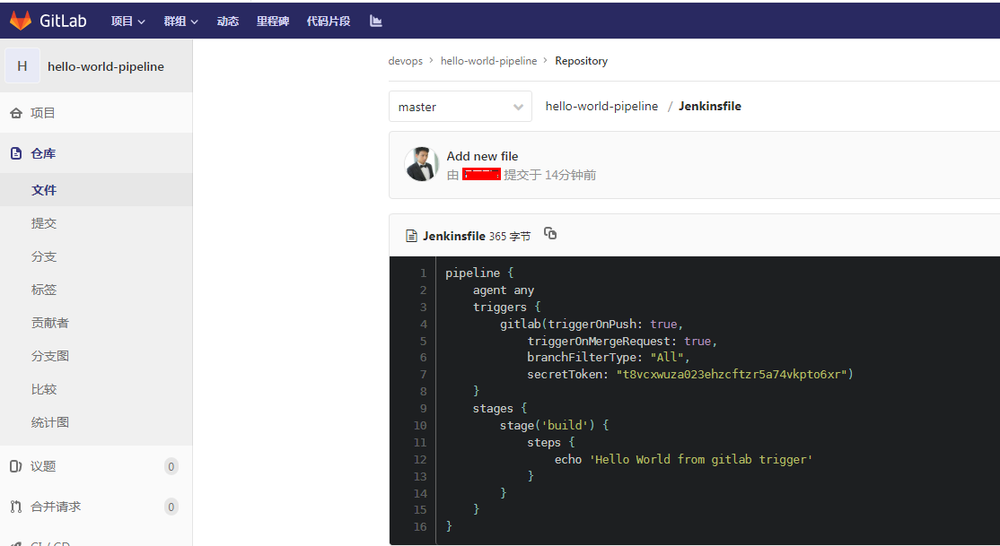

新建 jenkins 项目

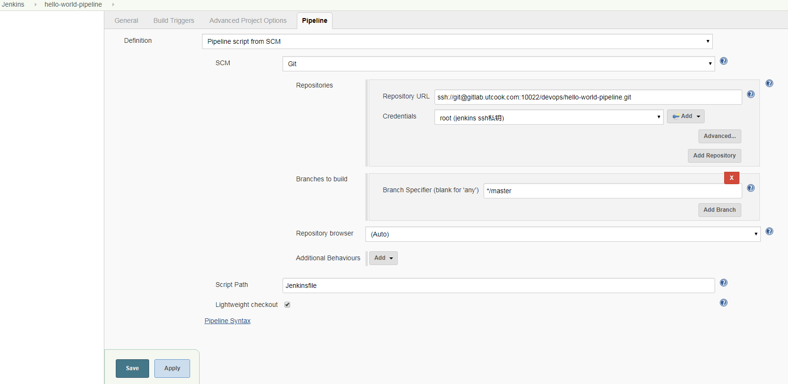

gltlab 设置集成 webhook 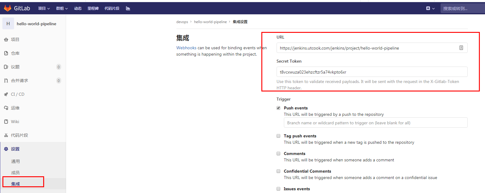

webhook 测试报错 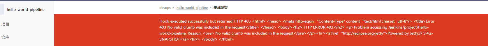

以上报错需要进行 jenkins 安装设置，取消勾选“CSRF Protection” 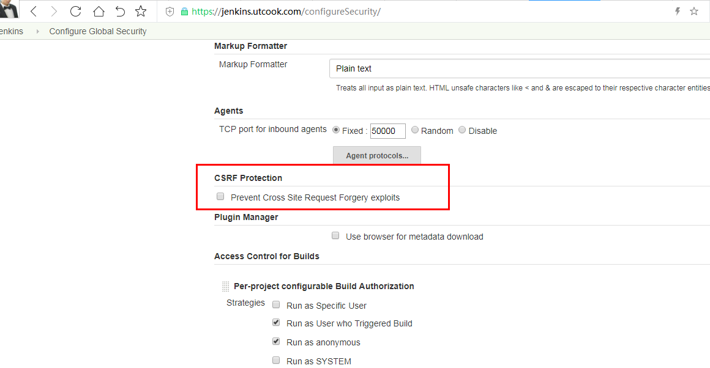

## 3.3 将构建状态信息推送到 Gitlab

jenkins 构建项目后，可以将构建的状态信息推送到 gitlab 的 pipeline 中，并且点击 pipeline 会自动跳转到 jenkins 的构建页面下。

首先 gitlab 仓库的管理帐户下生成个人访问 token。

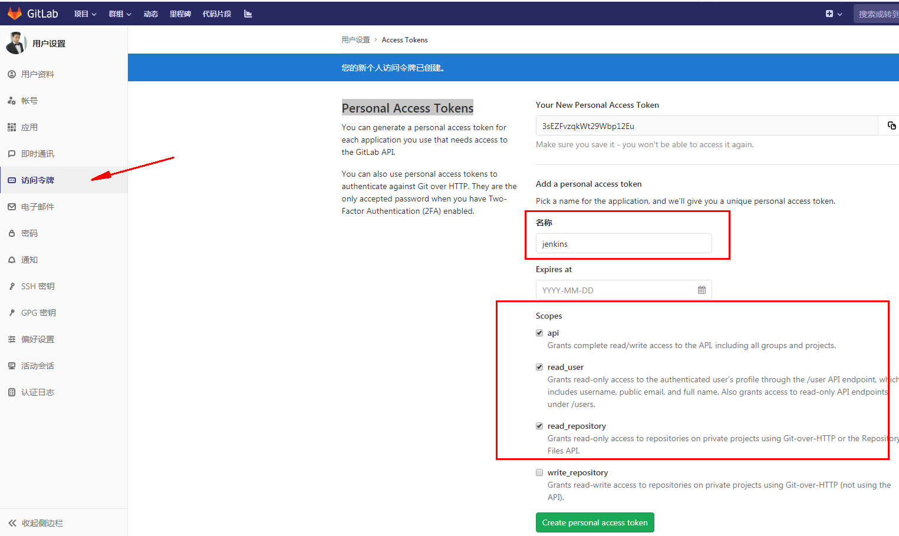

然后在 jenkins 内，进入"Manage Jenkins" → "Configure System"，页面中找到“Gitlab”，并添加 gitlab 和 token 凭证信息。

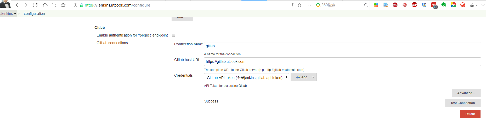

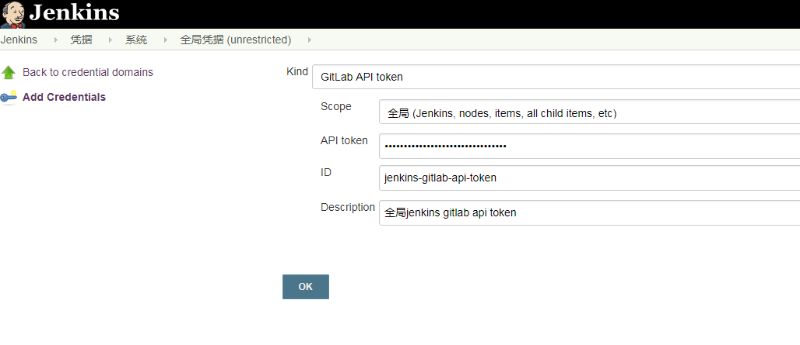

修改`Jenkinsfile`，如果 jenkins 中未触发过任务，第一次需要手动触发，以后 gitlab 内代码的修改会自动触发，并将运行结果提交到 gitlab pipeline 中。

完整的`Jenkinsfile`：

```
pipeline {
    agent any
    triggers {
        gitlab(triggerOnPush: true,
            triggerOnMergeRequest: true,
            branchFilterType: "All",
            secretToken: "t8vcxwuza023ehzcftzr5a74vkpto6xr")
    }
    stages {
        stage('build') {
            steps {
                echo 'Hello World from gitlab trigger'
            }
        }
    }
    post {
        failure {
            updateGitlabCommitStatus name: "build", state: "failed"
        }
        success {
            updateGitlabCommitStatus name: "build", state: "success"
        }
    }
    options {
        gitLabConnection("gitlab")
    }
}
```

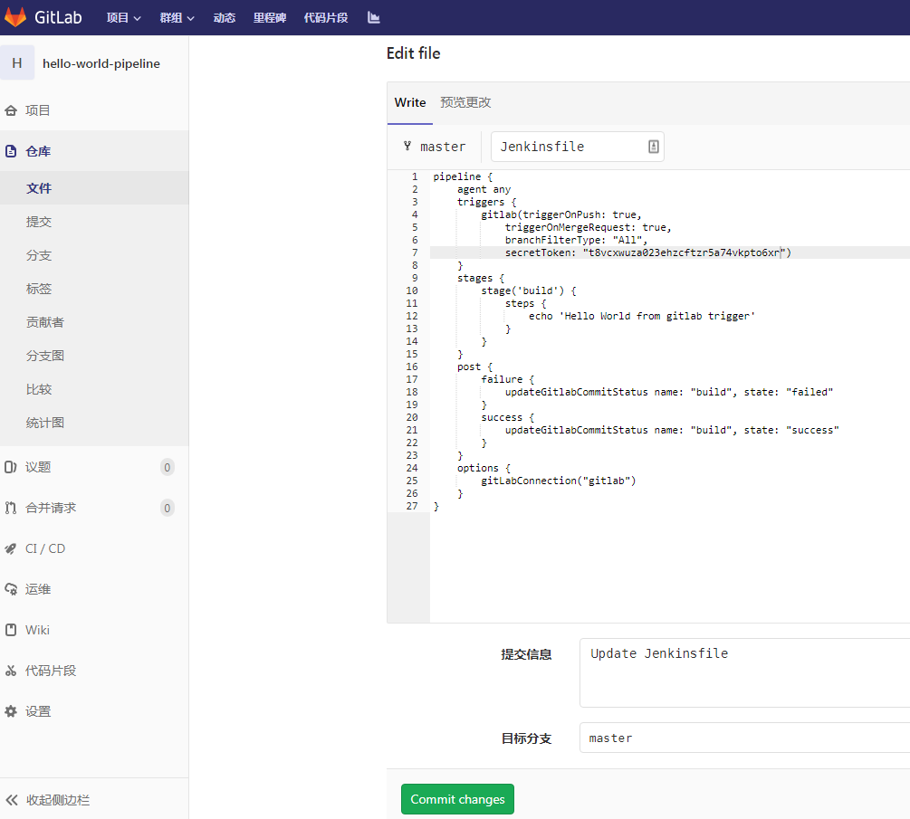

gitlab 仓库的 pipeline 中可查看到构建信息。 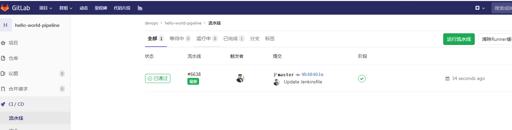

参考资料：
[1] 《Jenkins 2.x 实战指南》
[2] [https://jenkins.io/zh/doc/book/pipeline/syntax/](https://jenkins.io/zh/doc/book/pipeline/syntax/)
[3] [https://jenkins.io/zh/doc/pipeline/steps/](https://jenkins.io/zh/doc/pipeline/steps/)
[4] [https://blog.csdn.net/xiashei/article/details/88694027](https://blog.csdn.net/xiashei/article/details/88694027)
