# 1. 目的和环境说明

目的：**搭建一套拥有 ceph 集群并能直接用于开发、学习的高可用 kubernetes集群**

虚拟机：3台 每台硬件配置：cpu 2核及以上、内存 8G 及以上、硬盘 2 块（其中一块用于 ceph osd） 每台虚拟机系统安装 CentOS7，除了 `/boot` 分区，其余空间均分配给根分区，要求虚拟机能访问互联网并正常解析域名。

---

工具： kubernetes：v1.23.1 helm：v3.8.0

---

charts： metallb：2.6.0 ingress-nginx：4.0.15 rook-ceph：v1.8.2 rook-ceph-cluster：v1.8.2 kubernetes-dashboard：5.1.1 kubeapps：7.7.1

# 2. 一键安装 kubernetes 集群

## 2.1 初始化集群

本人的一键安装集群脚本：[https://github.com/ygqygq2/kubeadm-shell](https://github.com/ygqygq2/kubeadm-shell)

3台虚拟机设置好`hostname` 和 hosts `/etc/hosts`

```
10.111.3.53 master1
10.111.3.54 master2
10.111.3.55 master3
```

设置 `config.sh` 如下： 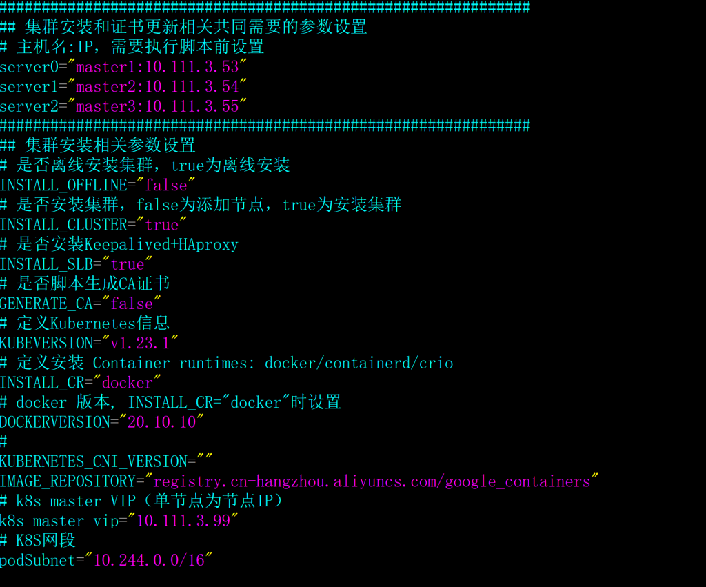

在 `master1` 上执行 `sh kubeadm_install_k8s.sh` 脚本完成后，会自动创建 3 master 节点的 高可用 kubernetes 集群。

## 2.2 安装 flannel 网络插件

这里使用 flannel 网络插件，当然你也可以选择其它网络插件。

```bash
mkdir -p /data/yaml
cd /data/yaml
wget https://raw.githubusercontent.com/flannel-io/flannel/master/Documentation/kube-flannel.yml
kubectl apply -f kube-flannel.yml
```

## 2.3 安装 helm 命令

```bash
cd /tmp
wget https://get.helm.sh/helm-v3.8.0-rc.1-linux-amd64.tar.gz
tar -zxvf helm-v3.8.0-rc.1-linux-amd64.tar.gz
mv linux-amd64/helm /usr/local/sbin/
chmod a+x /usr/local/sbin/helm
```

使用 `helm repo add bitnami https://charts.bitnami.com/bitnami` 等将以下 repo 添加好。 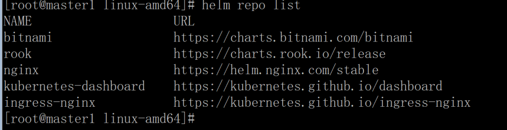

# 3. helm 安装各组件

## 3.1 阿里云申请用到的免费 ssl 证书

kubernetes dashboard 和 ceph dashboard 默认使用 https 方式访问，所以需要用到 ssl 证书，如修改成 http 方式（非安全）访问也可，本文不作这方面描述。 申请好免费证书，并下载 nginx 格式证书文件 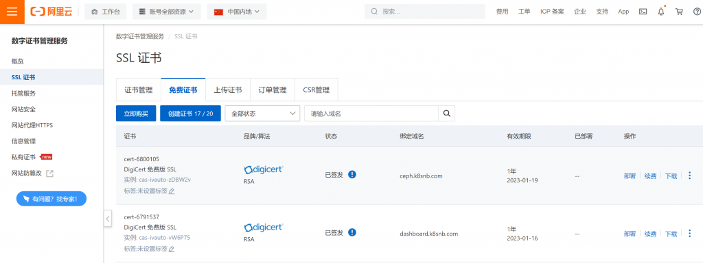

上传好证书文件并解压 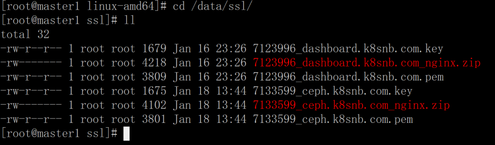

将证书文件创建成 tls secret， `kubectl create ns rook-ceph # 创建 rook-ceph 命名空间` `kubectl create secret tls ceph.k8snb.com --cert 7133599_ceph.k8snb.com.pem --key 7133599_ceph.k8snb.com.key -n rook-ceph` `kubectl create secret tls dashboard.k8snb.com --cert 7123996_dashboard.k8snb.com.pem --key 7123996_dashboard.k8snb.com.key -n kube-system`

## 3.2 安装 metallb

[MetalLB](https://metallb.universe.tf/faq/) is an open source, rock solid LoadBalancer. It handles the `ServiceType: Loadbalancer`，即提供一个内网负载均衡器，为 `LoadBalancer` 类型的 `service` 提供一个可访问的负载均衡 IP。

```bash
mkdir -p /data/helm
helm fetch --untar bitnami/metallb
cd metallb
mkdir kube-system  # 按目录区分安装的命名空间
rsync -avz values.yaml kube-system/
```

`vim kube-system/values.yaml` 修改配置 按如下图配置一个负载均衡 ip 池： 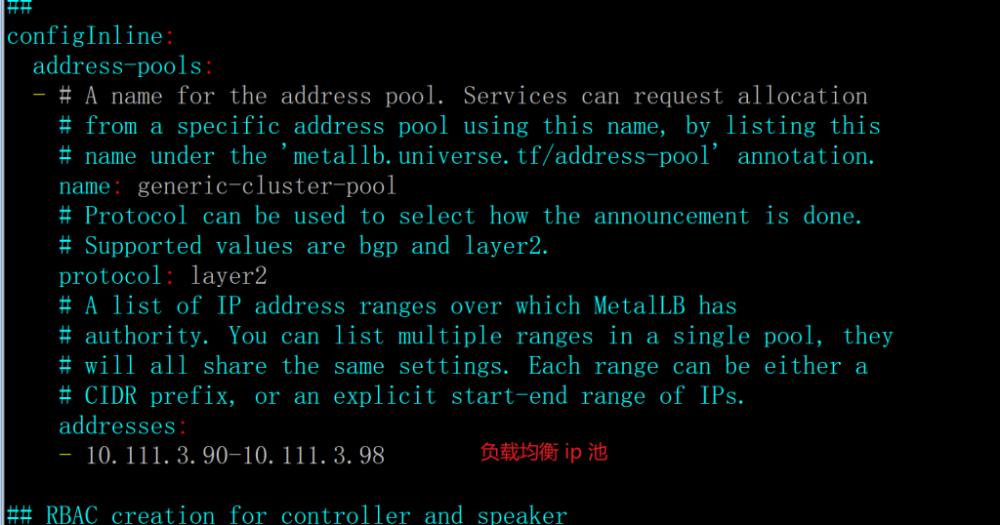

安装

```bash
helm install metallb -n kube-system -f kube-system/values.yaml .
```

## 3.3 安装 ingress-nginx

这里使用官方 ingress-nginx。

```bash
cd /data/helm
helm fetch --untar ingress-nginx/ingress-nginx
cd ingress-nginx
mkdir kube-system
rsync -avz values.yaml kube-system/
```

`vim kube-system/values.yaml` 修改配置和镜像仓库（主要是国内访问不了谷歌镜像仓库） 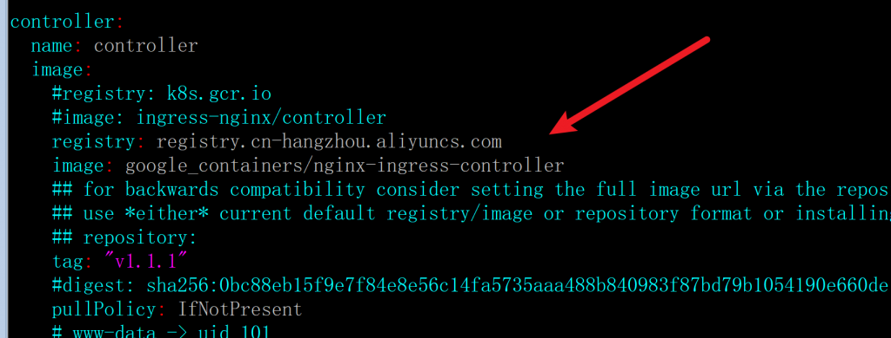

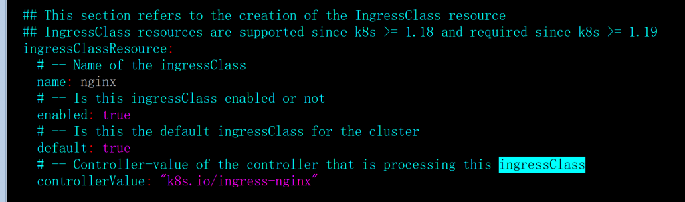

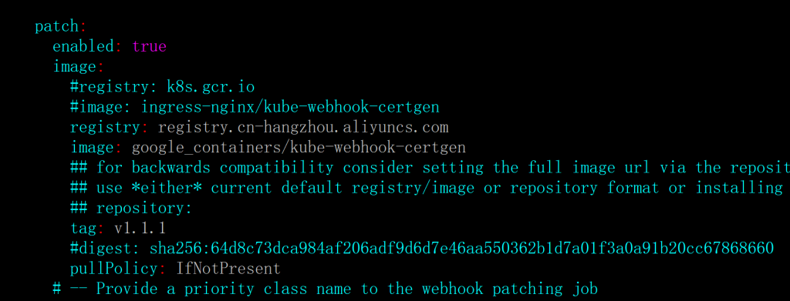

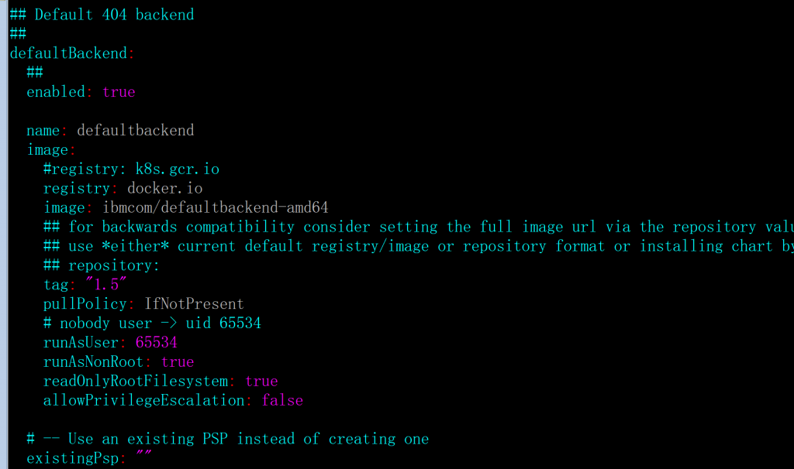

安装

```bash
helm install ingress-nginx -n kube-system -f kube-system/values.yaml .
```

## 3.4 安装 rook-ceph

rook 不作过多介绍，你可以访问其官网查看：[https://rook.io/docs/rook/v1.8/](https://rook.io/docs/rook/v1.8/)

```bash
cd /data/helm
helm fetch --untar rook/rook-ceph
cd rook-ceph
mkdir rook-ceph
rsync -avz values.yaml rook-ceph/
```

`vim rook-ceph/values.yaml` 修改配置和镜像仓库 github 上发现一个谷歌镜像同步到 docker hub的功能，在他这里提 issues，即可完成同步，然后按其说明，将仓库替换下就可以了。以下为我提的 issues，已经完成镜像同步，直接使用即可。 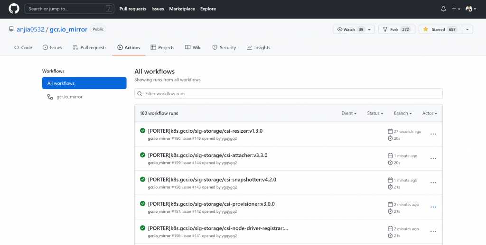

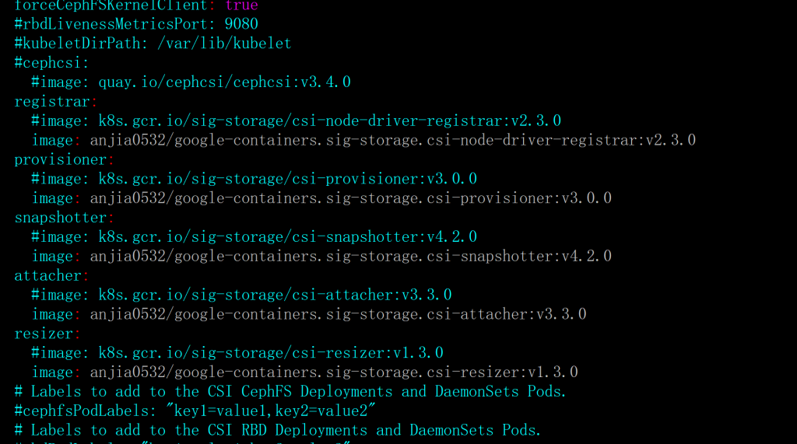

安装

```bash
helm install rook-ceph -n rook-ceph -f rook-ceph/values.yaml .
```

## 3.5 安装 rook-ceph-cluster

```bash
cd /data/helm
helm fetch --untar rook/rook-ceph-cluster
cd rook-ceph-cluster
mkdir rook-ceph
rsync -avz values.yaml rook-ceph/
```

`vim rook-ceph/values.yaml` 修改配置

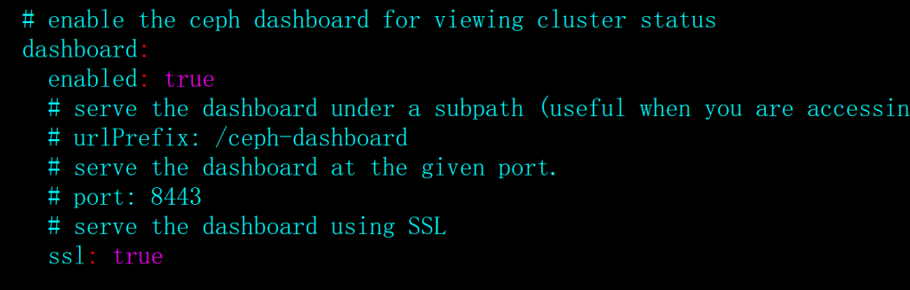

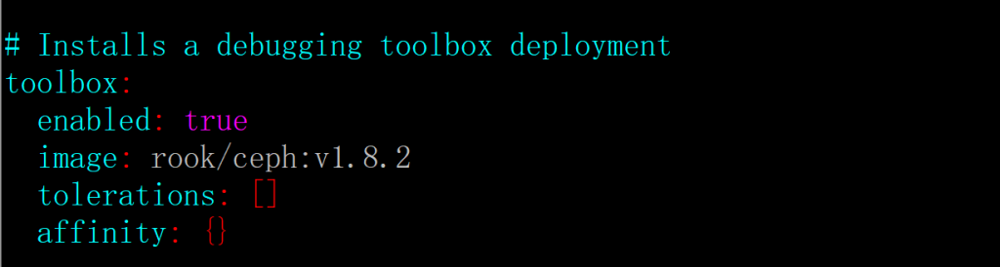

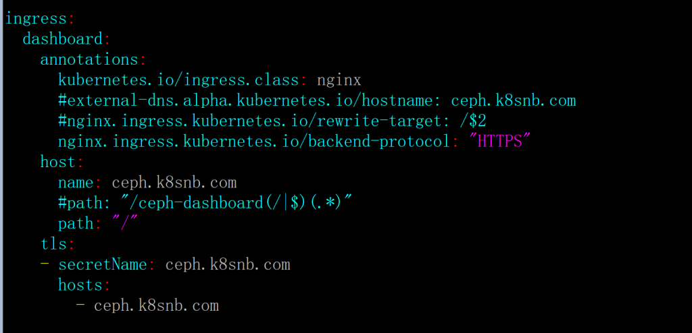

安装

```bash
helm install rook-ceph-cluster -n rook-ceph -f rook-ceph/values.yaml .
```

进入 toolbox 修改 ceph dashboard admin 用户密码

`kubectl get pod -n rook-ceph` 查看 toolbox pod

`kubectl exec -it toolbox的pod名 -n rook-ceph /bin/bash` 进入 toolbox pod

修改 dashboard 用户密码

```bash
echo password > /tmp/p
ceph dashboard ac-user-set-password admin -i /tmp/p
```

添加域名解析或本地 hosts 都可。 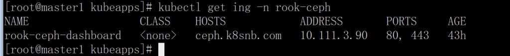

现在即可通过浏览器登录 cpeh dashboard。

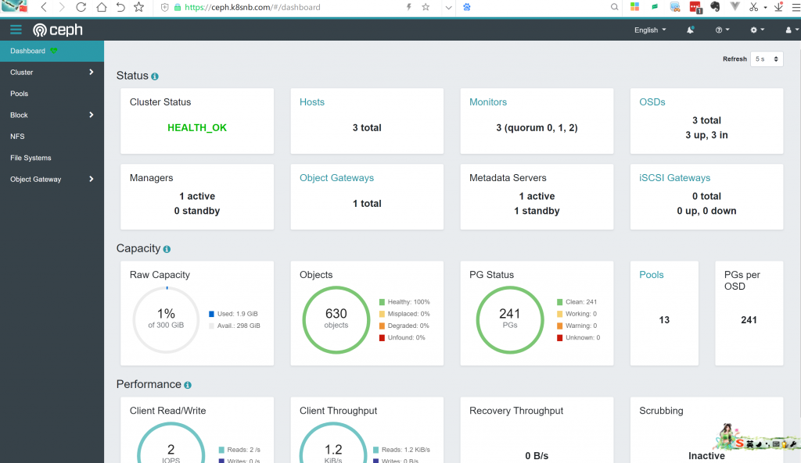

## 3.6 安装 kubernetes dashboard

```bash
cd /data/helm
helm fetch --untar kubernetes-dashboard/kubernetes-dashboard
cd kubernetes-dashboard
mkdir kube-sytem
rsync -avz values.yaml kube-system/
```

`vim kube-system/values.yaml` 修改配置

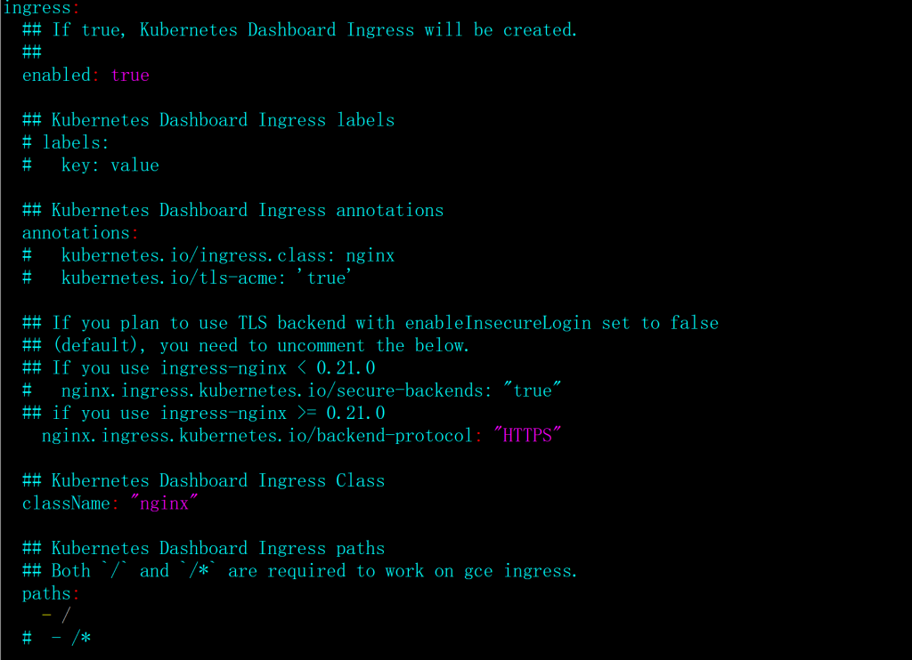

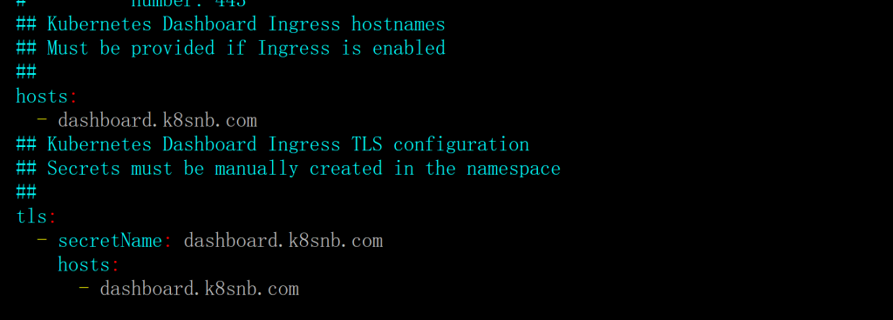

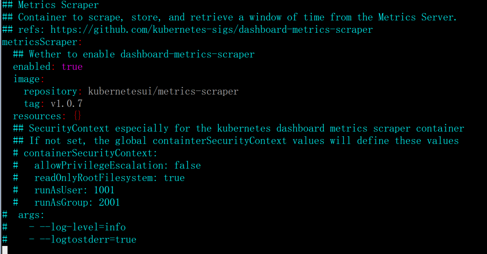

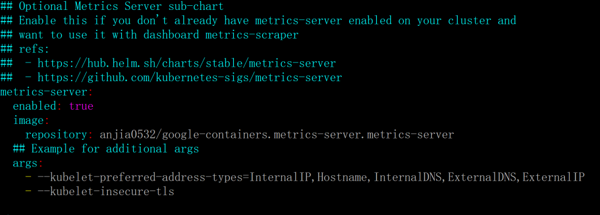

安装

```bash
helm install dashboard -n kube-system -f kube-system/values.yaml .
```

创建 k8s 集群访问帐号（这里为了方便学习，直接使用管理员），并获取登录 token

```bash
kubectl create serviceaccount admin -n kube-system
kubectl create clusterrolebinding admin --clusterrole=cluster-admin --serviceaccount=kube-system:admin
kubectl get secret -n kube-system|grep admin
kubectl describe secret 上面的secret名 -n kube-system  # token 即为登录 token
```

浏览器访问并登录 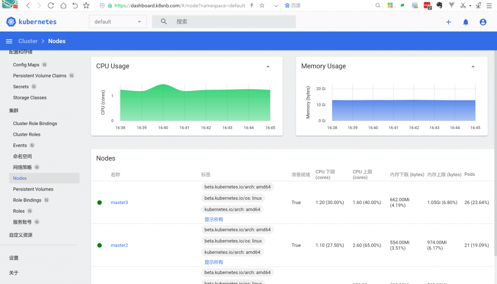

## 3.7 安装 kubeapps

```bash
cd /data/helm
helm fetch --untar bitnami/kubeapps
cd kubeapps
mkdir kubeapps
rsync -avz values.yaml kubeapps/
```

`vim kubeapps/values.yaml` 修改配置

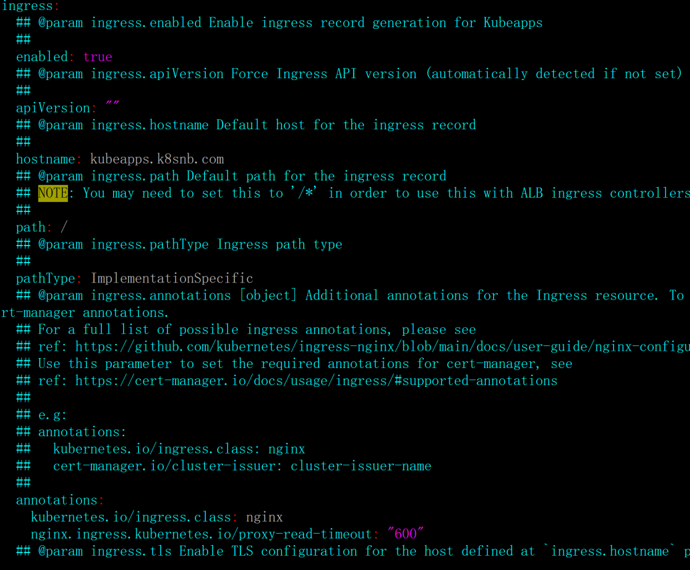

安装

```bash
helm install kubeapps -n kubeapps -f kubeapps/values.yaml .
```

浏览器访问并登录 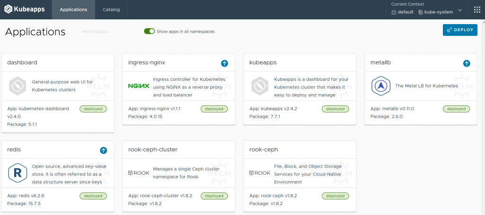
