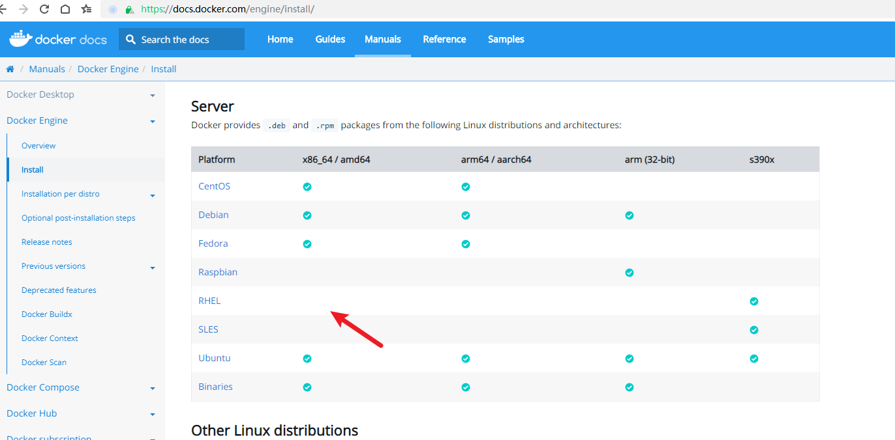
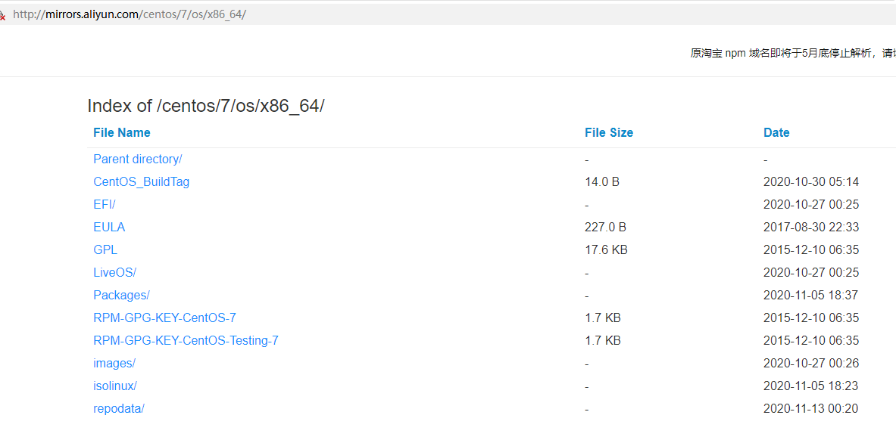
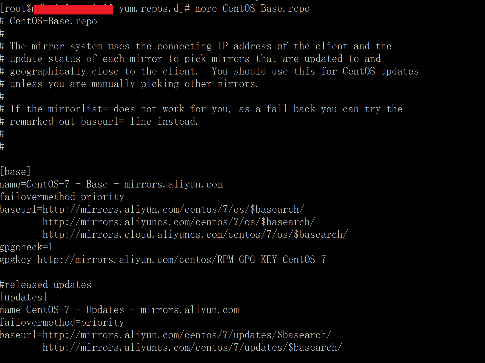
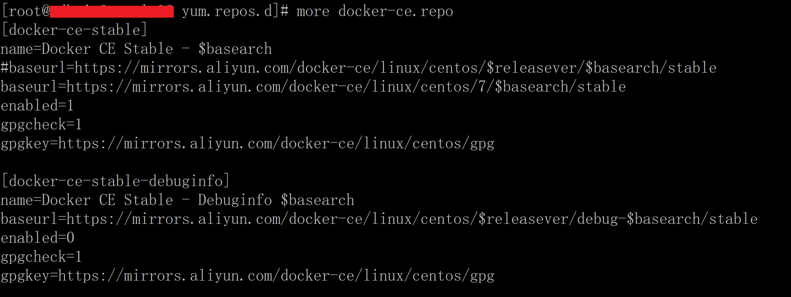

# 1. rhel 安装 docker ce 需求

RHEL 7 上安装 docker ce，但是官方提示并不支持，使用相应的源也会报依赖错误。那我非要安装呢？



# 2. 使用 CentOS7 源代替 rhel 源

直接到阿里云镜像源上把 base、epel、docker ce的 yum repo文件下载好，因为 rhel 不认识 CentOS 源中的这种变量 `$releasever`，我们直接根据 yum 源目录将变量替换成相应字符串。

[http://mirrors.aliyun.com/centos/](http://mirrors.aliyun.com/centos/)







然后继续使用 yum 命令安装 docker ce，成功后 docker 能正常使用。

# 3. 制作 docker ce 离线安装包

可以选择使用最小化安装的 centos 环境制作 docker ce 离线安装包。

- 准备离线安装包脚本 `ready_offline_rpm.sh` 内容如下：

```bash
cd `dirname $0`
SH_DIR=`pwd`
packages_dir=$SH_DIR/packages
DOCKERVERSION="20.10.13"

# 使用阿里云镜像源
curl -o /etc/yum.repos.d/CentOS-Base.repo http://mirrors.aliyun.com/repo/Centos-7.repo

# 创建本地仓库包
yum install --downloadonly --downloaddir=$packages_dir \
    createrepo

# 实用工具
yum install --downloadonly --downloaddir=$packages_dir \
    yum-utils \
    curl \
    wget \

# docker 依赖包
yum install --downloadonly --downloaddir=$packages_dir \
    device-mapper-persistent-data \
    lvm2

# 添加阿里云Docker源
yum -y install yum-utils
yum-config-manager --add-repo http://mirrors.aliyun.com/docker-ce/linux/centos/docker-ce.repo

# docker ce
yum install --downloadonly --downloaddir=$packages_dir \
    docker-ce-$DOCKERVERSION \
    docker-ce-cli-$DOCKERVERSION \
    containerd.io
```

脚本执行后，生成的 `packages` 目录就是离线安装包。

- 离线安装包准备本地 yum 源脚本 `ready_local_yum.sh` 内容如下：

```bash
cd `dirname $0`
packages_dir=$SH_DIR/packages

yum -y install policycoreutils-python audit-libs-python

rpm -ivh $packages_dir/deltarpm-*.rpm
rpm -ivh $packages_dir/libxml2-python-*.rpm
rpm -ivh $packages_dir/python-deltarpm-*.rpm
rpm -ivh $packages_dir/createrepo-*.rpm

createrepo  $packages_dir

cat > /etc/yum.repos.d/CentOS-Media.repo <<EOF
[c7-media]
name=CentOS-$releasever - Media
baseurl=file://$packages_dir
gpgcheck=0
enabled=1
gpgkey=file:///etc/pki/rpm-gpg/RPM-GPG-KEY-CentOS-7
       https://mirrors.aliyun.com/docker-ce/linux/centos/gpg
EOF

# yum -y install docker-ce
```

脚本执行后，就能使用 `yum -y install docker-ce` 安装 docker ce了。
