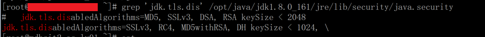
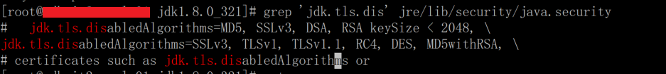
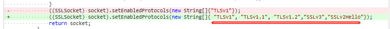

# 1. https 访问出现问题

以前正常的程序，更新版本后，出现访问 https 报错：

```
No appropriate protocol (protocol is disabled or cipher suites are inappropriate);
```

# 2. 处理过程

java 程序都是容器化部署的，我这边是使用的 centos 和 oracle jdk 制作的基础镜像，一般是一年更新一次版本，修复下漏洞。

根据报错信息，搜到 jdk 下的文件 `jre/lib/security/java.security` 里有个安全性参数 `jdk.tls.disabledAlgorithms` 对 SSL 版本使用有影响，经过对比官方 `jdk1.8.0_161` 和 `jdk1.8.0_321`，发现确实有差异。





解决办法可以根据自己情况修改这个参数值，也可以修改代码里自己支持的 ssl 协议版本。



# 3. 小结

虽然 JDK 只升级了小版本，但是升级前还是要查看官方的版本 release notes，不然可能会产生想不到的坑。

[https://www.oracle.com/java/technologies/javase/jdk-relnotes-index.html](https://www.oracle.com/java/technologies/javase/jdk-relnotes-index.html)
