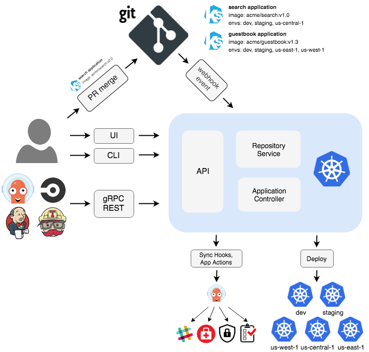
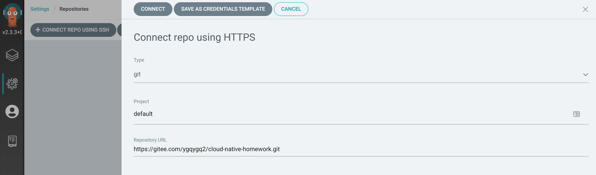
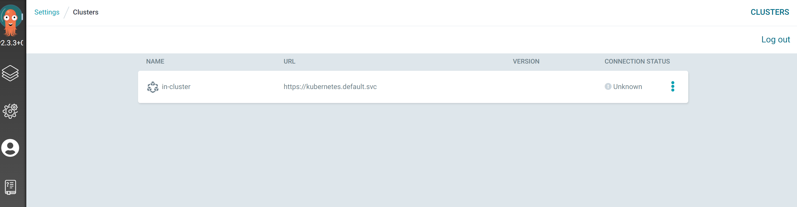
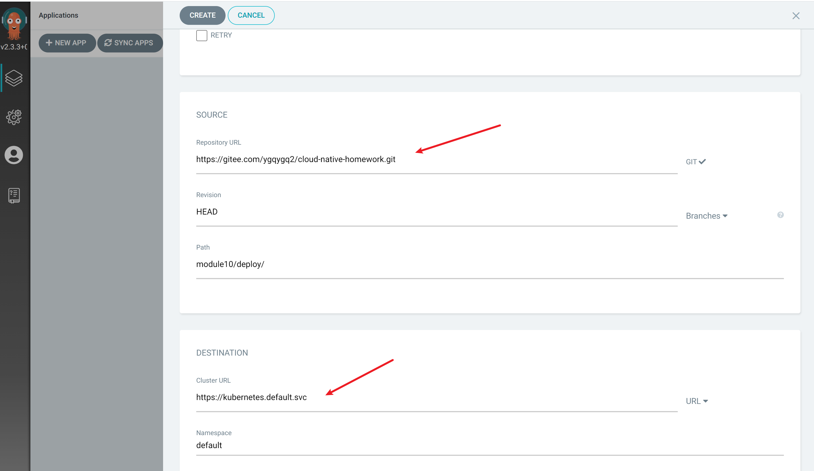
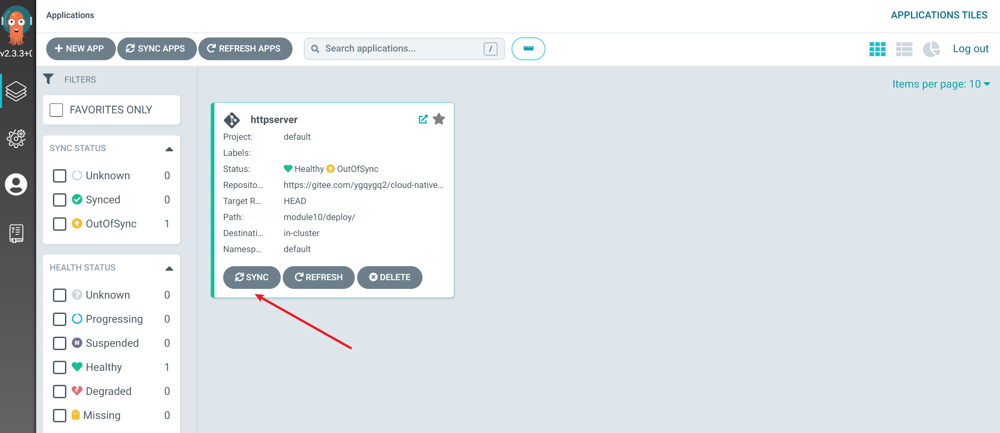
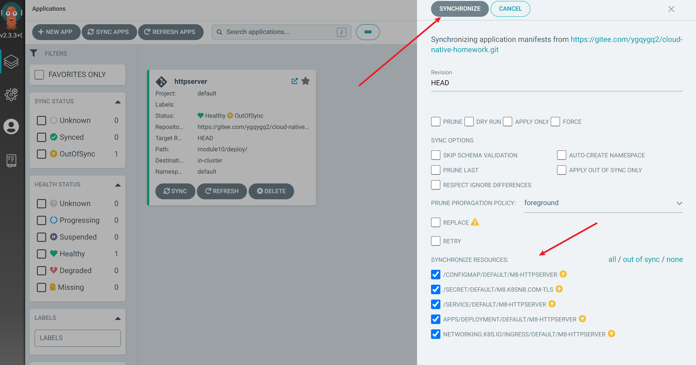
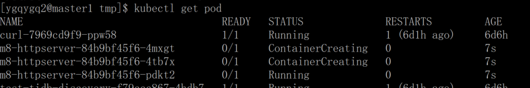
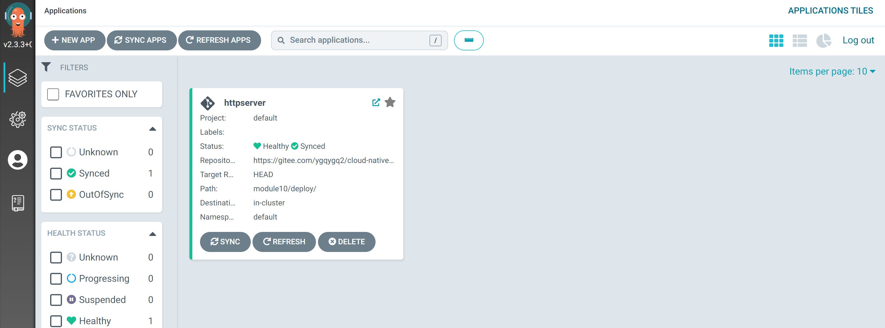
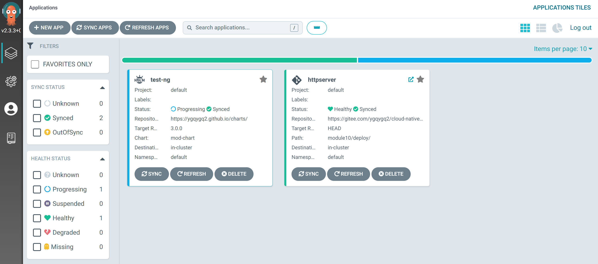

# 1. Argo CD 简单介绍

[Argo CD](https://argo-cd.readthedocs.io/en/stable/) 是一个用于 Kubernetes 遵循声明式 GitOps 持续交付工具。 其介绍直接查看官方文档即可，本文使用一个示例来体验 Argo CD。

# 2. 部署应用

我使用 [helm](https://helm.sh/) 安装 [bitnami](https://charts.bitnami.com/bitnami) 的 charts 仓库中的 argo-cd。安装过程略...

添加仓库 

添加/查看 k8s 集群 

创建应用 

同步应用 

可以看到同步应用时的资源清单 

k8s 中查看应用部署情况 

应用变成健康状态 

部署一个 helm 应用 

# 3. 小结

除了 yaml 方式，helm app 也体验了下。虽然说多环境和应用仓库、配置分离是 GitOPS 的痛点，但是当前 Argo CD 只支持 `values.yaml` 文件和 chart 包在同一仓库下，也表示其不适合大规模使用，因为通常应用维护人员并不一定是 chart 开发人员，其 Git 或 Chart 仓库权限不好分离。 后面再体验下 Argo 的其它产品。
