# 1\. Argo Rollouts 简单介绍

[Argo Rollouts](https://argoproj.github.io/argo-rollouts/) 是一个 Kubernetes 控制器和一组 CRDs，它们提供了先进的部署功能，例如蓝绿色、金丝雀、金丝雀分析、实验和渐进式交付功能。

# 2\. Argo Rollouts 安装

我使用 [helm](https://helm.sh/) 安装[官方 charts 仓库](https://argoproj.github.io/argo-helm)中的 argo-rollouts。安装过程略…

# 3\. Argo Rollouts Kubectl 插件安装

```bash
cd /tmp
curl -LO https://github.com/argoproj/argo-rollouts/releases/latest/download/kubectl-argo-rollouts-linux-amd64
chmod +x ./kubectl-argo-rollouts-linux-amd64
sudo mv ./kubectl-argo-rollouts-linux-amd64 /usr/local/sbin/kubectl-argo-rollouts
kubectl argo rollouts version
```

# 4\. Argo Rollouts 架构

详细介绍请查看官方文档：[https://argoproj.github.io/argo-rollouts/architecture/](https://argoproj.github.io/argo-rollouts/architecture/)

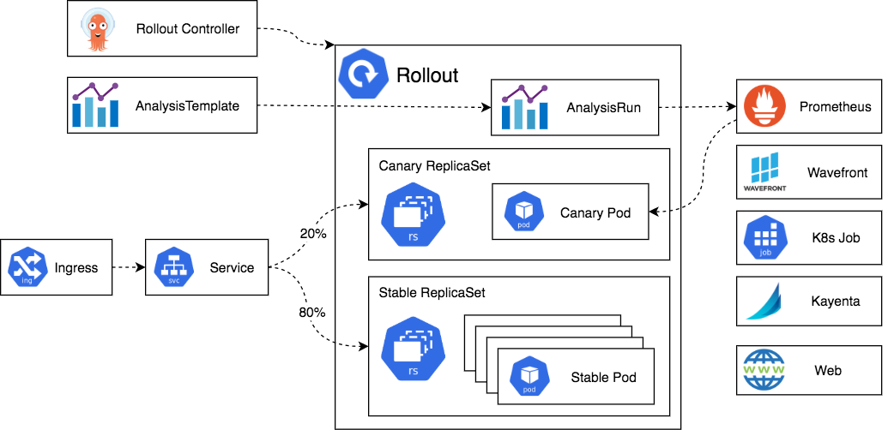

# 5\. 官方示例体验

本文环境： kubernetes: v1.23.4 istio: 1.13.3

我们使用[官方getting-started](https://github.com/argoproj/argo-rollouts/tree/master/docs/getting-started)测试。 其它请参考更详细的[官方示例](https://github.com/argoproj/argo-rollouts/tree/master/examples)。

# 6\. 示例体验

## 6.1 基本使用

### 6.1.1 部署 rollout

部署一个 rollout 资源，然后查看运行情况

```yaml
apiVersion: argoproj.io/v1alpha1
kind: Rollout
metadata:
  name: rollouts-demo
spec:
  replicas: 5
  strategy:
    canary:
      steps:
      - setWeight: 20
      - pause: {}
      - setWeight: 40
      - pause: {duration: 10}
      - setWeight: 60
      - pause: {duration: 10}
      - setWeight: 80
      - pause: {duration: 10}
  revisionHistoryLimit: 2
  selector:
    matchLabels:
      app: rollouts-demo
  template:
    metadata:
      labels:
        app: rollouts-demo
    spec:
      containers:
      - name: rollouts-demo
        image: argoproj/rollouts-demo:blue
        ports:
        - name: http
          containerPort: 8080
          protocol: TCP
        resources:
          requests:
            memory: 32Mi
            cpu: 5m
```

```bash
kubectl apply -f docs/getting-started/basic/rollout.yaml -n demo
kubectl apply -f docs/getting-started/basic/service.yaml -n demo
```

```bash
kubectl argo rollouts get rollout rollouts-demo --watch -n demo
```

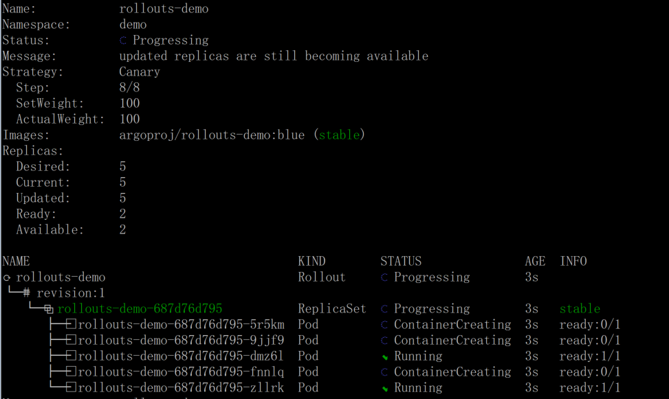


### 6.1.2 更新 rollout

rollout spec 模板和 deployment 一样，有内容修改即会触发一个新版本，kubectl argo rollouts 插件支持一个命令，`set image` 直接修改镜像：

```bash
kubectl argo rollouts set image rollouts-demo \
  rollouts-demo=argoproj/rollouts-demo:yellow -n demo
kubectl argo rollouts get rollout rollouts-demo -n demo -w  
```

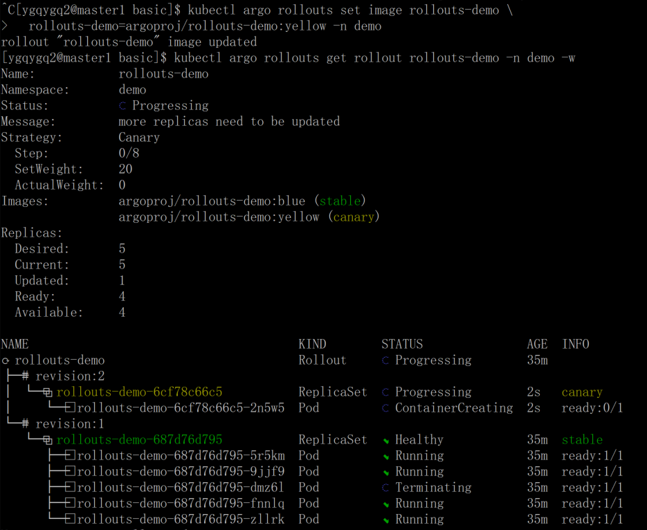


可以看到 rollout 处理暂停状态，现在有 20% 的 POD 为新版本，其它为旧版本。这符合定义的 20% 金丝雀流量。

### 6.1.3 恢复 rollout

当前 rollout 是暂停状态，当暂停没有设置持续时间时，它将无限期保持暂停状态，直到恢复。手动恢复 rollout 插件提供了一个命令 `promote`：

```bash
kubectl argo rollouts promote rollouts-demo -n demo
kubectl argo rollouts get rollout rollouts-demo -n demo -w
```

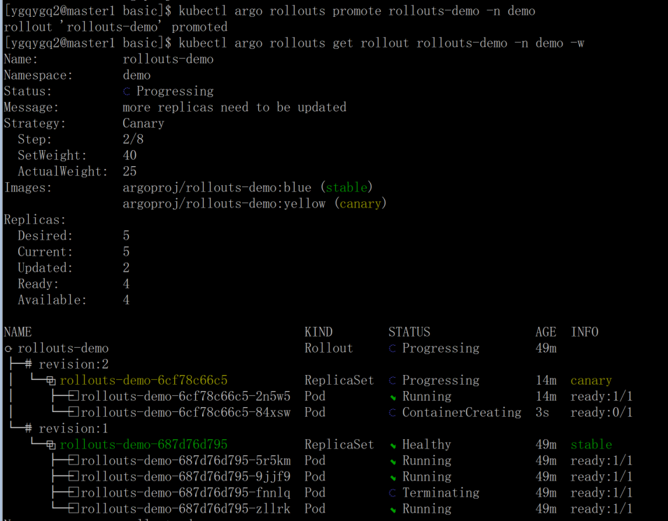


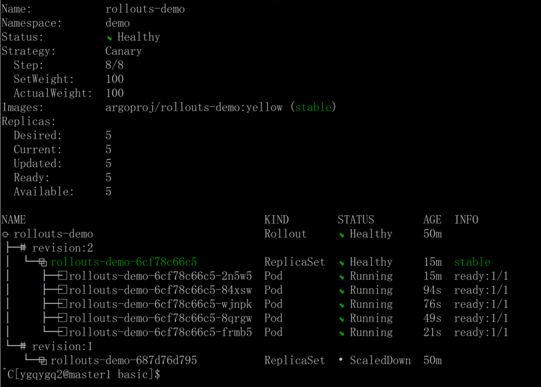

> `promote` 命令也支持跳过后续所有步骤和分析，参数为 `--full`。

一旦所有步骤都成功完成，新的 ReplicaSet 将被票房为 "stable"，无论何时，只要在更新期间中止部署（通过失败的canary或用户手动执行）,部署 就会退回 "stable" 版本。

### 6.1.4 中断 rollout

接下来将演示手动中止 rollout，设置一个“红色”容器版本，然后等待部署到暂停步骤：

```bash
kubectl argo rollouts set image rollouts-demo \
  rollouts-demo=argoproj/rollouts-demo:red -n demo
```

因为 rollout 在暂停状态，“red” 容器版本处于 “canary” 状态，abort rollout 将放大 ReplicaSet 的“稳定”版本，并缩小任何其他版本。尽管 ReplicaSet 的稳定版本可能正在运行并且是健康的，但是总体的部署仍然被认为是降级的，因为所需的版本（“red”镜像）不是实际正在运行的版本。

```bash
kubectl argo rollouts abort rollouts-demo
```


```bash
kubectl argo rollouts get rollout rollouts-demo -n demo -w
```


为了使 rollout 再次被认为是健康的而不是降级的，有必要将所需的状态更改为以前的、稳定的版本。这通常涉及运行 `kubectl apply` 来应用以前的 rollout，以下我们只需使用前面的 “yellow” 镜像重新运行 `set image` 命令。

```bash
kubectl argo rollouts set image rollouts-demo \
  rollouts-demo=argoproj/rollouts-demo:yellow -n demo
```

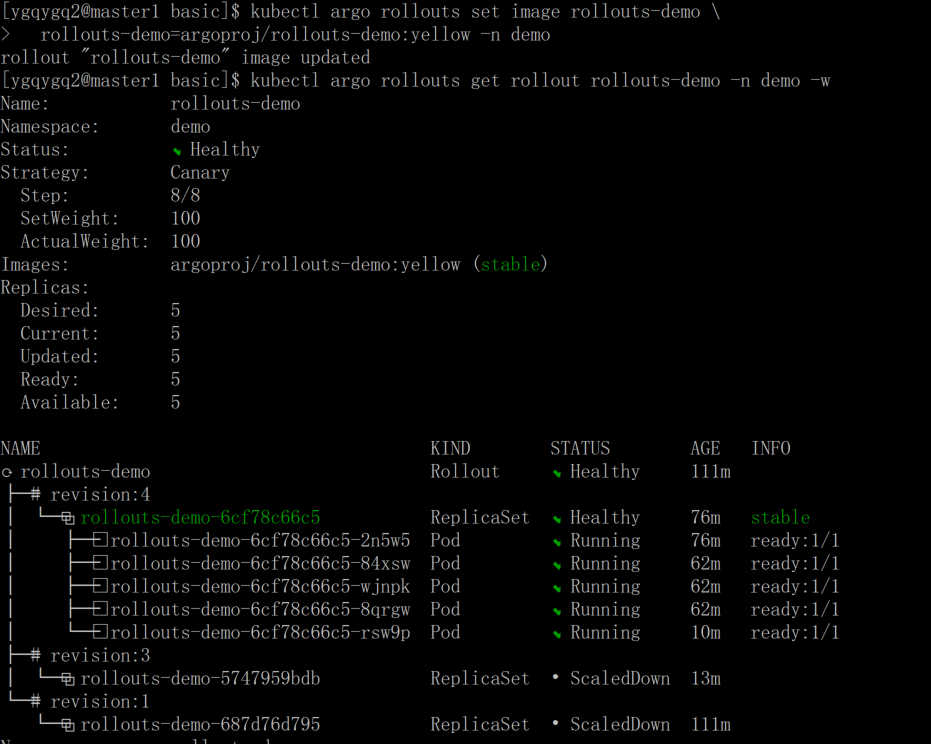

可以看到，rollout 重新恢复健康，并且没有任何新的 ReplicaSet 创建。

### 6.1.5 小结

基本示例中的 rollout 没有使用入口控制器或服务网络来路由流量。它使用普通的 kubernetes service 网络（即 kube-proxy)来实现基于新旧副本计数最接近大致 canary 权重。为了实现理想细粒度的 canary，需要一个入口控制器或服务网格。

## 6.2 Argo Rollouts 配合 Istio 使用

前提：kubernetes 集群已经安装 Istio。（本文使用 istio 1.13）

当 Istio 被用作流量路由时，Rollout canary 策略必须定义以下强制字段:

```yaml
apiVersion: argoproj.io/v1alpha1
kind: Rollout
metadata:
  name: rollouts-demo
spec:
  strategy:
    canary:
      # 引用一个服务，该服务由控制器更新指向金丝雀副本集
      canaryService: rollouts-demo-canary
      # 引用一个服务，该服务由控制器更新指向稳定副本集
      stableService: rollouts-demo-stable
      trafficRouting:
        istio:
          virtualServices:
          # 可以配置一个或多个 virtualServices
          # 引用一个虚拟服务，控制器用金丝雀权重更新该服务
          - name: rollouts-demo-vsvc1
            # 如果 VirtualService 中有一个单一的 HTTP 路由，可选，否则为必选
            routes:
            - http-primary
            # 如果 VirtualService 中有单个 HTTPS/TLS 路由，则为可选，否则为必选
            tlsRoutes:
            # 下面的字段是可选的，但是如果定义的话，它们应该与您的 VirtualService 中至少一个 TLS 路由匹配规则完全匹配
            - port: 443 # 仅在您希望匹配包含此端口的 VirtualService 中的任何规则时需要
              # 只有在您想匹配包含所有这些 SNI 主机的 VirtualService 中的任何规则时才需要
              sniHosts:
              - reviews.bookinfo.com
              - localhost
          - name: rollouts-demo-vsvc2
            # 如果 VirtualService 中有一个单一的 HTTP 路由，可选，否则为必选
            routes:
              - http-secondary
            # 如果 VirtualService 中有单个 HTTPS/TLS 路由，则为可选，否则为必选
            tlsRoutes:
              # 下面的字段是可选的，但是如果定义的话，它们应该与您的 VirtualService 中至少一个 TLS 路由匹配规则完全匹配
              - port: 443 # 仅在您希望匹配包含此端口的 VirtualService 中的任何规则时需要
                # 只有在您想匹配包含所有这些 SNI 主机的 VirtualService 中的任何规则时才需要
                sniHosts:
                  - reviews.bookinfo.com
                  - localhost
```

以下为示例使用的 yaml 文件：

```yaml
# rollout.yaml
apiVersion: argoproj.io/v1alpha1
kind: Rollout
metadata:
  name: rollouts-demo
spec:
  replicas: 1
  strategy:
    canary:
      canaryService: rollouts-demo-canary
      stableService: rollouts-demo-stable
      trafficRouting:
        istio:
          virtualServices:
          - name: rollouts-demo-vsvc1 # At least one virtualService is required
            routes:
            - primary # At least one route is required
          - name: rollouts-demo-vsvc2
            routes:
            - secondary # At least one route is required
      steps:
      - setWeight: 5
      - pause: {}
  revisionHistoryLimit: 2
  selector:
    matchLabels:
      app: rollouts-demo
  template:
    metadata:
      labels:
        app: rollouts-demo
        istio-injection: enabled
    spec:
      containers:
      - name: rollouts-demo
        image: argoproj/rollouts-demo:blue
        ports:
        - name: http
          containerPort: 8080
          protocol: TCP
        resources:
          requests:
            memory: 32Mi
            cpu: 5m
```

```yaml
# services.yaml
apiVersion: v1
kind: Service
metadata:
  name: rollouts-demo-canary
spec:
  ports:
  - port: 80
    targetPort: http
    protocol: TCP
    name: http
  selector:
    app: rollouts-demo
    # This selector will be updated with the pod-template-hash of the canary ReplicaSet. e.g.:
    # rollouts-pod-template-hash: 7bf84f9696

---
apiVersion: v1
kind: Service
metadata:
  name: rollouts-demo-stable
spec:
  ports:
  - port: 80
    targetPort: http
    protocol: TCP
    name: http
  selector:
    app: rollouts-demo
    # This selector will be updated with the pod-template-hash of the stable ReplicaSet. e.g.:
    # rollouts-pod-template-hash: 789746c88d
```

```yaml
# multipleVirtualsvc.yaml
apiVersion: networking.istio.io/v1alpha3
kind: VirtualService
metadata:
  name: rollouts-demo-vsvc1
spec:
  gateways:
  - rollouts-demo-gateway
  hosts:
  - rollouts-demo-vsvc1.local
  http:
  - name: primary
    route:
    - destination:
        host: rollouts-demo-stable
        port:
          number: 15372
      weight: 100
    - destination:
        host: rollouts-demo-canary
        port:
          number: 15372
      weight: 0
  tls:
  - match:
    - port: 3000
      sniHosts:
      - rollouts-demo-vsvc1.local  # 修改此处，否则 istio 1.13 版本报错
    route:
    - destination:
        host: rollouts-demo-stable
      weight: 100
    - destination:
        host: rollouts-demo-canary
      weight: 0

---
apiVersion: networking.istio.io/v1alpha3
kind: VirtualService
metadata:
  name: rollouts-demo-vsvc2
spec:
  gateways:
  - rollouts-demo-gateway
  hosts:
  - rollouts-demo-vsvc2.local
  http:
  - name: secondary
    route:
    - destination:
        host: rollouts-demo-stable
        port:
          number: 15373
      weight: 100
    - destination:
        host: rollouts-demo-canary
        port:
          number: 15373
      weight: 0
  tls:
  - match:
    - port: 3000
      sniHosts:
      - rollouts-demo-vsvc2.local  # 修改此处，否则 istio 1.13 版本报错
    route:
    - destination:
        host: rollouts-demo-stable
      weight: 100
    - destination:
        host: rollouts-demo-canary
      weight: 0
```

```yaml
# gateway.yaml
apiVersion: networking.istio.io/v1alpha3
kind: Gateway
metadata:
  name: rollouts-demo-gateway
spec:
  selector:
    istio: ingressgateway # use istio default controller
  servers:
  - port:
      number: 80
      name: http
      protocol: HTTP
    hosts:
    - "*"
```

**部署**

```bash
kubectl apply -f docs/getting-started/istio/rollout.yaml -n demo
kubectl apply -f docs/getting-started/istio/services.yaml -n demo
kubectl apply -f docs/getting-started/istio/multipleVirtualsvc.yaml -n demo
kubectl apply -f docs/getting-started/istio/gateway.yaml -n demo
```

```bash
kubectl get ro,svc,virtualservice,gateway,pod -n demo
kubectl argo rollouts get rollout rollouts-demo -n demo
```

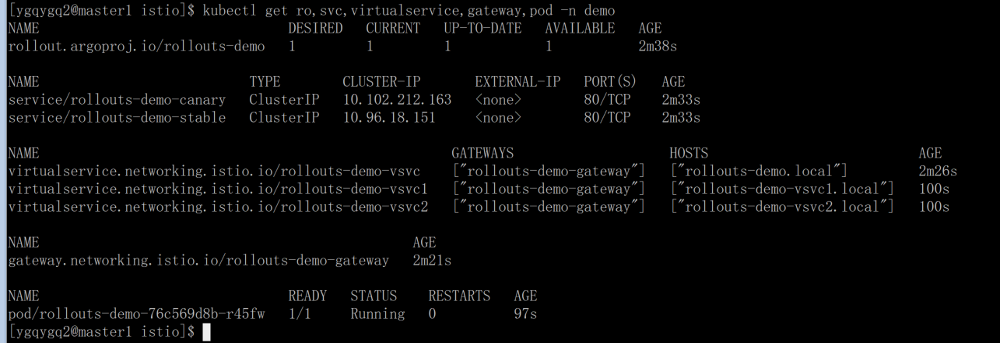

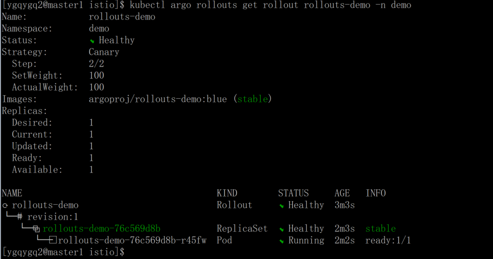

**执行更新**

```bash
kubectl argo rollouts set image rollouts-demo rollouts-demo=argoproj/rollouts-demo:yellow -n demo
kubectl argo rollouts get rollout rollouts-demo -n demo
```


rollouts-demo-vsvc1、rollouts-demo-vsvc2 都有更新

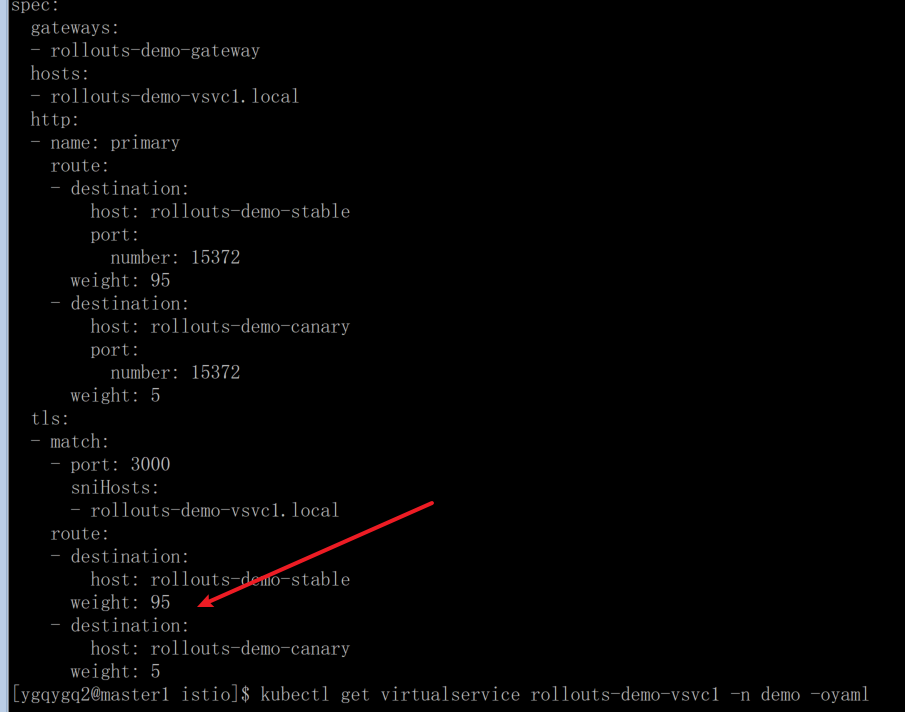

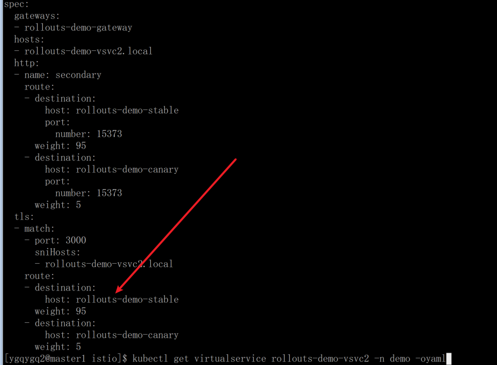

当 Rollout 执行步骤时，将调整 HTTP 和/或 TLS 路由的目标权重，以匹配步骤的当前 `setWeight`。

## 6.3 Argo Rollouts 配合 Nginx Ingress 使用

前提：kubernetes 集群已经安装 Nginx Ingress

当 NGINX Ingress 被用作流量路由时，Rollout 探测器策略必须定义以下强制字段:

```yaml
apiVersion: argoproj.io/v1alpha1
kind: Rollout
metadata:
  name: rollouts-demo
spec:
  strategy:
    canary:
      # 引用一个服务，控制器将更新该服务以指向金丝雀副本集
      canaryService: rollouts-demo-canary
      # 引用一个服务，控制器将更新该服务以指向稳定副本集
      stableService: rollouts-demo-stable
      trafficRouting:
        nginx:
          # 引用一个入口，该入口有一个指向稳定服务的规则 (e.g. rollouts-demo-stable)
          # 这个入口将被克隆成一个新名字，以便实现 NGINX 流量分割。.
          stableIngress: rollouts-demo-stable
...
```

在 `canary.trafficRouting.nginx.stableIngress` 中引用的入口必须具有一个主机规则，该规则具有一个针对 `canary.stablervice` 下引用的服务的后端。在我们的示例中，stable Service 命名为: `rollouts-demo-stable`:

```yaml
apiVersion: networking.k8s.io/v1beta1
kind: Ingress
metadata:
  name: rollouts-demo-stable
  annotations:
    kubernetes.io/ingress.class: nginx
spec:
  rules:
  - host: rollouts-demo.local
    http:
      paths:
      - path: /
        backend:
          # 引用服务名称，也在 rolloutspec.strategy.canary.stablervice 字段中指定
          serviceName: rollouts-demo-stable
          servicePort: 80
```

以下为示例使用的 yaml 文件：

```yaml
# rollout.yaml
apiVersion: argoproj.io/v1alpha1
kind: Rollout
metadata:
  name: rollouts-demo
spec:
  replicas: 1
  strategy:
    canary:
      canaryService: rollouts-demo-canary
      stableService: rollouts-demo-stable
      trafficRouting:
        nginx:
          stableIngress: rollouts-demo-stable
      steps:
      - setWeight: 5
      - pause: {}
  revisionHistoryLimit: 2
  selector:
    matchLabels:
      app: rollouts-demo
  template:
    metadata:
      labels:
        app: rollouts-demo
    spec:
      containers:
      - name: rollouts-demo
        image: argoproj/rollouts-demo:blue
        ports:
        - name: http
          containerPort: 8080
          protocol: TCP
        resources:
          requests:
            memory: 32Mi
            cpu: 5m
```

```yaml
# services.yaml
apiVersion: v1
kind: Service
metadata:
  name: rollouts-demo-canary
spec:
  ports:
  - port: 80
    targetPort: http
    protocol: TCP
    name: http
  selector:
    app: rollouts-demo
    # This selector will be updated with the pod-template-hash of the canary ReplicaSet. e.g.:
    # rollouts-pod-template-hash: 7bf84f9696

---
apiVersion: v1
kind: Service
metadata:
  name: rollouts-demo-stable
spec:
  ports:
  - port: 80
    targetPort: http
    protocol: TCP
    name: http
  selector:
    app: rollouts-demo
    # This selector will be updated with the pod-template-hash of the stable ReplicaSet. e.g.:
    # rollouts-pod-template-hash: 789746c88d
```

```yaml
# ingress.yaml  这里使用 kubernetes 1.23.4 版本
apiVersion: networking.k8s.io/v1
kind: Ingress
metadata:
  name: rollouts-demo-stable
  annotations:
    kubernetes.io/ingress.class: nginx
spec:
  rules:
  - host: rollouts-demo.local
    http:
      paths:
      - path: /
        pathType: ImplementationSpecific
        backend:
          # Reference to a Service name, also specified in the Rollout spec.strategy.canary.stableService field
          service:
            name: rollouts-demo-stable
            port: 
              number: 80
```

**部署**

```bash
kubectl apply -f docs/getting-started/nginx/rollout.yaml
kubectl apply -f docs/getting-started/nginx/services.yaml
kubectl apply -f docs/getting-started/nginx/ingress.yaml  # 内容为上文
```


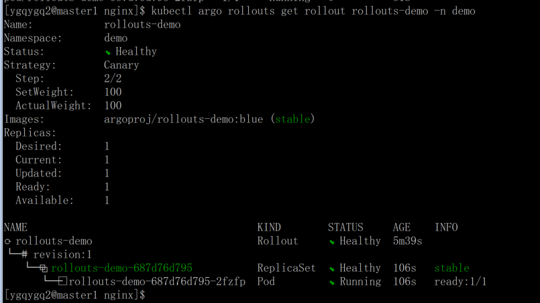

**执行更新**

```bash
kubectl argo rollouts set image rollouts-demo rollouts-demo=argoproj/rollouts-demo:yellow -n demo
kubectl argo rollouts get rollout rollouts-demo -n demo
```

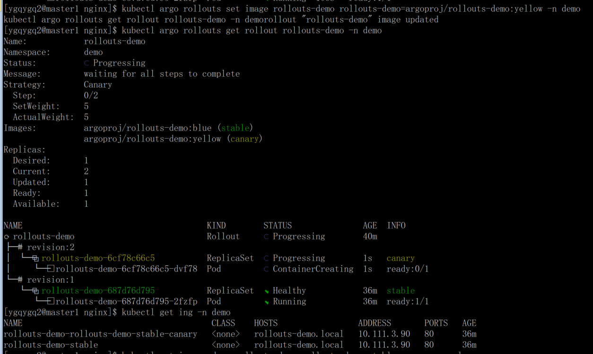

此时，Rollout 的探测器和稳定版本都在运行，5% 的流量指向 canary。需要注意的一点是，尽管只运行两个 pod，但是这款产品能够实现5% 的 canary 权重。这是能够实现的，因为流量分配发生在 ingrress 控制器(相对于加权副本数和 kube-proxy)。

在检查 rollout 控制器所生成的 ingress 副本时，我们看到它比原来的有以下变化:

1. 2 个额外的 NGINX 指定 canary 注释添加到注释中。
2. Ingress 规则将有一个规则，将后端指向 canary 服务。

```yaml
apiVersion: networking.k8s.io/v1
kind: Ingress
metadata:
  annotations:
    kubernetes.io/ingress.class: nginx
    nginx.ingress.kubernetes.io/canary: "true"
    nginx.ingress.kubernetes.io/canary-weight: "5"
  creationTimestamp: "2022-05-16T09:04:45Z"
  generation: 1
  name: rollouts-demo-rollouts-demo-stable-canary
  namespace: demo
  ownerReferences:
  - apiVersion: argoproj.io/v1alpha1
    blockOwnerDeletion: true
    controller: true
    kind: Rollout
    name: rollouts-demo
    uid: 1e9e8f18-2e6d-4c02-97dc-c22fb7ebcab8
  resourceVersion: "50355684"
  uid: 350850c3-98af-4a7f-8c85-b30c2c8b8656
spec:
  rules:
  - host: rollouts-demo.local
    http:
      paths:
      - backend:
          service:
            name: rollouts-demo-canary
            port:
              number: 80
        path: /
        pathType: ImplementationSpecific
```

随着 Rollout 在步骤中的进展，将调整 `canary-weight` 注释以匹配步骤的当前 `setWeight`。NGINX 入口控制器检查原始入口、金丝雀入口和金丝雀权重注释，以确定在两个入口之间分配的流量百分比。

# 7\. 总结

Argo Rollouts 提供强大的发布功能，确实可以在一定程度上代替 deployment，能基本上满足各种发布需求，它做不到的一些功能也可以配合 istio 。 总之，随着 Argo 系列的产品逐渐完善，其将会在基于 kubernetes 的 CI/CD 中越发占有一席之地。
