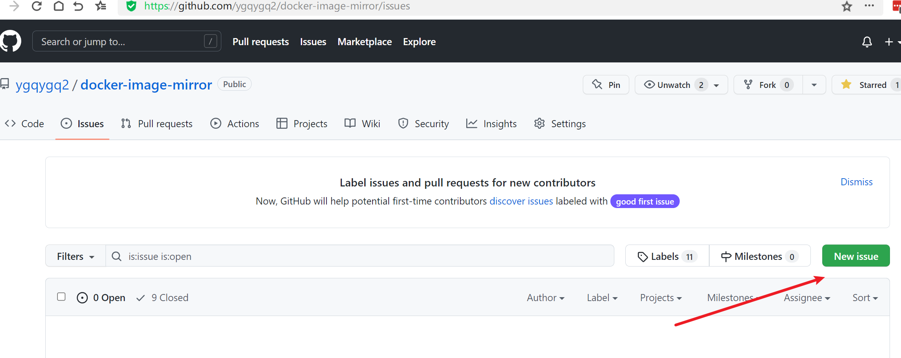
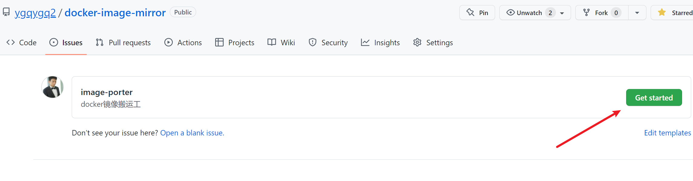
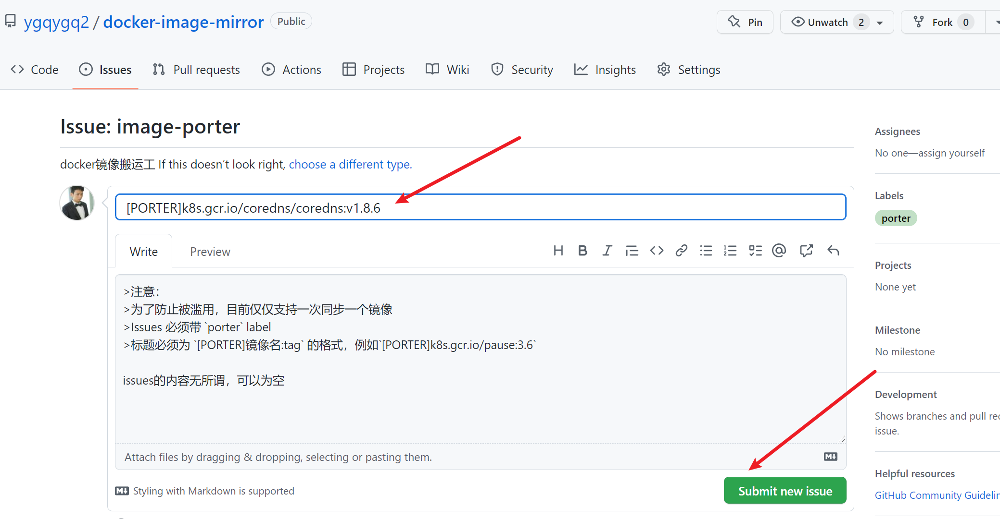
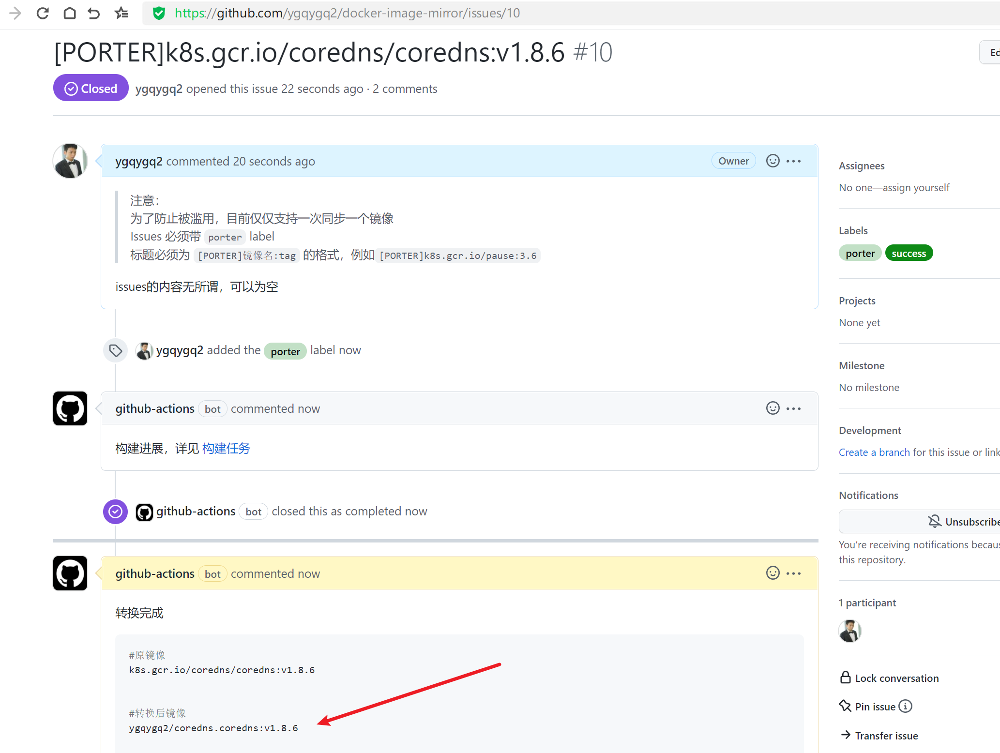
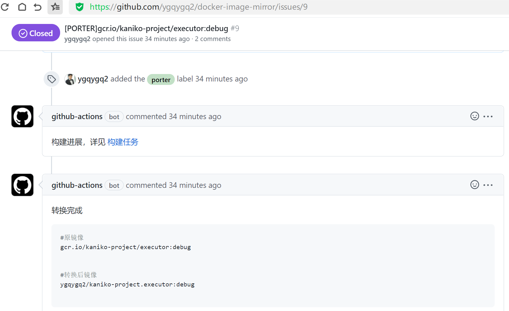

# 1. 目的

不管是 k8s 官方 image 还是其它 google docker imag 等，从国内直接拉取不了，此方案使用 github action 作为中转，将 image 上传至 docker hub。

# 2. 过程

打开我的仓库 [https://github.com/ygqygq2/docker-image-mirror](https://github.com/ygqygq2/docker-image-mirror)，当然也欢迎 [fork](https://github.com/ygqygq2/docker-image-mirror/fork)，修改成自己想要的样子。

新建 issue 

点击开始 

输入你要同步的 image 地址，前面`[PORTER]`加不加不影响。 

等待 CI 完成 

转换后的 image 即可直接 `docker pull`。 
