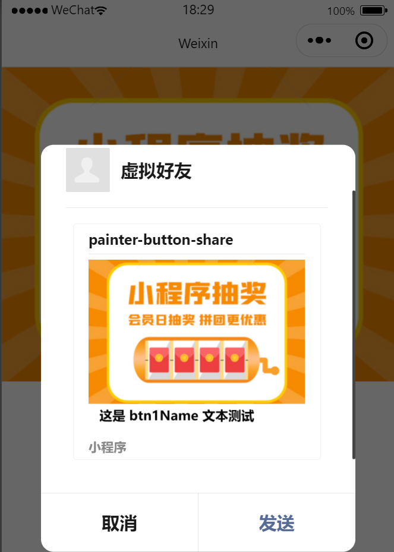
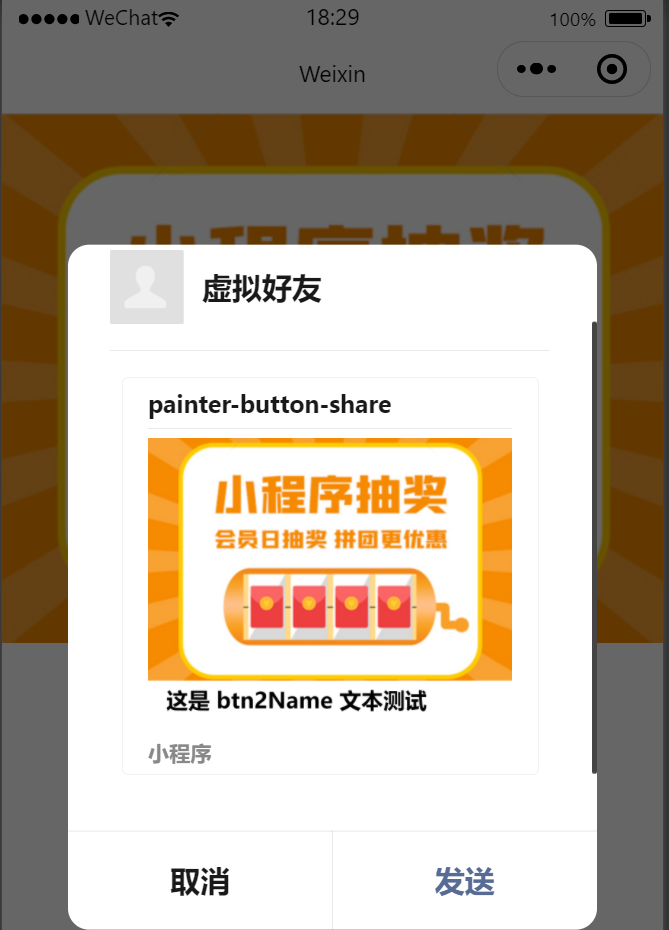
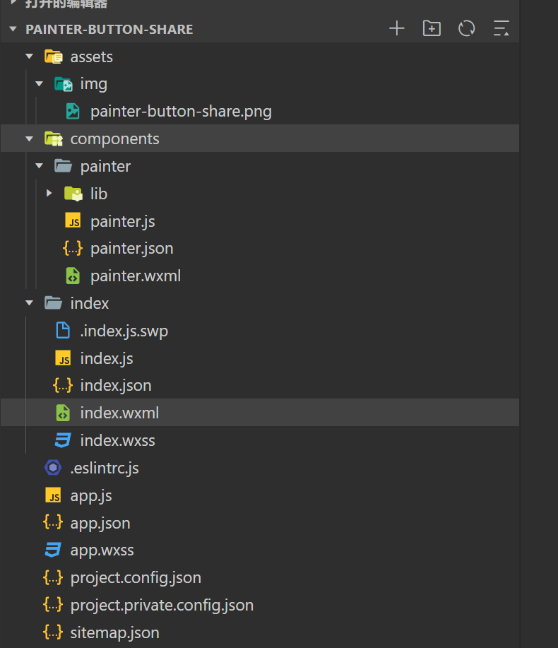
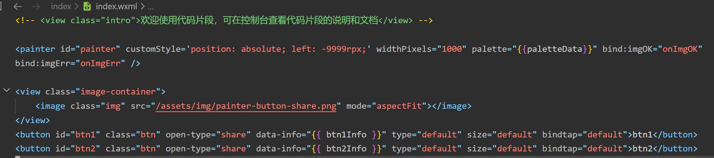
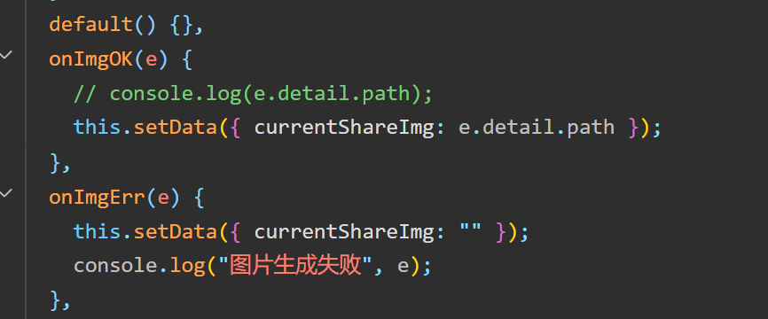
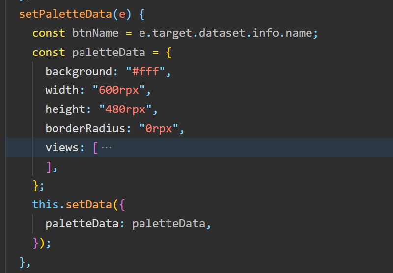
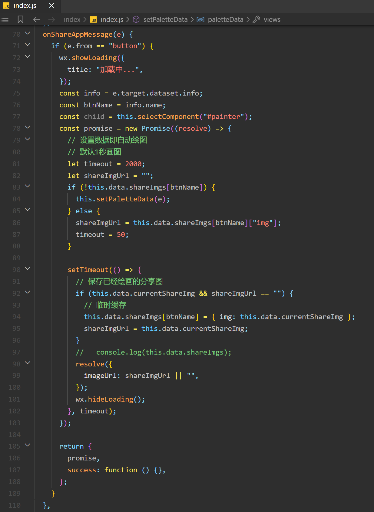

# 1. 说明

先上代码片断分享链接： [https://developers.weixin.qq.com/s/vl3ws9mA72GG](https://developers.weixin.qq.com/s/vl3ws9mA72GG)

- \[x\] 使用 painter 画图
- \[x\] 按钮传递定制化信息

效果如下： 



# 2. 关键代码说明

文件列表如下： 

```
{
  "usingComponents": {
      "painter": "/components/painter/painter"
  }
}
```

- painter 为组件，在页面 json 文件中引入；



- 组件使用 `palette` 传入画图参数，参数中使用 json 格式，内容基本是把 css 转换下写法，可以此在线绘制生成你需要的 json 内容: [https://painterjs.github.io/](https://painterjs.github.io/)
- button 通过 `data-xxx` 传值，js 中通过 `e.target.dataset.xxx` 获取数据；
- `bindtap` 绑定个空的函数，防止默认事件，比如跳转等；



- 可拿到生成的图片地址，图片地址格式类似为 `http://tmp/xxxxxxxxxxxxxxx`，经实践用户转发发送其它人是可以看得到的，这省去了上传后台的麻烦；



- painter 组件自动监听 palette 数据，一旦有新数据传入，它即自动开始绘制，时间较快；



- 函数中通过 `e.from` 判断是 `button` 或 `menu`；
- 加上 `showLoading` 提示体验好点，后面记得 `hideLoading` 取消提示；
- 当前官方版本支持 3 秒的 `promise` 异步时间，因此绘制图片时间不超过 3 秒才行，现在手机性能较好，我这里 1 秒的定时器来等待图片生成再去拿图片；
- 为了避免相同图片重复生成，可以增加一定的缓存，我这里使用页面级别的缓存；
- 最后注意返回这个 `promise`，因为转发图主要是 `imageUrl` 来设置；

# 3. 总结

小程序开发还是有坑和体验不好的地方，但相比前端来讲又稍微简单了点，不过小程序体积大了以后，一个页面上千行代码也是经常的事，所以提前使用上 typescript scss ，多使用 class 封装等对于后续维护有更好的体验。

参考资料： \[1\] [https://github.com/Kujiale-Mobile/Painter](https://github.com/Kujiale-Mobile/Painter) \[2\] [https://developers.weixin.qq.com/miniprogram/dev/reference/api/Page.html#onShareAppMessage-Object-object](https://developers.weixin.qq.com/miniprogram/dev/reference/api/Page.html#onShareAppMessage-Object-object)
