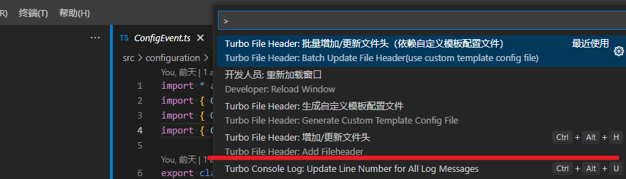
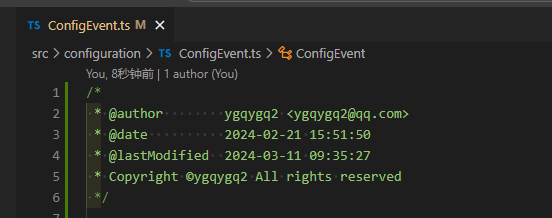

# 1. 扩展介绍

最近写了一个 vscode 扩展 [turbo-file-header](https://marketplace.visualstudio.com/items?itemName=ygqygq2.turbo-file-header)，主要是为了实现代码文件中文件头管理，比如增加一些作者信息、lincense 等，欢迎使用。 现在已经实现的功能：

- 快捷键 `ctrl + alt + h` 快速插入/更新文件头；
- 生成项目级自定义文件头模板配置文件；
- 根据项目级自定义文件头模板配置文件管理文件头；
- 注释支持语法高亮标签，让注释展示更多信息；
- 支持新/未知语言配置，在没有相应扩展识别该语言的情况下，使用自定义注释符号；
- 支持批量插入/更新文件头；
- 多语言支持；

> 注意：
> **为了防止误操作，有版本管理，扩展需要工作目录为 git/svn 项目**；

# 2. 扩展使用

通过命令使用：

项目级文件头管理：

**需要生成自定义模板配置文件** 

> - 自定义模板配置文件生成在 workspace 的 `.vscode` 目录下；
> - 扩展会优先使用自定义模板配置来生成文件头；
> - 批量插入/更新文件依赖自定义模板配置文件，因为要配置查找哪些文件需要文件头；
