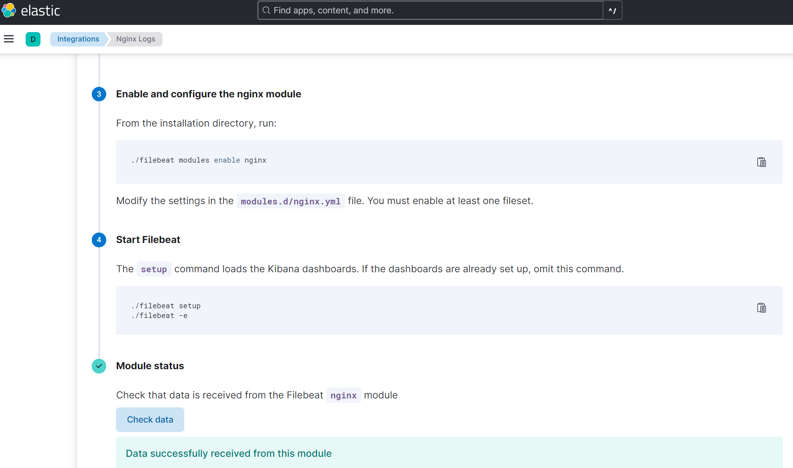
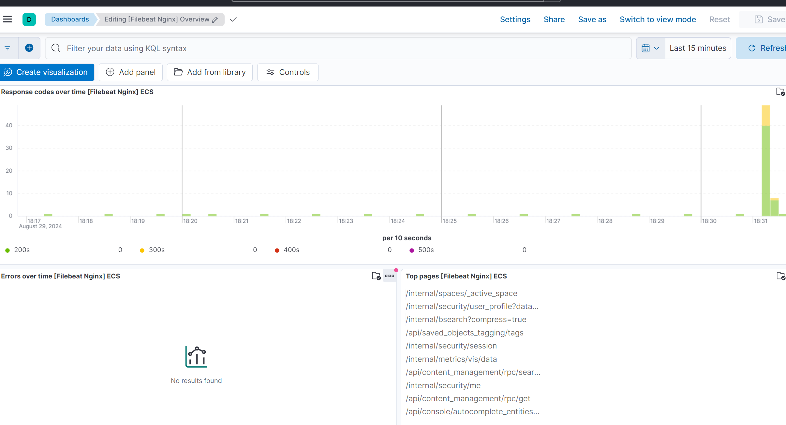
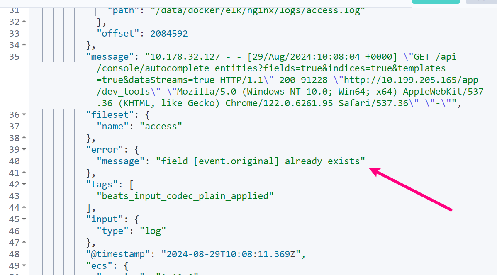

[TOC]

# 1. 说明

elk 版本：8.15.0

# 2. 启个 nginx

有 nginx 可以直接使用。我这里是在之前环境下 `docker-compose.yml` 中启动了个 nginx：

```yaml
nginx:
  restart: always
  image: nginx:1.26.1
  ports:
    - "80:80"
    - "443:443"
  volumes:
    #- ./nginx/html:/usr/share/nginx/html
    - ./nginx/logs:/var/log/nginx
    #- ./nginx/certs:/etc/nginx/certs
    - ./nginx/conf/nginx.conf:/etc/nginx/nginx.conf
    - ./nginx/conf/conf.d:/etc/nginx/conf.d
```

刚开始如果没有 nginx 配置，可以先不映射配置目录和文件，先启动，然后 `docker cp` 把配置和目录拷贝出来，再挂载进去。

配置 `nginx/conf/conf.d/default.conf`：

```
#
upstream kibana_servers {
    server kibana:5601 weight=1 max_fails=3 fail_timeout=30s;
}

server{
    listen 80;
    server_name localhost;
    # root /usr/local/nginx/html ;
    # rewrite ^(.*) https://$server_name$1 permanent;

    location / {
        proxy_pass http://kibana_servers/;
        proxy_set_header Host $host:$server_port;
        proxy_set_header X-Forwarded-Host $host:$server_port;
        proxy_set_header X-Forwarded-Server $host;
        proxy_set_header X-Forwarded-For $proxy_add_x_forwarded_for;
        proxy_set_header X-Forwarded-Proto $scheme;
        proxy_set_header X-Real-IP $remote_addr;
        proxy_connect_timeout  30s;
        proxy_read_timeout     90s;
        proxy_send_timeout     90s;
        client_max_body_size   50m;
        client_body_buffer_size 16k;  # 默认是 8k 或 16k，可以根据需要调整
    }
}
```

# 3. filebeat 接入到 es

根据指引 filebeat 直接接入到 es。


filebeat 安装参考 《Docker compose 安装 ELK》中 "6. 安装 filebeat"。

filebeat 的目录下，设置 nginx 日志路径 `modules.d/nginx.yml`：

```yaml
- module: nginx
  # Access logs
  access:
    enabled: true

    # Set custom paths for the log files. If left empty,
    # Filebeat will choose the paths depending on your OS.
    var.paths: ["/data/docker/elk/nginx/logs/access.log*"]

  # Error logs
  error:
    enabled: true

    # Set custom paths for the log files. If left empty,
    # Filebeat will choose the paths depending on your OS.
    var.paths: ["/data/docker/elk/nginx/logs/error.log*"]
```

主配置 `filebeat.yml`：

```yaml
filebeat.config.modules:
  # Glob pattern for configuration loading
  path: ${path.config}/modules.d/*.yml

output.elasticsearch:
  hosts: ["https://10.1.205.165:9200"]
  username: "filebeat_writer"
  password: "YOUR_PASSWORD"
  ssl:
    enabled: true
    # fingerprint=$(openssl x509 -fingerprint -sha256 -noout -in certs/ca/ca.crt | awk -F"=" '{print $2}' | sed 's/://g')
    ca_trusted_fingerprint: "33CB5A3B3ECCA59FDF7333D9XXXXXXXXFD34D5386FF9205AB8E1"
    # certs/ca 目录从 es 中拷过来
    certificate_authorities: ["certs/ca/ca.crt"]

# output.logstash:
#   hosts: ["10.1.205.165:5044", "10.1.205.166:5044"]

setup.kibana:
  host: "10.1.205.165:5601"

logging.level: warning
```

Dev Tools 创建角色：

```
PUT /_security/role/filebeat_writer_role
{
  "cluster": [
    "monitor"
  ],
  "indices": [
    {
      "names": [
        "filebeat*"
      ],
      "privileges": [
        "create_doc",
        "create",
        "delete",
        "index",
        "write",
        "all",
        "auto_configure",
        "manage"
      ],
      "allow_restricted_indices": false
    }
  ],
  "applications": [],
  "run_as": [],
  "metadata": {},
  "transient_metadata": {
    "enabled": true
  }
}
```

Dev Tools 创建用户：

```
POST /_security/user/filebeat_writer
{
  "password" : "YOUR_PASSWORD",
  "roles" : [ "filebeat_writer_role" ],
  "full_name" : "Filebeat Writer",
  "email" : "filebeat_writer@example.com",
  "metadata" : {}
}
```

启用模块：

```bash
./filebeat modules enable nginx
./filebeat modules enable all-filesets

#
./filebeat setup
./filebeat -e
```

成功后，在 kibana 的 nginx log dashboard 中可以看到数据


# 4. filebeat 接入 logstash

主配置 `filebeat.yml`：

```yaml
filebeat.config.modules:
  # Glob pattern for configuration loading
  path: ${path.config}/modules.d/*.yml

# output.elasticsearch:
#   hosts: ["https://10.1.205.165:9200"]
#   username: "filebeat_internal"
#   password: "YOUR_PASSWORD"
#   ssl:
#     enabled: true
#     # fingerprint=$(openssl x509 -fingerprint -sha256 -noout -in certs/ca/ca.crt | awk -F"=" '{print $2}' | sed 's/://g')
#     ca_trusted_fingerprint: "33CB5A3B3ECCA59FDF7333D9XXXXXXXXFD34D5386FF9205AB8E1"
#     # certs/ca 目录从 es 中拷过来
#     certificate_authorities: ["certs/ca/ca.crt"]

output.logstash:
  hosts: ["10.1.205.165:5044", "10.1.205.166:5044"]

setup.kibana:
  host: "10.1.205.165:5601"

logging.level: warning
```

有问题的配置我就不贴了，最终配置在下面，注释有说明解决问题的关键。
启动 filebeat 后，在 kibana Dev Tools 中查询：

```
GET filebeat-*/_search
{
  "size": 1,
  "sort": [
    {}
  ]
}
```

结果发现 ingest pipeline 处理异常，经过一段时间排查，找到了 [相同问题链接](https://discuss.elastic.co/t/aws-ingest-pipeline-error-in-processor-rename-message-to-event-original/341472/8)


然后下面是最终的可用 Logstash Pipeline 设置 `logstash/pipeline/filebeat.conf`：

```yaml
#
input {
  beats {
    port => 5044
  }
}

filter {
  if [@metadata][pipeline] {
    # 这里解决上面 `[event][original]` 已存在问题
    ruby {
      code => "event.remove('[event][original]')"
    }
  } else if [log_type] == "k8s" {
    # 将嵌套字段提升为顶层字段
    mutate {
      rename => {
        "[kubernetes][namespace]" => "kubernetes_namespace"
        "[kubernetes][node][name]" => "kubernetes_node_name"
        "[kubernetes][pod][ip]" => "kubernetes_pod_ip"
        "[kubernetes][pod][name]" => "kubernetes_pod_name"
        "[container][runtime]" => "container_runtime"
      }
    }

    # 使用 prune 过滤器保留所需字段
    prune {
      whitelist_names => ["@timestamp", "log_type", "container_runtime", "kubernetes_namespace", "kubernetes_node_name", "kubernetes_pod_ip", "kubernetes_pod_name", "message"]
    }
  }
}

output {
  if [@metadata][pipeline] {
    elasticsearch {
      hosts => ["https://es01:9200", "https://es02:9200", "https://es03:9200"]
      user => "logstash_writer"
      password => "logstash_password"
      ssl_enabled => true
      ssl_certificate_authorities => "/usr/share/logstash/certs/ca/ca.crt"
      action => "create"
      pipeline => "%{[@metadata][pipeline]}"
      index => "%{[@metadata][beat]}-%{[@metadata][version]}"
      manage_template => false
    }
  } else if [log_type] == "k8s" {
    elasticsearch {
      hosts => ["https://es01:9200", "https://es02:9200", "https://es03:9200"]
      index => "k8s-%{+YYYY.MM.dd}"
      user => "logstash_writer"
      password => "logstash_password"
      ssl_enabled => true
      ssl_certificate_authorities => "/usr/share/logstash/certs/ca/ca.crt"
    }
  } else {
    # 默认索引
    elasticsearch {
      hosts => ["https://es01:9200", "https://es02:9200", "https://es03:9200"]
      index => "logstash-%{+YYYY.MM.dd}"
      user => "logstash_writer"
      password => "logstash_password"
      ssl_enabled => true
      ssl_certificate_authorities => "/usr/share/logstash/certs/ca/ca.crt"
      action => "create"
      manage_template => false
    }
  }
}
```

logstash 角色和用户权限同上面 filebeat 角色和用户。

# 5. 总结

Filebeat 收集 nginx、mysql 等日志，没有特别需求，最好直接接入 ES 中，少了一层 logstash 其实性能更好，问题也相对较少，官方文档推荐的。

参考资料：
[1] https://www.elastic.co/guide/en/logstash/8.15/use-ingest-pipelines.html
[2] https://www.elastic.co/guide/en/elasticsearch/reference/8.15/ingest.html
[3] https://www.elastic.co/guide/en/beats/filebeat/8.15/filebeat-installation-configuration.html
[4] https://discuss.elastic.co/t/aws-ingest-pipeline-error-in-processor-rename-message-to-event-original/341472/8
[5] https://www.elastic.co/guide/en/ecs-logging/overview/master/intro.html
