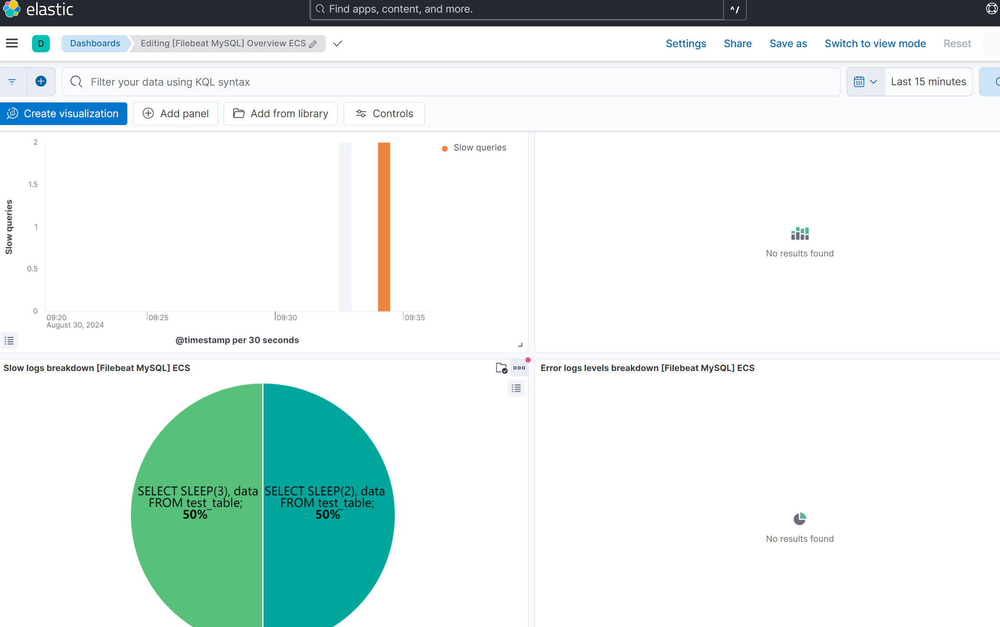

[TOC]

# 1. 说明

elk 版本：8.15.0

# 2. 启个 mysql

`docker-compose.yml` 中 mysql：

```yaml
  mysql:
    # restart: always
    image: mysql:8.0.27
    # ports:
    #   - "3306:3306"
    volumes:
      - ./mysql/data:/var/lib/mysql
      - ./mysql/log:/var/log/mysql
    command: [
      '--character-set-server=utf8mb4',
      '--collation-server=utf8mb4_unicode_ci',
      '--default-time-zone=+8:00']
    environment:
	  TZ: "Asia/Shanghai"
      MYSQL_ROOT_PASSWORD: "Mysqlr00Tp"
```

启动，并查看：

```
docker-compose up -d
docker-compose ps
```

# 3. 设置慢查询

进入 mysql 查询慢查询设置，因为我这里是临时测试，所以直接用命令设置，生产还需要设置到配置文件中。

```bash
# 我这里是 elk-mysql-1 容器名
docker exec -it elk-mysql-1 /bin/bash

# 进入 mysql
mysql -uroot -p$MYSQL_ROOT_PASSWORD
```

查询结果：

```
mysql> SHOW VARIABLES LIKE 'slow_query_log';
SHOW VARIABLES LIKE 'slow_query_log_file';
+----------------+-------+
| Variable_name  | Value |
+----------------+-------+
| slow_query_log | OFF   |
+----------------+-------+
1 row in set (0.01 sec)

mysql> SHOW VARIABLES LIKE 'slow_query_log_file';
+---------------------+--------------------------------------+
| Variable_name       | Value                                |
+---------------------+--------------------------------------+
| slow_query_log_file | /var/lib/mysql/1f4c6d344dcc-slow.log |
+---------------------+--------------------------------------+
1 row in set (0.00 sec)

mysql> SHOW VARIABLES LIKE 'long_query_time';
+-----------------+-----------+
| Variable_name   | Value     |
+-----------------+-----------+
| long_query_time | 10.000000 |
+-----------------+-----------+
1 row in set (0.00 sec)
```

把慢查询开启，并设置慢查询时间为 2 秒：

```
mysql> SET GLOBAL slow_query_log = 'ON';
Query OK, 0 rows affected (0.02 sec)

mysql> SET GLOBAL long_query_time = 2;
Query OK, 0 rows affected (0.00 sec)
```

慢查询日志路径不支持在线设置，需要设置到配置文件中，所以我们直接用上面默认的路径测试。

```
mysql> SET GLOBAL slow_query_log_file = '/var/log/mysql/mysql-slow.log';
ERROR 1231 (42000): Variable 'slow_query_log_file' can't be set to the value of '/var/log/mysql/mysql-slow.log'
```

上面设置后，退出再重进下，生效到新 Session 中。

# 4. filebeat 设置

`modules.d/mysql.yml` 中设置：

```yaml
- module: mysql
  error:
    enabled: false
    var.paths: ['/path/to/log/mysql/error.log*']
  slowlog:
    enabled: true
    var.paths: ['/data/docker/elk/mysql/data/*-slow.log*']
```

因为这里是容器环境，默认错误日志是输出的，我们只设置慢查询日志就好。

```
mysql> SHOW VARIABLES LIKE 'log_error';
+---------------+--------+
| Variable_name | Value  |
+---------------+--------+
| log_error     | stderr |
+---------------+--------+
1 row in set (0.00 sec)
```

主配置 `filebeat.yml`：

```yaml
filebeat.config.modules:
  # Glob pattern for configuration loading
  path: ${path.config}/modules.d/*.yml

output.elasticsearch:
  hosts: ['https://10.1.205.165:9200']
  username: 'filebeat_writer'
  password: 'YOUR_PASSWORD'
  ssl:
    enabled: true
    # fingerprint=$(openssl x509 -fingerprint -sha256 -noout -in certs/ca/ca.crt | awk -F"=" '{print $2}' | sed 's/://g')
    ca_trusted_fingerprint: '33CB5A3B3ECCA59FDF7333D9XXXXXXXXFD34D5386FF9205AB8E1'
    # certs/ca 目录从 es 中拷过来
    certificate_authorities: ['certs/ca/ca.crt']

# output.logstash:
#   hosts: ["10.1.205.165:5044", "10.1.205.166:5044"]

setup.kibana:
  host: '10.1.205.165:5601'

logging.level: warning
```

启动 filebeat 即可。

# 5. 触发慢查询

用以下 SQL 触发慢查询：

```
CREATE DATABASE test;
USE test;

CREATE TABLE test_table (
    id INT AUTO_INCREMENT PRIMARY KEY,
    data VARCHAR(255)
);

INSERT INTO test_table (data) VALUES ('sample data 1'), ('sample data 2'), ('sample data 3');

SELECT SLEEP(3), data FROM test_table;
```

在 MySQL 中，`SLEEP` 函数的参数是以秒为单位的。如果你执行 `SELECT SLEEP(3), data FROM test_table;`，每一行都会等待 3 秒。因此，如果表中有 3 行数据，总的查询时间将是 3 秒乘以行数，即 9 秒。

可以看到 kibana 中的 dashboard 已经有数据了：


# 6. MySQL 告警至飞书

` docker-compose.yml`：

```
services:
  elastalert:
    image: ygqygq2/elastalert2:2.21.0
    volumes:
      - ./elastalert/config.yaml:/opt/elastalert/config.yaml
      - ./elastalert/rules:/opt/elastalert/rules
      - /usr/share/zoneinfo/Asia/Shanghai:/etc/localtime:ro
    restart: always
```

关键的是 rules：

```yaml
#rule name 必须是独一的，不然会报错
name: 'mysql-slowlog'
type: 'frequency'
#这个index 是指再kibana 里边的index  支持正则 log-*
index: 'filebeat-*'
#时间触发的次数
num_events: 1
#和num_events参数关联，1分钟内出现1次会报警
timeframe:
  # hours: 1
  minutes: 1
  # seconds: 30
##同一规则的两次警报之间的最短时间。在此时间内发生的任何警报都将被丢弃。默认值为一分钟
realert:
  minutes: 1
# terms_size: 50
# timestamp_field: "@timestamp"
# timestamp_type: "iso"
use_strftime_index: true

filter:
  - query:
      bool:
        must:
          - query_string:
              query: 'event.dataset: mysql.slowlog'
          - script:
              script:
                source: >
                  def ip_list = params.ip_list;
                  def host_ip = doc['host.ip'][0];
                  def duration_in_seconds = doc['event.duration'].value / 1e9;
                  return ip_list.contains(host_ip) && duration_in_seconds > params.threshold;
                lang: painless
                params:
                  ip_list: ['10.x.x.x']
                  threshold: 10 # 10 seconds

alert:
  - feishu

# 告警群
feishu_robot_webhook_url: 'https://open.feishu.cn/open-apis/bot/v2/hook/xxxxx'

# 这个时间段内的匹配将不告警，适用于某些时间段请求低谷避免误报警
# feishu_skip:
#   start: "01:00:00"
#   end: "09:00:00"

alert_subject: 'MySQL 慢查询'
alert_text_type: alert_text_only
alert_text: |
  💔 ELK 日志告警
  🔵【告警名称】{}
  🧭【告警时间】{}
  🔢【命中次数】{}
  🆔【日志_id】{}
  🖥️️【故障主机】{}
  🌐【查询来源】{}
  👤【查询用户】{}
  ⏱️【查询耗时】{} 秒
  📝【日志信息】{}

# 设置告警使用的变量名
alert_text_args:
  - 'alert_subject'
  - 'alert_time'
  - 'num_hits'
  - '_id'
  - 'host.ip[0]'
  - 'related.ip'
  - 'related.user'
  - 'event.duration'
  - 'mysql.slowlog.query'
```

参考资料：
[1] https://www.elastic.co/guide/en/beats/filebeat/8.15/filebeat-module-mysql.html
