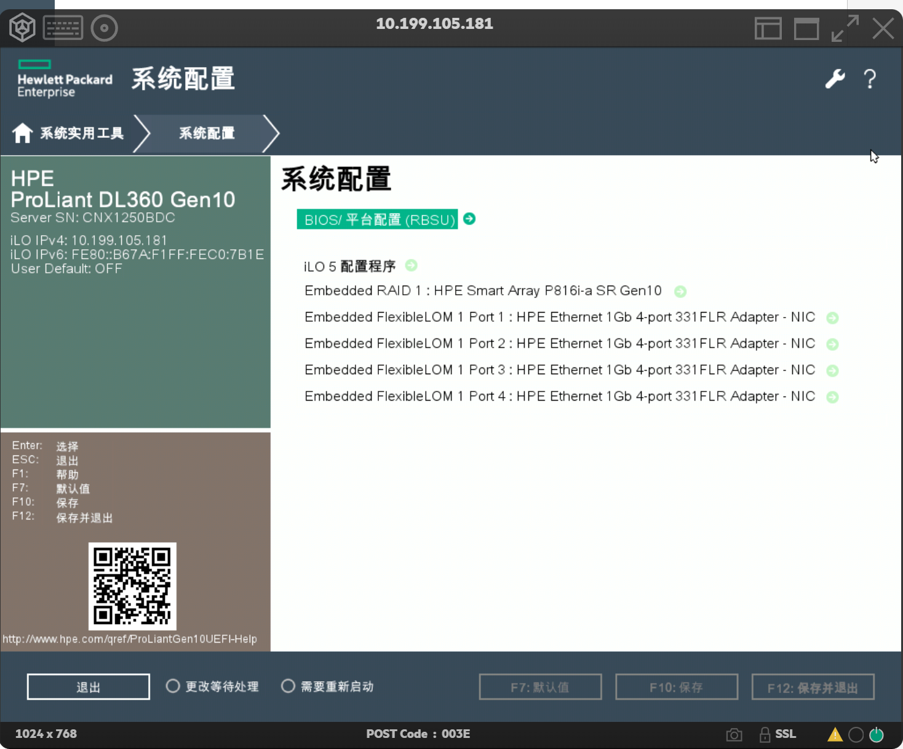
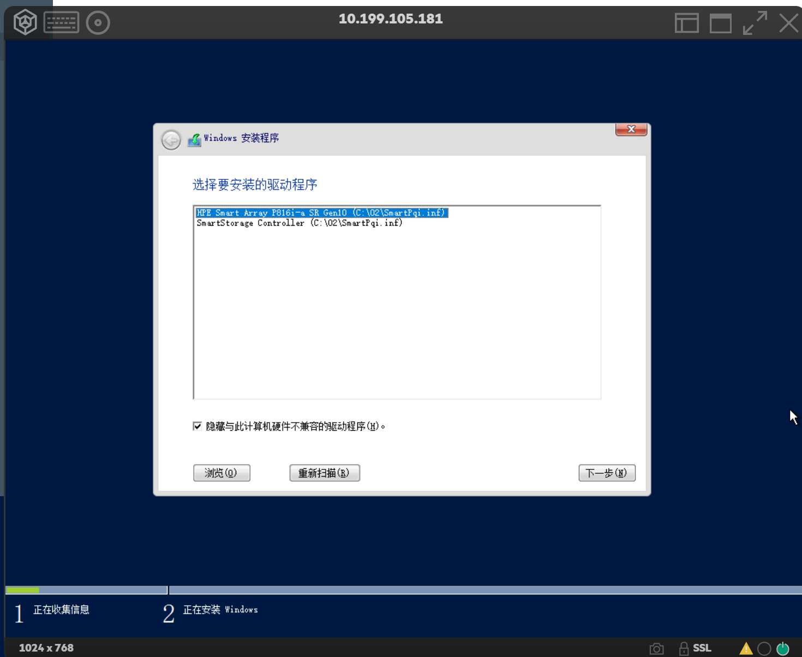
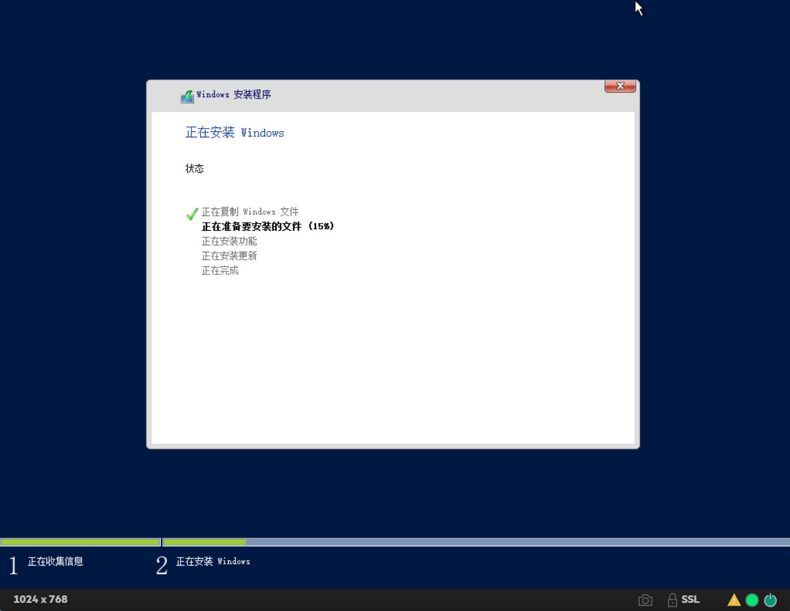

[TOC]

# 1. 设置 raid

略，根据以下 [1] 参考资料进行即可

# 2. 准备 windows 驱动

设置 Raid 时，可以看到阵列型号，我这里是：HPE Smart Array P816i-a SR Gen10

根据型号下载对应的驱动，然后准备一个 U 盘，下载好的驱动，在 windows 下双击，提取至 U 盘某目录。

# 3. windows 安装

推荐从带外安装系统，远程方便管理。

从 iso 加载 windows 成虚拟 cd/dvd，然后正常安装进度。

在识别不到磁盘时，插上 U 盘，选择你提取到 U 盘的驱动目录。

1. 选择第一个，下一步
   

2. 此时可以看见磁盘，但是你仍然无法安装，然后再次从 U 盘加载驱动，选择第二个，下一步，即可正常安装。后面都是正常流程了。
   

参考资料：
[1] https://blog.csdn.net/guanqaz/article/details/132394065
