[TOC]

# 1. 引言

在使用 Cursor、GitHub Copilot、Continue 等 AI 编程助手时，你是否遇到过这些问题：

- 每次换项目都要重新配置编码规范？
- 团队成员的 AI 提示词不统一，代码风格混乱？
- 优质的规则模板分散在各处，难以管理和复用？

**Turbo AI Rules** 就是为解决这些痛点而生的 VS Code 扩展。它让你可以从 Git 仓库同步 AI 规则，自动生成各种 AI 工具的配置文件，真正实现"一次编写，处处使用"。

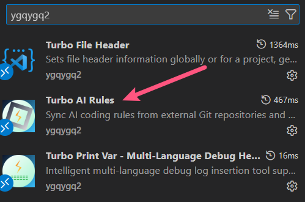

# 2. 核心特性

## 2.1 多源管理，灵活组合

从多个 Git 仓库同步规则，可以是：

- 团队共享的编码规范仓库
- 个人积累的最佳实践
- 开源社区的优质模板

每个规则源可以独立启用/禁用，按需组合使用。

## 2.2 智能适配器，一键生成

内置主流 AI 工具适配器：

- **Cursor** - 生成 `.cursorrules` 文件
- **GitHub Copilot** - 生成 `.github/copilot-instructions.md`
- **Continue** - 生成 `.continuerules` 配置
- **自定义适配器** - 支持扩展到任意 AI 工具，可单文件，可目录

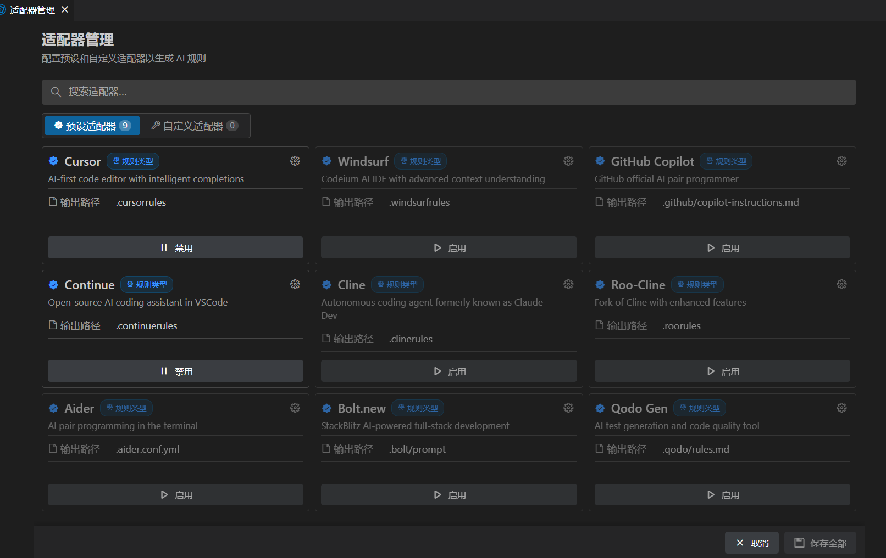

只需在设置中启用对应适配器，扩展会自动生成并维护规则文件。

## 2.3 可视化管理，操作便捷

提供直观的图形界面：

- **仪表板** - 扩展各页面的入口和部分状态展示
- **欢迎页** - 快速开始向导和模板库
- **规则源管理页** - 管理多规则源
- **适配器管理页** - 灵活启用/禁用和添加自定义适配器
- **树形规则展示和选择** 方便用户选择规则和快速同步，支持 skills 文件同步
- **规则搜索页** - 规则源中规则太多，可快速搜索
- **规则预览页** - 看到规则标题，想知道详细规则是什么
- **统计面板** - 可视化规则分析和导出
- **状态栏显示** - 快速查看同步状态

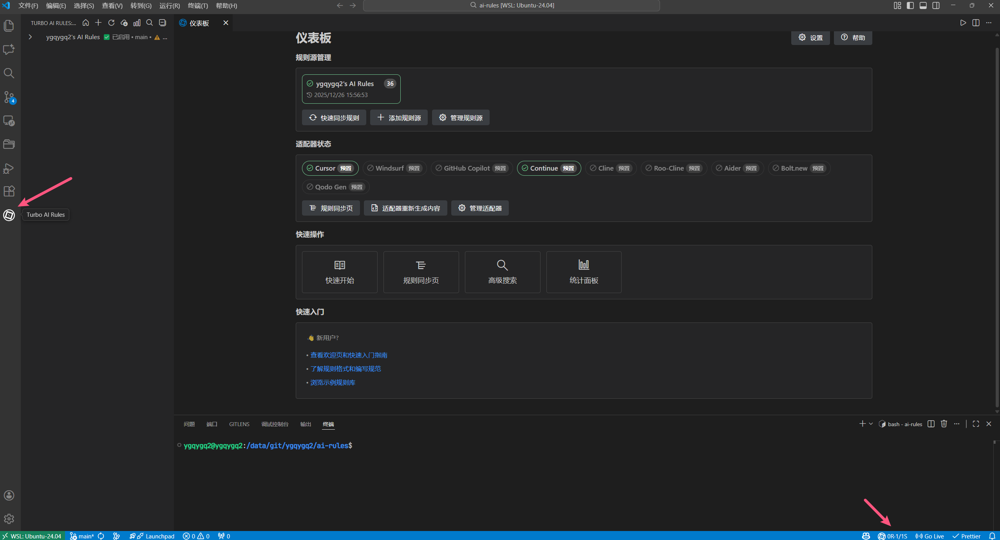


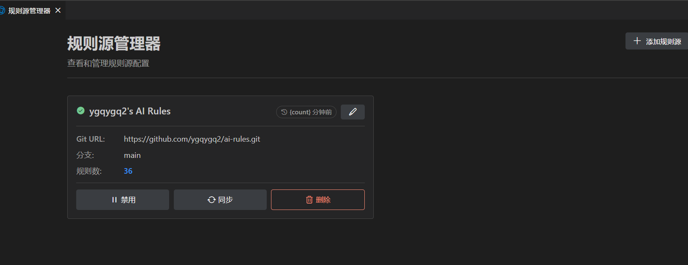

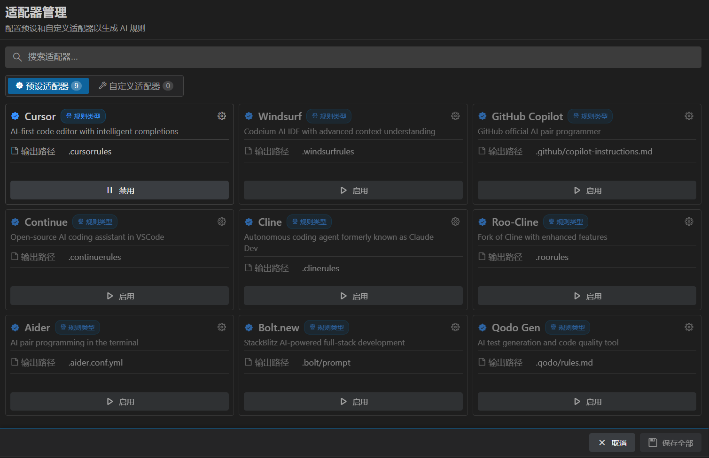

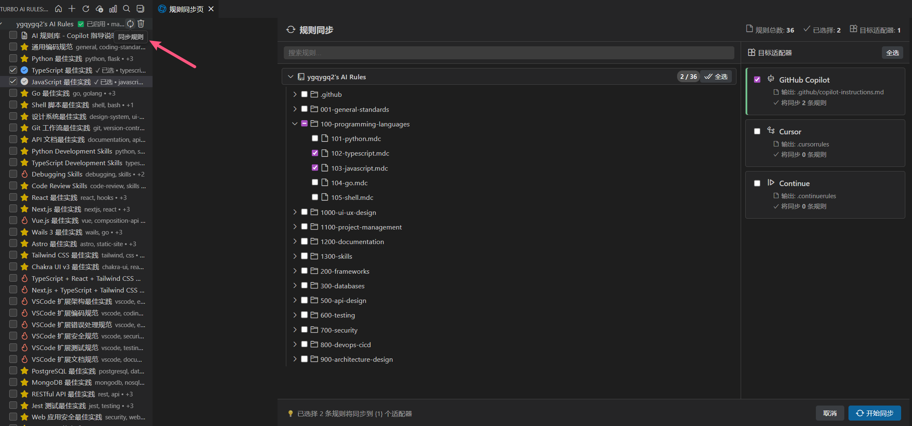

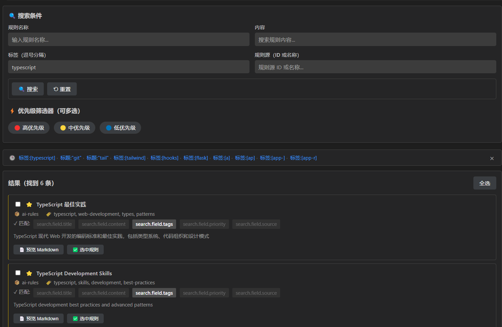


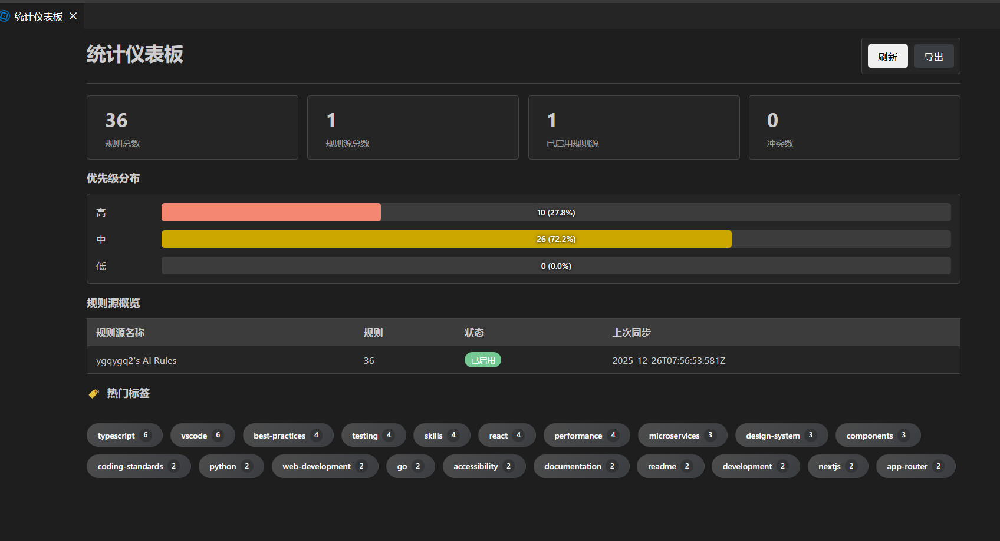

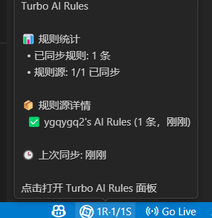

# 3. 快速上手

## 第一步：安装扩展

在 VS Code 扩展市场搜索 **Turbo AI Rules**，点击安装。
完整的扩展名是：`ygqygq2.turbo-ai-rules`

## 第二步：添加规则源

安装后会自动打开欢迎页，你可以选择：

**方式一：使用预设模板**

- 点击本人的规则仓库添加为规则源（自用较多，主要是里面元数据写法作为参考）
- 扩展会自动添加示例规则源

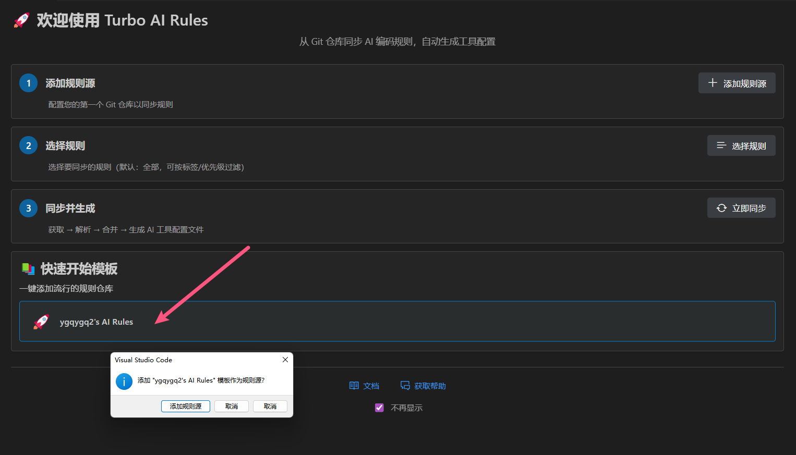

**方式二：手动添加**

1. 点击 **添加规则源** 按钮
2. 输入 Git 仓库信息：

```
仓库 URL:   https://github.com/your/coding-rules.git
分支:       main（可选，默认 main）
子路径:     rules（可选，只展示此目录下的规则）
显示名称:   我的规范（便于识别）
访问令牌:   ghp_xxx（仅私有仓库需要）
```

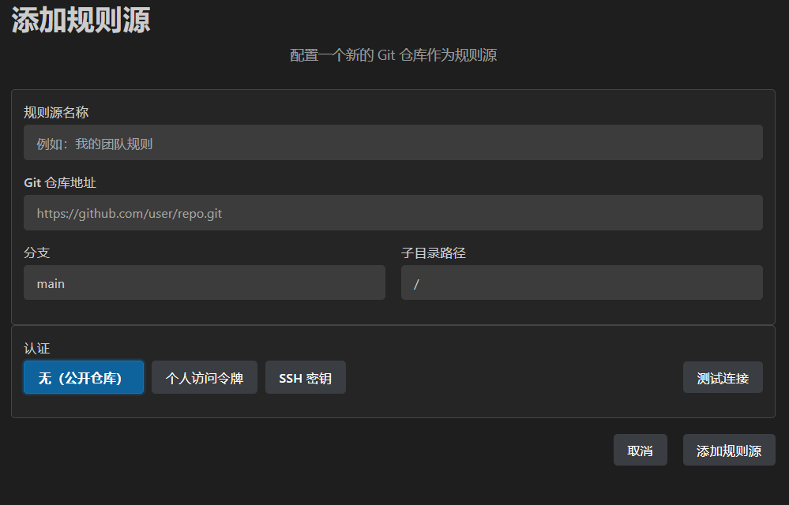

## 第三步：同步规则

添加源后会自动触发首次同步，但默认未选中任何规则。你也可以随时打开左侧栏图标选择规则后，手动同步：

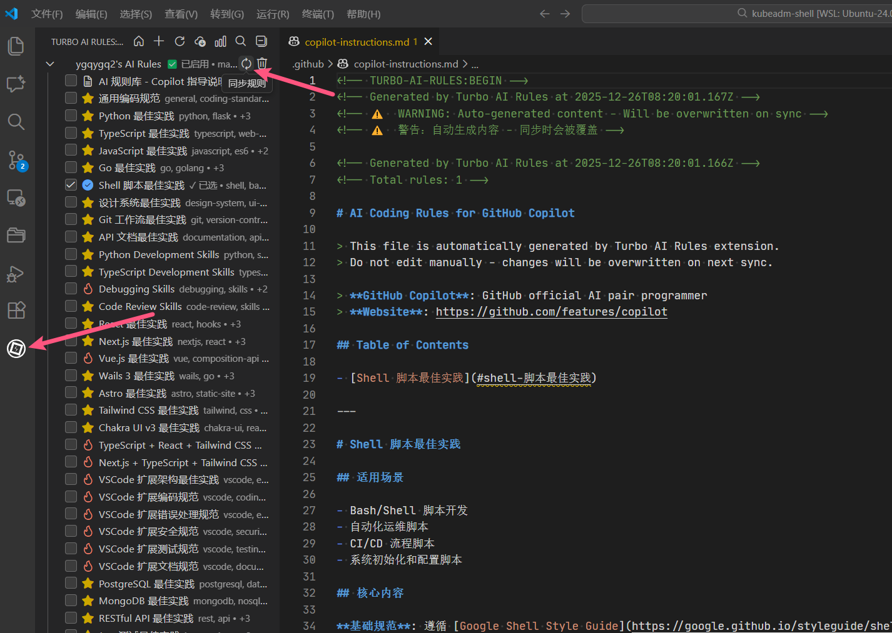

同步完成后，扩展会在工作区根目录生成适配器的规则文件（默认只启用 Cursor 适配器，自行启用/禁用），适配器启用的配置在项目配置 `settings.json` 持久化。

## 第四步：启用其他适配器

如果你使用 GitHub Copilot 或 Continue，需要额外启用适配器：

1. 进入扩展仪表板
2. 点击 “管理适配器” 按钮
3. 启用/禁用适配器（记得点击下面保存按钮），添加自定义适配器等

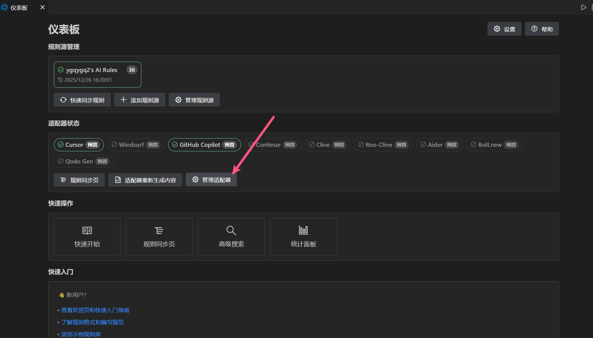


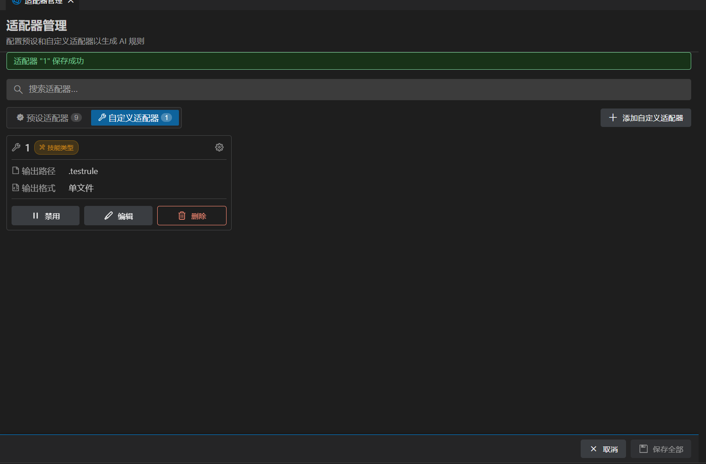

---

# 4. 进阶使用

## 4.1 规则文件格式

如果想要树形规则展示更美观，按如下模板添加以下规则元数据
规则文件使用标准 Markdown + YAML frontmatter 格式：

```markdown
---
id: 105
title: Shell 脚本最佳实践
description: Shell 脚本编程规范，包含命名约定、模块化设计和错误处理
globs: ['**/*.sh', '**/bash/**', '**/shell/**']
priority: medium
tags: [shell, bash, scripting]
version: 1.0.0
author: Turbo AI Rules
lastUpdated: 2025-12-19
---

# Shell 脚本最佳实践

## 适用场景

- Bash/Shell 脚本开发
- 自动化运维脚本
- CI/CD 流程脚本
- 系统初始化和配置脚本
```

关键字段说明（必填的最好加上）：

- 元数据在文件的开始位置
- `id` - 唯一标识（必填）
- `title` - 规则标题（必填）
- `priority` - 优先级（high/medium/low）
- `tags` - 标签，用于搜索和分类

具体可参考：https://github.com/ygqygq2/ai-rules

## 4.2 规则搜索与管理

扩展提供强大的搜索功能：

- 按规则名字关键字
- 按规则内容关键字
- 按标签（元数据定义的）
- 限定规则源
- 按优先级


### 统计与分析

打开统计仪表板查看规则概览：

- **规则分布** - 按源、优先级、标签统计
- **导出功能** - 导出 JSON/CSV 格式报告
- **热门标签** - 按规则内标签统计，点击可快速到达搜索页展示结果

命令：`Turbo AI Rules: View Statistics Dashboard`

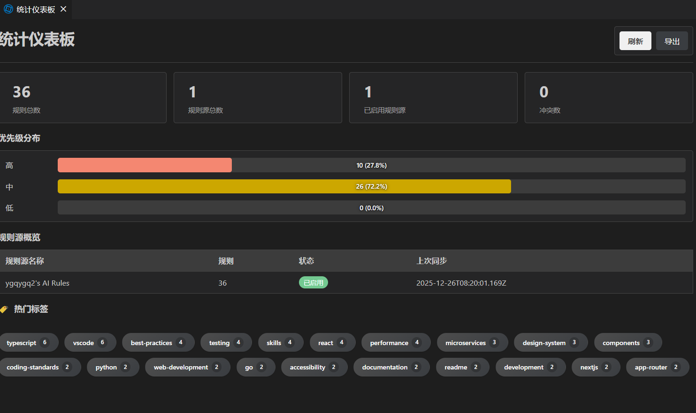

# 5. 实用技巧

## 5.1 团队协作场景

1. **建立团队规则仓库**

   ```bash
   mkdir coding-rules
   cd coding-rules
   git init
   # 创建 rules/ 目录，添加 .md/.mdc 规则文件
   git push origin main
   ```

2. **团队成员安装扩展**
   - 添加团队规则源
   - 启用统一的适配器
   - 享受一致的 AI 辅助体验

3. **持续维护**
   - 规则仓库更新时，成员只需点击同步
   - 配置文件自动更新，无需手动干预

## 5.2 个人效率提升

- **按项目切换规则**：不同工作区使用不同规则
- **优先级控制**：根据 AI 按优先级排序生成在前/后
- **标签管理**：用 `[python, django]` 等标签快速找到相关规则

## 5.3 私有仓库支持

使用私有仓库时：

1. 生成 GitHub Personal Access Token（需 `repo` 读权限）
2. 添加源时填入 Token
3. Token 会安全存储在 VS Code Secrets 中

## 5.4 使用限制

**多根工作区支持**：当前版本对多根工作区（Multi-root Workspace）支持有限，建议在单一工作区环境中使用。
**规则文件要求**：所有规则文件建议符合标准的 MDC（Markdown + frontmatter）格式，否则体验会下降。

## 5.5 常见问题

**Q: 同步后配置文件没有更新？**  
A: 检查适配器是否已启用，以及规则源是否已启用。

**Q: 私有仓库认证失败？**  
A: 确保 Token 权限包含 `repo`，且仓库 URL 正确，然后点击测试连接，确认是否通过连接。

**Q: 如何禁用某条规则？**  
A: 在树视图中选择的规则才会被同步，不选择即可。

**Q: 配置文件被误删了怎么办？**  
A: 规则文件会自动重新生成，无需担心，用户规则（项目额外的规则）请放在指定目录，默认为 `ai-rules`（可配置）。

# 6. 总结

Turbo AI Rules 让 AI 编程规则的管理变得简单高效：

✅ 从 Git 仓库同步规则，版本可控  
✅ 自动适配多种 AI 工具，无需手动维护  
✅ 可视化管理界面，操作直观便捷  
✅ 支持团队协作和个人定制

无论你是个人开发者还是团队协作，都能通过这个扩展提升 AI 辅助编程的体验。现在就去 [VS Code 市场](https://marketplace.visualstudio.com/items?itemName=ygqygq2.turbo-ai-rules) 安装试试吧！

---

**相关链接**

- 📦 [VS Code 市场](https://marketplace.visualstudio.com/items?itemName=ygqygq2.turbo-ai-rules)
- 📚 [用户指引](https://github.com/ygqygq2/turbo-ai-rules/tree/main/docs/user-guide)
- 🐛 [问题反馈](https://github.com/ygqygq2/turbo-ai-rules/issues)
- 💬 [讨论交流](https://github.com/ygqygq2/turbo-ai-rules/discussions)
