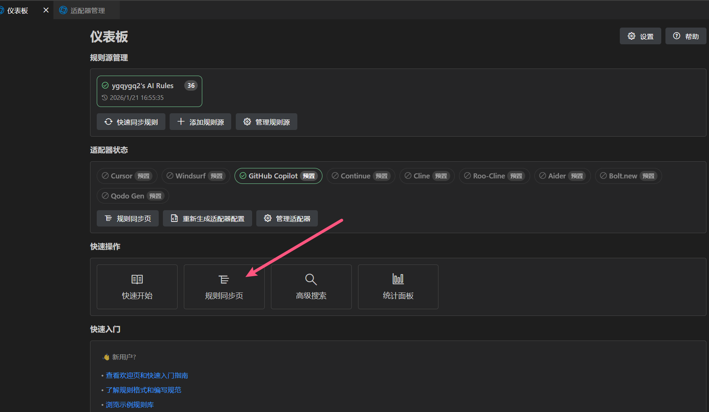
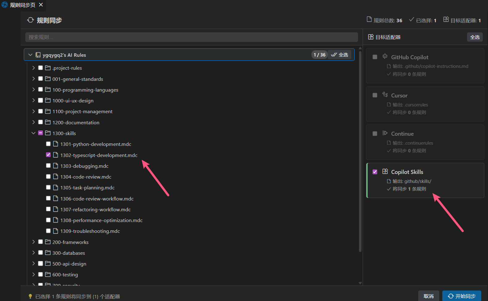
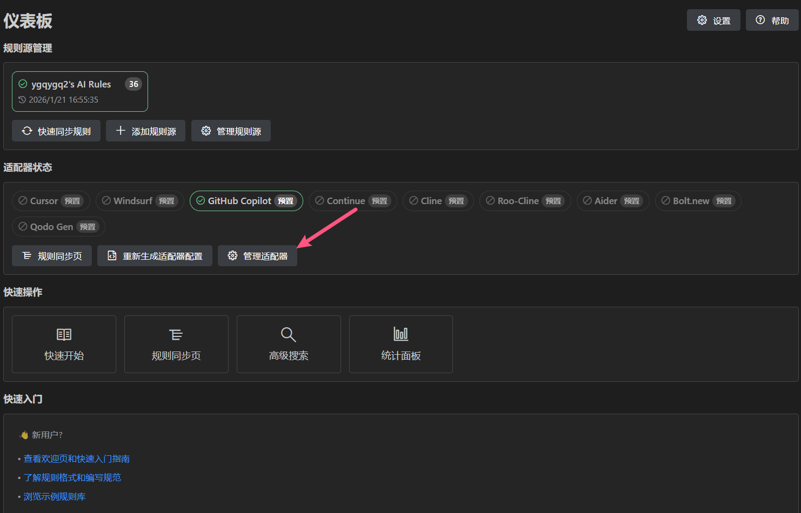
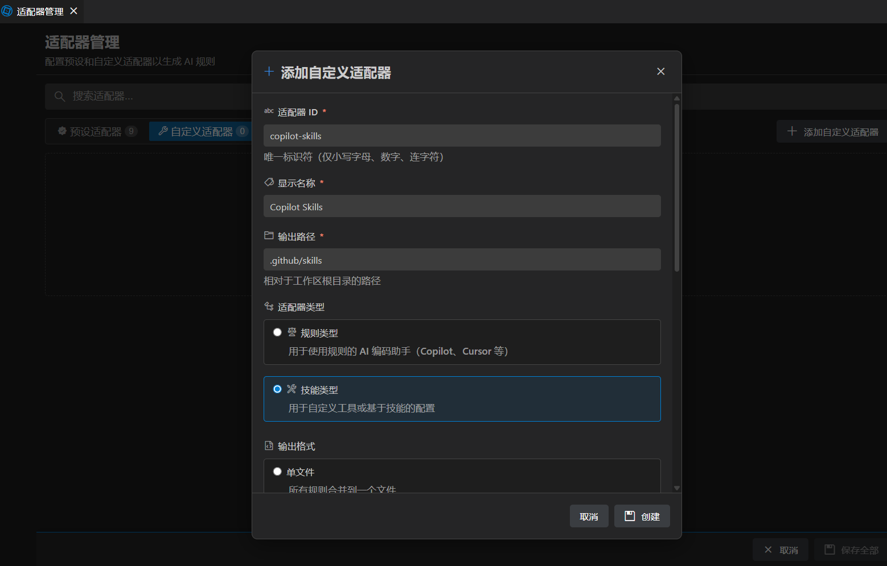
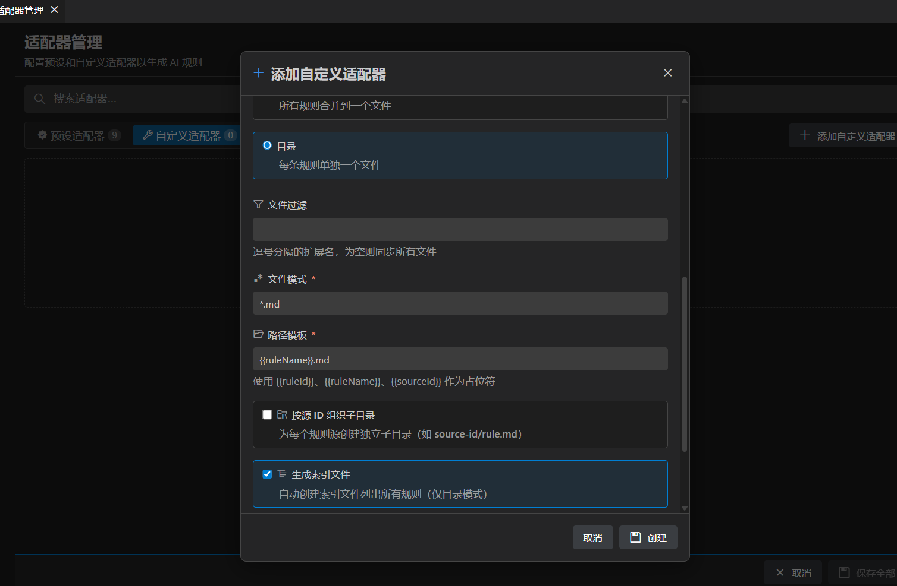

[TOC]

# 1. AI Skills 革命正在席卷编程界

2026 年，如果你还没有听说过 **AI Skills**，那你可能已经落后了。随着 Cursor、GitHub Copilot、Claude Code、Continue 等 AI 编程助手的普及，一场新的技术革命正在发生。开发者们不再需要记忆所有的 API 和语法细节，而是通过自然语言与 AI 对话，让 AI 成为自己的编程搭档。

但是，工具再强大，如果不能被正确引导，也只是"瞎猜"。这就是为什么 **AI Skills** 变得如此重要——它们就像是给 AI 助手的"操作手册"，告诉它们如何按照你的标准和最佳实践来生成代码。

> **什么是 AI Skills?**  
> AI Skills 是编辑器官方支持的 AI 能力配置文件，不同于传统的 Rules(规则)或 Prompts(提示词)，Skills 是结构化的、可被 AI 编辑器识别和应用的能力描述文件。目前部分编辑器都已支持 Skills 文件。

## 1.1 手动管理 Skills 的痛苦体验

想象这样一个场景:

**你在 GitHub 发现了 Anthropic 官方的优质 Skills 文件**，兴奋地想在项目中使用。然后你开始了漫长的折腾:

1. **找到 Skills 文件** → 在仓库中翻找，下载到本地
2. **查文档搞清楚放哪里**:
   - Cursor 用户: 复制到 `.cursor/skills/` 目录
   - GitHub Copilot 用户: 复制到 `.github/skills/` 目录
3. **重复上述步骤** → 你有 10 个项目，都要配一遍
4. **一周后 Skills 更新了** → 再来一遍...
5. **团队新人入职** → 你发给他 5 个 Skills 文件，他不知道往哪放

**时间成本**: 重复操作 × 项目数 × 更新频率 = **巨大的时间浪费**

> 📌 **Skills 和 AI Rules 都很麻烦**
>
> - **AI Rules**: 传统的提示词规则文件(如 `.cursorrules`、`.copilot-instructions`)，也需要手动管理和同步
> - **AI Skills**: 新一代结构化能力文件，功能更强大，但管理更复杂——需要放到编辑器特定目录
>
> **共同问题**: 手动管理、跨项目同步困难、团队协作不便、多编辑器配置重复
>
> **Turbo AI Rules 的使命**: 同时解决 Rules 和 Skills 的管理难题!

**更多的痛点**:

- 🤯 **配置文件分散** - Rules 在项目根目录，Skills 在各编辑器专属目录，一团乱麻
- 🔄 **重复劳动** - 同时用 Cursor 和 Copilot?需要手动复制 Skills 到两个不同目录
- 👥 **团队协作难** - 如何确保 10 个人的 Skills 文件都是最新版本?靠发文档?
- 📚 **优质 Skills 难发现** - 散落在各个 GitHub 仓库，没有统一的获取方式
- ⚡ **更新是噩梦** - Skills 更新后，要手动替换所有项目的所有编辑器目录

**如果你也受够了这些，继续往下看**，Turbo AI Rules 将彻底改变你的工作方式!

# 2. Turbo AI Rules:自动化的救星

**Turbo AI Rules** 的核心理念非常简单:

> **用户只找 Skills，工具做剩下的麻烦事**

## 2.1 自动化解决方案:一键同步，智能识别

**传统方式 VS Turbo AI Rules**:

| 操作         | 手动方式             | 使用 Turbo AI Rules      |
| ------------ | -------------------- | ------------------------ |
| 找 Skills    | 在 GitHub 翻找       | 添加仓库链接             |
| 下载 Skills  | 手动下载每个文件     | 自动拉取                 |
| 放到正确目录 | 查文档，手动复制     | 自动识别编辑器，自动同步 |
| 多编辑器支持 | 重复复制到 3+ 个目录 | 一次配置，全部同步       |
| 多项目同步   | 逐个项目重复操作     | 所有项目共享配置         |
| 更新 Skills  | 手动替换所有项目     | 一键更新全部项目         |
| 团队共享     | 发文档，手把手教     | 分享仓库链接             |

**工作原理**:

1. **你的工作**:
   - 找到好的 Skills 仓库(如 Anthropic 官方)
   - 在扩展中添加仓库链接
   - 点击"同步"

2. **Turbo AI Rules 自动完成**:
   - 从 Git 拉取 Skills 文件
   - 根据你启用的适配器
   - 自动同步到对应适配器的 Skills 目录:
     - Cursor → `.cursor/skills/`
     - GitHub Copilot → `.github/skills/`
   - 同时生成对应的 Rules 配置文件

**效果**: 从**繁琐的手动操作**变为**一键自动完成**!

## 2.2 核心功能亮点

### 📦 智能多编辑器适配

**目前主流 AI 编辑器中已确认支持 Skills 的有**:

| 编辑器         | Rules 文件                        | Skills 目录       |
| -------------- | --------------------------------- | ----------------- |
| Cursor         | `.cursorrules`                    | `.cursor/skills/` |
| GitHub Copilot | `.github/copilot-instructions.md` | `.github/skills/` |

**Turbo AI Rules 方案**:

✅ **预设 10 个适配器**（8 个 Rules + 2 个 Skills）:

- **规则适配器**: 支持 8 种主流 AI 编辑器的规则文件生成
- **Skills 适配器**: Cursor Skills (`.cursor/skills/`), GitHub Copilot Skills (`.github/skills/`)

✅ **自动化 Skills 管理**:

- 自动识别仓库中的 Skills 文件（如 `skill.md`）
- 一键同步到对应编辑器的 Skills 目录
- 保持目录结构和资源文件完整性
- 支持自定义 Skills 适配器（可配置任意编辑器）

✅ **智能多编辑器支持**:

- 一次配置，自动生成所有需要的 Rules 文件
- 智能同步 Skills 到各编辑器对应目录
- 支持多编辑器并存（比如你同时用 Cursor 和 Copilot）

### ✨ 统一管理 Rules 和 Skills

### 🚀 从 Git 仓库同步规则和 Skills

将你的 AI Rules 和 Skills 存放在 Git 仓库中:

- ✨ **版本控制** - 每次规则变更都有记录
- 🌐 **团队共享** - 团队成员一键同步，保持一致
- 🔄 **持续更新** - 规则仓库更新后，点击同步即可获取最新版本
- 🔒 **私有仓库支持** - 企业规则也能安全管理
- 📂 **智能识别** - 自动识别并同步 Skills 文件到编辑器指定目录

### 🎯 可视化管理界面

告别手动编辑配置文件的时代:

- **📊 仪表板** - 一目了然的规则和 Skills 状态
- **🌳 树形展示** - 按目录结构浏览和选择规则与 Skills
- **🔍 智能搜索** - 按关键词、标签、优先级快速定位规则
- **📈 统计分析** - 了解你的规则库的使用情况
- **🎨 规则预览** - 实时查看规则和 Skills 内容

### 💡 灵活的规则组织

- **多源管理** - 从多个仓库组合规则和 Skills(公司规范 + 个人实践 + 社区模板)
- **优先级控制** - 设置规则的重要程度
- **标签分类** - 用标签管理不同场景的规则和 Skills
- **条件过滤** - 按文件类型自动应用规则
- **Skills 智能同步** - 自动识别 Skills 文件并同步到编辑器对应目录

# 3. 实战案例:从混乱到高效

## 3.1 场景一:个人开发者的效率提升

**小王**是一名全栈开发者，平时使用 Cursor 写 React 前端，用 GitHub Copilot 写 Python 后端。他从社区找到了几个优秀的 Skills 文件(如 `react-hooks.md`、`python-fastapi.md`)，想在项目中使用。

**传统做法:**

```bash
# Cursor 项目
cd frontend-project
mkdir -p .cursor/skills
cp ~/Downloads/react-hooks.md .cursor/skills/

# GitHub Copilot 项目
cd ../backend-project
mkdir -p .github/skills
cp ~/Downloads/python-fastapi.md .github/skills/

# 下个项目又要重复...
```

1. 手动创建 `.cursor/skills/` 或 `.github/skills/` 目录
2. 逐个复制 Skills 文件到对应目录
3. 每启动新项目都要重复这个过程
4. 发现更好的 Skills 时，要在所有项目中逐一替换文件

**使用 Turbo AI Rules 后:**

1. **创建 Skills 仓库**: 创建一个 Git 仓库 `my-ai-skills`，把适合自己编码风格的 Skills 文件统一管理
2. **添加规则源**: 在 VS Code 中添加这个规则源（一次性配置）
3. **启用 Skills 适配器**: 在适配器管理页启用需要的 Skills 适配器
   - ✅ Cursor Skills → 自动同步到 `.cursor/skills/`
   - ✅ Copilot Skills → 自动同步到 `.github/skills/`
   - ✅ 自定义适配器 → 同步到你指定的目录
4. **一键同步**: 点击同步 → 扩展自动:
   - 识别 `skill.md` 文件及其目录
   - 复制整个 Skills 目录到正确位置
   - 保留目录结构和所有资源文件
5. **持续更新**: Skills 更新只需 push 到 Git 仓库，所有项目一键同步

> 💡 **Skills 适配器特性**:
>
> - **智能识别**: 自动检测 `skill.md` 作为技能入口点
> - **完整复制**: 保持目录结构，包含所有关联文件（图片、配置等）
> - **多源管理**: 支持从多个仓库组合不同的 Skills
> - **自定义支持**: 通过自定义适配器支持任意编辑器

**效率提升: 从手动复制文件到一键自动同步，节省 95% 的配置时间！**

## 3.2 场景二:团队协作的一致性保障

**某创业公司**有 10 名开发者，使用 Cursor 和 GitHub Copilot。团队 Leader 整理了一套 Skills 文件(包括公司 API 规范、数据库设计原则、安全要求等)，要求团队统一使用。

**传统做法(混乱且难以维护):**

- 通过 Slack 发送 Skills 文件压缩包，要求每个人手动复制到 `.cursor/skills/` 和 `.github/skills/`
- 10 个人，一半忘记复制，一半复制到错误的目录
- 更新 Skills 时，再发一次通知，又有人漏掉
- 新人入职:需要老员工手把手教如何配置 Skills

**Turbo AI Rules 解决方案:**

1. 团队 Leader 创建规则仓库 `company-ai-standards`，包含所有 Skills 文件
2. 制定统一的编码规范、API 使用指南、安全要求等 Skills
3. 所有成员安装 Turbo AI Rules，添加公司规则源
4. Skills 更新时，Slack 通知一句"同步下 AI 规则"，大家点一下按钮，扩展自动把 Skills 复制到正确的编辑器目录

**收益:**

- ✅ 代码审查时间大幅减少(AI 生成代码符合规范)
- ✅ 新人上手极快(安装扩展 + 同步规则源)
- ✅ Skills 版本一致性 100%(不再有人使用过时 Skills)
- ✅ 团队沟通成本大幅降低(不用再手把手教配置)

**结果:** PR 质量提升，维护者审核效率翻倍!

# 4. 快速开始

## Step 1: 安装扩展

在 VS Code 扩展市场搜索 **Turbo AI Rules** 并安装

或直接访问: [VS Code Marketplace](https://marketplace.visualstudio.com/items?itemName=ygqygq2.turbo-ai-rules)

## Step 2: 添加规则源

安装后会自动打开欢迎页，你可以:

**选项 A: 使用预设模板**

- 点击推荐的规则仓库一键添加

**选项 B: 创建并添加自己的规则仓库**

> 💡 **为什么需要自己的 Skills 仓库？**
>
> 每个开发者的编程习惯、代码风格、技术栈都不同。别人的 Skills 可能不完全适合你的工作流程。
>
> **建议**:准备一个自己的 Skills Git 仓库，根据自己的实际需求定制 Skills 文件，这样 AI 助手才能真正理解你的编码风格和偏好。

创建你自己的规则仓库:

```
仓库 URL:   https://github.com/your-name/my-ai-skills.git
分支:       main
子路径:     (可选)
显示名称:   我的专属 AI Skills
```

## Step 3: 打开规则同步页面

点击左侧栏的 Turbo AI Rules 图标，打开规则同步页面:



在这里你可以:

- 查看所有已添加的规则源
- 浏览规则源中的 Rules 和 Skills 文件
- 按目录结构或标签筛选

## Step 4: 选择规则和适配器

1. 在树形视图中勾选需要的 Rules 和 Skills 文件
2. 在右侧选择要同步的适配器
   - **规则适配器**: Cursor, Copilot, Windsurf, Continue 等
   - **Skills 适配器**: Cursor Skills, Copilot Skills
3. 点击"同步"按钮



**扩展自动完成:**

✅ **传统规则文件** (单文件型):

- `.cursorrules` (Cursor)
- `.github/copilot-instructions.md` (GitHub Copilot)
- `.continuerules` (Continue)
- 以及其他编辑器的规则文件

✅ **Skills 文件** (目录型，自动识别):

- **Cursor Skills**: `skill.md` 及其目录 → `.cursor/skills/`
- **Copilot Skills**: `skill.md` 及其目录 → `.github/skills/`
- **自定义 Skills**: 按你配置的路径同步

**关键特性**:

- 🎯 自动识别 `skill.md` 作为技能入口点
- 📂 保持完整目录结构（不是单独复制文件）
- 🖼️ 包含所有资源（图片、配置、示例代码等）
- 🔄 支持多源 Skills 组合

**一键操作，告别手动复制文件和目录！**

## Step 5: 配置适配器

如果需要调整适配器设置，可以打开适配器管理页:



**预设适配器（10 个）**:

📝 **规则类型（8 个）**: 支持 8 种主流 AI 编辑器

🎯 **Skills 类型（2 个）**:

- **Cursor Skills**: 输出到 `.cursor/skills/`
- **GitHub Copilot Skills**: 输出到 `.github/skills/`

**自定义适配器**:

- 添加自己的 Rules/Skills 适配器
- 指定任意输出目录
- 支持更多 AI 编辑器

**在适配器管理页你可以**:

- ✅ 启用/禁用特定适配器
- ✅ 查看输出路径和类型（规则/技能）
- ✅ 配置排序和组织方式
- ✅ 添加自定义适配器

大功告成！现在你的 AI 助手已经接收到规则指引，Skills 文件也已自动同步到对应编辑器的 Skills 目录。

# 5. 自定义适配器：支持任意 AI 编辑器

虽然 Turbo AI Rules 预设了 10 个主流适配器（包括 2 个 Skills 适配器），但如果你使用的 AI 工具不在列表中，或者需要特殊配置，可以自定义适配器。

## 5.1 添加自定义适配器

1. 打开适配器管理页
2. 点击"添加自定义适配器"



## 5.2 配置适配器参数

填写以下信息:



**基本配置**:

- **适配器名称**: 例如 "MyAI Editor Skills"
- **适配器类型**:
  - 选择 **Rule Type**（规则）→ 生成单个配置文件
  - 选择 **Skill Type**（技能）→ 复制整个 Skills 目录
- **输出路径**:
  - 规则类型: `.myai/rules.md`（单文件）
  - Skills 类型: `.myai/skills/`（目录）

**Skills 适配器特殊配置**:

- ✅ **保持目录结构**: 自动启用，复制完整的 Skills 目录树
- ✅ **识别 skill.md**: 自动检测技能入口文件
- ✅ **包含资源文件**: 图片、配置等一并复制

保存后，同步时扩展会:

- **规则适配器**: 生成单个配置文件
- **Skills 适配器**: 复制整个 Skills 目录及其资源

## 5.3 预设 Skills 适配器

Turbo AI Rules 预设支持以下 Skills 适配器：

**✅ Cursor Skills**

- 输出目录: `.cursor/skills/`
- 官方文档: [Cursor Skills](https://cursor.com/docs/context/skills)

**✅ GitHub Copilot Skills**

- 输出目录: `.github/skills/`
- 官方文档: [GitHub Copilot Skills](https://code.visualstudio.com/docs/copilot/customization/agent-skills)

> 💡 **自定义适配器**: 如果你的 AI 编辑器也支持 Skills 目录，可以通过自定义适配器添加支持

# 6. 常见问题

**Q: 规则文件会覆盖我的自定义配置吗？**  
A: 不会。Turbo AI Rules 生成的文件中会明确标注自动生成区域。你可以在指定的用户规则目录（默认 `ai-rules/`）添加自己的规则。

**Q: 支持私有仓库吗？**  
A: 支持！添加规则源时填入 GitHub Personal Access Token 即可（需要 `repo` 读权限）。

**Q: 如何更新规则和 Skills？**  
A: 规则仓库更新后，打开 Turbo AI Rules 界面，点击"同步"按钮即可获取最新版本。所有启用的适配器都会自动更新。

**Q: 可以同时使用多个规则源吗？**  
A: 可以！你可以组合使用公司规范、个人实践和社区模板，按优先级控制应用顺序。

**Q: Skills 适配器和规则适配器有什么区别？**  
A:

- **规则适配器**：生成单个配置文件（如 `.cursorrules`），合并所有规则内容
- **Skills 适配器**：复制整个 Skills 目录，保持完整的目录结构和资源文件
- 目前预设了 2 个 Skills 适配器：Cursor Skills 和 Copilot Skills

**Q: 如何识别 Skills 文件？**  
A: 扩展会自动识别仓库中的 `skill.md` 文件作为技能入口点，并复制整个包含目录到对应的 Skills 目录（如 `.cursor/skills/`、`.github/skills/`）。

**Q: 可以自定义 Skills 适配器吗？**  
A: 可以！在适配器管理页添加自定义适配器，选择 "Skill Type"，指定输出目录即可。扩展会自动处理目录结构和资源文件。

**Q: Skills 同步会包含哪些文件？**  
A: Skills 适配器会复制完整的技能目录，包括：

- `skill.md` 主文件
- 图片、图表等资源文件
- 示例代码
- 配置文件
- 其他关联文档

**Q: 支持离线使用吗？**  
A: 规则和 Skills 同步后会缓存在本地，即使离线也能正常使用已同步的内容。

# 7. 为什么现在就要开始使用?

## 7.1 AI 编程已成趋势

根据 GitHub 2025 年报告:

- 92% 的开发者在工作中使用 AI 工具
- 使用 AI 的开发者效率平均提升 55%
- AI 辅助生成的代码占比已超过 40%
- 支持 Skills 的编辑器用户增长超过 200%

## 7.2 规则是 AI 的倍增器

好的 AI Skills 可以:

- ✅ 让 AI 生成符合你风格的代码
- ✅ 避免常见错误和安全隐患
- ✅ 自动应用最佳实践
- ✅ 加速新技术学习

## 7.3 投资回报率高

- **时间成本**: 几分钟安装配置
- **学习成本**: 图形界面，零门槛
- **收益**: 长期节省大量配置和维护时间

# 8. 立即行动

不要让杂乱的配置文件拖累你的效率，不要让团队的 AI 规则不统一影响代码质量。

**现在就开始:**

1. 📦 安装扩展: [VS Code Marketplace](https://marketplace.visualstudio.com/items?itemName=ygqygq2.turbo-ai-rules)
2. 📚 查看文档: [GitHub 仓库](https://github.com/ygqygq2/turbo-ai-rules)
3. 💬 加入讨论: [GitHub Discussions](https://github.com/ygqygq2/turbo-ai-rules/discussions)
4. ⭐ Star 支持: 如果觉得有用，给个 Star 鼓励一下!

**特别福利:**

- 🎁 提 Issue 或 PR 的前 50 位用户，将在下个版本的 README 中致谢
- 🎉 贡献优质规则的开发者，将获得"规则贡献者"徽章

# 9. 总结

在 AI Skills 时代，**Turbo AI Rules** 不仅仅是一个工具，它是:

- 🎯 **效率倍增器** - 从手动复制文件到一键自动同步，节省 95% 配置时间
- 🤝 **协作催化剂** - 让团队的 AI 规则和 Skills 统一、可控、易更新
- 🚀 **学习加速器** - 通过规则库快速吸收最佳实践
- 🌍 **社区连接器** - 让优秀的 AI Rules 和 Skills 得以共享和传播
- 🔄 **多编辑器支持** - 预设 10 个适配器（含 2 个 Skills 适配器）+ 自定义支持
- 🎨 **智能 Skills 管理** - 自动识别 `skill.md`，保持完整目录结构和资源文件

**核心优势**:

✅ **预设 Skills 适配器**：开箱即用的 Cursor Skills 和 Copilot Skills 支持  
✅ **自定义 Skills 支持**：通过自定义适配器扩展到任意 AI 编辑器  
✅ **目录完整性**：自动复制整个 Skills 目录，包含所有资源文件  
✅ **多源组合**：从多个仓库组合不同的 Skills，灵活管理  
✅ **一键更新**：仓库更新后，所有项目一键同步最新 Skills

AI 正在重塑编程，而 Turbo AI Rules 让你更好地驾驭 AI。告别手动管理 Skills 的痛苦，拥抱自动化的高效工作流！

**不要等待，现在就开始你的智能编程之旅！**

---

**相关链接:**

- 📦 [VS Code 市场](https://marketplace.visualstudio.com/items?itemName=ygqygq2.turbo-ai-rules)
- 📖 [详细使用指南](https://www.ygqygq2.com/blog/2025/12/2025-12-26-让-AI-编程助手更智能-Turbo-AI-Rules-扩展使用指南)
- 💻 [GitHub 仓库](https://github.com/ygqygq2/turbo-ai-rules)
- 🐛 [问题反馈](https://github.com/ygqygq2/turbo-ai-rules/issues)
- 💬 [讨论交流](https://github.com/ygqygq2/turbo-ai-rules/discussions)
- 📚 [规则示例仓库](https://github.com/ygqygq2/ai-rules)

**如果这篇文章对你有帮助，欢迎分享给更多需要的开发者!** 🙌
