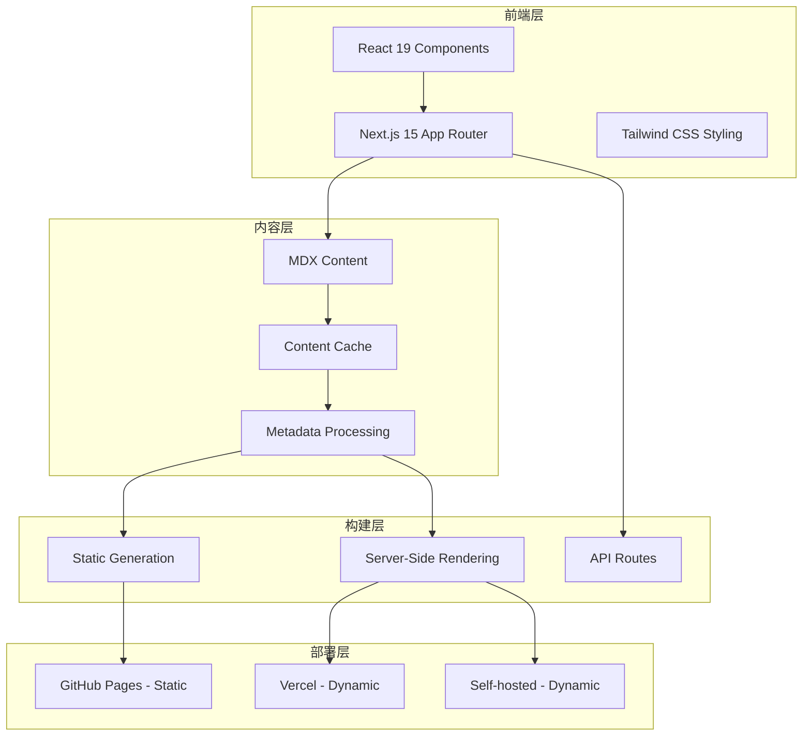
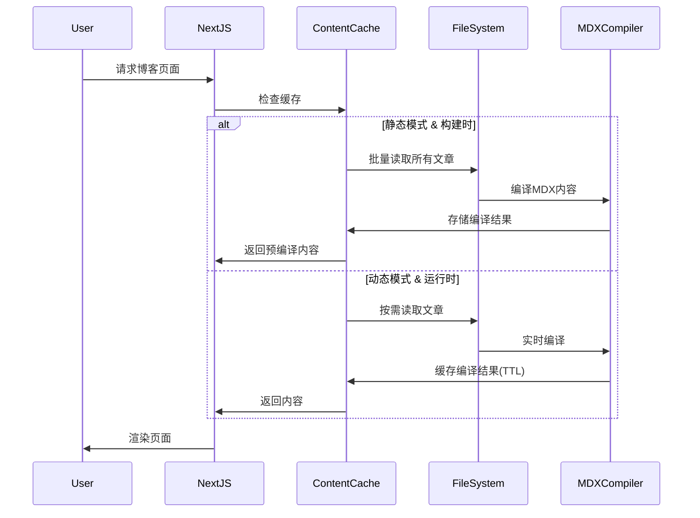

# 博客系统双模式架构设计文档

## 快速开始指南 🚀

### 开发模式（您当前使用的）

```bash
# 开发环境 - 支持热重载，用于本地开发
pnpm dev
# 访问: http://localhost:3000
```

### 生产模式部署

#### 静态模式（GitHub Pages部署）

```bash
# 移除API路由（静态模式不支持）
bash scripts/manage-api.sh unlink

# 构建静态文件
pnpm run build:static
# 部署到 GitHub Pages（自动）
```

#### 动态模式（服务器部署）

```bash
# 启用API路由（动态模式必需）
bash scripts/manage-api.sh link

# 构建生产版本
pnpm run build:dynamic

# 启动生产服务器
pnpm run serve:dynamic
# 访问: http://localhost:3000
```

> 📖 **详细的生产部署指南**: 参见 [dynamic-production-deployment.md](./dynamic-production-deployment.md)

---

## 1. 项目概述

### 1.1 设计目标

本设计文档定义了基于 Next.js 15 的技术博客平台的双模式架构，支持静态部署（Static Mode）和动态部署（Dynamic Mode）两种运行模式，以满足不同部署环境的需求。

### 1.2 业务需求

- **静态模式**：适用于 GitHub Pages 等静态托管平台，具备极快的加载速度和优秀的 SEO 性能
- **动态模式**：适用于 Vercel 或自托管服务器，支持完整的服务端功能如订阅、API 交互等
- **模式切换**：通过环境变量控制，无需修改代码即可在两种模式间切换
- **功能一致性**：确保核心博客功能在两种模式下保持一致的用户体验

### 1.3 技术约束

- 基于 Next.js 15 App Router 架构
- 支持 React 19 服务器组件
- 兼容 MDX 内容格式
- 响应式设计，支持移动端访问

## 2. 系统架构设计

### 2.1 整体架构

博客系统采用分层架构设计，通过环境变量控制渲染策略，实现静态和动态模式的无缝切换。



### 2.2 模式切换机制

系统通过 `EXPORT` 环境变量控制运行模式：

| 配置项            | Static 模式      | Dynamic 模式        | 说明             |
| ----------------- | ---------------- | ------------------- | ---------------- |
| `EXPORT` 环境变量 | `"true"`         | `undefined`         | 控制构建输出格式 |
| Next.js `output`  | `"export"`       | `undefined`         | 静态文件生成     |
| 页面 `dynamic`    | `"force-static"` | `"auto"`            | 渲染策略         |
| API Routes        | 禁用/降级        | 完整功能            | 服务端能力       |
| 构建产物          | `out/` 静态文件  | `.next/` 服务器文件 | 部署格式         |

### 2.3 核心组件设计

#### 2.3.1 页面组件

- **博客列表页** (`/blog`)：支持分页和标签过滤
- **博客详情页** (`/blog/[...slug]`)：MDX 内容渲染和评论系统
- **标签页** (`/tags`)：标签云展示和文章分类
- **项目页** (`/projects`)：项目展示和技术栈介绍
- **关于页** (`/about`)：个人介绍和联系信息

#### 2.3.2 内容管理

- **MDX 解析器**：将 Markdown 内容编译为 React 组件
- **内容缓存**：内存缓存机制提升性能
- **元数据处理**：文章 frontmatter 解析和索引生成
- **搜索功能**：基于 KBar 的全局搜索

#### 2.3.3 服务接口

- **订阅 API** (`/api/newsletter`)：邮箱订阅功能（仅动态模式）
- **RSS 生成**：自动生成 RSS feed
- **站点地图**：SEO 优化的 sitemap.xml

## 3. 实现设计

### 3.1 环境配置策略

```typescript
// 页面组件渲染策略配置
export const dynamic = process.env.EXPORT === 'true' ? 'force-static' : 'auto'

// API 路由配置策略
export const dynamic = process.env.EXPORT === 'true' ? 'force-static' : 'force-dynamic'

// 静态参数生成策略
export async function generateStaticParams() {
  if (process.env.EXPORT === 'true') {
    // 静态模式：预生成所有路径
    return await getAllPaths()
  }
  // 动态模式：按需生成
  return []
}
```

### 3.2 内容处理流程



### 3.3 构建流程设计

#### 3.3.1 API 路由管理机制

项目采用分离式 API 路由管理，以支持动静两种模式：

- **API 源目录**：`api/` （项目根目录）
- **动态模式目录**：`app/api/` （Next.js App Router 要求）

```bash
# 启用动态模式（软链接 API 路由）
bash scripts/manage-api.sh link

# 禁用动态模式（移除 API 路由）
bash scripts/manage-api.sh unlink

# 检查 API 状态
bash scripts/manage-api.sh status

# 初始化 API 开发环境
bash scripts/manage-api.sh init
```

**管理原则**：

- 静态模式：必须移除 `app/api` 目录，否则构建失败
- 动态模式：必须链接 `api/` 到 `app/api`，否则 API 功能不可用
- 开发模式：自动复制博客资源到 `public/` 目录

#### 3.3.2 静态构建流程

1. 设置 `EXPORT=true` 环境变量
2. **移除 `app/api` 目录**（防止构建错误）
3. 执行 `next build` 生成静态文件
4. 运行 `postbuild.mjs` 脚本处理资源
5. 输出到 `out/` 目录供静态托管

#### 3.3.3 动态构建流程

1. **链接 `api/` 到 `app/api`**（启用 API 路由）
2. 保持 `EXPORT` 未定义
3. 执行 `next build` 生成服务器文件
4. 启动 Next.js 服务器
5. 支持 SSR 和 API 路由功能

## 4. 部署策略

### 4.1 多环境部署配置

| 环境         | 模式    | 部署平台       | 配置要点                  |
| ------------ | ------- | -------------- | ------------------------- |
| GitHub Pages | Static  | GitHub Actions | EXPORT=true, 静态文件输出 |
| Vercel       | Dynamic | Vercel CLI     | API路由, ISR支持          |
| 自托管       | Dynamic | Docker/PM2     | 完整Node.js环境           |
| CDN          | Static  | 任意CDN        | 纯静态文件分发            |

### 4.2 性能指标

| 指标       | Static 模式 | Dynamic 模式 | 说明                     |
| ---------- | ----------- | ------------ | ------------------------ |
| 构建时间   | ~2分钟      | ~30秒        | 静态模式需预生成所有页面 |
| 首屏加载   | <1秒        | <2秒         | 静态文件无服务器处理时间 |
| SEO评分    | 100%        | 95%          | 静态模式SEO表现更优      |
| 功能完整性 | 90%         | 100%         | 动态模式支持全部API功能  |

## 5. 质量保证

### 5.1 功能验证矩阵

| 功能     | Static 模式 | Dynamic 模式 | 测试方法       |
| -------- | ----------- | ------------ | -------------- |
| 博客列表 | ✅ 预生成   | ✅ SSR       | 对比渲染内容   |
| 博客详情 | ✅ 预生成   | ✅ SSR       | 检查MDX渲染    |
| 标签页面 | ✅ 预生成   | ✅ SSR       | 验证标签统计   |
| 搜索功能 | ✅ 本地JSON | ✅ API搜索   | 搜索结果一致性 |
| 订阅功能 | ❌ 禁用     | ✅ 完整功能  | API响应测试    |
| 评论系统 | ✅ 客户端   | ✅ 客户端    | Giscus集成     |

### 5.2 监控与调试

#### 5.2.1 运行时检测

- 当前运行模式识别
- 构建时间信息记录
- 环境变量状态监控
- 调试信息输出

#### 5.2.2 性能监控

- 页面加载性能对比
- 构建时间统计
- 内存使用情况
- 缓存命中率

## 6. 扩展性设计

### 6.1 功能扩展点

- **主题系统**：支持多主题切换
- **多语言支持**：国际化功能扩展
- **插件机制**：第三方功能插件集成
- **API 扩展**：更多服务端功能接口

### 6.2 性能优化方向

- **增量构建**：只重新构建变更内容
- **智能缓存**：更精细的缓存策略
- **CDN 集成**：静态资源分发优化
- **预加载策略**：关键页面预渲染

## 7. 维护策略

### 7.1 版本升级路径

- Next.js 框架升级策略
- React 版本兼容性管理
- 依赖包安全更新
- 破坏性变更处理

### 7.2 故障恢复

- 构建失败回滚机制
- 内容损坏修复流程
- 部署环境故障切换
- 数据备份和恢复策略

---

## 8. 实用命令参考

### 8.1 日常开发命令

```bash
# 开发模式（您当前使用的）
pnpm dev                    # 启动开发服务器
pnpm lint                   # 代码风格检查和修复
pnpm clean                  # 清理缓存和构建文件

# API 路由管理
bash scripts/manage-api.sh link     # 启用API开发（动态模式）
bash scripts/manage-api.sh unlink   # 禁用API路由（静态模式）
bash scripts/manage-api.sh status   # 检查API路由状态
bash scripts/manage-api.sh init     # 初始化API开发环境

# 验证和测试
npm run check-mode          # 检查当前模式配置
npm run verify:dynamic      # 验证动态构建组件
node scripts/test-dynamic-mode.mjs  # 测试动态模式组件
```

### 8.2 生产部署命令

```bash
# 静态模式（GitHub Pages）
bash scripts/manage-api.sh unlink   # 移除API路由（必须）
pnpm run build:static       # 构建静态文件到 out/ 目录
pnpm run serve              # 本地预览静态文件

# 动态模式（服务器部署）
bash scripts/manage-api.sh link     # 启用API路由（必须）
pnpm run build:dynamic      # 构建生产版本到 .next/ 目录
pnpm run serve:dynamic      # 启动生产服务器
```

### 8.3 故障排除命令

```bash
# 清理和重建
pnpm run clean              # 清理所有缓存
rm -rf node_modules pnpm-lock.yaml  # 完全重新安装
pnpm install
pnpm run build:dynamic

# 检查构建产物
ls -la .next/               # 检查Next.js构建文件
ls -la public/blog-assets/  # 检查blog资源文件
cat public/blog-assets-manifest.json  # 查看资源清单

# 进程和端口检查
lsof -i :3000              # 检查端口占用
ps aux | grep node         # 检查Node.js进程
pm2 status                 # 检查PM2进程状态
```

## 9. 使用场景对比

### 9.1 选择静态模式的情况

✅ **适用于**：

- GitHub Pages 免费托管
- 访问量较大，需要最佳性能
- 内容更新不频繁
- 不需要后端功能（订阅、表单等）
- 希望最小化运维成本

❌ **不适用于**：

- 需要实时数据交互
- 需要用户订阅功能
- 需要后端API集成
- 内容需要频繁更新

### 9.2 选择动态模式的情况

✅ **适用于**：

- 需要完整的后端功能
- 有服务器资源（VPS、云服务器）
- 需要实时SEO优化
- 计划集成数据库或外部API
- 需要用户交互功能

❌ **不适用于**：

- 预算有限，无法承担服务器成本
- 技术团队缺乏服务器运维经验
- 对性能要求极高的场景

## 10. 部署环境建议

### 10.1 开发环境

```bash
# 推荐配置
Node.js: 20.x LTS
pnpm: 最新版本
内存: 4GB+
存储: 10GB+

# 开发工具
VS Code + 相关扩展
Git 2.40+
Docker (可选)
```

### 10.2 生产环境

#### GitHub Pages（静态模式）

```bash
# 自动化部署
- GitHub Actions 自动构建
- 免费CDN加速
- 自定义域名支持
- HTTPS自动配置
```

#### Vercel（动态模式）

```bash
# 推荐配置
- 免费层：适合个人博客
- Pro层：适合商业项目
- 全球CDN
- 自动HTTPS
- 环境变量管理
```

#### 自托管服务器（动态模式）

```bash
# 最小配置
CPU: 1核
内存: 2GB
存储: 20GB SSD
带宽: 1Mbps+

# 推荐配置
CPU: 2核+
内存: 4GB+
存储: 40GB+ SSD
带宽: 10Mbps+
```

---

**📚 相关文档**：

- [动态模式生产部署完整指南](./dynamic-production-deployment.md)
- [动态模式资源处理策略](./dynamic-assets-strategy.md)
- [构建脚本系统说明](./build-dynamic-scripts.md)

本设计文档为博客系统双模式架构提供了完整的技术规范和实现指导，确保系统在不同部署环境下的稳定性和一致性。
