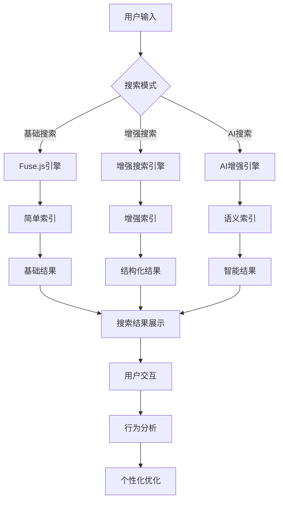
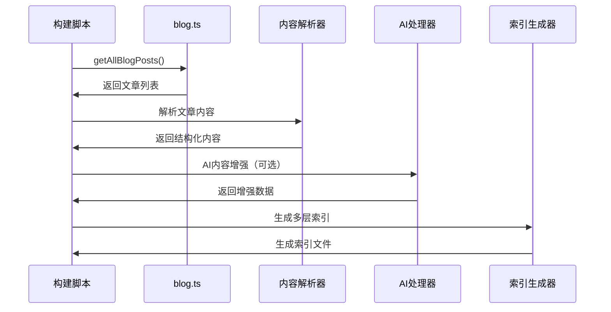
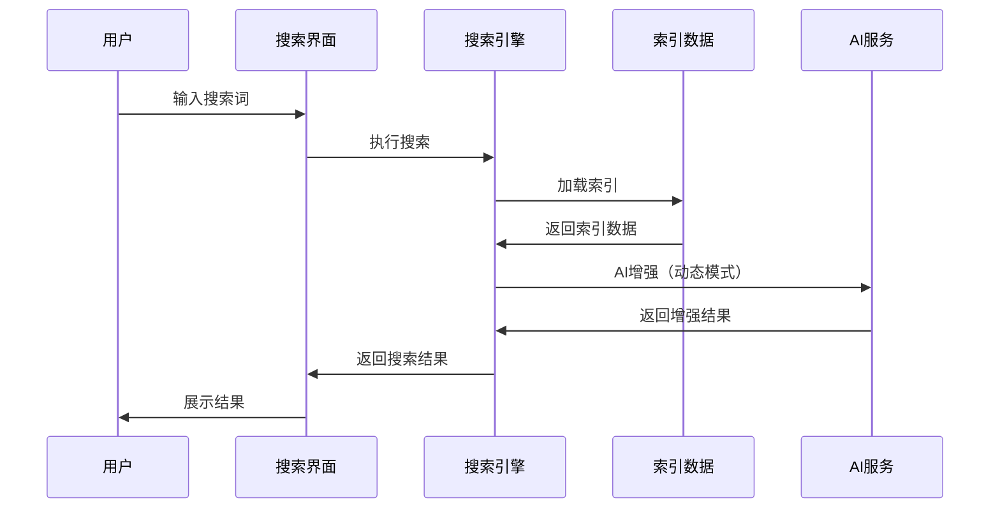

# 00 搜索系统概览

> 🔍 **博客搜索系统全景** - 理解搜索架构、技术选型和实现策略

## 🎯 系统目标

### 核心需求

- **高准确性**：精确匹配用户搜索意图
- **好体验**：快速响应、智能建议、内容定位
- **个性化**：随机排序、用户偏好适配
- **可扩展**：支持AI增强、多语言、语义搜索

### 性能指标

- 搜索响应时间 < 100ms
- 索引文件大小 < 10MB
- 内存使用 < 50MB
- 搜索准确率 > 85%

## 🏗️ 架构设计

### 整体架构



### 索引层次

1. **简单索引** (`search.json`)
   - 基础字段：标题、摘要、标签
   - 文件大小：~200KB
   - 用途：向后兼容、快速回退

2. **增强索引** (`search-enhanced.json`)
   - 结构化内容：段落、标题、代码块
   - 中文分词：单字、双字、三字词组
   - 文件大小：~7MB

3. **AI索引** (`search-ai.json`) - 未来实现
   - 语义向量：文章嵌入表示
   - 智能摘要：AI生成的内容摘要
   - 关联推荐：相关文章推荐

## 🔄 数据流

### 构建时流程



### 搜索时流程



## ⚖️ 技术选型对比

### 预生成 vs 实时搜索

| 特性           | 预生成索引 ✅       | 实时搜索           |
| -------------- | ------------------- | ------------------ |
| **响应速度**   | 极快 (<50ms)        | 较慢 (100-500ms)   |
| **资源消耗**   | 客户端轻量          | 服务器资源密集     |
| **索引准确性** | 构建时确定          | 实时最新           |
| **离线支持**   | 完全支持            | 不支持             |
| **扩展性**     | 静态文件，易CDN缓存 | 需要搜索服务器     |
| **实时性**     | 需要重新构建        | 立即反映内容变化   |
| **复杂查询**   | 有限                | 支持复杂SQL/ES查询 |
| **成本**       | 几乎零运营成本      | 需要搜索服务器成本 |

### 选择建议

#### 静态模式（推荐）

- ✅ 个人博客、文档站点
- ✅ 更新频率低（每日/每周）
- ✅ 成本敏感
- ✅ 需要离线支持

#### 动态模式

- ✅ 企业级应用
- ✅ 实时性要求高
- ✅ 复杂搜索需求
- ✅ 有充足服务器资源

## 🚀 核心特性

### 1. 智能分词

```typescript
// 中文分词示例
const tokens = ChineseTokenizer.tokenize('JavaScript学习笔记')
// 输出: ["J", "a", "v", "a", "S", "c", "r", "i", "p", "t", "学", "习", "笔", "记",
//        "学习", "习笔", "笔记", "JavaScript", "学习笔", "习笔记"]
```

### 2. 随机排序

```typescript
// 平衡随机性和相关性
const finalScore = (1 - randomWeight) * relevanceScore + randomWeight * randomFactor
```

### 3. 结构化搜索

```typescript
// 支持多种内容类型
interface SearchableContent {
  type: 'heading' | 'paragraph' | 'code' | 'list' | 'quote'
  content: string
  plainText: string
  tokens: string[]
}
```

## 📊 性能数据

### 当前指标（131篇文章）

- **处理时间**：314ms
- **内容块**：24,349个
- **索引文件**：
  - 增强索引：7MB
  - 兼容索引：216KB
  - 元数据索引：36KB

### 扩展性预测

| 文章数量 | 预计索引大小 | 预计处理时间 | 建议策略    |
| -------- | ------------ | ------------ | ----------- |
| 100      | 5MB          | 200ms        | 单文件索引  |
| 500      | 25MB         | 1s           | 分片索引    |
| 1000     | 50MB         | 2s           | 懒加载+分片 |
| 5000+    | 250MB+       | 10s+         | AI压缩+CDN  |

## 🔮 发展路线

### 短期目标（1-2个月）

- [x] 基础增强搜索实现
- [x] 随机排序机制
- [ ] AI内容理解集成
- [ ] 搜索分析统计

### 中期目标（3-6个月）

- [ ] 语义搜索实现
- [ ] 多语言搜索支持
- [ ] 个性化推荐
- [ ] 搜索性能监控

### 长期目标（6个月+）

- [ ] 全文语义理解
- [ ] 智能问答系统
- [ ] 跨文档关联搜索
- [ ] 搜索意图预测

---

## 📖 相关文档

- **[增强搜索实现](./01-enhanced-search-implementation.md)** - 技术实现细节
- **[搜索配置指南](./02-search-configuration.md)** - 配置参数说明
- **[AI搜索集成](./03-ai-search-integration.md)** - AI集成方案
- **[性能优化策略](./06-performance-optimization.md)** - 性能调优

---

> 💡 **下一步**: 阅读 [增强搜索实现](./01-enhanced-search-implementation.md) 了解具体的技术实现方案。
