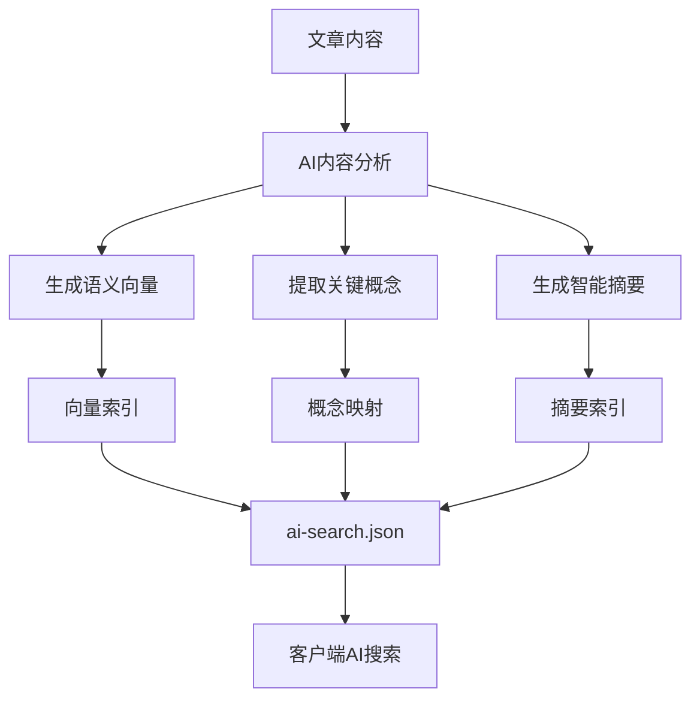
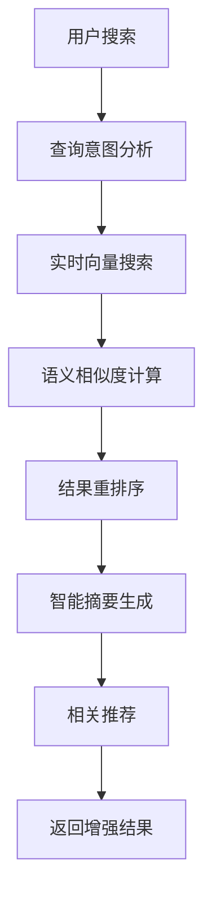

# 03 AI搜索集成方案

> 🧠 **AI增强搜索** - 将人工智能融入博客搜索，提供语义理解和智能推荐

## 🎯 AI集成目标

### 核心价值

- **语义理解**：理解用户真实搜索意图，而非仅仅匹配关键词
- **智能摘要**：AI生成高质量内容摘要，提升搜索预览效果
- **相关推荐**：基于内容语义的智能文章推荐
- **查询增强**：自动扩展和优化用户搜索查询

### 应用场景

- **模糊搜索**："如何部署Kubernetes" → 匹配k8s、容器编排相关文章
- **概念搜索**："前端性能优化" → 匹配webpack、缓存、CDN等相关内容
- **问答式搜索**："怎么解决内存不足" → 直接定位到解决方案段落
- **多语言搜索**：支持中英文混合、技术术语理解

## 🏗️ 双模式AI集成架构

### 静态模式：构建时AI预处理



#### 优势

- **零运营成本**：AI处理在构建时完成
- **快速响应**：客户端直接使用预处理结果
- **离线支持**：完全静态化，支持CDN缓存
- **一致性好**：所有用户获得相同的AI增强体验

#### 实现策略

```typescript
// 构建时AI处理流程
interface AIBuildProcess {
  // 1. 内容向量化
  embeddings: Array<{
    slug: string
    title_vector: number[]
    content_vector: number[]
    summary_vector: number[]
  }>

  // 2. 概念提取
  concepts: Array<{
    slug: string
    main_concepts: string[]
    related_terms: string[]
    difficulty_level: 'beginner' | 'intermediate' | 'advanced'
  }>

  // 3. 智能摘要
  summaries: Array<{
    slug: string
    ai_summary: string
    key_points: string[]
    recommended_for: string[]
  }>
}
```

### 动态模式：实时AI增强



#### 优势

- **实时智能**：根据用户具体查询动态优化
- **个性化**：基于用户历史和偏好调整结果
- **最新理解**：使用最新AI模型和训练数据
- **复杂查询**：支持对话式、多轮交互搜索

#### 实现策略

```typescript
// 动态AI搜索接口
interface DynamicAISearch {
  // 实时查询增强
  enhanceQuery(query: string): Promise<{
    expanded_query: string
    intent: SearchIntent
    keywords: string[]
    concepts: string[]
  }>

  // 实时语义搜索
  semanticSearch(
    query: string,
    context?: SearchContext,
  ): Promise<{
    results: SemanticSearchResult[]
    explanations: string[]
    related_queries: string[]
  }>

  // 实时内容摘要
  generateSummary(
    content: string,
    query: string,
  ): Promise<{
    summary: string
    highlights: string[]
    relevance_score: number
  }>
}
```

## 🔧 技术实现方案

### 方案一：OpenAI集成（推荐）

#### 静态模式实现

```typescript
// lib/ai-search-static.ts
import OpenAI from 'openai'

export class StaticAIProcessor {
  private openai: OpenAI

  constructor() {
    this.openai = new OpenAI({
      apiKey: process.env.OPENAI_API_KEY,
    })
  }

  // 批量生成文章向量
  async generateEmbeddings(posts: BlogPost[]): Promise<EmbeddingIndex> {
    const embeddings: EmbeddingIndex = {
      vectors: [],
      concepts: [],
      summaries: [],
    }

    for (const post of posts) {
      // 1. 生成标题和内容向量
      const titleEmbedding = await this.openai.embeddings.create({
        model: 'text-embedding-3-small',
        input: post.title,
      })

      const contentEmbedding = await this.openai.embeddings.create({
        model: 'text-embedding-3-small',
        input: post.body.raw.slice(0, 8000), // 限制token数量
      })

      embeddings.vectors.push({
        slug: post.slug,
        title_vector: titleEmbedding.data[0].embedding,
        content_vector: contentEmbedding.data[0].embedding,
      })

      // 2. 提取关键概念
      const concepts = await this.extractConcepts(post)
      embeddings.concepts.push({
        slug: post.slug,
        ...concepts,
      })

      // 3. 生成智能摘要
      const summary = await this.generateSummary(post)
      embeddings.summaries.push({
        slug: post.slug,
        ...summary,
      })

      // 避免API限流
      await this.delay(100)
    }

    return embeddings
  }

  // 提取文章概念
  private async extractConcepts(post: BlogPost) {
    const response = await this.openai.chat.completions.create({
      model: 'gpt-3.5-turbo',
      messages: [
        {
          role: 'system',
          content:
            '你是一个技术文章分析专家。请分析文章内容，提取主要技术概念、相关术语和难度等级。',
        },
        {
          role: 'user',
          content: `标题：${post.title}\n内容：${post.body.raw.slice(0, 2000)}...`,
        },
      ],
      functions: [
        {
          name: 'extract_concepts',
          description: '提取文章的技术概念和元数据',
          parameters: {
            type: 'object',
            properties: {
              main_concepts: {
                type: 'array',
                items: { type: 'string' },
                description: '主要技术概念',
              },
              related_terms: {
                type: 'array',
                items: { type: 'string' },
                description: '相关技术术语',
              },
              difficulty_level: {
                type: 'string',
                enum: ['beginner', 'intermediate', 'advanced'],
                description: '文章难度等级',
              },
            },
          },
        },
      ],
      function_call: { name: 'extract_concepts' },
    })

    return JSON.parse(response.choices[0].message.function_call?.arguments || '{}')
  }

  // 生成智能摘要
  private async generateSummary(post: BlogPost) {
    const response = await this.openai.chat.completions.create({
      model: 'gpt-3.5-turbo',
      messages: [
        {
          role: 'system',
          content: '你是一个技术写作专家。请为技术文章生成简洁、准确的摘要和要点。',
        },
        {
          role: 'user',
          content: `请为以下技术文章生成摘要：\n标题：${post.title}\n内容：${post.body.raw.slice(0, 3000)}...`,
        },
      ],
      functions: [
        {
          name: 'generate_summary',
          description: '生成文章摘要和关键点',
          parameters: {
            type: 'object',
            properties: {
              ai_summary: {
                type: 'string',
                description: '简洁的文章摘要（100字以内）',
              },
              key_points: {
                type: 'array',
                items: { type: 'string' },
                description: '关键技术点（3-5个）',
              },
              recommended_for: {
                type: 'array',
                items: { type: 'string' },
                description: '推荐给哪类读者',
              },
            },
          },
        },
      ],
      function_call: { name: 'generate_summary' },
    })

    return JSON.parse(response.choices[0].message.function_call?.arguments || '{}')
  }

  private delay(ms: number) {
    return new Promise(resolve => setTimeout(resolve, ms))
  }
}
```

#### 动态模式实现

```typescript
// lib/ai-search-dynamic.ts
export class DynamicAISearch {
  private openai: OpenAI

  constructor() {
    this.openai = new OpenAI({
      apiKey: process.env.OPENAI_API_KEY,
    })
  }

  // 实时语义搜索
  async semanticSearch(query: string, indices: EnhancedSearchIndex[]): Promise<AISearchResult[]> {
    // 1. 生成查询向量
    const queryEmbedding = await this.openai.embeddings.create({
      model: 'text-embedding-3-small',
      input: query,
    })

    // 2. 加载预计算的文章向量
    const vectors = await this.loadVectorIndex()

    // 3. 计算余弦相似度
    const similarities = vectors.map(vector => ({
      slug: vector.slug,
      similarity: this.cosineSimilarity(queryEmbedding.data[0].embedding, vector.content_vector),
    }))

    // 4. 按相似度排序并返回Top结果
    return similarities
      .sort((a, b) => b.similarity - a.similarity)
      .slice(0, 10)
      .map(result => {
        const post = indices.find(p => p.slug === result.slug)!
        return {
          post,
          ai_score: result.similarity,
          explanation: `基于语义相似度：${(result.similarity * 100).toFixed(1)}%`,
        }
      })
  }

  // 查询意图理解
  async analyzeSearchIntent(query: string): Promise<SearchIntent> {
    const response = await this.openai.chat.completions.create({
      model: 'gpt-3.5-turbo',
      messages: [
        {
          role: 'system',
          content: '分析用户的搜索意图，判断查询类型和扩展相关词汇。',
        },
        {
          role: 'user',
          content: `搜索查询：${query}`,
        },
      ],
      functions: [
        {
          name: 'analyze_intent',
          description: '分析搜索意图',
          parameters: {
            type: 'object',
            properties: {
              intent_type: {
                type: 'string',
                enum: ['factual', 'tutorial', 'troubleshooting', 'comparison', 'overview'],
                description: '搜索意图类型',
              },
              expanded_keywords: {
                type: 'array',
                items: { type: 'string' },
                description: '扩展关键词',
              },
              technical_level: {
                type: 'string',
                enum: ['beginner', 'intermediate', 'advanced'],
                description: '期望的技术难度',
              },
            },
          },
        },
      ],
      function_call: { name: 'analyze_intent' },
    })

    return JSON.parse(response.choices[0].message.function_call?.arguments || '{}')
  }

  // 余弦相似度计算
  private cosineSimilarity(a: number[], b: number[]): number {
    const dotProduct = a.reduce((sum, ai, i) => sum + ai * b[i], 0)
    const magnitudeA = Math.sqrt(a.reduce((sum, ai) => sum + ai * ai, 0))
    const magnitudeB = Math.sqrt(b.reduce((sum, bi) => sum + bi * bi, 0))
    return dotProduct / (magnitudeA * magnitudeB)
  }

  // 加载向量索引
  private async loadVectorIndex() {
    // 在生产环境中，这里应该从缓存或数据库加载
    const response = await fetch('/api/search/vectors')
    return response.json()
  }
}
```

### 方案二：本地AI模型（开源方案）

```typescript
// lib/local-ai-search.ts
import { HfInference } from '@huggingface/inference'

export class LocalAISearch {
  private hf: HfInference

  constructor() {
    this.hf = new HfInference(process.env.HUGGINGFACE_TOKEN)
  }

  // 使用开源模型生成向量
  async generateEmbeddings(text: string): Promise<number[]> {
    const response = await this.hf.featureExtraction({
      model: 'sentence-transformers/paraphrase-multilingual-MiniLM-L12-v2',
      inputs: text,
    })

    return Array.isArray(response) ? response : []
  }

  // 本地语义搜索
  async localSemanticSearch(query: string, documents: string[]): Promise<SearchResult[]> {
    const queryEmbedding = await this.generateEmbeddings(query)

    const results = []
    for (let i = 0; i < documents.length; i++) {
      const docEmbedding = await this.generateEmbeddings(documents[i])
      const similarity = this.cosineSimilarity(queryEmbedding, docEmbedding)

      results.push({
        index: i,
        similarity,
        document: documents[i],
      })
    }

    return results.sort((a, b) => b.similarity - a.similarity)
  }
}
```

## 📋 实施计划

### 阶段1：基础AI集成（2-3周）

- [ ] 配置OpenAI API密钥和环境
- [ ] 实现静态模式AI预处理
- [ ] 集成向量生成和存储
- [ ] 创建AI搜索API接口

### 阶段2：动态AI搜索（3-4周）

- [ ] 实现实时语义搜索
- [ ] 添加查询意图分析
- [ ] 优化搜索结果排序
- [ ] 集成AI摘要生成

### 阶段3：高级功能（4-6周）

- [ ] 个性化搜索推荐
- [ ] 多轮对话搜索
- [ ] 搜索结果解释
- [ ] 性能监控和优化

## 💰 成本评估

### OpenAI API成本（按131篇文章估算）

#### 静态模式（构建时）

```
向量生成：
- 131篇 × 2次调用（标题+内容）× $0.0001/1K tokens ≈ $2-5
- 每月重新生成1次 ≈ $2-5/月

概念提取：
- 131篇 × $0.002/1K tokens ≈ $5-10
- 每月重新生成1次 ≈ $5-10/月

总计：约 $7-15/月
```

#### 动态模式（按搜索量）

```
实时搜索：
- 1000次搜索/月 × $0.0001/1K tokens ≈ $1-3/月
- 10000次搜索/月 × $0.0001/1K tokens ≈ $10-30/月

总计：约 $1-30/月（基于使用量）
```

### 成本优化策略

1. **混合模式**：静态预处理 + 动态增强
2. **缓存策略**：缓存AI结果，减少重复调用
3. **本地模型**：关键功能使用开源模型
4. **智能触发**：仅在需要时启用AI增强

## ⚠️ 注意事项

### 技术限制

- **API限流**：OpenAI有请求频率限制
- **Token限制**：单次请求有最大token数限制
- **延迟问题**：AI调用会增加响应时间
- **可靠性**：依赖外部AI服务的稳定性

### 解决方案

- **批量处理**：构建时批量生成，减少实时调用
- **回退机制**：AI不可用时回退到传统搜索
- **缓存策略**：积极缓存AI结果
- **监控报警**：监控AI服务状态和成本

---

## 📖 相关文档

- **[AI搜索实现指南](./04-ai-search-implementation.md)** - 详细实现步骤
- **[搜索配置指南](./02-search-configuration.md)** - 配置参数说明
- **[性能优化策略](./06-performance-optimization.md)** - 性能调优

---

> 💡 **下一步**: 查看 [AI搜索实现指南](./04-ai-search-implementation.md) 开始具体的代码实现。
