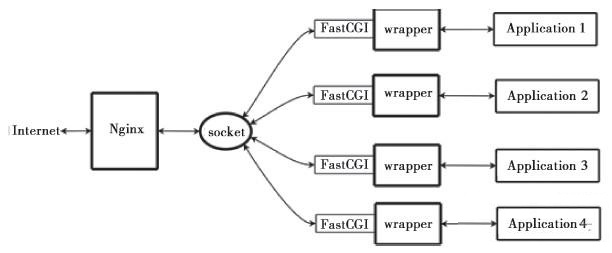

# Nginx+FastCGI运行原理

Nginx不支持对外部程序的直接调用或者解析，所有的外部程序（包括PHP）必须通过FastCGI接口来调用。FastCGI接口在Linux下是socket（这个socket可以是文件socket，也可以是ip socket）。为了调用CGI程序，还需要一个FastCGI的wrapper（wrapper可以理解为用于启动另一个程序的程序），这个wrapper绑定在某个固定socket上，如端口或者文件socket。当Nginx将CGI请求发送给这个socket的时候，通过FastCGI接口，wrapper接收到请求，然后派生出一个新的线程，这个线程调用解释器或者外部程序处理脚本并读取返回数据；接着，wrapper再将返回的数据通过FastCGI接口，沿着固定的socket传递给Nginx；最后，Nginx将返回的数据发送给客户端。这就是Nginx+FastCGI的整个运作过程，如图所示。 
